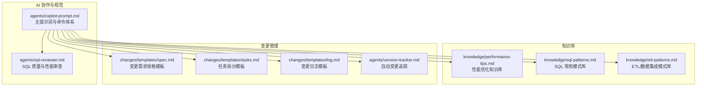
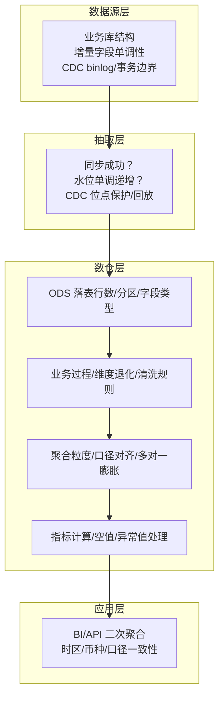
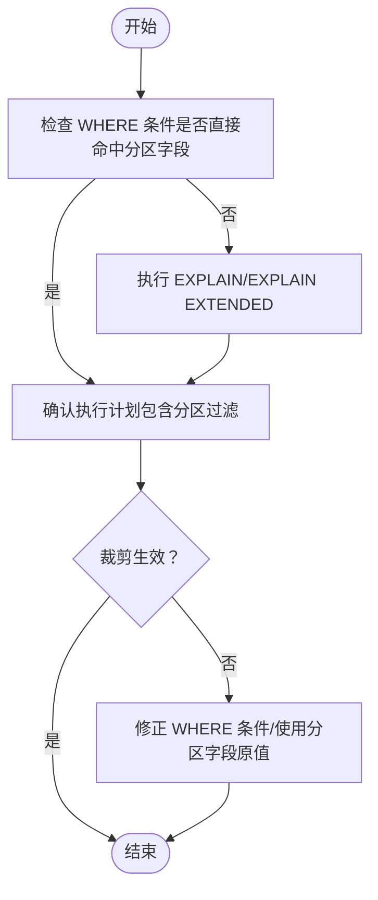
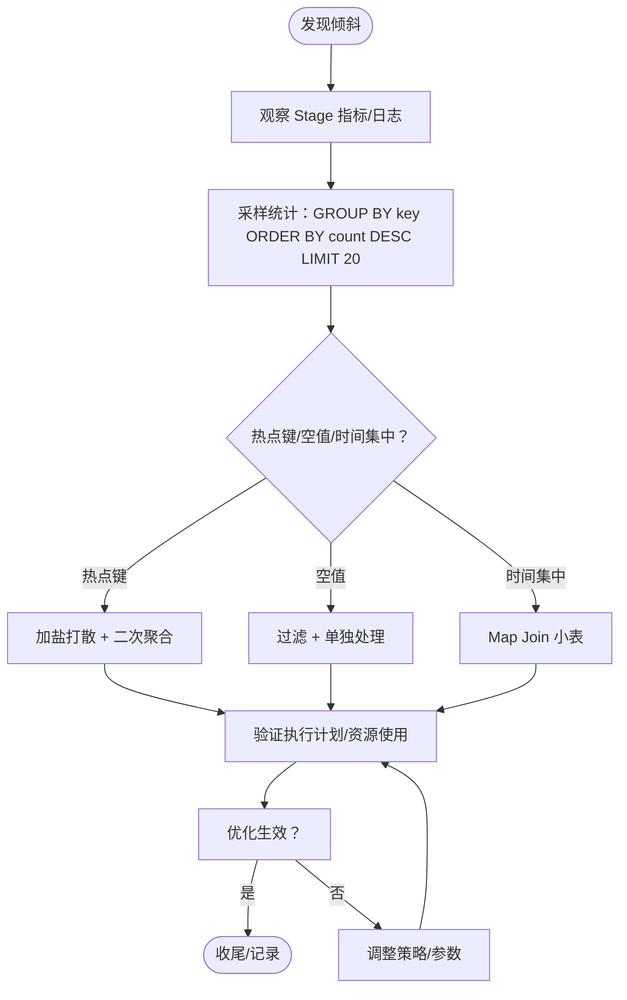
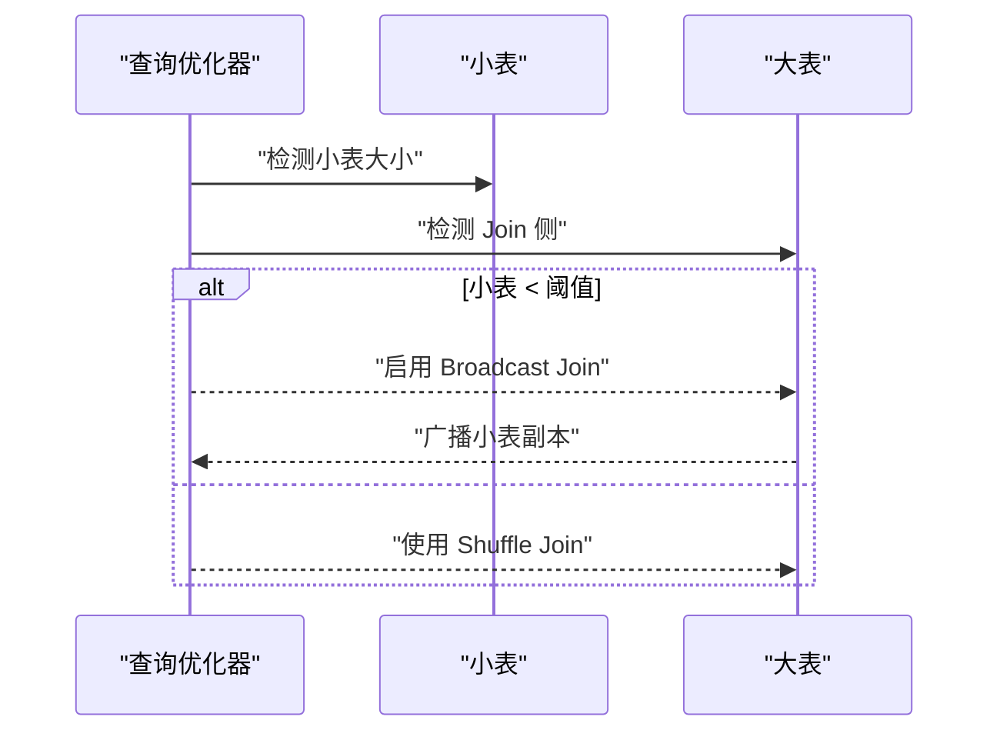
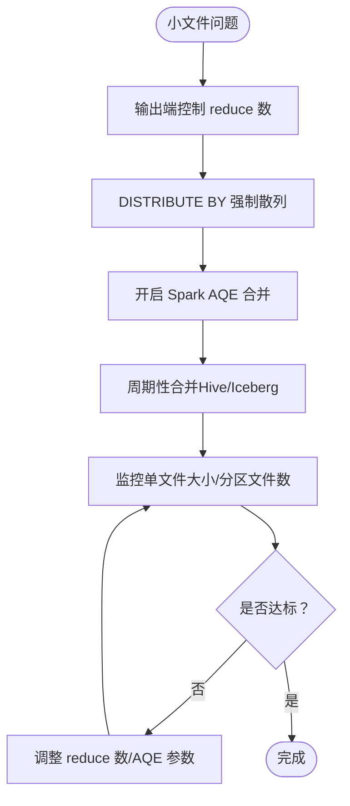
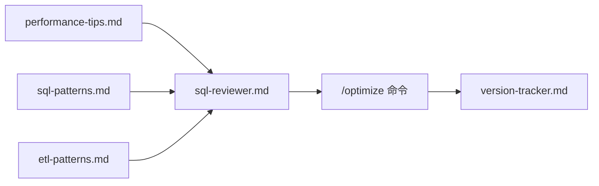

# 性能优化经验

<cite>
**本文引用的文件**
- [目录结构和设计说明.md](file://目录结构和设计说明.md)
- [copilot-prompt.md](file://agents/copilot-prompt.md)
- [sql-reviewer.md](file://agents/sql-reviewer.md)
- [performance-tips.md](file://knowledge/performance-tips.md)
- [sql-patterns.md](file://knowledge/sql-patterns.md)
- [etl-patterns.md](file://knowledge/etl-patterns.md)
</cite>

## 目录
1. [简介](#简介)
2. [项目结构](#项目结构)
3. [核心组件](#核心组件)
4. [架构总览](#架构总览)
5. [详细组件分析](#详细组件分析)
6. [依赖分析](#依赖分析)
7. [性能考量](#性能考量)
8. [故障排查指南](#故障排查指南)
9. [结论](#结论)
10. [附录](#附录)

## 简介
本技术手册围绕数据仓库性能优化的实战经验进行系统化整理，涵盖分区裁剪、倾斜键处理、小文件合并、谓词下推与列裁剪、Map/Broadcast Join、窗口函数、存储格式与压缩、调度与资源等多个方面。手册提供性能诊断方法与工具使用建议，总结不同场景下的优化策略与实施方案，并结合仓库内的知识库与Agent提示词，给出从问题发现到效果验证的完整流程指导。

## 项目结构
该项目采用“提示词工程 + 知识库 + 变更追踪”的工程化结构，围绕数据仓库开发的规范、模式与优化经验形成可复用的知识资产，并通过命令式协作流程保障变更的可审计与可回溯。

图表来源
- [目录结构和设计说明.md:19-55](file://目录结构和设计说明.md#L19-L55)
- [copilot-prompt.md:15-34](file://agents/copilot-prompt.md#L15-L34)

章节来源
- [目录结构和设计说明.md:19-55](file://目录结构和设计说明.md#L19-L55)

## 核心组件
- 性能优化知识库：系统总结分区裁剪、倾斜键、小文件、CTE物化、谓词下推与列裁剪、Join顺序与类型、窗口函数、存储格式与压缩、调度与资源、性能分析工具等主题。
- SQL 模式库：提供经验证的高质量 SQL 模式，覆盖去重保留最新、拉链表、同环比、分组 TopN、累计求和、行转列/列转行、数据回刷、Lambda 合并、缺失日期补齐、NULL 安全比较等。
- ETL 模式库：覆盖 CDC 增量同步、JDBC 增量抽取、MERGE/UPSERT、小文件控制、历史回刷、文件接入、API 拉取、全量/增量/CDC 选型对照、数据漂移与时区处理等。
- SQL 质量与性能审查：提供审查清单与输出格式，聚焦分区裁剪缺失、Join 顺序不当、Map/Broadcast Join 未启用、倾斜风险、列裁剪失效、窗口函数不合理等问题。
- 命令式协作与变更追踪：通过 /optimize、/sql、/etl、/model、/propose、/apply、/review、/dq、/schedule、/archive 等命令，确保性能优化与功能开发在统一流程下推进，并自动记录变更日志。

章节来源
- [performance-tips.md:1-349](file://knowledge/performance-tips.md#L1-L349)
- [sql-patterns.md:1-331](file://knowledge/sql-patterns.md#L1-L331)
- [etl-patterns.md:1-220](file://knowledge/etl-patterns.md#L1-L220)
- [sql-reviewer.md:1-68](file://agents/sql-reviewer.md#L1-L68)
- [copilot-prompt.md:47-53](file://agents/copilot-prompt.md#L47-L53)

## 架构总览
性能优化贯穿数据源层、抽取层、数仓层（ODS/DWD/DWS/ADS）、应用层（BI/API/下游消费）。优化流程遵循“现象收集 → 根因定位 → 方案验证 → 实施修复”，并以 EXPLAIN、作业历史、Profile/Stage Metrics、数据采样等工具支撑诊断。

图表来源
- [copilot-prompt.md:133-146](file://agents/copilot-prompt.md#L133-L146)

章节来源
- [copilot-prompt.md:133-146](file://agents/copilot-prompt.md#L133-L146)

## 详细组件分析

### 分区裁剪
- 核心要点：大型分区表的 WHERE 条件必须直接命中分区字段，禁止用函数包裹，否则导致全表扫描。
- 验证方法：Hive 使用 EXPLAIN，Spark 使用 EXPLAIN EXTENDED，关注执行计划中的分区过滤信息。
- 踩坑提示：动态分区裁剪在旧版 Spark 默认不生效；子查询/JOIN 关联条件中使用分区字段时需确认裁剪是否生效。

图表来源
- [performance-tips.md:23-34](file://knowledge/performance-tips.md#L23-L34)

章节来源
- [performance-tips.md:5-40](file://knowledge/performance-tips.md#L5-L40)

### 数据倾斜
- 现象：任务长时间卡在 99%、个别 reducer 数据量远超其他、特定 stage OOM。
- 常见原因：Key 上大量 NULL/默认值、业务热点、时间集中。
- 解决方案：
  - A. 过滤 + 单独处理：将热点键单独处理后与常规键聚合。
  - B. 加盐打散 + 二次聚合：通过随机盐值分散到多个桶，再在外层去盐汇总。
  - C. Map Join 小表：当一侧为小表时启用广播，避免 Shuffle。
- 配置参考：Hive 与 Spark 的倾斜处理相关开关与阈值。

图表来源
- [performance-tips.md:42-98](file://knowledge/performance-tips.md#L42-L98)

章节来源
- [performance-tips.md:42-98](file://knowledge/performance-tips.md#L42-L98)

### Map Join / Broadcast Join
- 核心：小表广播到每个 Map Task，避免 Shuffle。
- 触发方式：Hive 自动/显式 Hint；Spark 自动/显式 Hint。
- 阈值建议：Hive 25MB→50MB；Spark 10MB→100MB。
- 踩坑：小表行数过大时广播可能导致 Driver OOM；多个广播嵌套需注意内存累积。

图表来源
- [performance-tips.md:101-135](file://knowledge/performance-tips.md#L101-L135)

章节来源
- [performance-tips.md:101-135](file://knowledge/performance-tips.md#L101-L135)

### 小文件问题
- 危害：NameNode 压力、Map Task 启动开销大、查询性能下降。
- 控制手段：输出端控制 reduce 数、DISTRIBUTE BY 强制散列；Spark AQE 自动合并；周期性合并（Hive CONCATENATE、Iceberg rewrite_data_files）。
- 阈值：单文件目标 128MB~256MB，单分区文件数 < 50。

图表来源
- [performance-tips.md:138-165](file://knowledge/performance-tips.md#L138-L165)

章节来源
- [performance-tips.md:138-165](file://knowledge/performance-tips.md#L138-L165)

### CTE / WITH 物化策略
- 引擎差异：Hive/Spark 默认不物化（可 CACHE）；Snowflake 默认物化；PostgreSQL 12+ 默认 NOT MATERIALIZED。
- 推荐做法：多次引用的复杂 CTE 先落临时表；Spark 可显式 CACHE。
- 踩坑：假设 WITH 会被物化会导致重复计算多次；Spark CACHE 占用 Executor 内存需注意释放。

章节来源
- [performance-tips.md:167-194](file://knowledge/performance-tips.md#L167-L194)

### 谓词下推（PPD）与列裁剪
- 核心：WHERE 条件下推到数据源层减少扫描；列裁剪只读必要列（列存收益显著）。
- 验证：检查执行计划是否包含 PartitionFilters/DataFilters。
- 失效场景：ON 条件中混入过滤、UDF 使谓词无法下推、SELECT * 导致列裁剪失效。
- 优化技巧：WHERE 各自约束，避免写在 ON 中。

章节来源
- [performance-tips.md:196-229](file://knowledge/performance-tips.md#L196-L229)

### Join 顺序与类型
- 顺序原则：Hive on MR 左大右小；Spark/Trino CBO 自动选但保留 hint 兜底；MaxCompute Map Join 优先小表。
- 类型选择：Broadcast Hash Join（小表最快）、Shuffle Hash Join（中等）、Sort Merge Join（两侧都大代价高）、Bucket Join（按相同 key 分桶跳过 Shuffle）。
- 分桶 Join：两张大表按相同 key 分桶，Join 时跳过 Shuffle。

章节来源
- [performance-tips.md:232-256](file://knowledge/performance-tips.md#L232-L256)

### 窗口函数性能
- 关键点：PARTITION BY 列基数过低易倾斜，过高导致启动开销；复杂 ORDER BY 考虑预排序。
- 优化技巧：加 PARTITION BY 限定范围；配合 DISTRIBUTE BY + SORT BY。

章节来源
- [performance-tips.md:259-283](file://knowledge/performance-tips.md#L259-L283)

### 存储格式与压缩
- 推荐：大型分析表 ORC+ZSTD（Hive）/ Parquet+ZSTD（Spark）；小表/临时表 Parquet+Snappy；强 schema 演进 Iceberg+Parquet。
- 列存收益：列裁剪、谓词下推、压缩。

章节来源
- [performance-tips.md:286-306](file://knowledge/performance-tips.md#L286-L306)

### 调度与资源
- 资源队列：按主题/优先级划分；核心 ADS 独占队列；低优先级放共享队列限并发。
- 调度时间窗：错峰调度、上游就绪触发、SLA 基线。
- 失败重试：指数退避、幂等判断、连续失败告警与自动跳过/保留前一日数据。

章节来源
- [performance-tips.md:308-325](file://knowledge/performance-tips.md#L308-L325)

### 性能分析工具
- 通用流程：EXPLAIN → 作业历史 → Profile/Stage Metrics → 数据采样。
- 常用命令：SHOW PARTITIONS、DESC FORMATTED、SHOW CREATE TABLE、Hive ANALYZE TABLE COMPUTE STATISTICS。

章节来源
- [performance-tips.md:327-349](file://knowledge/performance-tips.md#L327-L349)

## 依赖分析
- 性能优化知识库与 SQL 模式库、ETL 模式库共同构成“经验工具箱”，为优化提供可复用的模式与最佳实践。
- SQL 质量与性能审查 Agent 作为“质量门禁”，在 SQL 开发阶段拦截常见性能隐患。
- 命令式协作流程确保优化与开发在统一规范下推进，版本追踪保障可审计与可回溯。

图表来源
- [copilot-prompt.md:117-120](file://agents/copilot-prompt.md#L117-L120)
- [sql-reviewer.md:31-43](file://agents/sql-reviewer.md#L31-L43)

章节来源
- [copilot-prompt.md:117-120](file://agents/copilot-prompt.md#L117-L120)
- [sql-reviewer.md:31-43](file://agents/sql-reviewer.md#L31-L43)

## 性能考量
- 分区裁剪：确保 WHERE 直接命中分区字段，避免函数包裹；验证执行计划中的分区过滤。
- 倾斜处理：热点键过滤单独处理、加盐打散、Map Join 小表；关注配置项与阈值。
- 小文件控制：输出端 reduce 数、DISTRIBUTE BY、AQE 合并、周期性合并。
- PPD 与列裁剪：WHERE 下推、列裁剪、避免 SELECT * 与 UDF。
- Join 优化：顺序与类型选择、分桶 Join、Map/Broadcast Join 阈值。
- 窗口函数：合理 PARTITION BY、预排序、DISTRIBUTE BY + SORT BY。
- 存储格式：列存格式与压缩策略，结合业务特征选择。
- 调度与资源：队列划分、时间窗、重试策略与 SLA 基线。

## 故障排查指南
- 现象收集：慢任务、卡顿、OOM、资源峰值。
- 根因定位：EXPLAIN 执行计划、作业历史、Profile/Stage Metrics、数据采样（倾斜键）。
- 方案验证：修正 WHERE 条件、启用广播、控制 reduce 数、调整分桶、优化窗口函数。
- 实施修复：按优化建议调整 SQL/配置，记录变更与效果对比。

章节来源
- [copilot-prompt.md:133-146](file://agents/copilot-prompt.md#L133-L146)
- [performance-tips.md:327-349](file://knowledge/performance-tips.md#L327-L349)

## 结论
通过将性能优化知识库、SQL/ETL 模式库与审查 Agent、命令式协作流程相结合，可以形成从问题发现到效果验证的闭环。实践中应坚持“先诊断、后优化、再验证”的原则，结合执行计划、作业历史与采样分析，针对性地采用分区裁剪、倾斜处理、小文件合并、Join 优化、窗口函数与存储格式等策略，持续提升数据仓库整体性能与稳定性。

## 附录
- 常用 SQL 模式：去重保留最新、拉链表、同环比、分组 TopN、累计求和、行转列/列转行、数据回刷、Lambda 合并、缺失日期补齐、NULL 安全比较。
- ETL 模式：CDC 增量同步、JDBC 增量抽取、MERGE/UPSERT、小文件控制、历史回刷、文件接入、API 拉取、全量/增量/CDC 选型对照、数据漂移与时区处理。

章节来源
- [sql-patterns.md:6-331](file://knowledge/sql-patterns.md#L6-L331)
- [etl-patterns.md:6-220](file://knowledge/etl-patterns.md#L6-L220)