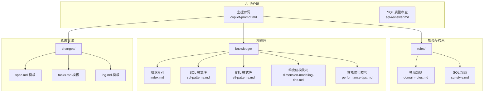
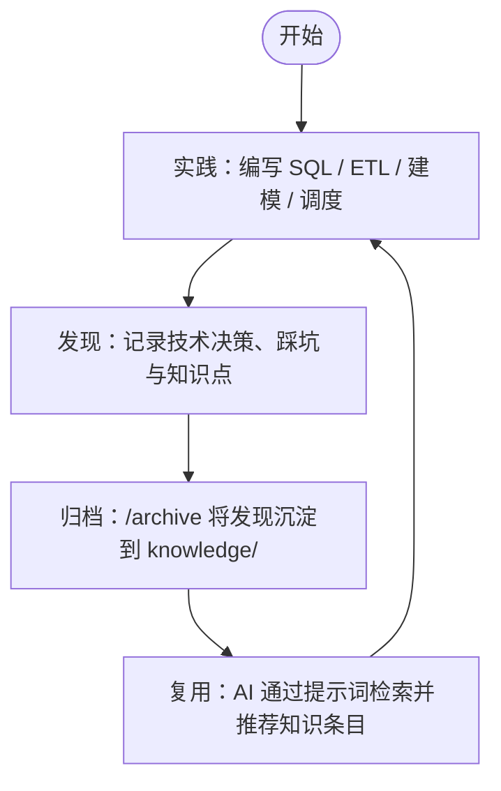
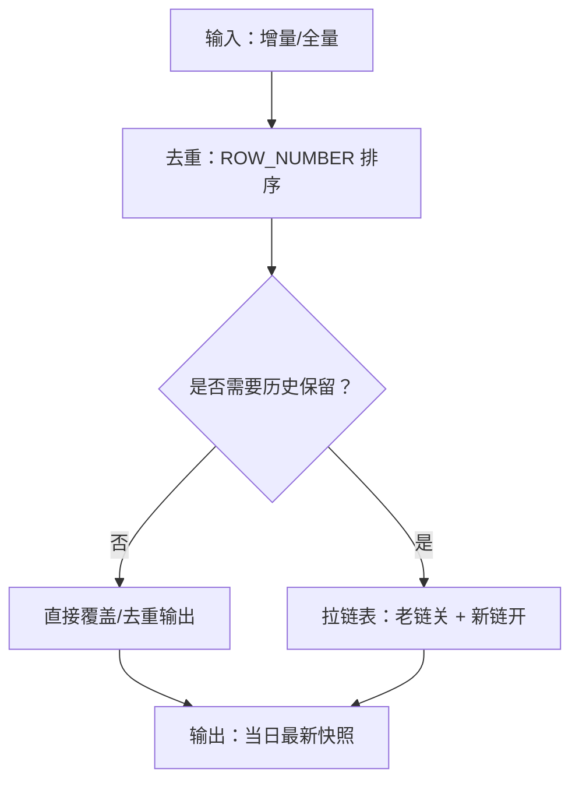
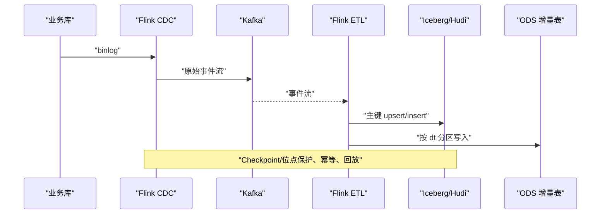
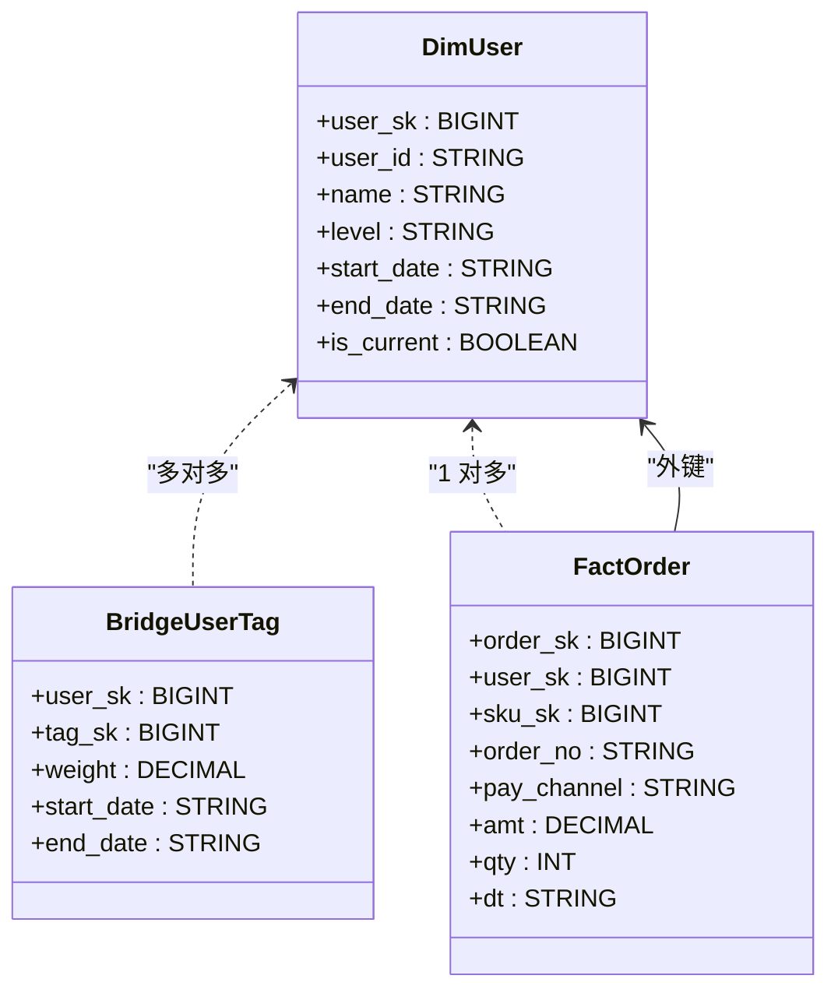
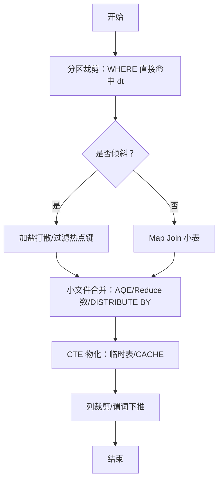
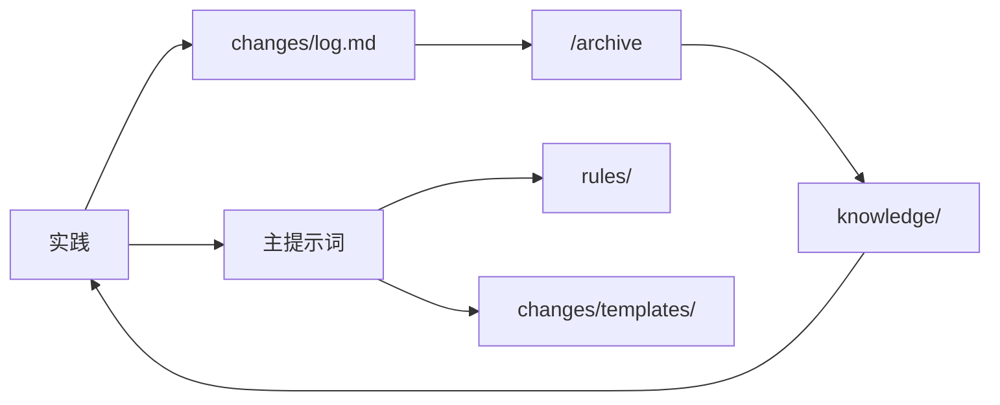

# 知识库系统

<cite>
**本文引用的文件**
- [目录结构和设计说明.md](file://目录结构和设计说明.md)
- [知识索引.md](file://knowledge/index.md)
- [SQL 模式库.md](file://knowledge/sql-patterns.md)
- [ETL 模式库.md](file://knowledge/etl-patterns.md)
- [维度建模技巧.md](file://knowledge/dimension-modeling-tips.md)
- [性能优化技巧.md](file://knowledge/performance-tips.md)
- [主提示词.md](file://agents/copilot-prompt.md)
- [SQL 质量审查.md](file://agents/sql-reviewer.md)
- [领域规则.md](file://rules/domain-rules.md)
- [SQL 编码规范.md](file://rules/sql-style.md)
- [变更需求规格模板.md](file://changes/templates/spec.md)
- [任务拆分模板.md](file://changes/templates/tasks.md)
- [变更日志模板.md](file://changes/templates/log.md)
</cite>

## 目录
1. [简介](#简介)
2. [项目结构](#项目结构)
3. [核心组件](#核心组件)
4. [架构总览](#架构总览)
5. [详细组件分析](#详细组件分析)
6. [依赖分析](#依赖分析)
7. [性能考虑](#性能考虑)
8. [故障排查指南](#故障排查指南)
9. [结论](#结论)
10. [附录](#附录)

## 简介
本知识库系统围绕“实践 → 发现 → 沉淀 → 复用”的知识飞轮机制，系统化沉淀数据仓库工程中的 SQL 模式、ETL 同步策略、维度建模技巧与性能优化经验。通过规范化的命令式协作流程（/propose → /apply → /review → /archive），将每次变更的决策、踩坑与知识发现固化为可复用的经验条目，持续提升团队交付质量与效率。

## 项目结构
系统采用“三段式知识结构”：
- rules/：项目约束与规范（强制）
- knowledge/：经验知识库（推荐复用）
- changes/：变更过程与审计（历史）

图表来源
- [目录结构和设计说明.md:19-55](file://目录结构和设计说明.md#L19-L55)
- [主提示词.md:23-34](file://agents/copilot-prompt.md#L23-L34)
- [SQL 质量审查.md:1-68](file://agents/sql-reviewer.md#L1-L68)

章节来源
- [目录结构和设计说明.md:19-55](file://目录结构和设计说明.md#L19-L55)
- [主提示词.md:23-34](file://agents/copilot-prompt.md#L23-L34)

## 核心组件
- 知识索引：一句话索引各知识域入口，便于快速定位 SQL 模式、ETL 模式、维度建模与性能优化。
- SQL 模式库：覆盖去重保留最新、拉链表（SCD2）、同环比、TopN、累计求和、行转列/列转行、历史回刷、Lambda 合并、缺失日期补齐、NULL 安全比较等高频模式。
- ETL 模式库：覆盖 CDC 增量同步、JDBC 增量抽取、MERGE/UPSERT、小文件控制、历史回刷、文件接入、API 拉取、全量/增量/CDC 选型对照、时区与数据漂移处理。
- 维度建模技巧：代理键/业务键、SCD 三类型、桥接表、退化维度、一致性维度、事实表类型、维度分级、分层归属判定。
- 性能优化技巧：分区裁剪、数据倾斜、Map/Broadcast Join、小文件、CTE 物化、谓词下推/列裁剪、Join 顺序与类型、窗口函数、存储格式与压缩、调度与资源、性能分析工具。
- 规范与约束：领域规则（KPI/同环比/行业口径）、SQL 编码规范（命名/格式/禁忌）、变更模板（spec/tasks/log）。
- AI 协作：主提示词定义身份、法则与命令体系；SQL 质量审查提供性能/正确性/可维护性三维度检查清单。

章节来源
- [知识索引.md:6-60](file://knowledge/index.md#L6-L60)
- [SQL 模式库.md:1-331](file://knowledge/sql-patterns.md#L1-L331)
- [ETL 模式库.md:1-220](file://knowledge/etl-patterns.md#L1-L220)
- [维度建模技巧.md:1-253](file://knowledge/dimension-modeling-tips.md#L1-L253)
- [性能优化技巧.md:1-349](file://knowledge/performance-tips.md#L1-L349)
- [领域规则.md:1-142](file://rules/domain-rules.md#L1-L142)
- [SQL 编码规范.md:1-254](file://rules/sql-style.md#L1-L254)
- [主提示词.md:1-147](file://agents/copilot-prompt.md#L1-L147)
- [SQL 质量审查.md:1-68](file://agents/sql-reviewer.md#L1-L68)
- [变更需求规格模板.md:1-132](file://changes/templates/spec.md#L1-L132)
- [任务拆分模板.md:1-74](file://changes/templates/tasks.md#L1-L74)
- [变更日志模板.md:1-61](file://changes/templates/log.md#L1-L61)

## 架构总览
知识飞轮机制的端到端流程如下：

图表来源
- [目录结构和设计说明.md:78](file://目录结构和设计说明.md#L78)

章节来源
- [目录结构和设计说明.md:78](file://目录结构和设计说明.md#L78)

## 详细组件分析

### SQL 模式库
- 去重保留最新：按主键保留最新记录，支持 QUALIFY 写法，注意分区键基数与倾斜风险。
- 拉链表（SCD2）：老链关、新链开，幂等写入，建议定期归档。
- 同环比（YoY/MoM）：处理空值与除零，自连接偏移，注意闰年/财年场景。
- 分组 TopN：ROW_NUMBER/DENSE_RANK + QUALIFY（部分引擎），注意窗口函数 Shuffle。
- 累计求和：标准窗口语法，支持按年/月分组。
- 行转列/列转行：CASE WHEN 法与 LATERAL VIEW/UNNEST，注意展开后行数膨胀。
- 历史回刷：INSERT OVERWRITE 单分区，禁止 INSERT INTO；批量回刷需控制并发。
- Lambda 合并：ODS 全量 + 增量合并出当日快照，注意 schema 一致与去重。
- 缺失日期补齐：左关联日期维度表，dim_date 行数小，代价可忽略。
- NULL 安全比较：Hive/Spark 的 <=> 与通用写法，优先使用引擎特性。

图表来源
- [SQL 模式库.md:6-39](file://knowledge/sql-patterns.md#L6-L39)
- [SQL 模式库.md:42-94](file://knowledge/sql-patterns.md#L42-L94)

章节来源
- [SQL 模式库.md:6-331](file://knowledge/sql-patterns.md#L6-L331)

### ETL 模式库
- CDC 增量同步：Flink CDC + Kafka + Iceberg/Hudi，强调位点保护、op 字段、幂等与回放。
- JDBC 增量抽取：基于 update_time 水位，重叠窗口与 ODS 去重，注意时区与索引。
- MERGE/UPSERT：ACID 存储的主键幂等写入，乱序保护与小文件合并。
- 小文件控制：reduce 数、DISTRIBUTE BY、AQE 动态合并与周期性合并。
- 历史回刷：范围确认、依赖 DAG、试点、分批执行、进度跟踪与失败重试。
- 文件接入：目录约定、完成标记、编码与 schema 校验、bad record 隔离。
- API 拉取：限流、重试、断点续传、变更追踪与 schema 漂移处理。
- 全量/增量/CDC 选型对照：实时性、源压、完整性、复杂度、历史追踪、适用规模与工具栈。
- 时区与数据漂移：UTC 存储 + tz/local_dt，按业务日分区，明确报表时区口径。

图表来源
- [ETL 模式库.md:6-27](file://knowledge/etl-patterns.md#L6-L27)

章节来源
- [ETL 模式库.md:1-220](file://knowledge/etl-patterns.md#L1-L220)

### 维度建模技巧
- 代理键 vs 业务键：双键并存，代理键稳定、业务键追溯；SCD2 必用代理键。
- SCD 三类型：Type 1（覆盖）、Type 2（拉链）、Type 3（双列对照），选型对照表。
- 桥接表：解决多对多/多值维度，注意权重与时间窗口，控制基数爆炸。
- 退化维度：低基数/仅事实表使用的属性退化为事实表列，避免冗余维度表。
- 一致性维度：跨主题共享，避免重复建设，变更需广播预警。
- 事实表类型：事务/周期快照/累积快照/无事实事实表，选型示例与注意事项。
- 维度分级：核心/扩展/杂项维度，降低事实表外键复杂度。
- 分层归属：ODS/DWD/DWS/ADS/DIM 的落层与命名前缀判定。

图表来源
- [维度建模技巧.md:13-23](file://knowledge/dimension-modeling-tips.md#L13-L23)
- [维度建模技巧.md:94-112](file://knowledge/dimension-modeling-tips.md#L94-L112)
- [维度建模技巧.md:133-146](file://knowledge/dimension-modeling-tips.md#L133-L146)

章节来源
- [维度建模技巧.md:1-253](file://knowledge/dimension-modeling-tips.md#L1-L253)

### 性能优化技巧
- 分区裁剪：WHERE 直接命中分区字段，禁止函数包裹；验证执行计划。
- 数据倾斜：热点键过滤/单独处理、加盐打散、Map Join 小表。
- Map/Broadcast Join：阈值与触发方式，注意驱动内存与多播风险。
- 小文件：reduce 数控制、DISTRIBUTE BY、AQE 合并与周期性合并。
- CTE 物化：引擎差异，复杂多次引用先落临时表或 CACHE。
- 谓词下推/列裁剪：WHERE 下推与只读必要列，避免 UDF 与 SELECT *。
- Join 顺序与类型：按引擎选择最优 Join，分桶 Join 跳过 Shuffle。
- 窗口函数：PARTITION BY 列基数平衡，配合 DISTRIBUTE BY/SORT BY。
- 存储格式与压缩：ORC/Parquet/ZSTD 收益显著，列存优势明显。
- 调度与资源：队列划分、错峰调度、SLA 基线、失败重试。
- 性能分析：EXPLAIN/作业历史/Profile/采样找倾斜键。

图表来源
- [性能优化技巧.md:5-40](file://knowledge/performance-tips.md#L5-L40)
- [性能优化技巧.md:42-98](file://knowledge/performance-tips.md#L42-L98)
- [性能优化技巧.md:101-135](file://knowledge/performance-tips.md#L101-L135)
- [性能优化技巧.md:138-165](file://knowledge/performance-tips.md#L138-L165)
- [性能优化技巧.md:167-193](file://knowledge/performance-tips.md#L167-L193)
- [性能优化技巧.md:196-229](file://knowledge/performance-tips.md#L196-L229)

章节来源
- [性能优化技巧.md:1-349](file://knowledge/performance-tips.md#L1-L349)

### 规范与约束
- 领域规则：金额精度、百分比格式、时间维度、同环比口径、排名与排序键、状态颜色、KPI 字典、数据质量五维度、历史数据约定、行业特定规则、跨系统一致性。
- SQL 编码规范：库/表/字段命名、粒度后缀、关键字大小写、缩进与注释、头部注释、性能优先原则、禁止事项与常见错误对照。
- 变更模板：spec/tasks/log，覆盖背景目标、现状分析、功能点、业务规则、模型变更、SQL 设计、ETL/调度、DQ、影响范围、风险关注、验证策略、技术决策与执行日志。

章节来源
- [领域规则.md:1-142](file://rules/domain-rules.md#L1-L142)
- [SQL 编码规范.md:1-254](file://rules/sql-style.md#L1-L254)
- [变更需求规格模板.md:1-132](file://changes/templates/spec.md#L1-L132)
- [任务拆分模板.md:1-74](file://changes/templates/tasks.md#L1-L74)
- [变更日志模板.md:1-61](file://changes/templates/log.md#L1-L61)

### AI 协作与审查
- 主提示词：定义身份、核心法则（Spec 驱动）、命令体系、回答框架、调试流程与诊断层级。
- SQL 质量审查：Critical/Important/Minor 三级，涵盖计算错误、全表扫描、Join 膨胀、回刷幂等、分区裁剪、NULL 处理、CTE 可读性、字段别名、性能清单与工具权限。
- 模型审查：在 SQL 审查前进行，确保模型与规范一致。
- 性能审查：四层诊断（数据源→抽取→数仓→应用），量化优化前后对比。

章节来源
- [主提示词.md:1-147](file://agents/copilot-prompt.md#L1-L147)
- [SQL 质量审查.md:1-68](file://agents/sql-reviewer.md#L1-L68)

## 依赖分析
- 组件耦合与内聚：知识库内部高度内聚（同一主题知识集中），与规范/模板弱耦合（通过命令与流程约束）。
- 直接依赖：AI 提示词依赖规范与模板；知识库依赖变更日志沉淀；变更模板支撑三阶段审查。
- 外部依赖：引擎方言差异（Hive/Spark/Flink/Trino）、存储格式（ORC/Parquet/Iceberg/Hudi）与调度系统（Azkaban/DolphinScheduler/MC）。
- 知识飞轮：实践 → changes/log.md → /archive → knowledge/ → 复用。

图表来源
- [目录结构和设计说明.md:78](file://目录结构和设计说明.md#L78)
- [主提示词.md:133-146](file://agents/copilot-prompt.md#L133-L146)

章节来源
- [目录结构和设计说明.md:78](file://目录结构和设计说明.md#L78)
- [主提示词.md:133-146](file://agents/copilot-prompt.md#L133-L146)

## 性能考虑
- 分区裁剪：避免函数包裹分区字段，使用 EXPLAIN 验证 PartitionFilters。
- 倾斜治理：热点键过滤、加盐打散、Map Join 小表；配置 skew join 参数。
- 小文件：控制 reduce 数、DISTRIBUTE BY、启用 AQE 合并与周期性合并。
- CTE 物化：复杂多次引用先物化为临时表或 CACHE。
- Join 顺序与类型：按引擎选择最优 Join，分桶 Join 跳过 Shuffle。
- 存储格式：优先 ORC/Parquet + ZSTD，列存收益显著。
- 调度与资源：错峰调度、SLA 基线、失败重试与资源队列划分。

章节来源
- [性能优化技巧.md:5-40](file://knowledge/performance-tips.md#L5-L40)
- [性能优化技巧.md:42-98](file://knowledge/performance-tips.md#L42-L98)
- [性能优化技巧.md:138-165](file://knowledge/performance-tips.md#L138-L165)
- [性能优化技巧.md:167-193](file://knowledge/performance-tips.md#L167-L193)
- [性能优化技巧.md:232-256](file://knowledge/performance-tips.md#L232-L256)
- [性能优化技巧.md:286-305](file://knowledge/performance-tips.md#L286-L305)
- [性能优化技巧.md:308-324](file://knowledge/performance-tips.md#L308-L324)
- [性能优化技巧.md:327-349](file://knowledge/performance-tips.md#L327-L349)

## 故障排查指南
- 调试流程：现象收集 → 根因定位 → 方案验证 → 实施修复。
- 诊断层级：数据源层 → 抽取层 → ODS 层 → DWD 层 → DWS 层 → ADS 层 → 应用层。
- 常见问题：
  - 分区裁剪失效：WHERE 使用函数包裹分区字段。
  - 数据倾斜：热点键、大量 NULL/默认值、时间集中。
  - 小文件爆炸：reduce 数过多、文件过小。
  - JOIN 膨胀：未限制业务日期导致维度重复。
  - 回刷幂等：INSERT INTO 而非 INSERT OVERWRITE。
  - 时区不一致：业务库与数仓时区差异导致跨日丢数。
- 工具与方法：EXPLAIN/作业历史/Profile/采样、采样倾斜键、验证执行计划。

章节来源
- [主提示词.md:133-146](file://agents/copilot-prompt.md#L133-L146)
- [SQL 质量审查.md:31-64](file://agents/sql-reviewer.md#L31-L64)
- [性能优化技巧.md:327-349](file://knowledge/performance-tips.md#L327-L349)

## 结论
本知识库系统通过“规范 + 知识 + 变更”的三段式结构，将实践经验沉淀为可复用的知识条目，并以命令式流程保障变更的可审计与可回溯。SQL 模式、ETL 策略、维度建模与性能优化四大知识域覆盖数仓核心场景，辅以严格的审查与模板，确保交付质量与效率持续提升。

## 附录

### 知识飞轮使用指南
- 实践：在编写 SQL/ETL/建模/调度过程中，记录技术决策与踩坑。
- 归档：通过 /archive 将发现沉淀到 knowledge/，并完善知识索引。
- 复用：在后续工作中，AI 通过提示词检索并推荐相关知识条目，加速交付。

章节来源
- [目录结构和设计说明.md:78](file://目录结构和设计说明.md#L78)
- [主提示词.md:129-132](file://agents/copilot-prompt.md#L129-L132)