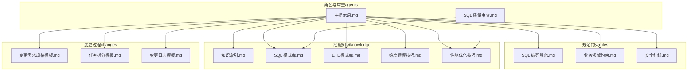
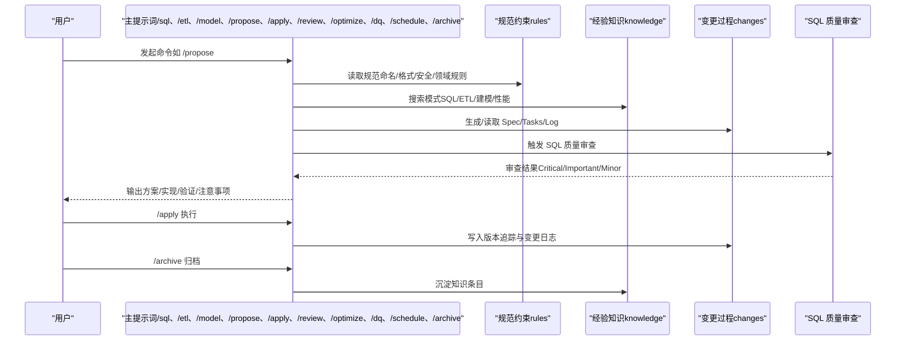
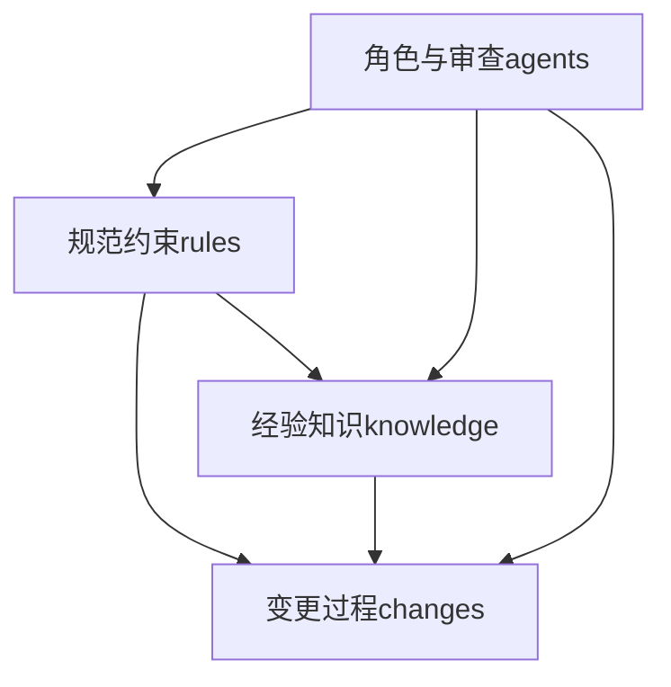

# 知识库系统

<cite>
**本文引用的文件**
- [目录结构和设计说明.md](file://目录结构和设计说明.md)
- [知识索引.md](file://knowledge/index.md)
- [SQL 模式库.md](file://knowledge/sql-patterns.md)
- [ETL 模式库.md](file://knowledge/etl-patterns.md)
- [维度建模技巧.md](file://knowledge/dimension-modeling-tips.md)
- [性能优化技巧.md](file://knowledge/performance-tips.md)
- [主提示词.md](file://agents/copilot-prompt.md)
- [SQL 质量审查.md](file://agents/sql-reviewer.md)
- [SQL 编码规范.md](file://rules/sql-style.md)
- [业务领域约束.md](file://rules/domain-rules.md)
- [安全红线.md](file://rules/security.md)
- [变更需求规格模板.md](file://changes/templates/spec.md)
- [任务拆分模板.md](file://changes/templates/tasks.md)
- [变更日志模板.md](file://changes/templates/log.md)
</cite>

## 目录
1. [简介](#简介)
2. [项目结构](#项目结构)
3. [核心组件](#核心组件)
4. [架构总览](#架构总览)
5. [详细组件分析](#详细组件分析)
6. [依赖分析](#依赖分析)
7. [性能考虑](#性能考虑)
8. [故障排查指南](#故障排查指南)
9. [结论](#结论)
10. [附录](#附录)

## 简介
本知识库系统围绕数据仓库工程实践，提供“规范约束（rules）—经验知识（knowledge）—变更过程（changes）”三位一体的知识飞轮。其目标是：
- 以“规范”为红线，确保安全、正确、可审计；
- 以“知识”为工具箱，沉淀 SQL 模式、ETL 模式、维度建模技巧与性能优化经验；
- 以“变更”为载体，形成可追溯的实践档案，持续迭代。

本系统支持的检索与使用实践包括：关键词索引快速定位、按主题分层浏览、命令式协作（/sql、/etl、/model、/propose、/apply、/review、/optimize、/dq、/schedule、/archive）以及版本追踪与归档沉淀。

## 项目结构
系统采用“agents/（角色与审查）—changes/（变更模板与日志）—knowledge/（知识库）—rules/（规范）”的组织方式，强调工程化与可审计性。

图表来源
- [目录结构和设计说明.md:19-55](file://目录结构和设计说明.md#L19-L55)
- [主提示词.md:1-147](file://agents/copilot-prompt.md#L1-L147)
- [SQL 质量审查.md:1-68](file://agents/sql-reviewer.md#L1-L68)

章节来源
- [目录结构和设计说明.md:19-55](file://目录结构和设计说明.md#L19-L55)

## 核心组件
- 规范约束（rules）
  - SQL 编码规范：命名、格式、性能与正确性原则、禁止事项与检查清单。
  - 业务领域约束：金额精度、百分比格式、同比/环比口径、排序键、状态颜色、KPI 字典、数据质量五维度、历史数据约定、行业特定规则、跨系统一致性。
  - 安全红线：数据安全、字段级脱敏、行级权限、数据分级、上线与发布、数据回刷、业务安全、跨境合规、安全审计与应急响应。
- 经验知识（knowledge）
  - 知识索引：一句话索引，快速定位 SQL 模式、ETL 模式、维度建模技巧、性能优化技巧。
  - SQL 模式库：去重保留最新、拉链表（SCD Type 2）、同环比、TopN、累计求和、行转列/列转行、数据回刷幂等覆盖、Lambda 合并、缺失日期补齐、NULL 安全比较。
  - ETL 模式库：CDC 增量同步、JDBC 增量抽取、MERGE/UPSERT、小文件控制、历史回刷、文件接入（CSV/Excel/JSON）、API 拉取（REST/GraphQL）、全量/增量/CDC 选型对照、数据漂移与时区处理。
  - 维度建模技巧：代理键 vs 业务键、SCD 三种类型、桥接表、退化维度、一致性维度、事实表类型选择、维度表分级、数仓分层归属判定。
  - 性能优化技巧：分区裁剪、数据倾斜、Map Join/Broadcast Join、小文件问题、CTE/ WITH 物化策略、谓词下推与列裁剪、Join 顺序与类型、窗口函数性能、存储格式与压缩、调度与资源、性能分析工具。
- 变更过程（changes）
  - 变更需求规格模板：背景与目标、现状分析、功能点、业务规则与口径、模型变更（DDL）、SQL 加工设计、ETL/同步变更、调度变更、数据质量规则、影响范围、风险与关注点、验证策略、技术决策、执行日志、审查结论、确认记录。
  - 任务拆分模板：按 ODS→DIM→DWD→DWS→ADS→调度→DQ→权限发布顺序拆分，每个任务可独立验证。
  - 变更日志模板：记录决策、踩坑、知识发现、性能对比、数据质量验证、回刷记录等。
- 角色与审查（agents）
  - 主提示词：Spec 驱动、身份与原则、命令体系、调试流程、诊断层级。
  - SQL 质量审查：审查分级（Critical/Important/Minor）、性能审查清单、输出格式与工具权限。

章节来源
- [SQL 编码规范.md:1-254](file://rules/sql-style.md#L1-L254)
- [业务领域约束.md:1-142](file://rules/domain-rules.md#L1-L142)
- [安全红线.md:1-98](file://rules/security.md#L1-L98)
- [知识索引.md:1-60](file://knowledge/index.md#L1-L60)
- [SQL 模式库.md:1-331](file://knowledge/sql-patterns.md#L1-L331)
- [ETL 模式库.md:1-220](file://knowledge/etl-patterns.md#L1-L220)
- [维度建模技巧.md:1-253](file://knowledge/dimension-modeling-tips.md#L1-L253)
- [性能优化技巧.md:1-349](file://knowledge/performance-tips.md#L1-L349)
- [变更需求规格模板.md:1-132](file://changes/templates/spec.md#L1-L132)
- [任务拆分模板.md:1-74](file://changes/templates/tasks.md#L1-L74)
- [变更日志模板.md:1-61](file://changes/templates/log.md#L1-L61)
- [主提示词.md:1-147](file://agents/copilot-prompt.md#L1-L147)
- [SQL 质量审查.md:1-68](file://agents/sql-reviewer.md#L1-L68)

## 架构总览
系统以“命令式协作 + 规范约束 + 知识复用 + 变更追踪”的闭环运作，贯穿从需求到上线再到归档的全过程。

图表来源
- [主提示词.md:63-147](file://agents/copilot-prompt.md#L63-L147)
- [SQL 质量审查.md:1-68](file://agents/sql-reviewer.md#L1-L68)
- [SQL 编码规范.md:1-254](file://rules/sql-style.md#L1-L254)
- [业务领域约束.md:1-142](file://rules/domain-rules.md#L1-L142)
- [安全红线.md:1-98](file://rules/security.md#L1-L98)
- [变更需求规格模板.md:1-132](file://changes/templates/spec.md#L1-L132)
- [任务拆分模板.md:1-74](file://changes/templates/tasks.md#L1-L74)
- [变更日志模板.md:1-61](file://changes/templates/log.md#L1-L61)

## 详细组件分析

### SQL 模式库
- 去重保留最新：ROW_NUMBER 按主键分区，更新时间降序，tie-breaker 用 op_seq；等价 QUALIFY 写法；注意基数过低引发倾斜，可用 DISTRIBUTE BY 提示散列。
- 拉链表（SCD Type 2）：老链关闭 + 新链开启，三列区间标记（start_date/end_date/is_current）；写入必须幂等（INSERT OVERWRITE）；建议定期归档拆分。
- 同环比（YoY/MoM）：自连接偏移日期，处理空值与除零约定；base CTE 限定窗口避免全表扫描；dim_date 关联更稳健。
- 分组 TopN：ROW_NUMBER/DENSE_RANK/RANK 差异；注意 PARTITION BY 列基数；可配合 DISTRIBUTE BY + SORT BY 减少二次排序。
- 累计求和：ROWS BETWEEN UNBOUNDED PRECEDING AND CURRENT ROW；跨年/跨月分组加 PARTITION BY year_month。
- 行转列/列转行：CASE WHEN + SUM 透视；UNNEST/stack 展开；注意列转行的行数膨胀。
- 数据回刷幂等覆盖：单分区 INSERT OVERWRITE；多分区批量回刷需控制并发与队列资源。
- Lambda 合并：昨日全量 + 今日增量 UNION ALL 后去重，增量优先覆盖；注意 schema 一致与字段补齐。
- 缺失日期补齐：左关联 dim_date 补全；COALESCE 处理空值。
- NULL 安全比较：Hive/Spark 用 <=>；通用写法用 OR (a IS NULL AND b IS NULL)。

章节来源
- [SQL 模式库.md:6-331](file://knowledge/sql-patterns.md#L6-L331)
- [SQL 编码规范.md:165-198](file://rules/sql-style.md#L165-L198)

### ETL 模式库
- CDC 增量同步：Flink CDC + Kafka + Iceberg/Hudi（MOR）；Checkpoint 周期、op 字段、幂等、回放；binlog ts 事件时间、大事务监控 lag、GTID 校验。
- JDBC 增量抽取：基于 update_time 水位；重叠窗口 + ODS 去重；DataX/SeaTunnel channel 与 splitPk；INSERT OVERWRITE 幂等。
- MERGE/UPSERT：Hudi/Iceberg/Delta/MaxCompute 事务表；乱序保护（s.update_time > t.update_time）；冲突处理（USING 子查询去重）；小文件合并（clustering/rewrite_data_files）。
- 小文件控制：Hive reduce 数、DISTRIBUTE BY 散列；Spark AQE 动态合并；阈值建议（单文件 128MB~256MB，单分区 <50）。
- 历史回刷：确认范围与依赖 → 试点 → 分批执行（控制并发）→ 进度追踪（状态表）→ 失败重试与告警。
- 文件接入（CSV/Excel/JSON）：目录约定、_SUCCESS 完成标记、编码与 schema 校验、bad record 隔离。
- API 拉取（REST/GraphQL）：限流（token bucket）、重试（5xx/429 退避）、断点续传（cursor/next_token）、变更追踪（since/updated_after）、schema 漂移（raw_payload）。
- 全量/增量/CDC 选型对照：实时性、源端压力、完整性、复杂度、历史追踪、适用规模、工具栈。
- 数据漂移与时区：存储 UTC + tz/local_dt；分区按业务日；报表明确时区口径；跨日订单以下单时区自然日为准。

章节来源
- [ETL 模式库.md:6-220](file://knowledge/etl-patterns.md#L6-L220)
- [安全红线.md:1-98](file://rules/security.md#L1-L98)

### 维度建模技巧
- 代理键 vs 业务键：双键并存；代理键稳定、业务键追溯；拉链表必用代理键主键。
- SCD 三种类型：Type 1（覆盖）、Type 2（拉链）、Type 3（双列对照）；选型对照表；Join 必须带时间窗口。
- 桥接表：解决多对多/多值维度；权重字段避免重复计算；注意桥接表爆炸。
- 退化维度：低基数/仅事实表使用的属性直接退化；避免把所有低基数枚举都退化。
- 一致性维度：跨主题共享；集中建设与物理化复用；变更预警。
- 事实表类型：事务事实表（粒度：单事件）、周期快照（粒度：日/月余额）、累积快照（生命周期里程碑）、无事实事实表（仅事件发生）。
- 维度表分级：核心维度（高复用、低变化）、扩展维度（特定主题）、杂项维度（标志位组合）。
- 数仓分层归属：ODS（保留源端字段）、DWD（清洗+业务过程）、DWS（轻度聚合）、ADS（指标+业务口径）、DIM（描述性属性）。

章节来源
- [维度建模技巧.md:5-253](file://knowledge/dimension-modeling-tips.md#L5-L253)
- [业务领域约束.md:45-125](file://rules/domain-rules.md#L45-L125)

### 性能优化技巧
- 分区裁剪：WHERE 直接命中分区字段，禁止函数包裹；EXPLAIN 验证；Spark 3.0+ DPP 默认开启。
- 数据倾斜：热点 key/默认值/时间集中；解决方案：过滤单独处理、加盐打散（Salt + 二次聚合）、Map Join 小表。
- Map Join/Broadcast Join：小表广播阈值（Hive/Spark/Trino）；多 Broadcast Join 注意 driver 内存。
- 小文件问题：危害（元数据爆炸、Map 启动开销、查询性能下降）；控制手段（reduce 数、DISTRIBUTE BY、AQE 合并、周期性合并）。
- CTE/ WITH 物化策略：Hive/Spark 默认不物化；多次引用复杂 CTE 先落临时表；Spark 可 CACHE。
- 谓词下推与列裁剪：WHERE 下推、只读必要列；UDF 会使谓词无法下推；SELECT * 失效。
- Join 顺序与类型：Hive on MR 左大右小；Spark/Trino CBO 自动选；Bucket Join 跳过 Shuffle。
- 窗口函数性能：PARTITION BY 列基数适中；ORDER BY 复杂时预排序；DISTRIBUTE BY + SORT BY。
- 存储格式与压缩：ORC/Parquet 列存收益显著；强 schema 演进用 Iceberg + Parquet。
- 调度与资源：资源队列划分、错峰调度、依赖紧凑、SLA 基线、失败重试策略。
- 性能分析工具：EXPLAIN 执行计划、作业历史、Profile/Stage Metrics、数据采样、SHOW PARTITIONS/DESC/SHOW CREATE TABLE/ANALYZE TABLE。

章节来源
- [性能优化技巧.md:5-349](file://knowledge/performance-tips.md#L5-L349)
- [SQL 编码规范.md:165-198](file://rules/sql-style.md#L165-L198)

### 命令式协作与检索方法
- 命令体系：/sql（SQL 开发）、/etl（ETL/数据集成）、/model（建模）、/propose（创建变更提案）、/apply（执行实施）、/review（三阶段审查）、/optimize（性能诊断与优化）、/dq（数据质量校验）、/schedule（调度配置）、/archive（归档 + 知识沉淀）。
- 检索方法：
  - 关键词索引：通过知识索引快速定位 SQL/ETL/建模/性能主题下的条目。
  - 主题浏览：按知识库章节逐一阅读，形成从“模式”到“实践”的深度理解。
  - 命令驱动：在 AI 协作中，先用 /propose 生成 Spec，再用 /apply 拆分任务，最后 /archive 沉淀知识。
- 最佳实践：
  - 严格遵循规范（命名、格式、分区裁剪、幂等覆盖、脱敏与权限）。
  - 以模式为蓝本，结合领域规则与安全红线，避免“魔法数字”与“裸跑”。

章节来源
- [主提示词.md:36-147](file://agents/copilot-prompt.md#L36-L147)
- [知识索引.md:6-60](file://knowledge/index.md#L6-L60)

## 依赖分析
- 组件耦合与内聚
  - 规范约束（rules）为强约束，贯穿 SQL 编码、建模、ETL、调度、安全全流程。
  - 经验知识（knowledge）为弱耦合复用层，通过“一句话索引”与章节导航降低检索成本。
  - 变更过程（changes）与 agents 为强耦合，确保每次变更可审计、可回溯。
- 直接与间接依赖
  - SQL 模式依赖 SQL 编码规范与领域规则；ETL 模式依赖安全红线与调度规范。
  - 维度建模技巧与性能优化技巧相互支撑：建模正确性保障 SQL 正确性，性能优化提升整体吞吐。
- 外部依赖与集成点
  - 工具栈：DataX/SeaTunnel、Flink CDC、dbt、Spark、Iceberg/Hudi/Delta、MaxCompute 等。
  - 平台：调度系统（Azkaban/DolphinScheduler/MC）、数据血缘平台（可选集成）。
- 接口契约与实现细节
  - SQL 编码规范定义了命名、格式、性能与正确性原则；ETL 模式明确了 CDC/JDBC/MERGE/小文件控制等场景的约定与阈值。
  - 变更模板提供了结构化输入，确保 Spec-Plan-Implement-Review-Archive 的闭环。

图表来源
- [目录结构和设计说明.md:70-78](file://目录结构和设计说明.md#L70-L78)
- [主提示词.md:1-147](file://agents/copilot-prompt.md#L1-L147)

章节来源
- [目录结构和设计说明.md:70-78](file://目录结构和设计说明.md#L70-L78)

## 性能考虑
- 分区裁剪与谓词下推：避免函数包裹分区字段，确保 WHERE 条件可下推；EXPLAIN 验证。
- 数据倾斜治理：识别热点 key/默认值/时间集中；采用过滤单独处理、加盐打散、Map Join 小表等策略。
- 小文件控制：合理设置 reduce 数与 DISTRIBUTE BY；启用 AQE 自动合并；周期性合并运维任务。
- CTE 物化与列裁剪：多次引用的复杂 CTE 先物化为临时表；只读必要列，避免 SELECT *。
- Join 顺序与类型：按引擎特性选择 Broadcast Hash Join、Sort Merge Join 或 Bucket Join。
- 窗口函数：控制 PARTITION BY 列基数，必要时预排序与 DISTRIBUTE BY + SORT BY。
- 存储格式：优先 ORC/Parquet，列存收益显著；强 schema 演进用 Iceberg + Parquet。
- 调度与资源：错峰调度、SLA 基线、失败重试与资源队列划分。

章节来源
- [性能优化技巧.md:5-349](file://knowledge/performance-tips.md#L5-L349)
- [SQL 编码规范.md:165-198](file://rules/sql-style.md#L165-L198)

## 故障排查指南
- 诊断层级（数据源层→抽取层→ODS 层→DWD 层→DWS 层→ADS 层→应用层）
  - 数据源层：业务库结构变更、源表迟到/重复、事务边界。
  - 抽取层：同步成功与否、增量字段单调性、CDC binlog 丢失。
  - ODS 层：落表行数与源端一致、分区完整、字段类型匹配。
  - DWD 层：业务过程完整、维度退化正确、数据清洗规则生效。
  - DWS 层：聚合粒度正确、口径对齐、多对一不膨胀。
  - ADS 层：指标计算符合 spec、空值/零值/异常值处理。
  - 应用层：BI/API 二次聚合、时区/币种正确。
- SQL 质量审查清单
  - 计算结果错误、Join 笛卡尔积、全表扫描、主键重复、回刷未幂等、跨库/跨集群引用未声明、敏感字段未脱敏。
  - 子查询未用 CTE、重复计算、隐式类型转换、NULL 处理缺失、分区裁剪被阻断、WHERE 写在 ON、字段别名未声明、复杂 SQL 缺少头部注释。
- 性能评估与工具
  - EXPLAIN 执行计划、作业历史、Profile/Stage Metrics、数据采样、SHOW PARTITIONS/DESC/SHOW CREATE TABLE/ANALYZE TABLE。
- 安全与合规
  - 禁止硬编码凭据、PII 脱敏、行级权限、数据分级、跨境合规、审计与应急响应。

章节来源
- [主提示词.md:133-147](file://agents/copilot-prompt.md#L133-L147)
- [SQL 质量审查.md:5-68](file://agents/sql-reviewer.md#L5-L68)
- [安全红线.md:1-98](file://rules/security.md#L1-L98)

## 结论
本知识库系统通过“规范约束 + 经验知识 + 变更过程 + 角色审查”的协同机制，实现了数仓工程的标准化、可审计与可持续演进。建议在日常工作中：
- 以规范为底线，确保命名、格式、分区裁剪、幂等覆盖、脱敏与权限；
- 以模式为蓝本，快速复用 SQL/ETL/建模/性能优化经验；
- 以命令为驱动，规范变更流程，沉淀知识，形成知识飞轮；
- 以审查为抓手，严控质量与安全，建立闭环。

## 附录
- 使用建议
  - 初次使用：执行 /init 初始化项目上下文，阅读主提示词与各模板。
  - 日常协作：优先使用 /propose 生成 Spec，/apply 拆分任务，/review 三阶段审查，/archive 归档沉淀。
  - 模式复用：通过知识索引与章节导航快速定位 SQL/ETL/建模/性能主题条目。
  - 安全合规：严格遵循安全红线与脱敏策略，涉及 PII/财务/历史回刷必须标注并走审批流程。

章节来源
- [目录结构和设计说明.md:186-204](file://目录结构和设计说明.md#L186-L204)
- [主提示词.md:63-147](file://agents/copilot-prompt.md#L63-L147)
- [变更需求规格模板.md:1-132](file://changes/templates/spec.md#L1-L132)
- [任务拆分模板.md:1-74](file://changes/templates/tasks.md#L1-L74)
- [变更日志模板.md:1-61](file://changes/templates/log.md#L1-L61)