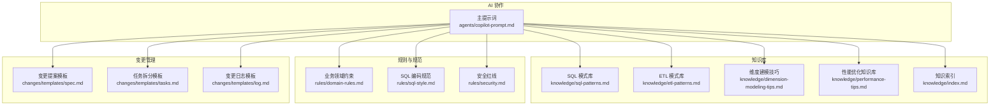
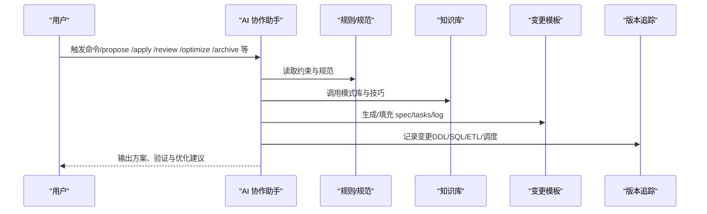
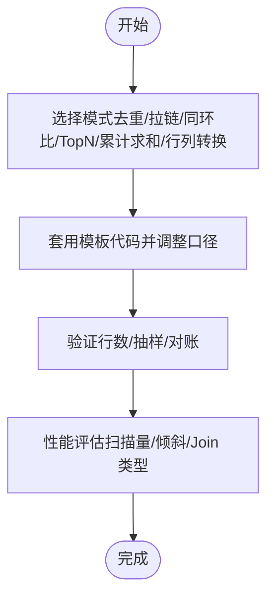
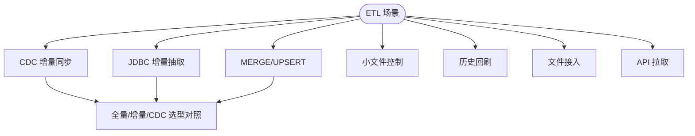
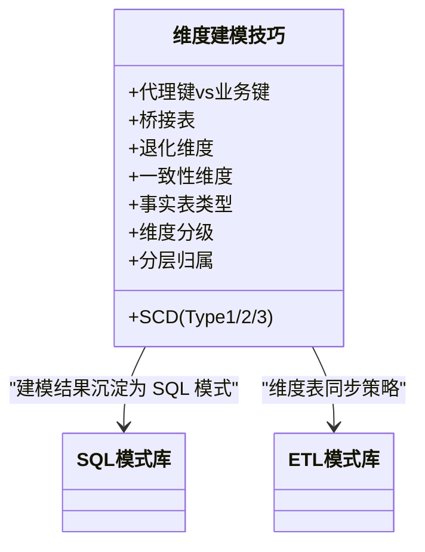
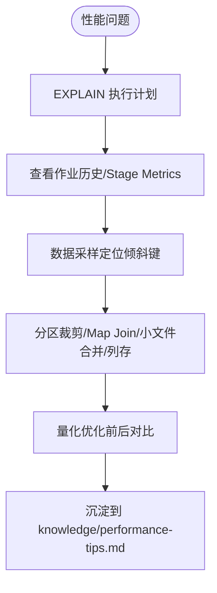
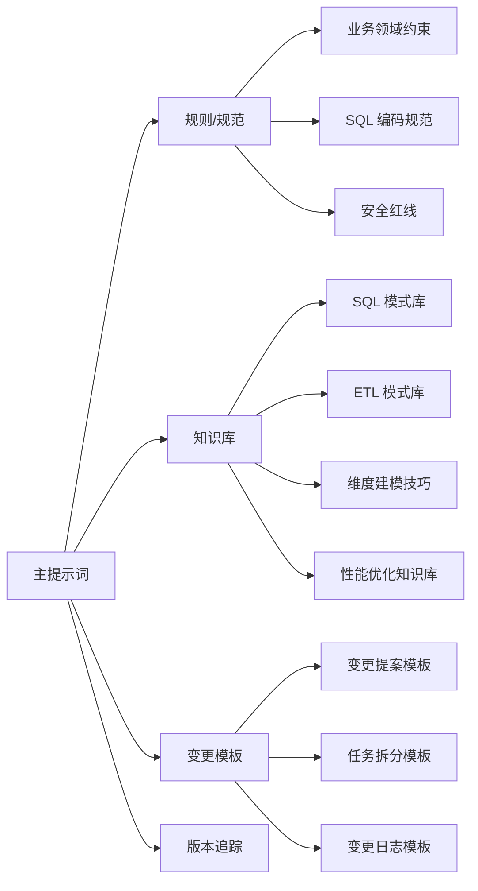

# 知识库索引

<cite>
**本文引用的文件**
- [目录结构和设计说明.md](file://目录结构和设计说明.md)
- [知识索引.md](file://knowledge/index.md)
- [SQL 常用模式库.md](file://knowledge/sql-patterns.md)
- [ETL 模式库.md](file://knowledge/etl-patterns.md)
- [维度建模技巧.md](file://knowledge/dimension-modeling-tips.md)
- [性能优化知识库.md](file://knowledge/performance-tips.md)
- [主提示词.md](file://agents/copilot-prompt.md)
- [业务领域约束.md](file://rules/domain-rules.md)
- [SQL 编码规范.md](file://rules/sql-style.md)
- [安全红线.md](file://rules/security.md)
- [变更提案模板.md](file://changes/templates/spec.md)
- [任务拆分模板.md](file://changes/templates/tasks.md)
- [变更日志模板.md](file://changes/templates/log.md)
</cite>

## 目录
1. [简介](#简介)
2. [项目结构](#项目结构)
3. [核心组件](#核心组件)
4. [架构总览](#架构总览)
5. [详细组件分析](#详细组件分析)
6. [依赖关系分析](#依赖关系分析)
7. [性能与检索指南](#性能与检索指南)
8. [故障排查与最佳实践](#故障排查与最佳实践)
9. [结论](#结论)
10. [附录](#附录)

## 简介
本索引面向数据仓库工程场景，提供“三段式知识库”的导航与检索指南。知识库以“规则（约束）—经验（模式库）—过程（变更日志）”为核心结构，围绕 SQL 模式、ETL 模式、维度建模、性能优化、业务规则与安全规范，帮助用户快速定位所需知识，提升研发效率与质量。

## 项目结构
项目采用“提示词 + 知识库 + 规则 + 变更模板”的组织方式：
- agents/：AI 协作提示词与审查器
- knowledge/：领域知识与模式库（SQL/ETL/建模/性能）
- rules/：项目约束与规范（业务、SQL、安全、调度等）
- changes/：变更管理模板（spec/tasks/log/validation）

图表来源
- [目录结构和设计说明.md:19-55](file://目录结构和设计说明.md#L19-L55)
- [主提示词.md:1-147](file://agents/copilot-prompt.md#L1-L147)

章节来源
- [目录结构和设计说明.md:19-55](file://目录结构和设计说明.md#L19-L55)

## 核心组件
- 知识索引：一句话索引，便于 AI 快速命中关键模式与技巧
- SQL 模式库：去重保留最新、拉链表、同环比、TopN、累计求和、行转列/列转行等
- ETL 模式库：CDC 增量同步、JDBC 增量抽取、MERGE/UPSERT、小文件合并、历史回刷
- 维度建模技巧：代理键/业务键、SCD、桥接表、退化维度、一致性维度、事实表类型、维度分级、分层归属
- 性能优化知识库：分区裁剪、数据倾斜、Map Join、小文件、CTE 物化、谓词下推、Join 顺序与类型、窗口函数、存储格式与压缩、调度与资源
- 规则与规范：业务口径、SQL 编码规范、安全红线
- 变更模板：spec/tasks/log，支撑“Spec 驱动 + 三段式知识库 + 强制变更追踪”

章节来源
- [知识索引.md:1-60](file://知识索引.md#L1-L60)
- [SQL 常用模式库.md:1-331](file://knowledge/sql-patterns.md#L1-L331)
- [ETL 模式库.md:1-220](file://knowledge/etl-patterns.md#L1-L220)
- [维度建模技巧.md:1-253](file://knowledge/dimension-modeling-tips.md#L1-L253)
- [性能优化知识库.md:1-349](file://knowledge/performance-tips.md#L1-L349)
- [业务领域约束.md:1-142](file://rules/domain-rules.md#L1-L142)
- [SQL 编码规范.md:1-254](file://rules/sql-style.md#L1-L254)
- [安全红线.md:1-98](file://rules/security.md#L1-L98)
- [变更提案模板.md:1-132](file://changes/templates/spec.md#L1-L132)
- [任务拆分模板.md:1-74](file://changes/templates/tasks.md#L1-L74)
- [变更日志模板.md:1-61](file://changes/templates/log.md#L1-L61)

## 架构总览
系统以“提示词驱动 + 知识飞轮 + 变更追踪”为核心：
- 提示词驱动：AI 在固定命令流内工作，确保流程闭环
- 知识飞轮：实践 → changes/log.md → archive → knowledge/ 复用
- 变更追踪：自动记录每次 DDL/SQL/ETL/调度变更，形成可审计日志

图表来源
- [目录结构和设计说明.md:61-105](file://目录结构和设计说明.md#L61-L105)
- [主提示词.md:63-132](file://agents/copilot-prompt.md#L63-L132)

章节来源
- [目录结构和设计说明.md:61-105](file://目录结构和设计说明.md#L61-L105)
- [主提示词.md:63-132](file://agents/copilot-prompt.md#L63-L132)

## 详细组件分析

### 知识索引与检索导航
- 作用：以“一句话索引”快速定位 SQL/ETL/建模/性能等关键模式
- 使用建议：
  - 按关键词检索：如“去重保留最新”“CDC 增量同步”“SCD2 拉链表”
  - 通过章节定位：index.md 中的章节标题与条目链接到具体文件与段落
  - 结合变更日志：archive 时沉淀到 knowledge/，形成知识飞轮

章节来源
- [知识索引.md:1-60](file://知识索引.md#L1-L60)

### SQL 模式库
- 覆盖场景：去重保留最新、拉链表（SCD2）、同环比、TopN、累计求和、行转列/列转行、数据回刷、Lambda 合并、缺失日期补齐、NULL 安全比较
- 使用建议：
  - 直接复用模板代码，按业务口径微调
  - 注意性能说明与基数/倾斜风险
  - 与分区裁剪、Map Join 等性能优化结合

图表来源
- [SQL 常用模式库.md:6-331](file://knowledge/sql-patterns.md#L6-L331)

章节来源
- [SQL 常用模式库.md:1-331](file://knowledge/sql-patterns.md#L1-L331)

### ETL 模式库
- 覆盖场景：CDC 增量同步（Flink CDC + Kafka + Iceberg/Hudi）、JDBC 增量抽取、MERGE/UPSERT、小文件控制、历史回刷、文件接入、API 拉取、全量/增量/CDC 选型对照、数据漂移与时区处理
- 使用建议：
  - 依据数据源与实时性需求选择同步方式
  - 严格幂等与回放能力设计
  - 控制小文件与回刷并发，避免影响日常作业

图表来源
- [ETL 模式库.md:6-220](file://knowledge/etl-patterns.md#L6-L220)

章节来源
- [ETL 模式库.md:1-220](file://knowledge/etl-patterns.md#L1-L220)

### 维度建模技巧
- 关键主题：代理键 vs 业务键、SCD（Type 1/2/3）、桥接表、退化维度、一致性维度、事实表类型（事务/周期/累积/无事实）、维度分级、分层归属判定
- 使用建议：
  - 双键并存策略，兼顾历史追溯与性能
  - SCD 选型需平衡历史完整性与存储/性能
  - 一致性维度集中建设，避免口径分裂

图表来源
- [维度建模技巧.md:5-253](file://knowledge/dimension-modeling-tips.md#L5-L253)

章节来源
- [维度建模技巧.md:1-253](file://knowledge/dimension-modeling-tips.md#L1-L253)

### 性能优化知识库
- 关键主题：分区裁剪、数据倾斜、Map Join、小文件、CTE 物化、谓词下推、Join 顺序与类型、窗口函数、存储格式与压缩、调度与资源、性能分析工具
- 使用建议：
  - 以 EXPLAIN 与作业历史为起点，定位慢 stage
  - 结合分区裁剪、倾斜治理、广播小表、列存格式等手段
  - 建立性能对比记录，沉淀优化经验

图表来源
- [性能优化知识库.md:5-349](file://knowledge/performance-tips.md#L5-L349)

章节来源
- [性能优化知识库.md:1-349](file://knowledge/performance-tips.md#L1-L349)

### 规则与规范
- 业务领域约束：金额精度、百分比格式、同比/环比口径、排名与排序键、状态颜色、KPI 定义标准、数据质量五大维度、历史数据约定、行业特定规则、跨系统一致性
- SQL 编码规范：命名约定（库/表/字段/分区）、格式规范、关键字大小写、头部注释、性能优先原则、禁止事项
- 安全红线：数据安全、字段级脱敏、行级权限（RLS）、数据分级与访问控制、上线与发布安全、数据回刷安全、业务安全、跨境合规、安全审计、应急响应

章节来源
- [业务领域约束.md:1-142](file://rules/domain-rules.md#L1-L142)
- [SQL 编码规范.md:1-254](file://rules/sql-style.md#L1-L254)
- [安全红线.md:1-98](file://rules/security.md#L1-L98)

### 变更管理模板
- 变更提案模板：背景与目标、现状分析、功能点、业务规则与口径、模型变更（DDL）、SQL 加工设计、ETL/同步变更、调度变更、数据质量规则、影响范围、风险与关注点、验证策略、待澄清、技术决策、执行日志、审查结论、确认记录
- 任务拆分模板：按 ODS→DIM→DWD→DWS→ADS 顺序拆分，每个任务原子化、可独立验证
- 变更日志模板：时间线、技术决策、踩坑记录、知识发现（分类标签）、Spec-实现偏差、回刷记录、性能对比、DQ 验证、质量备忘

章节来源
- [变更提案模板.md:1-132](file://changes/templates/spec.md#L1-L132)
- [任务拆分模板.md:1-74](file://changes/templates/tasks.md#L1-L74)
- [变更日志模板.md:1-61](file://changes/templates/log.md#L1-L61)

## 依赖关系分析
- 组件耦合与协作：
  - 提示词驱动 AI 严格遵循规则与规范
  - 知识库为 AI 提供可复用的经验与模式
  - 变更模板承载“Spec 驱动”的过程资产
  - 版本追踪贯穿所有变更，确保可审计与可回溯
- 外部依赖与集成：
  - 引擎差异（Hive/Spark/MaxCompute/Trino）对 SQL/ETL/性能的影响
  - 工具栈（Flink CDC/Kafka/Iceberg/Hudi/SeaTunnel/DataX/dbt/Spark）的选择与配置

图表来源
- [目录结构和设计说明.md:61-105](file://目录结构和设计说明.md#L61-L105)
- [主提示词.md:63-132](file://agents/copilot-prompt.md#L63-L132)

章节来源
- [目录结构和设计说明.md:61-105](file://目录结构和设计说明.md#L61-L105)
- [主提示词.md:63-132](file://agents/copilot-prompt.md#L63-L132)

## 性能与检索指南
- 快速检索技巧
  - 使用“知识索引”按关键词快速定位：如“去重保留最新”“CDC 增量同步”“SCD2 拉链表”“分区裁剪”“Map Join”
  - 通过章节标题与条目链接到具体文件与段落，避免全文搜索
  - 结合“变更日志模板”的分类标签，沉淀知识时统一打标（SQL 模式、建模技巧、ETL/同步技巧、调度与运维、性能优化、数据质量、安全与权限、业务口径）
- 性能优化流程
  - EXPLAIN → 作业历史 → Profile/Stage Metrics → 数据采样 → 优化方案 → 量化对比 → 沉淀到 knowledge/performance-tips.md
- 使用建议
  - 先复用模式库，再按业务口径微调
  - 严格遵循 SQL 编码规范与安全红线
  - 通过变更模板固化流程，版本追踪确保可审计

章节来源
- [知识索引.md:1-60](file://知识索引.md#L1-L60)
- [性能优化知识库.md:327-349](file://knowledge/performance-tips.md#L327-L349)
- [SQL 编码规范.md:165-201](file://rules/sql-style.md#L165-L201)
- [安全红线.md:7-98](file://rules/security.md#L7-L98)
- [变更日志模板.md:26-35](file://changes/templates/log.md#L26-L35)

## 故障排查与最佳实践
- 常见问题与对策
  - 分区裁剪失效：避免函数包裹分区字段，确认执行计划
  - 数据倾斜：过滤热点、加盐打散、Map Join 小表
  - 小文件爆炸：控制 reduce 数、DISTRIBUTE BY、AQE 合并
  - CDC 位点跳变：校验 GTID，保留足够长的 Kafka 历史
  - NULL 安全比较：使用 `<=>` 或显式 OR (a IS NULL AND b IS NULL)
- 最佳实践
  - 以“Spec 驱动”，先提案再实施
  - 三阶段审查：Spec 合规 → 模型质量 → SQL 质量
  - 每次变更自动记录，沉淀到 knowledge/
  - 严格命名与注释，统一关键字大小写与缩进

章节来源
- [性能优化知识库.md:10-39](file://knowledge/performance-tips.md#L10-L39)
- [ETL 模式库.md:17-27](file://knowledge/etl-patterns.md#L17-L27)
- [SQL 常用模式库.md:311-331](file://knowledge/sql-patterns.md#L311-L331)
- [主提示词.md:113-127](file://agents/copilot-prompt.md#L113-L127)
- [目录结构和设计说明.md:61-105](file://目录结构和设计说明.md#L61-L105)

## 结论
本知识库以“提示词驱动 + 三段式知识库 + 强制变更追踪”为核心，提供从 SQL 模式、ETL 同步、维度建模到性能优化与安全规范的完整知识体系。通过“知识索引 + 模板 + 版本追踪”，实现“实践 → 知识沉淀 → 复用”的闭环，显著提升研发效率与质量。

## 附录
- 使用方式
  - 将项目目录加载到 AI 编码助手，阅读主提示词，按命令开展协作
  - 首次使用执行初始化，填充项目上下文
- 扩展方向
  - 增加实时数仓、湖仓一体、成本优化等专题
  - 集成 dbt/SQLMesh 与数据血缘平台

章节来源
- [目录结构和设计说明.md:186-204](file://目录结构和设计说明.md#L186-L204)
- [主提示词.md:55-62](file://agents/copilot-prompt.md#L55-L62)