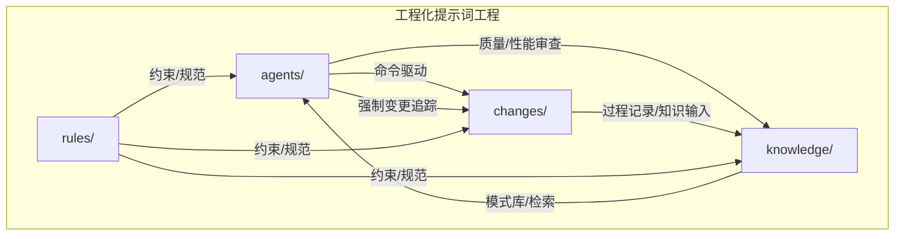
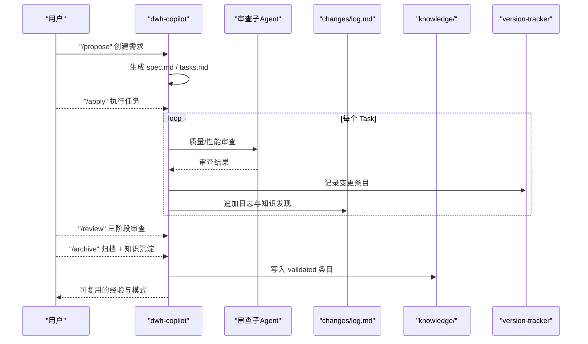
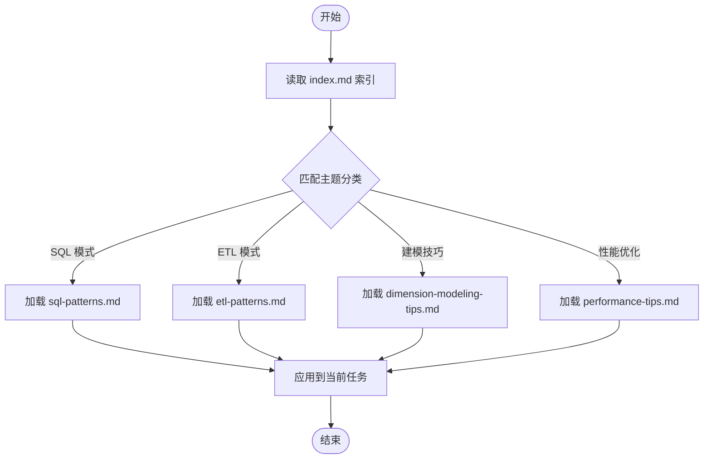
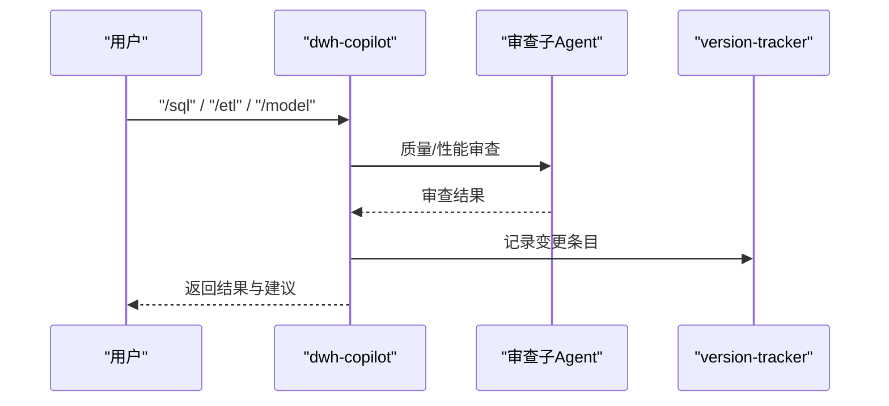
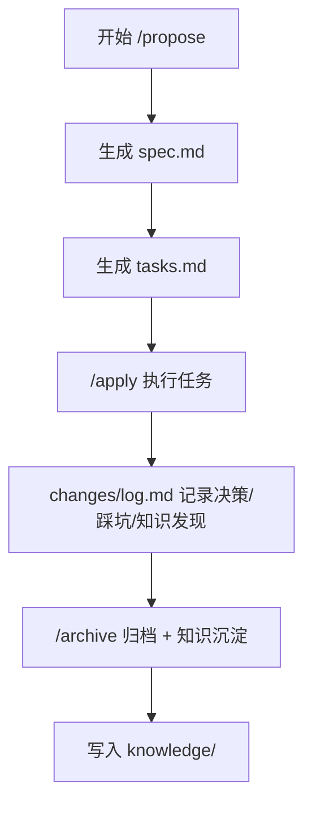
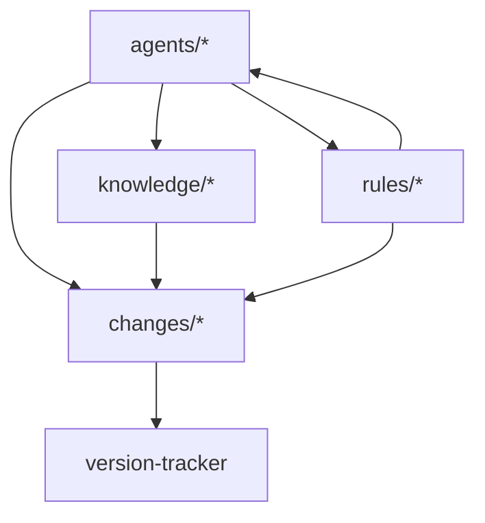

# 知识飞轮机制

<cite>
**本文引用的文件**
- [目录结构和设计说明.md](file://目录结构和设计说明.md)
- [copilot-prompt.md](file://agents/copilot-prompt.md)
- [sql-reviewer.md](file://agents/sql-reviewer.md)
- [version-tracker.md](file://agents/version-tracker.md)
- [index.md](file://knowledge/index.md)
- [sql-patterns.md](file://knowledge/sql-patterns.md)
- [etl-patterns.md](file://knowledge/etl-patterns.md)
- [dimension-modeling-tips.md](file://knowledge/dimension-modeling-tips.md)
- [performance-tips.md](file://knowledge/performance-tips.md)
- [spec.md](file://changes/templates/spec.md)
- [tasks.md](file://changes/templates/tasks.md)
- [log.md](file://changes/templates/log.md)
- [domain-rules.md](file://rules/domain-rules.md)
- [sql-style.md](file://rules/sql-style.md)
- [modeling-standards.md](file://rules/modeling-standards.md)
</cite>

## 目录
1. [简介](#简介)
2. [项目结构](#项目结构)
3. [核心组件](#核心组件)
4. [架构总览](#架构总览)
5. [详细组件分析](#详细组件分析)
6. [依赖分析](#依赖分析)
7. [性能考虑](#性能考虑)
8. [故障排查指南](#故障排查指南)
9. [结论](#结论)
10. [附录](#附录)

## 简介
本文件围绕“知识飞轮机制”在数据仓库工程中的落地实践，系统阐述从“实践 → 发现 → 沉淀 → 复用”的闭环设计与实现路径。通过对 agents、changes、knowledge、rules 四大目录的协同，构建可审计、可复用、可优化的知识管理体系，支撑团队在 Spec 驱动下的标准化开发流程，提升效率、降低重复劳动、保证质量一致性。

## 项目结构
项目采用“三段式知识结构 + 强制变更追踪”的工程化提示词工程，核心目录与职责如下：
- agents/：AI 角色与子 Agent 提示词，负责命令式协作、质量审查、性能诊断与变更追踪
- changes/：变更管理与过程记录，承载 Spec 驱动的完整变更生命周期
- knowledge/：领域知识库，沉淀 SQL 模式、ETL 模式、建模技巧、性能优化经验
- rules/：项目约束与规范，定义强制规则与最佳实践

图表来源
- [目录结构和设计说明.md: 19-55:19-55](file://目录结构和设计说明.md#L19-L55)
- [目录结构和设计说明.md: 70-78:70-78](file://目录结构和设计说明.md#L70-L78)

章节来源
- [目录结构和设计说明.md: 19-55:19-55](file://目录结构和设计说明.md#L19-L55)
- [目录结构和设计说明.md: 70-78:70-78](file://目录结构和设计说明.md#L70-L78)

## 核心组件
- 知识飞轮闭环
  - 实践：通过命令式流程（/sql、/etl、/model、/apply、/review、/optimize、/dq、/schedule、/archive）在各层执行具体任务
  - 发现：在 changes/log.md 中记录决策、踩坑与知识发现
  - 沉淀：通过 /archive 将 validated 的知识条目写入 knowledge/
  - 复用：AI 在后续任务中基于 knowledge/ 快速命中模式与经验
- 三段式知识结构
  - rules/：约束（必须遵守的“红线”）
  - knowledge/：经验（可复用的“工具箱”）
  - changes/：过程（每次变更的“病历”）
- 强制变更追踪
  - version-tracker 在每次 DDL/SQL/ETL/调度变更后自动记录结构化日志，确保可审计、可回溯

章节来源
- [目录结构和设计说明.md: 78](file://目录结构和设计说明.md#L78)
- [目录结构和设计说明.md: 98-106:98-106](file://目录结构和设计说明.md#L98-L106)
- [copilot-prompt.md: 64-68:64-68](file://agents/copilot-prompt.md#L64-L68)
- [version-tracker.md: 5-16:5-16](file://agents/version-tracker.md#L5-L16)

## 架构总览
知识飞轮在数据仓库工程中的作用与价值体现在：
- 规范化流程：通过命令体系与三阶段审查，确保 Spec 驱动与质量合规
- 知识复用：SQL 模式、ETL 模式、建模技巧、性能优化经验可直接复用
- 可审计性：版本追踪记录所有变更，支持回溯与责任界定
- 质量保障：数据质量规则、性能审查清单与 DQ 对账流程降低偏差与回归风险

图表来源
- [目录结构和设计说明.md: 126-151:126-151](file://目录结构和设计说明.md#L126-L151)
- [copilot-prompt.md: 103-131:103-131](file://agents/copilot-prompt.md#L103-L131)
- [version-tracker.md: 7-16:7-16](file://agents/version-tracker.md#L7-L16)
- [log.md: 20-25:20-25](file://changes/templates/log.md#L20-L25)

章节来源
- [目录结构和设计说明.md: 126-151:126-151](file://目录结构和设计说明.md#L126-L151)
- [copilot-prompt.md: 103-131:103-131](file://agents/copilot-prompt.md#L103-L131)
- [version-tracker.md: 7-16:7-16](file://agents/version-tracker.md#L7-L16)
- [log.md: 20-25:20-25](file://changes/templates/log.md#L20-L25)

## 详细组件分析

### 知识库组织与检索机制
- 索引与分类
  - index.md 提供“一句话索引”，便于 AI 快速命中 SQL 模式、ETL 模式、建模技巧、性能优化等主题
  - 每个条目包含触发关键词、核心逻辑与相关表/作业/文件链接，支持快速检索
- 模式库与技巧库
  - SQL 模式库：去重保留最新、拉链表（SCD2）、同环比、TopN、累计求和、行转列/列转行、数据回刷、Lambda 合并、缺失日期补齐、NULL 安全比较
  - ETL 模式库：CDC 增量同步、JDBC 增量抽取、MERGE/UPSERT、小文件控制、历史回刷、文件接入、API 拉取、全量/增量/CDC 选型对照、数据漂移与时区处理
  - 维度建模技巧：代理键 vs 业务键、SCD 三种类型、桥接表、退化维度、一致性维度、事实表类型选择、维度表分级、分层归属判定
  - 性能优化知识库：分区裁剪、数据倾斜、Map Join/Broadcast Join、小文件问题、CTE 物化策略、谓词下推与列裁剪、Join 顺序与类型、窗口函数性能、存储格式与压缩、调度与资源、性能分析工具
- 检索与复用
  - AI 在执行任务时，基于 index.md 的关键词与分类标签快速匹配相应模式，减少重复思考与试错成本

图表来源
- [index.md: 6-60:6-60](file://knowledge/index.md#L6-L60)
- [sql-patterns.md: 1-331:1-331](file://knowledge/sql-patterns.md#L1-L331)
- [etl-patterns.md: 1-220:1-220](file://knowledge/etl-patterns.md#L1-L220)
- [dimension-modeling-tips.md: 1-253:1-253](file://knowledge/dimension-modeling-tips.md#L1-L253)
- [performance-tips.md: 1-349:1-349](file://knowledge/performance-tips.md#L1-L349)

章节来源
- [index.md: 6-60:6-60](file://knowledge/index.md#L6-L60)
- [sql-patterns.md: 1-331:1-331](file://knowledge/sql-patterns.md#L1-L331)
- [etl-patterns.md: 1-220:1-220](file://knowledge/etl-patterns.md#L1-L220)
- [dimension-modeling-tips.md: 1-253:1-253](file://knowledge/dimension-modeling-tips.md#L1-L253)
- [performance-tips.md: 1-349:1-349](file://knowledge/performance-tips.md#L1-L349)

### 命令式协作与流程控制
- 命令体系
  - /init、/sql、/etl、/model、/propose、/apply、/review、/optimize、/dq、/schedule、/archive
  - 每个命令定义明确的触发场景、输入输出与质量要求，确保流程可重复、可审计
- 三阶段审查
  - Spec 合规 → 模型质量 → SQL 质量，逐级推进，不通过不进入下一阶段
- 变更即记录
  - 每次执行命令后，version-tracker 自动记录结构化变更条目，确保可追溯

图表来源
- [copilot-prompt.md: 68-131:68-131](file://agents/copilot-prompt.md#L68-L131)
- [sql-reviewer.md: 1-68:1-68](file://agents/sql-reviewer.md#L1-L68)
- [version-tracker.md: 7-16:7-16](file://agents/version-tracker.md#L7-L16)

章节来源
- [copilot-prompt.md: 68-131:68-131](file://agents/copilot-prompt.md#L68-L131)
- [sql-reviewer.md: 1-68:1-68](file://agents/sql-reviewer.md#L1-L68)
- [version-tracker.md: 7-16:7-16](file://agents/version-tracker.md#L7-L16)

### 变更管理与知识输入
- changes/templates/
  - spec.md：需求规格模板，包含背景、现状、功能点、业务规则、DDL、SQL 设计、ETL/同步、调度、DQ、影响范围、风险与验证策略等
  - tasks.md：任务拆分模板，按 ODS→DIM→DWD→DWS→ADS 顺序原子化拆分，明确验收标准与验证方法
  - log.md：变更日志模板，记录时间线、技术决策、踩坑记录、知识发现、性能对比、DQ 验证等
- 知识发现与沉淀
  - changes/log.md 作为知识飞轮的输入，/archive 命令用于将 validated 的知识条目沉淀到 knowledge/

图表来源
- [spec.md: 1-132:1-132](file://changes/templates/spec.md#L1-L132)
- [tasks.md: 1-74:1-74](file://changes/templates/tasks.md#L1-L74)
- [log.md: 1-61:1-61](file://changes/templates/log.md#L1-L61)

章节来源
- [spec.md: 1-132:1-132](file://changes/templates/spec.md#L1-L132)
- [tasks.md: 1-74:1-74](file://changes/templates/tasks.md#L1-L74)
- [log.md: 1-61:1-61](file://changes/templates/log.md#L1-L61)

### 约束与规范（rules/）
- 业务领域规则：金额精度、报表展示、百分比格式、时间维度、同比/环比口径、排序键、状态颜色、跨系统一致性、历史数据约定、行业特定规则
- SQL 编码规范：命名约定（库/表/字段/分区）、关键字大小写、缩进与换行、头部注释、禁止事项、常见错误对照
- 建模与分层规范：分层架构、星型模型、事实表/维度表设计、关系与关联、物理设计（分区/分桶/存储格式/生命周期）、度量值与指标分级、禁止事项、模型评审清单

章节来源
- [domain-rules.md: 1-142:1-142](file://rules/domain-rules.md#L1-L142)
- [sql-style.md: 1-254:1-254](file://rules/sql-style.md#L1-L254)
- [modeling-standards.md: 1-242:1-242](file://rules/modeling-standards.md#L1-L242)

## 依赖分析
- 组件耦合与协作
  - agents 依赖 changes 的当前进行中变更与模板，依赖 rules 的约束与规范，依赖 knowledge 的模式库进行复用
  - changes 依赖 version-tracker 的结构化记录能力
  - knowledge 依赖 changes 的 validated 发现进行沉淀
  - rules 为 agents 与 changes 提供强制约束与最佳实践
- 外部依赖与集成点
  - 与调度系统（Azkaban/DolphinScheduler/MC）的集成：通过调度配置与依赖关系管理
  - 与数据质量平台的集成：DQ 规则与对账流程
  - 与数据血缘平台的集成：变更影响分析自动化（扩展）

图表来源
- [目录结构和设计说明.md: 19-55:19-55](file://目录结构和设计说明.md#L19-L55)
- [version-tracker.md: 1-120:1-120](file://agents/version-tracker.md#L1-L120)

章节来源
- [目录结构和设计说明.md: 19-55:19-55](file://目录结构和设计说明.md#L19-L55)
- [version-tracker.md: 1-120:1-120](file://agents/version-tracker.md#L1-L120)

## 性能考虑
- 分区裁剪：WHERE 条件直接命中分区字段，避免函数包裹导致的全表扫描
- 数据倾斜：热点键过滤/单独处理、加盐打散、Map Join 小表等策略
- Join 顺序与类型：依据引擎特性选择 Broadcast Hash Join、Sort Merge Join、Bucket Join
- CTE 物化：在 Hive/Spark 中避免默认不物化导致的重复计算
- 存储格式与压缩：ORC/Parquet + ZSTD 优先，列裁剪与谓词下推显著降低扫描量
- 调度与资源：错峰调度、资源队列划分、失败重试与回放策略

章节来源
- [performance-tips.md: 5-349:5-349](file://knowledge/performance-tips.md#L5-L349)

## 故障排查指南
- 调试流程：现象收集 → 根因定位 → 方案验证 → 实施修复
- 诊断层级：数据源层 → 抽取层 → ODS/DWD/DWS/ADS → 应用层
- SQL 质量审查：Critical/Important/Minor 三级问题清单，涵盖分区裁剪、Join 膨胀、全表扫描、重复计算、NULL 处理、时间过滤、字段别名、CTE 使用等
- 数据质量规则：完整性、唯一性、一致性、准确性、时效性五维度，严重等级（P0/P1/P2）

章节来源
- [copilot-prompt.md: 133-146:133-146](file://agents/copilot-prompt.md#L133-L146)
- [sql-reviewer.md: 5-68:5-68](file://agents/sql-reviewer.md#L5-L68)
- [domain-rules.md: 69-91:69-91](file://rules/domain-rules.md#L69-L91)

## 结论
知识飞轮机制通过“实践 → 发现 → 沉淀 → 复用”的闭环，将团队在数据仓库工程中的经验沉淀为可复用的知识资产。结合命令式协作、三阶段审查与强制变更追踪，既保证了质量一致性，又提升了团队效率与可维护性。建议持续完善 changes/log.md 的知识发现质量，加强 version-tracker 的自动化记录，推动 knowledge/ 的主题化与结构化演进，以实现更高层次的知识复用与工程化水平。

## 附录
- 知识贡献与维护最佳实践
  - 在每个 Task 完成后及时在 changes/log.md 记录“技术决策、踩坑记录、知识发现”
  - 使用分类标签（SQL 模式、建模技巧、ETL/同步技巧、调度与运维、性能优化、数据质量、数据安全与权限、业务口径）便于检索
  - 通过 /archive 将 validated 的条目沉淀到 knowledge/，并在 AI 协作中主动建议沉淀
  - 定期回顾与更新 rules/ 中的约束与规范，确保与实践一致
- 知识库组织与检索建议
  - 保持 index.md 的简洁与可读性，每条用一句话说清核心逻辑
  - 模式库按“场景 → 代码 → 解释 → 性能说明”结构编写，便于快速复用
  - 对性能优化与踩坑记录进行量化对比，形成可衡量的改进证据