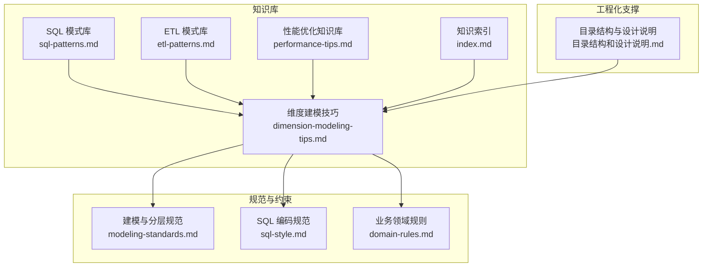
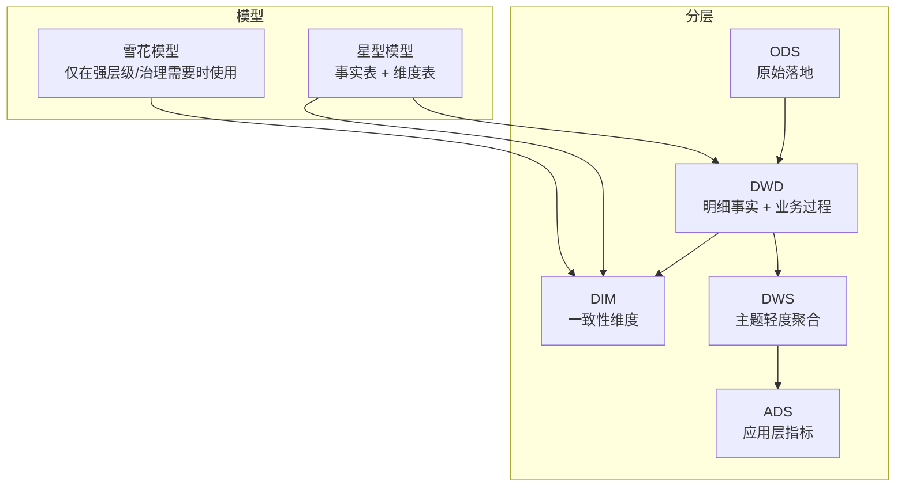
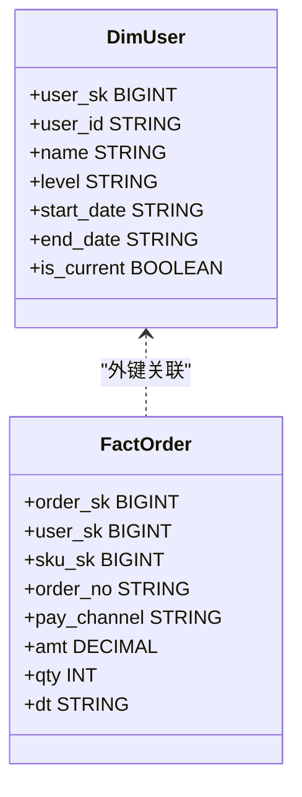
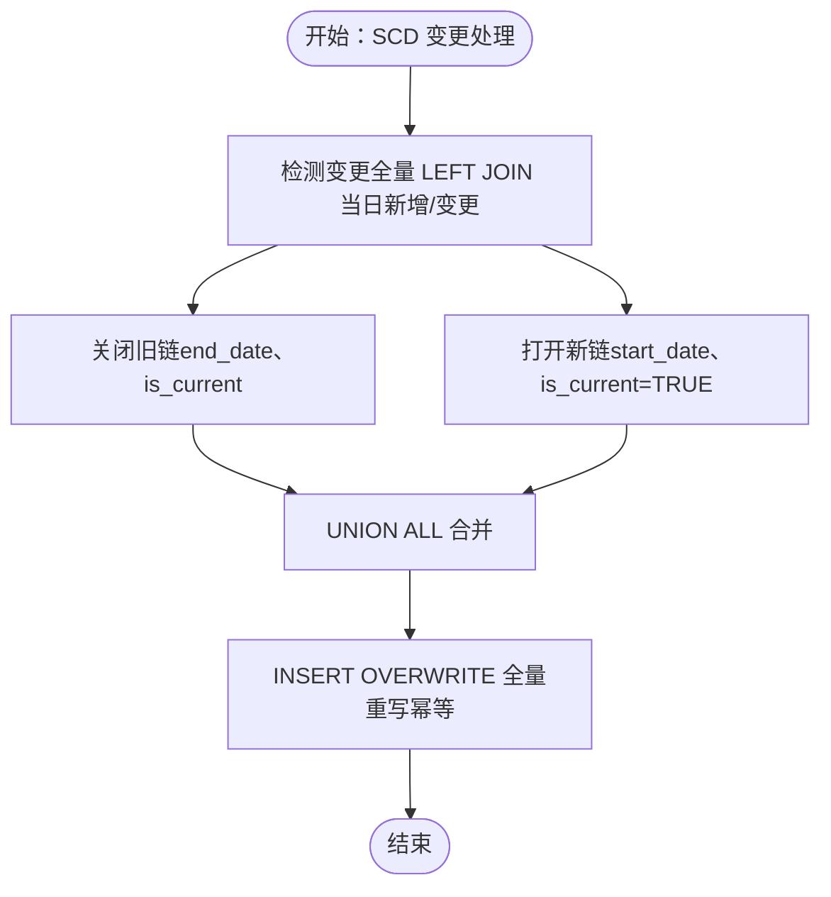
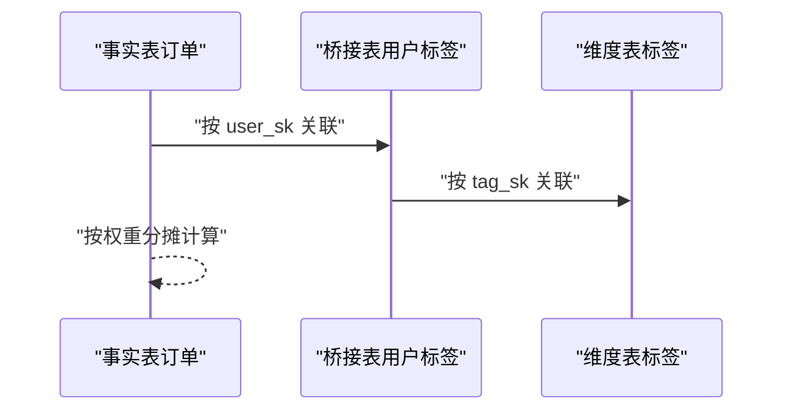
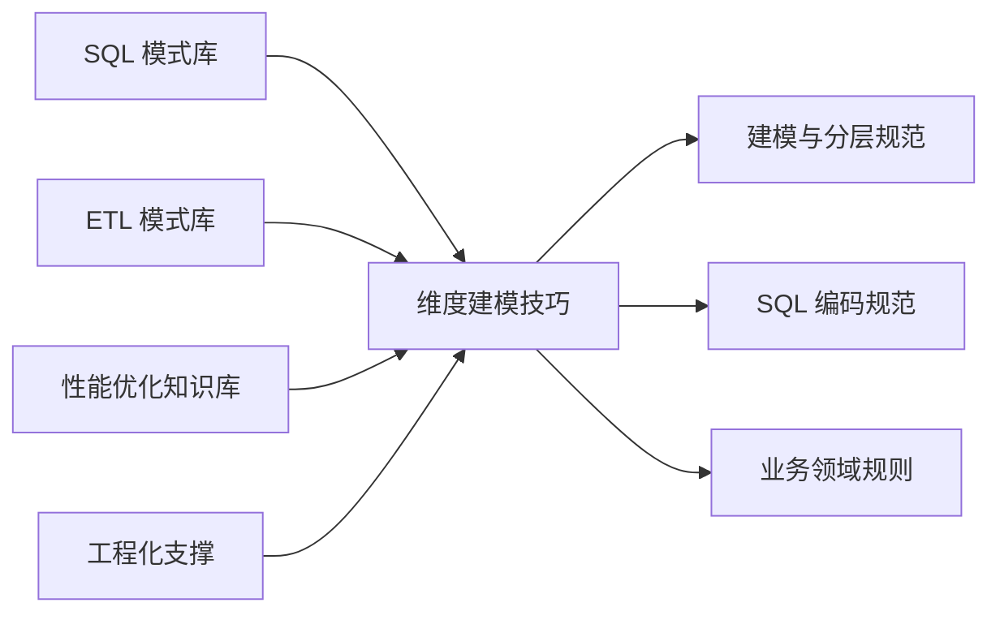

# 维度建模技巧

<cite>
**本文引用的文件**
- [dimension-modeling-tips.md](file://data_warehouse_engineering_code_copilot/knowledge/dimension-modeling-tips.md)
- [sql-patterns.md](file://data_warehouse_engineering_code_copilot/knowledge/sql-patterns.md)
- [modeling-standards.md](file://data_warehouse_engineering_code_copilot/rules/modeling-standards.md)
- [sql-style.md](file://data_warehouse_engineering_code_copilot/rules/sql-style.md)
- [performance-tips.md](file://data_warehouse_engineering_code_copilot/knowledge/performance-tips.md)
- [etl-patterns.md](file://data_warehouse_engineering_code_copilot/knowledge/etl-patterns.md)
- [domain-rules.md](file://data_warehouse_engineering_code_copilot/rules/domain-rules.md)
- [目录结构和设计说明.md](file://data_warehouse_engineering_code_copilot/目录结构和设计说明.md)
- [index.md](file://data_warehouse_engineering_code_copilot/knowledge/index.md)
</cite>

## 目录
1. [简介](#简介)
2. [项目结构](#项目结构)
3. [核心组件](#核心组件)
4. [架构总览](#架构总览)
5. [详细组件分析](#详细组件分析)
6. [依赖分析](#依赖分析)
7. [性能考量](#性能考量)
8. [故障排查指南](#故障排查指南)
9. [结论](#结论)
10. [附录](#附录)

## 简介
本指南围绕维度建模的核心方法论与工程实践，系统阐述星型模型与雪花模型的设计原理、适用场景与设计原则；详解维度表与事实表的建模方法，重点覆盖缓慢变化维度（SCD）的三种类型及其处理策略；总结维度建模最佳实践与常见问题的解决方案，包括维度层次设计、属性规范化、命名规范等；并通过实际案例展示从需求分析到模型实现的完整流程，帮助读者在工程中落地 Kimball 维度建模思想。

## 项目结构
该项目是一个“AI 协作助手”型的数仓工程化知识库，围绕“Spec 驱动 + 三段式知识库 + 强制变更追踪”的理念，沉淀 SQL 模式、ETL 模式、建模技巧与性能优化经验，并配套规范与审查流程，确保模型与实现的一致性与可审计性。

图表来源
- [目录结构和设计说明.md:19-55](file://data_warehouse_engineering_code_copilot/目录结构和设计说明.md#L19-L55)
- [index.md:27-36](file://data_warehouse_engineering_code_copilot/knowledge/index.md#L27-L36)

章节来源
- [目录结构和设计说明.md:19-55](file://data_warehouse_engineering_code_copilot/目录结构和设计说明.md#L19-L55)
- [index.md:1-60](file://data_warehouse_engineering_code_copilot/knowledge/index.md#L1-L60)

## 核心组件
- 维度建模技巧：涵盖代理键/业务键、SCD 三类型、桥接表、退化维度、一致性维度、事实表类型、维度分级与分层归属判定等。
- SQL 模式库：提供拉链表（SCD2）等关键实现模式，支撑维度建模落地。
- 建模与分层规范：定义标准分层、星型/雪花模型优先级、事实表/维度表设计原则、命名与字段规范。
- SQL 编码规范：统一命名、格式、头部注释、性能与正确性约束。
- 性能优化知识库：分区裁剪、倾斜、Map Join、小文件、CTE 物化等优化策略。
- ETL 模式库：CDC、JDBC 增量、MERGE/UPSERT、小文件控制、历史回刷等工程化实践。
- 业务领域规则：金额精度、同比/环比口径、KPI 定义、跨系统一致性等。

章节来源
- [dimension-modeling-tips.md:1-253](file://data_warehouse_engineering_code_copilot/knowledge/dimension-modeling-tips.md#L1-L253)
- [sql-patterns.md:1-331](file://data_warehouse_engineering_code_copilot/knowledge/sql-patterns.md#L1-L331)
- [modeling-standards.md:1-242](file://data_warehouse_engineering_code_copilot/rules/modeling-standards.md#L1-L242)
- [sql-style.md:1-254](file://data_warehouse_engineering_code_copilot/rules/sql-style.md#L1-L254)
- [performance-tips.md:1-349](file://data_warehouse_engineering_code_copilot/knowledge/performance-tips.md#L1-L349)
- [etl-patterns.md:1-220](file://data_warehouse_engineering_code_copilot/knowledge/etl-patterns.md#L1-L220)
- [domain-rules.md:1-142](file://data_warehouse_engineering_code_copilot/rules/domain-rules.md#L1-L142)

## 架构总览
维度建模在本项目中的工程化落地遵循 Kimball 星型模型优先的原则，强调：
- 星型模型优先：面向分析的模型以事实表为中心，维度表扁平化，减少 Join 复杂度。
- 一致性维度：跨主题共享维度，避免重复建设。
- 维度表分级：核心维度、扩展维度、杂项维度，提升查询效率与可维护性。
- SCD 策略：根据业务需要选择 Type 1/2/3，兼顾历史追溯与存储/性能平衡。
- 分层与命名：严格按 ODS/DWD/DWS/ADS/DIM 分层，统一命名与字段规范，确保可审计与可复用。

图表来源
- [modeling-standards.md:9-34](file://data_warehouse_engineering_code_copilot/rules/modeling-standards.md#L9-L34)
- [modeling-standards.md:51-55](file://data_warehouse_engineering_code_copilot/rules/modeling-standards.md#L51-L55)

章节来源
- [modeling-standards.md:9-34](file://data_warehouse_engineering_code_copilot/rules/modeling-standards.md#L9-L34)
- [modeling-standards.md:51-55](file://data_warehouse_engineering_code_copilot/rules/modeling-standards.md#L51-L55)

## 详细组件分析

### 星型模型与雪花模型
- 星型模型：以事实表为中心，维度表扁平化，适合 OLAP 分析，Join 简单，查询性能好。
- 雪花模型：维度表进一步规范化，减少冗余，但增加 Join 层数，查询复杂度上升。
- 选择原则：优先星型模型；仅在维度强层级、强复用、强治理需要时采用雪花模型，并需说明原因。

章节来源
- [modeling-standards.md:51-55](file://data_warehouse_engineering_code_copilot/rules/modeling-standards.md#L51-L55)

### 代理键 vs 业务键
- 代理键：数仓内自增/哈希 ID，稳定、整数、Join 性能好。
- 业务键：源系统标识，便于追溯，但易变。
- 推荐：双键并存，维度表同时保留 user_sk 与 user_id，事实表使用代理键外键。

图表来源
- [dimension-modeling-tips.md:11-23](file://data_warehouse_engineering_code_copilot/knowledge/dimension-modeling-tips.md#L11-L23)
- [modeling-standards.md:121-124](file://data_warehouse_engineering_code_copilot/rules/modeling-standards.md#L121-L124)

章节来源
- [dimension-modeling-tips.md:5-36](file://data_warehouse_engineering_code_copilot/knowledge/dimension-modeling-tips.md#L5-L36)
- [modeling-standards.md:121-124](file://data_warehouse_engineering_code_copilot/rules/modeling-standards.md#L121-L124)

### 缓慢变化维度（SCD）
- Type 1：覆盖，不保留历史，适用于纠错型变更。
- Type 2：拉链表，保留完整历史，查询需带时间窗口。
- Type 3：双列对照，仅保留前一版本，适用于简单对比。
- 选型对照：Type 1 存储开销最小、Join 简单；Type 2 历史完整但存储大、Join 复杂；Type 3 折中。
- 关键约束：全量重写保证幂等；拉链表查询必须带时间窗口；避免一刀切用 SCD2。

图表来源
- [sql-patterns.md:42-94](file://data_warehouse_engineering_code_copilot/knowledge/sql-patterns.md#L42-L94)
- [dimension-modeling-tips.md:39-83](file://data_warehouse_engineering_code_copilot/knowledge/dimension-modeling-tips.md#L39-L83)

章节来源
- [sql-patterns.md:42-94](file://data_warehouse_engineering_code_copilot/knowledge/sql-patterns.md#L42-L94)
- [dimension-modeling-tips.md:39-83](file://data_warehouse_engineering_code_copilot/knowledge/dimension-modeling-tips.md#L39-L83)

### 桥接表（多对多/多值维度）
- 用于解决“多对多”或“多值维度”，如一个客户多个标签、一份订单多个销售员。
- 关键约定：权重字段用于分摊；必要时带时间窗口；关注基数爆炸。
- 用法示例：通过桥接表与标签维度关联，计算持有 VIP 标签的订单金额。

图表来源
- [dimension-modeling-tips.md:86-122](file://data_warehouse_engineering_code_copilot/knowledge/dimension-modeling-tips.md#L86-L122)

章节来源
- [dimension-modeling-tips.md:86-122](file://data_warehouse_engineering_code_copilot/knowledge/dimension-modeling-tips.md#L86-L122)

### 退化维度（Degenerate Dimension）
- 低基数且仅在事实表内使用的属性，直接退化为事实表列，避免小维度表。
- 适用场景：订单号、支付渠道等；低基数枚举在成本/收益不划算时可退化。
- 踩坑：把所有低基数枚举都退化会导致语义维护混乱；真正高复用的枚举应建 dim 表。

章节来源
- [dimension-modeling-tips.md:125-155](file://data_warehouse_engineering_code_copilot/knowledge/dimension-modeling-tips.md#L125-L155)

### 一致性维度（Conformed Dimension）
- 跨主题/跨事实表共享的维度，避免重复建设。
- 实施要点：集中建设、物理化复用、变更预警。
- 反模式：各主题各自维护多套 dim_user_xxx；一致性维度过度膨胀时拆分为核心维 + 扩展维。

章节来源
- [dimension-modeling-tips.md:158-176](file://data_warehouse_engineering_code_copilot/knowledge/dimension-modeling-tips.md#L158-L176)

### 事实表类型选择
- 事务事实表：单事件粒度（订单、支付、点击）。
- 周期快照：日/月等周期状态拍照（库存、账户余额）。
- 累积快照：流程多个里程碑（订单生命周期）。
- 无事实事实表：仅记录事件发生（学生选课、客户咨询）。
- 选型示例与注意事项：避免用事务表回答“截至 X 日的库存”问题；累积快照需注意幂等更新。

章节来源
- [dimension-modeling-tips.md:179-204](file://data_warehouse_engineering_code_copilot/knowledge/dimension-modeling-tips.md#L179-L204)

### 维度表分级
- 核心维度：高复用、低变化（用户、商品、组织）。
- 扩展维度：仅特定主题使用（订单标签、风险评分）。
- 杂项维度：低基数标志位组合（is_vip × is_new × source），降低事实表外键列数。
- 收益：事实表外键从 N 列降到 1 列，多维分析筛选更高效。

章节来源
- [dimension-modeling-tips.md:207-231](file://data_warehouse_engineering_code_copilot/knowledge/dimension-modeling-tips.md#L207-L231)

### 分层归属判定与命名规范
- 分层归属：是否做了清洗/业务过程切分 → 进 DWD；是否按主题聚合 → 进 DWS；是否直接服务于报表/API（指标级）→ 进 ADS；是否描述性属性（不可加和）→ 进 DIM。
- 命名规范：统一前缀 + 业务过程 + 粒度后缀；主键/外键命名；金额/数量/比率/布尔/时间/日期/状态等字段命名；分区字段统一 dt。
- 反模式：ADS 直接读 ODS；DWD 表里包含汇总指标；DWS 横向爆炸。

章节来源
- [dimension-modeling-tips.md:233-253](file://data_warehouse_engineering_code_copilot/knowledge/dimension-modeling-tips.md#L233-L253)
- [sql-style.md:20-87](file://data_warehouse_engineering_code_copilot/rules/sql-style.md#L20-L87)
- [modeling-standards.md:38-46](file://data_warehouse_engineering_code_copilot/rules/modeling-standards.md#L38-L46)

### 事实表与维度表设计原则
- 事实表：只保留外键、退化维度（业务键）、度量值；描述性属性不冗余到事实表；大型事实表必须按 dt 分区；事务事实表 di 与累积快照 da 严格区分。
- 维度表：代理键 + 业务键双键并存；包含所有描述性属性；拉链表（SCD2）必须有 start_date/end_date/is_current；小型维度表使用全量快照即可。
- 必须的维度表：dim_date、dim_user、dim_org 等。

章节来源
- [modeling-standards.md:73-114](file://data_warehouse_engineering_code_copilot/rules/modeling-standards.md#L73-L114)
- [modeling-standards.md:118-147](file://data_warehouse_engineering_code_copilot/rules/modeling-standards.md#L118-L147)

### 关系与关联约定
- 事实表外键 = 维度表代理键（性能 + 历史一致性）。
- 拉链维度的关联必须带时间窗口：f.biz_date BETWEEN u.start_date AND u.end_date。
- 默认 LEFT JOIN；INNER JOIN 仅在业务上要求“必须有维度”时使用。
- 禁止跨层反向、跨层跳跃、循环依赖、跨主题强耦合。

章节来源
- [modeling-standards.md:151-168](file://data_warehouse_engineering_code_copilot/rules/modeling-standards.md#L151-L168)

### 物理设计与生命周期
- 分区：主分区统一 dt；二级分区按需；单表分区数建议 ≤ 5000。
- 分桶：大表 Join 同一主键时启用，桶数为 2 的幂；Bucket Join 跳过 Shuffle。
- 存储格式：大表优先 ORC（Hive）/ Parquet（Spark/Iceberg）；压缩 ZSTD 优先。
- 生命周期：ODS 增量分区永久；DWD/DWS/ADS 永久；mid_/tmp_ 短期。

章节来源
- [modeling-standards.md:171-193](file://data_warehouse_engineering_code_copilot/rules/modeling-standards.md#L171-L193)

### 指标与口径对齐
- 指标分级：原子指标（*_amt/*_cnt/*_qty）、派生指标（*_rate/*_pct/avg_*）、复合指标（kpi_*）。
- 同名指标在不同表中口径必须一致；出现差异必须改名；一致性指标定义集中在业务领域规则。

章节来源
- [modeling-standards.md:196-209](file://data_warehouse_engineering_code_copilot/rules/modeling-standards.md#L196-L209)
- [domain-rules.md:45-66](file://data_warehouse_engineering_code_copilot/rules/domain-rules.md#L45-L66)

## 依赖分析
维度建模在本项目中的依赖关系体现为：知识库（dimension-modeling-tips.md、sql-patterns.md、etl-patterns.md、performance-tips.md）与规范（modeling-standards.md、sql-style.md、domain-rules.md）共同驱动模型设计与实现；工程化流程（目录结构和设计说明.md）保障变更可审计与可复用。

图表来源
- [目录结构和设计说明.md:19-55](file://data_warehouse_engineering_code_copilot/目录结构和设计说明.md#L19-L55)
- [index.md:27-36](file://data_warehouse_engineering_code_copilot/knowledge/index.md#L27-L36)

章节来源
- [目录结构和设计说明.md:19-55](file://data_warehouse_engineering_code_copilot/目录结构和设计说明.md#L19-L55)
- [index.md:27-36](file://data_warehouse_engineering_code_copilot/knowledge/index.md#L27-L36)

## 性能考量
- 分区裁剪：WHERE 条件必须直接命中分区字段，禁止函数包裹；通过 EXPLAIN 验证裁剪是否生效。
- 数据倾斜：热点键/大量 NULL/默认值/时间集中导致；可通过过滤单独处理、加盐打散、Map Join 小表等方式缓解。
- Map Join/Broadcast Join：小表广播避免 Shuffle；阈值建议以引擎默认为基础适度上调。
- 小文件问题：控制 reduce 数、DISTRIBUTE BY 散列、AQE 自动合并、周期性合并。
- CTE 物化：Hive/Spark 默认不物化，多次引用的复杂 CTE 建议物化为临时表或显式 CACHE。
- Join 顺序与类型：按引擎特性选择 Broadcast Hash Join、Shuffle Hash Join、Sort Merge Join、Bucket Join。
- 窗口函数：PARTITION BY 列基数适中，避免全局排序；配合 DISTRIBUTE BY 优化。
- 存储格式与压缩：大表优先 ORC/Parquet + ZSTD；列裁剪与谓词下推显著提升性能。
- 调度与资源：按主题/优先级划分队列，错峰调度，失败重试与 SLA 基线。

章节来源
- [performance-tips.md:5-39](file://data_warehouse_engineering_code_copilot/knowledge/performance-tips.md#L5-L39)
- [performance-tips.md:42-98](file://data_warehouse_engineering_code_copilot/knowledge/performance-tips.md#L42-L98)
- [performance-tips.md:101-135](file://data_warehouse_engineering_code_copilot/knowledge/performance-tips.md#L101-L135)
- [performance-tips.md:138-165](file://data_warehouse_engineering_code_copilot/knowledge/performance-tips.md#L138-L165)
- [performance-tips.md:167-193](file://data_warehouse_engineering_code_copilot/knowledge/performance-tips.md#L167-L193)
- [performance-tips.md:232-256](file://data_warehouse_engineering_code_copilot/knowledge/performance-tips.md#L232-L256)
- [performance-tips.md:259-283](file://data_warehouse_engineering_code_copilot/knowledge/performance-tips.md#L259-L283)
- [performance-tips.md:286-305](file://data_warehouse_engineering_code_copilot/knowledge/performance-tips.md#L286-L305)
- [performance-tips.md:308-349](file://data_warehouse_engineering_code_copilot/knowledge/performance-tips.md#L308-L349)

## 故障排查指南
- SCD2 写入幂等：必须使用 INSERT OVERWRITE；避免全量重写导致的历史版本丢失。
- 拉链表查询时间窗口：必须带 BETWEEN u.start_date AND u.end_date，否则历史查询不准确。
- 桥接表权重：SUM 时必须乘以权重，避免重复计算。
- 一致性维度变更：变更需广播给所有下游主题，避免口径分裂。
- 分区裁剪失效：检查 WHERE 条件是否包裹分区字段；确认子查询/JOIN 关联条件中裁剪是否生效。
- 数据倾斜：采样热点键，采用加盐打散或单独处理；评估是否需要 Map Join。
- 命名与格式：严格遵守 snake_case、关键字大写、函数小写、缩进与注释规范；禁止 SELECT *、函数包裹分区字段、硬编码日期等。

章节来源
- [dimension-modeling-tips.md:33-36](file://data_warehouse_engineering_code_copilot/knowledge/dimension-modeling-tips.md#L33-L36)
- [dimension-modeling-tips.md:80-83](file://data_warehouse_engineering_code_copilot/knowledge/dimension-modeling-tips.md#L80-L83)
- [dimension-modeling-tips.md:119-122](file://data_warehouse_engineering_code_copilot/knowledge/dimension-modeling-tips.md#L119-L122)
- [performance-tips.md:36-39](file://data_warehouse_engineering_code_copilot/knowledge/performance-tips.md#L36-L39)
- [sql-style.md:192-201](file://data_warehouse_engineering_code_copilot/rules/sql-style.md#L192-L201)

## 结论
本指南基于 Kimball 维度建模思想，结合项目中的规范与知识库，系统梳理了星型/雪花模型、代理键/业务键、SCD 三类型、桥接表、退化维度、一致性维度、事实表类型与分层归属等关键要素。通过统一的命名与字段规范、严格的分层与模型评审清单，以及性能优化与 ETL 工程化实践，确保维度建模在工程中可落地、可审计、可复用、可扩展。建议在实际项目中：
- 优先采用星型模型，仅在强层级/治理需要时使用雪花模型；
- 维度表双键并存，事实表使用代理键外键；
- SCD 选型需结合业务历史追溯需求与存储/性能预算；
- 通过桥接表处理多对多/多值维度；
- 严格遵守分层归属与命名规范，确保口径一致与可维护性；
- 在实现层面落实分区裁剪、Map Join、小文件控制、CTE 物化等性能优化策略。

## 附录
- 实际案例流程（从需求到实现）：
  1) 需求澄清：明确粒度、时间窗、是否含退款、SLA。
  2) 模型设计：确定事实表/维度表、SCD 类型、桥接表、退化维度。
  3) DDL 设计：依据命名与字段规范编写建表语句，配置分区与生命周期。
  4) ETL 实现：选择 CDC/JDBC/MERGE 等模式，保证幂等与回放能力。
  5) SQL 实现：使用 SQL 模式库中的拉链表/同环比/TopN 等模式。
  6) 性能优化：按性能优化知识库进行分区裁剪、倾斜处理、Map Join、小文件合并等。
  7) 审查与归档：三阶段审查（Spec 合规 → 模型质量 → SQL 质量），变更追踪与知识沉淀。

章节来源
- [目录结构和设计说明.md:126-167](file://data_warehouse_engineering_code_copilot/目录结构和设计说明.md#L126-L167)