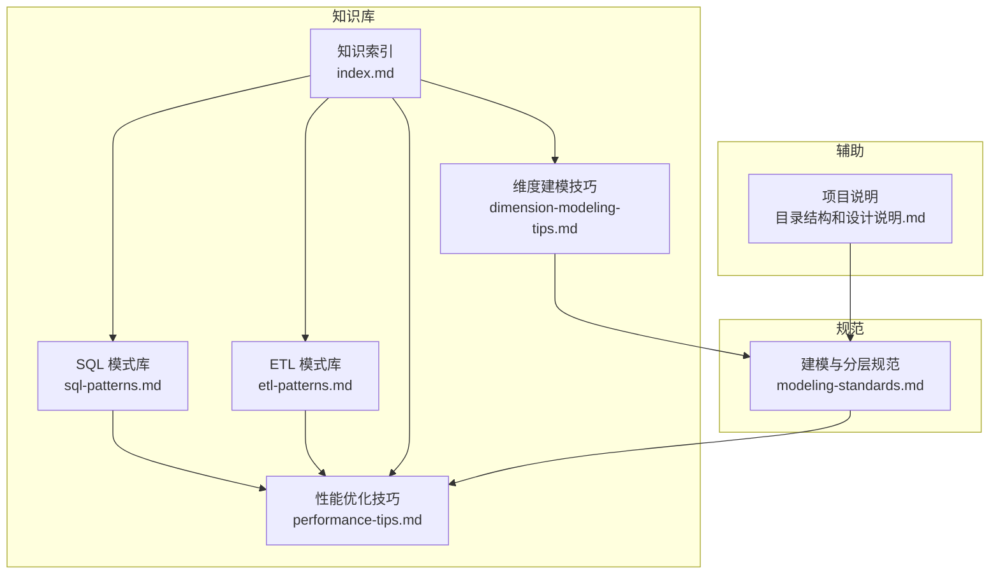
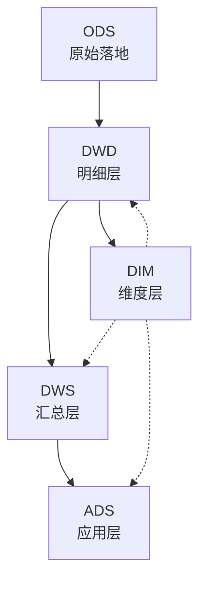
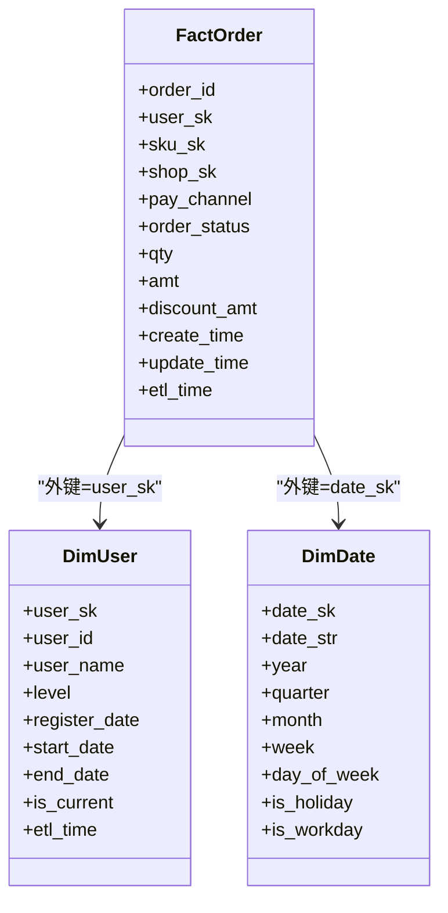
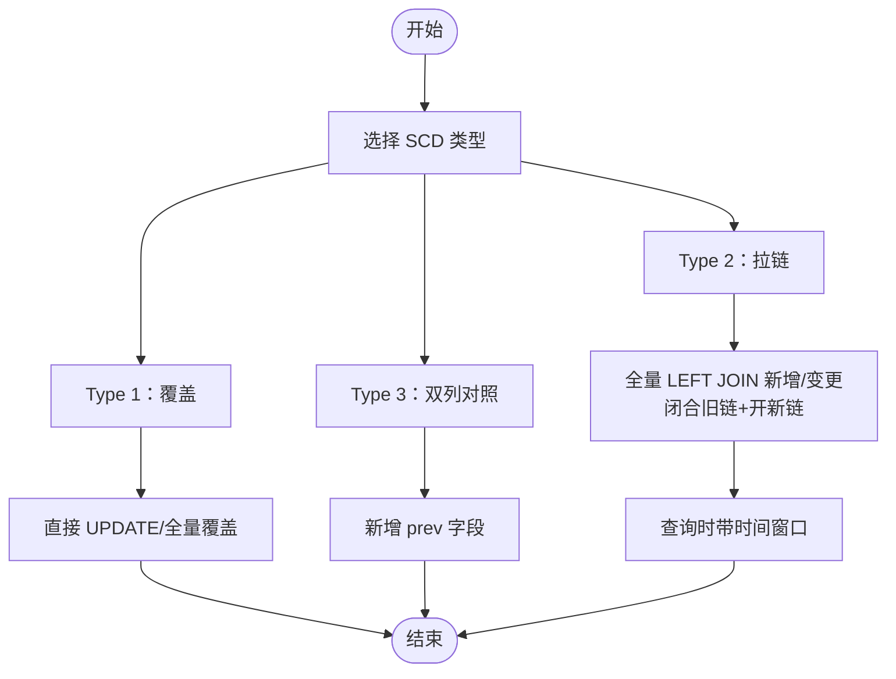
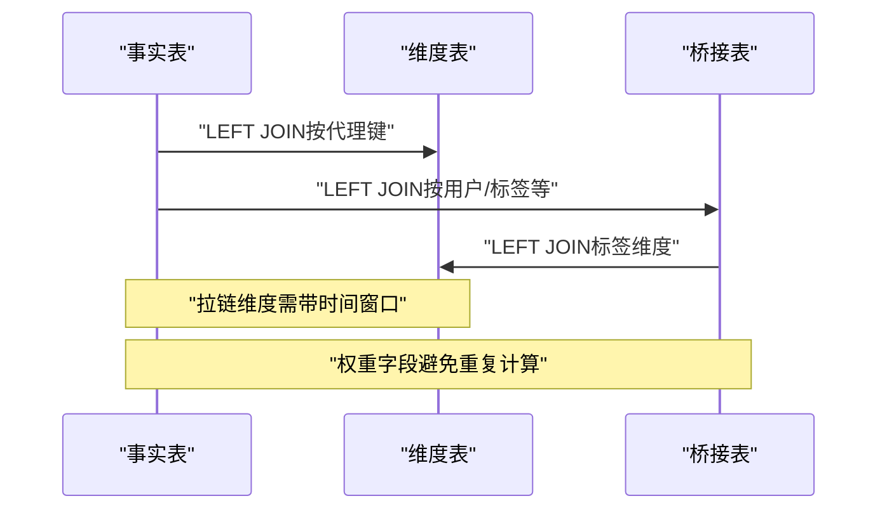
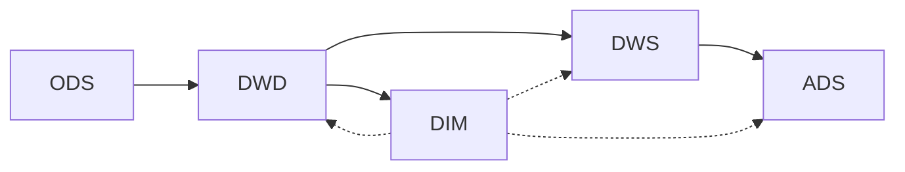

# 维度建模技巧

<cite>
**本文引用的文件**
- [dimension-modeling-tips.md](file://data_warehouse_engineering_code_copilot/knowledge/dimension-modeling-tips.md)
- [modeling-standards.md](file://data_warehouse_engineering_code_copilot/rules/modeling-standards.md)
- [sql-patterns.md](file://data_warehouse_engineering_code_copilot/knowledge/sql-patterns.md)
- [performance-tips.md](file://data_warehouse_engineering_code_copilot/knowledge/performance-tips.md)
- [etl-patterns.md](file://data_warehouse_engineering_code_copilot/knowledge/etl-patterns.md)
- [index.md](file://data_warehouse_engineering_code_copilot/knowledge/index.md)
- [目录结构和设计说明.md](file://data_warehouse_engineering_code_copilot/目录结构和设计说明.md)
</cite>

## 目录
1. [简介](#简介)
2. [项目结构](#项目结构)
3. [核心组件](#核心组件)
4. [架构总览](#架构总览)
5. [详细组件分析](#详细组件分析)
6. [依赖分析](#依赖分析)
7. [性能考量](#性能考量)
8. [故障排查指南](#故障排查指南)
9. [结论](#结论)
10. [附录](#附录)

## 简介
本文件系统化梳理维度建模的理论与实践，围绕星型模型设计原则、雪花模型优化策略、缓慢变化维度（SCD）处理、代理键设计、维度表关系管理、事实表设计规范等核心主题展开，并结合仓库中的建模规范、SQL 模式与性能优化知识，提供可操作的建模检查清单与常见问题解决方案，帮助在复杂业务场景下做出合理的建模决策与权衡。

## 项目结构
本仓库采用“提示词 + 知识库 + 规范 + 变更追踪”的工程化组织方式，围绕数仓建模与开发形成可复用的知识体系：
- agents：AI 角色与审查流程提示词
- changes：变更驱动的 Spec/任务/日志模板
- knowledge：SQL 模式、ETL 模式、维度建模技巧、性能优化等知识库
- rules：建模与分层规范、调度与安全等强制约束

图表来源
- [dimension-modeling-tips.md:1-253](file://data_warehouse_engineering_code_copilot/knowledge/dimension-modeling-tips.md#L1-L253)
- [modeling-standards.md:1-242](file://data_warehouse_engineering_code_copilot/rules/modeling-standards.md#L1-L242)
- [sql-patterns.md:1-200](file://data_warehouse_engineering_code_copilot/knowledge/sql-patterns.md#L1-L200)
- [performance-tips.md:1-307](file://data_warehouse_engineering_code_copilot/knowledge/performance-tips.md#L1-L307)
- [etl-patterns.md:1-220](file://data_warehouse_engineering_code_copilot/knowledge/etl-patterns.md#L1-L220)
- [index.md:1-60](file://data_warehouse_engineering_code_copilot/knowledge/index.md#L1-L60)
- [目录结构和设计说明.md:1-204](file://data_warehouse_engineering_code_copilot/目录结构和设计说明.md#L1-L204)

章节来源
- [目录结构和设计说明.md:1-204](file://data_warehouse_engineering_code_copilot/目录结构和设计说明.md#L1-L204)

## 核心组件
- 维度建模技巧：涵盖代理键/业务键、SCD 类型、桥接表、退化维度、一致性维度、事实表类型、维度分级与分层归属判定等
- 建模与分层规范：明确分层职责、表类型标识、事实/维度设计原则、关系与关联约定、物理设计与生命周期
- SQL 模式库：提供去重保留最新、拉链表（SCD2）、同环比、TopN、累计求和等高频模式
- 性能优化技巧：分区裁剪、数据倾斜、Map/Broadcast Join、小文件合并、CTE 物化、谓词下推与列裁剪、窗口函数优化、存储格式与压缩
- ETL 模式库：CDC 增量同步、JDBC 增量抽取、MERGE/UPSERT、小文件控制、历史回刷、文件/API 接入等

章节来源
- [dimension-modeling-tips.md:1-253](file://data_warehouse_engineering_code_copilot/knowledge/dimension-modeling-tips.md#L1-L253)
- [modeling-standards.md:1-242](file://data_warehouse_engineering_code_copilot/rules/modeling-standards.md#L1-L242)
- [sql-patterns.md:1-200](file://data_warehouse_engineering_code_copilot/knowledge/sql-patterns.md#L1-L200)
- [performance-tips.md:1-307](file://data_warehouse_engineering_code_copilot/knowledge/performance-tips.md#L1-L307)
- [etl-patterns.md:1-220](file://data_warehouse_engineering_code_copilot/knowledge/etl-patterns.md#L1-L220)
- [index.md:1-60](file://data_warehouse_engineering_code_copilot/knowledge/index.md#L1-L60)

## 架构总览
数仓建模遵循 Kimball 维度建模范式，以星型模型为核心，事实表围绕维度表建立直接关联。规范明确了分层架构与表类型标识，强调一致性维度复用与严格的跨层依赖约束，确保模型可维护性与可扩展性。

图表来源
- [modeling-standards.md:7-46](file://data_warehouse_engineering_code_copilot/rules/modeling-standards.md#L7-L46)

章节来源
- [modeling-standards.md:1-242](file://data_warehouse_engineering_code_copilot/rules/modeling-standards.md#L1-L242)

## 详细组件分析

### 星型模型设计原则
- 事实表：可度量的业务事件，仅保留外键、退化维度与度量值
- 维度表：描述性属性，采用代理键 + 业务键双键并存，拉链维度需具备起止日期与当前标记
- 关联约定：事实表外键应指向维度表代理键；拉链维度关联需带时间窗口；默认 LEFT JOIN，必要时使用 INNER JOIN

图表来源
- [modeling-standards.md:73-114](file://data_warehouse_engineering_code_copilot/rules/modeling-standards.md#L73-L114)
- [modeling-standards.md:118-142](file://data_warehouse_engineering_code_copilot/rules/modeling-standards.md#L118-L142)

章节来源
- [modeling-standards.md:49-162](file://data_warehouse_engineering_code_copilot/rules/modeling-standards.md#L49-L162)

### 雪花模型优化策略
- 仅在维度存在强层级、强复用、强治理需求时使用雪花模型，并需说明原因
- 优先通过一致性维度与桥接表降低复杂度，避免过度规范化导致查询路径过长

章节来源
- [modeling-standards.md:51-56](file://data_warehouse_engineering_code_copilot/rules/modeling-standards.md#L51-L56)

### 缓慢变化维度（SCD）处理
- Type 1：覆盖（不保留历史），适用于纠错型变更
- Type 2：拉链（保留完整历史），需具备起止日期与当前标记，查询时需带时间窗口
- Type 3：双列对照（保留前一版本），适用于简单对比场景
- 选型对照：历史完整性、存储开销、Join 复杂度与适用场景

图表来源
- [dimension-modeling-tips.md:39-83](file://data_warehouse_engineering_code_copilot/knowledge/dimension-modeling-tips.md#L39-L83)
- [sql-patterns.md:42-94](file://data_warehouse_engineering_code_copilot/knowledge/sql-patterns.md#L42-L94)

章节来源
- [dimension-modeling-tips.md:39-83](file://data_warehouse_engineering_code_copilot/knowledge/dimension-modeling-tips.md#L39-L83)
- [sql-patterns.md:42-94](file://data_warehouse_engineering_code_copilot/knowledge/sql-patterns.md#L42-L94)

### 代理键设计与键选择
- 代理键：数仓内自增/哈希/雪花 ID，用于稳定关联与历史一致性
- 业务键：源系统标识，用于追溯与跨系统集成
- 双键并存：拉链表/SCD2 必须使用代理键，同时保留业务键便于溯源
- 选型建议：跨系统集成、性能敏感 Join、简单维度等场景的取舍

章节来源
- [dimension-modeling-tips.md:5-36](file://data_warehouse_engineering_code_copilot/knowledge/dimension-modeling-tips.md#L5-L36)
- [modeling-standards.md:118-125](file://data_warehouse_engineering_code_copilot/rules/modeling-standards.md#L118-L125)

### 维度表关系管理
- 一致性维度：跨主题共享，避免重复建设；变更需广播给下游
- 杂项维度：低基数标志位组合的小维度，降低事实表外键列数
- 桥接表：解决多对多或多值维度问题，支持权重与时间窗口

图表来源
- [dimension-modeling-tips.md:86-122](file://data_warehouse_engineering_code_copilot/knowledge/dimension-modeling-tips.md#L86-L122)
- [modeling-standards.md:151-167](file://data_warehouse_engineering_code_copilot/rules/modeling-standards.md#L151-L167)

章节来源
- [dimension-modeling-tips.md:86-122](file://data_warehouse_engineering_code_copilot/knowledge/dimension-modeling-tips.md#L86-L122)
- [modeling-standards.md:151-167](file://data_warehouse_engineering_code_copilot/rules/modeling-standards.md#L151-L167)

### 事实表设计规范
- 设计原则：仅保留外键、退化维度与度量值；描述性属性不冗余到事实表
- 类型选择：事务事实表（单事件）、周期快照（实体×周期）、累积快照（单实体生命周期）、无事实事实表（仅事件发生）
- 标准字段与分区：按 dt 分区，存储格式与生命周期配置

章节来源
- [modeling-standards.md:73-114](file://data_warehouse_engineering_code_copilot/rules/modeling-standards.md#L73-L114)
- [dimension-modeling-tips.md:179-204](file://data_warehouse_engineering_code_copilot/knowledge/dimension-modeling-tips.md#L179-L204)

### 维度表分级与分层归属
- 维度分级：核心维度（高复用、低变化）、扩展维度（主题专用）、杂项维度（标志位组合）
- 分层归属：依据是否清洗/业务过程切分、是否聚合、是否直接服务报表/API、是否描述性属性进行判定

章节来源
- [dimension-modeling-tips.md:207-253](file://data_warehouse_engineering_code_copilot/knowledge/dimension-modeling-tips.md#L207-L253)
- [modeling-standards.md:36-46](file://data_warehouse_engineering_code_copilot/rules/modeling-standards.md#L36-L46)

## 依赖分析
- 分层依赖：ODS→DWD→DWS→ADS，维度层为共享层，可被多事实表引用
- 关联依赖：事实表外键→维度表代理键；拉链维度关联需带时间窗口
- 禁止依赖：跨层反向、跨层跳跃、循环依赖、跨主题强耦合

图表来源
- [modeling-standards.md:163-167](file://data_warehouse_engineering_code_copilot/rules/modeling-standards.md#L163-L167)

章节来源
- [modeling-standards.md:151-167](file://data_warehouse_engineering_code_copilot/rules/modeling-standards.md#L151-L167)

## 性能考量
- 分区裁剪：WHERE 条件直接命中分区字段，避免函数包裹
- 数据倾斜：热点键加盐打散、过滤单独处理、Map Join 小表
- Join 优化：Map/Broadcast Join、Bucket Join（分桶数量为 2 的幂）
- 小文件控制：输出端控制 reduce 数、AQE 自动合并、周期性合并
- CTE 物化：复杂 CTE 先落临时表，避免重复计算
- 谓词下推与列裁剪：WHERE 下推、只读必要列
- 窗口函数：合理分区与排序，避免全局排序
- 存储格式：大表优先 ORC/Parquet + ZSTD，小表/临时表 Parquet + Snappy

章节来源
- [performance-tips.md:5-307](file://data_warehouse_engineering_code_copilot/knowledge/performance-tips.md#L5-L307)

## 故障排查指南
- SCD2 关联错误：未带时间窗口导致历史版本无法区分
- 代理键生成：幂等性不足导致重复或不一致
- 桥接表重复计算：未使用权重字段导致金额重复
- 事实表类型误用：用事务事实表回答“截至 X 日的库存”导致计算量爆炸
- 分层归属错误：DWD 包含汇总指标、DWS 横向爆炸、ADS 直接读 ODS
- ETL 回放：CDC 位点保护、op 字段保留、回放窗口与幂等

章节来源
- [dimension-modeling-tips.md:33-83](file://data_warehouse_engineering_code_copilot/knowledge/dimension-modeling-tips.md#L33-L83)
- [dimension-modeling-tips.md:119-122](file://data_warehouse_engineering_code_copilot/knowledge/dimension-modeling-tips.md#L119-L122)
- [dimension-modeling-tips.md:201-204](file://data_warehouse_engineering_code_copilot/knowledge/dimension-modeling-tips.md#L201-L204)
- [modeling-standards.md:212-221](file://data_warehouse_engineering_code_copilot/rules/modeling-standards.md#L212-L221)
- [etl-patterns.md:17-27](file://data_warehouse_engineering_code_copilot/knowledge/etl-patterns.md#L17-L27)

## 结论
维度建模的关键在于：以星型模型为核心，通过一致性维度与桥接表降低复杂度；在代理键与业务键之间取得平衡；根据业务需求选择合适的 SCD 类型；严格遵循分层与表类型规范；并在性能层面落实分区裁剪、Join 优化、小文件控制与存储格式选择。通过规范化的建模流程与持续的知识沉淀，可在复杂业务场景下做出稳健且可维护的建模决策。

## 附录

### 建模检查清单
- 表名前缀与粒度后缀符合分层规范
- 业务过程清晰，事实表粒度单一
- 主键/外键命名规范，代理键与业务键双键并存
- 分区字段为 dt，分区数与二级分区合理
- 字段类型最小化，金额字段为 DECIMAL，精度合理
- 字段与表具备注释，表有用途描述
- 配置生命周期与存储格式/压缩策略
- 分层归属正确，未跨层依赖
- 维度复用一致性维度，避免重复建设
- 已声明上下游依赖，变更可追踪

章节来源
- [modeling-standards.md:224-242](file://data_warehouse_engineering_code_copilot/rules/modeling-standards.md#L224-L242)

### 常见建模案例与最佳实践
- 事务事实表：订单明细（按天增量），外键指向用户/商品/店铺代理键，退化维度包含支付渠道、订单状态
- 周期快照：账户余额（按日），实体×时间粒度，MERGE/全量重写
- 累积快照：订单生命周期（下单→支付→发货→签收），单实例多里程碑
- 拉链维度：用户等级变更（起止日期+当前标记），查询时带时间窗口
- 桥接表：用户标签（权重字段+时间窗口），避免重复计算
- 一致性维度：日期维度、用户维度、组织维度跨主题共享

章节来源
- [dimension-modeling-tips.md:179-204](file://data_warehouse_engineering_code_copilot/knowledge/dimension-modeling-tips.md#L179-L204)
- [modeling-standards.md:73-142](file://data_warehouse_engineering_code_copilot/rules/modeling-standards.md#L73-L142)