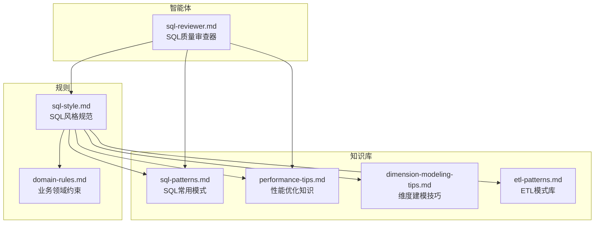
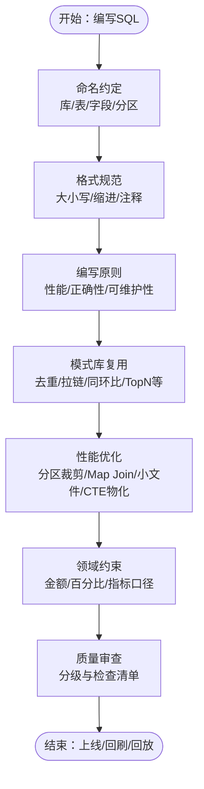
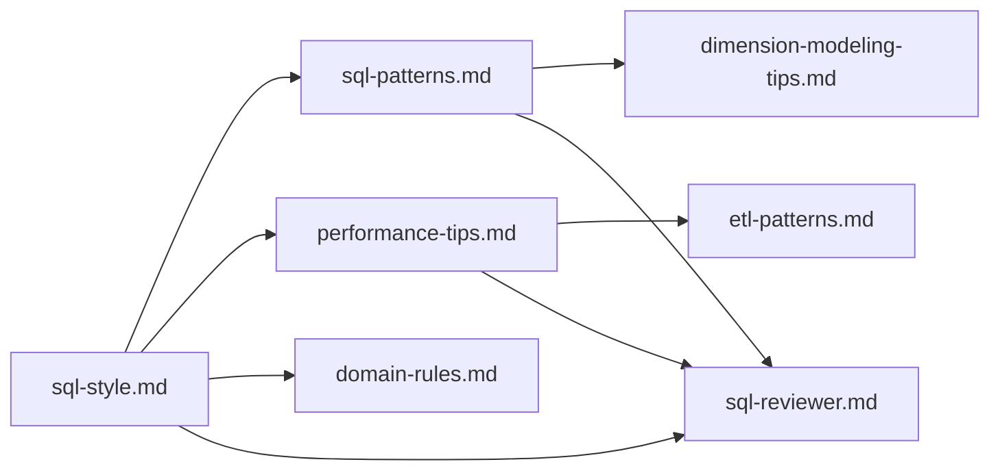

# SQL编码规范

<cite>
**本文引用的文件**
- [sql-style.md](file://data_warehouse_engineering_code_copilot/rules/sql-style.md)
- [sql-patterns.md](file://data_warehouse_engineering_code_copilot/knowledge/sql-patterns.md)
- [performance-tips.md](file://data_warehouse_engineering_code_copilot/knowledge/performance-tips.md)
- [dimension-modeling-tips.md](file://data_warehouse_engineering_code_copilot/knowledge/dimension-modeling-tips.md)
- [etl-patterns.md](file://data_warehouse_engineering_code_copilot/knowledge/etl-patterns.md)
- [domain-rules.md](file://data_warehouse_engineering_code_copilot/rules/domain-rules.md)
- [sql-reviewer.md](file://data_warehouse_engineering_code_copilot/agents/sql-reviewer.md)
</cite>

## 目录
1. [简介](#简介)
2. [项目结构](#项目结构)
3. [核心组件](#核心组件)
4. [架构总览](#架构总览)
5. [详细组件分析](#详细组件分析)
6. [依赖分析](#依赖分析)
7. [性能考量](#性能考量)
8. [故障排查指南](#故障排查指南)
9. [结论](#结论)
10. [附录](#附录)

## 简介
本文件面向数据仓库工程中的SQL编码规范，系统化梳理命名约定、格式规范、编写原则、禁止事项、常见错误对照以及性能优化建议。内容来源于仓库中的SQL风格规范、模式库、性能知识库、维度建模技巧、ETL模式库、领域规则与SQL审查器等资料，旨在帮助开发者在统一的规范下编写高质量、高性能、可维护的SQL。

## 项目结构
仓库围绕“规则”“知识库”“智能体”三大板块组织SQL相关规范与最佳实践：
- 规则：sql-style.md（SQL风格）、domain-rules.md（业务领域约束）
- 知识库：sql-patterns.md（常用SQL模式）、performance-tips.md（性能优化）、dimension-modeling-tips.md（维度建模）、etl-patterns.md（ETL模式）
- 智能体：sql-reviewer.md（SQL质量审查清单）

图表来源
- [sql-style.md:1-254](file://data_warehouse_engineering_code_copilot/rules/sql-style.md#L1-L254)
- [sql-patterns.md:1-331](file://data_warehouse_engineering_code_copilot/knowledge/sql-patterns.md#L1-L331)
- [performance-tips.md:1-349](file://data_warehouse_engineering_code_copilot/knowledge/performance-tips.md#L1-L349)
- [dimension-modeling-tips.md:1-253](file://data_warehouse_engineering_code_copilot/knowledge/dimension-modeling-tips.md#L1-L253)
- [etl-patterns.md:1-220](file://data_warehouse_engineering_code_copilot/knowledge/etl-patterns.md#L1-L220)
- [domain-rules.md:1-142](file://data_warehouse_engineering_code_copilot/rules/domain-rules.md#L1-L142)
- [sql-reviewer.md:1-68](file://data_warehouse_engineering_code_copilot/agents/sql-reviewer.md#L1-L68)

章节来源
- [sql-style.md:1-254](file://data_warehouse_engineering_code_copilot/rules/sql-style.md#L1-L254)
- [sql-patterns.md:1-331](file://data_warehouse_engineering_code_copilot/knowledge/sql-patterns.md#L1-L331)
- [performance-tips.md:1-349](file://data_warehouse_engineering_code_copilot/knowledge/performance-tips.md#L1-L349)
- [dimension-modeling-tips.md:1-253](file://data_warehouse_engineering_code_copilot/knowledge/dimension-modeling-tips.md#L1-L253)
- [etl-patterns.md:1-220](file://data_warehouse_engineering_code_copilot/knowledge/etl-patterns.md#L1-L220)
- [domain-rules.md:1-142](file://data_warehouse_engineering_code_copilot/rules/domain-rules.md#L1-L142)
- [sql-reviewer.md:1-68](file://data_warehouse_engineering_code_copilot/agents/sql-reviewer.md#L1-L68)

## 核心组件
- 命名约定：库/模式、表、字段、分区字段的统一命名与前缀/后缀规范
- 格式规范：关键字大小写、缩进与换行、注释风格、头部注释强制要求
- 编写原则：性能优先、正确性优先、可维护性优先
- 禁止事项：禁止的SQL模式与反例
- 常见错误对照：典型错误与正确写法对比
- 性能优化：分区裁剪、数据倾斜、Map Join、小文件、CTE物化、谓词下推、窗口函数、存储格式与压缩、调度与资源、性能分析工具

章节来源
- [sql-style.md:7-254](file://data_warehouse_engineering_code_copilot/rules/sql-style.md#L7-L254)

## 架构总览
SQL编码规范在项目中的落地路径如下：
- 规则驱动：sql-style.md定义命名、格式、原则与禁止事项
- 模式支撑：sql-patterns.md提供可复用的高质量SQL模式
- 性能保障：performance-tips.md提供性能优化策略与验证方法
- 建模指导：dimension-modeling-tips.md提供维度建模最佳实践
- ETL协同：etl-patterns.md提供数据接入与同步模式
- 领域约束：domain-rules.md提供业务口径与数据质量规则
- 质量审查：sql-reviewer.md提供审查分级与检查清单

图表来源
- [sql-style.md:7-254](file://data_warehouse_engineering_code_copilot/rules/sql-style.md#L7-L254)
- [sql-patterns.md:1-331](file://data_warehouse_engineering_code_copilot/knowledge/sql-patterns.md#L1-L331)
- [performance-tips.md:1-349](file://data_warehouse_engineering_code_copilot/knowledge/performance-tips.md#L1-L349)
- [dimension-modeling-tips.md:1-253](file://data_warehouse_engineering_code_copilot/knowledge/dimension-modeling-tips.md#L1-L253)
- [etl-patterns.md:1-220](file://data_warehouse_engineering_code_copilot/knowledge/etl-patterns.md#L1-L220)
- [domain-rules.md:1-142](file://data_warehouse_engineering_code_copilot/rules/domain-rules.md#L1-L142)
- [sql-reviewer.md:1-68](file://data_warehouse_engineering_code_copilot/agents/sql-reviewer.md#L1-L68)

## 详细组件分析

### 命名约定
- 库/模式命名：按用途划分（原始落地、明细层、汇总层、应用层、维度层、临时/中间、运维）
- 表命名：统一采用“层前缀 + 业务过程 + 粒度后缀”的命名结构，前缀涵盖ods_/dwd_/dws_/ads_/dim_/bridge_/tmp_/mid_
- 字段命名：主键/外键、通用字段（金额、数量、比率、布尔、时间戳、日期、状态、元信息）、分区字段统一使用dt/dh
- 命名禁忌：拼音/中文/混拼、SQL保留字、缩写不一致、camelCase/PascalCase

章节来源
- [sql-style.md:9-94](file://data_warehouse_engineering_code_copilot/rules/sql-style.md#L9-L94)
- [sql-style.md:20-87](file://data_warehouse_engineering_code_copilot/rules/sql-style.md#L20-L87)

### 格式规范
- 关键字大小写：关键字大写，函数小写，表/字段小写
- 缩进与换行：一级缩进4空格；SELECT后字段独占行；字段别名对齐；JOIN的ON独占行且多条件分行；WHERE多条件分行且AND/OR放行首；嵌套子查询改写为WITH CTE
- 头部注释：强制包含用途、依赖、产出、调度、责任人、变更记录
- 行内注释：对非显然业务规则补充注释

章节来源
- [sql-style.md:99-162](file://data_warehouse_engineering_code_copilot/rules/sql-style.md#L99-L162)

### 编写原则
- 性能优先：大型分区表必须分区裁剪；优先使用CTE替代深层子查询；多次引用的复杂CTE物化为临时表；小表Join大表使用Map Join/Broadcast hint；优先GROUP BY替代DISTINCT；禁止SELECT*；禁止最外层不必要的ORDER BY；禁止函数包裹分区字段
- 正确性优先：Join条件必须包含两侧分区字段；显式处理NULL；DECIMAL优于FLOAT/DOUBLE；类型必须显式转换；写入大表使用INSERT OVERWRITE保证幂等
- 可维护性：复杂SQL拆为多个CTE，每个单一职责；中间步骤语义化命名；统一使用表别名；避免超长字段表达式

章节来源
- [sql-style.md:167-189](file://data_warehouse_engineering_code_copilot/rules/sql-style.md#L167-L189)

### 禁止事项
- 禁止INSERT INTO写入分区表（必须使用INSERT OVERWRITE）
- 禁止在调度脚本中出现DROP TABLE（删表必须走运维变更）
- 禁止在SQL中硬编码业务日期（必须使用${bizdate}等变量）
- 禁止跨层反向引用（如DWD直接读ADS）
- 禁止ADS/DWS直接JOIN ODS（应走DWD）
- 禁止使用未注释的“魔法数字”
- 禁止生产SQL中保留调试代码（如SELECT * FROM xxx LIMIT 10）

章节来源
- [sql-style.md:192-201](file://data_warehouse_engineering_code_copilot/rules/sql-style.md#L192-L201)

### 常见错误对照
- SELECT*：必须明列字段
- 函数包裹分区字段：阻断分区裁剪
- FLOAT存金额：金额必须DECIMAL
- 保留字作字段名：避免关键字冲突
- 硬编码日期：使用调度变量

章节来源
- [sql-style.md:226-253](file://data_warehouse_engineering_code_copilot/rules/sql-style.md#L226-L253)

### SQL模式库
- 去重保留最新：ROW_NUMBER按更新时间与序号去重
- 拉链表（SCD Type 2）：历史链路闭合、新链路开启，写入使用INSERT OVERWRITE
- 同环比（YoY/MoM）：处理空值与除零，自连接日期偏移
- 分组TopN：ROW_NUMBER/RANK/DENSE_RANK区别与性能提示
- 累计求和：标准窗口语法与跨年/跨月分组
- 行转列/列转行：CASE WHEN透视与UNION ALL/stack/UNNEST
- 数据回刷（幂等覆盖）：INSERT OVERWRITE单分区
- 增量+全量合并（Lambda）：UNION ALL去重
- 缺失日期补齐：LEFT JOIN日期维度
- NULL安全比较：Spark/Hive的<=>或通用写法

章节来源
- [sql-patterns.md:6-331](file://data_warehouse_engineering_code_copilot/knowledge/sql-patterns.md#L6-L331)

### 维度建模技巧
- 代理键vs业务键：双键并存，拉链表必用代理键
- SCD三种类型：Type1覆盖、Type2拉链、Type3双列对照
- 桥接表：多对多/多值维度，权重与时间窗口
- 退化维度：低基数/仅事实表使用，直接退化为事实表列
- 一致性维度：跨主题共享，避免重复建设
- 事实表类型：事务事实表、周期快照、累积快照、无事实事实表
- 维度表分级：核心维度、扩展维度、杂项维度

章节来源
- [dimension-modeling-tips.md:5-253](file://data_warehouse_engineering_code_copilot/knowledge/dimension-modeling-tips.md#L5-L253)

### ETL模式库
- CDC增量同步：Flink CDC + Kafka + Iceberg/Hudi，位点保护、幂等、回放
- JDBC增量抽取：基于update_time水位，重叠窗口与幂等写入
- MERGE/UPSERT：主键幂等写入，乱序保护与小文件控制
- 小文件控制：reduce数、distribute by、AQE合并
- 历史回刷：范围确认、依赖构建、试点、分批执行、进度跟踪
- 文件接入：目录约定、完成标记、编码与schema校验
- API拉取：限流、重试、断点续传、schema漂移
- 全量/增量/CDC选型：实时性、源端压力、完整性、复杂度、历史追踪
- 数据漂移与时区：UTC存储、业务日分区、报表时区口径

章节来源
- [etl-patterns.md:6-220](file://data_warehouse_engineering_code_copilot/knowledge/etl-patterns.md#L6-L220)

### 领域规则
- 通用业务规则：金额DECIMAL(18,4)、报表两位小数、百分比一位小数+“%”、自然年时间维度、同比/环比零值与空值处理
- KPI/指标定义：必备属性、同名指标必须同口径
- 数据质量：完整性/唯一性/一致性/准确性/时效性五大维度与严重等级
- 历史数据：可追溯起始时间、口径变更生效时间、跨口径对比声明
- 行业特定规则：零售/电商、金融、制造、互联网/用户行为指标定义
- 跨系统一致性：与BI/业务后台展示一致，差异分析与记录

章节来源
- [domain-rules.md:8-142](file://data_warehouse_engineering_code_copilot/rules/domain-rules.md#L8-L142)

### SQL质量审查清单
- 审查分级：Critical/Important/Minor
- 性能审查清单：分区裁剪、Join顺序与类型、Map Join/Broadcast、数据倾斜、聚合下推、SELECT*、ORDER BY、DISTINCT替代、窗口函数PARTITION BY、CTE物化
- 输出格式：问题分类、影响评估、扫描量预估、优化建议摘要

章节来源
- [sql-reviewer.md:5-68](file://data_warehouse_engineering_code_copilot/agents/sql-reviewer.md#L5-L68)

## 依赖分析
SQL编码规范在项目中的依赖关系如下：
- 规则依赖：sql-style.md是基础，依赖领域规则与性能知识库进行补充
- 模式依赖：sql-patterns.md与dimension-modeling-tips.md相互印证，共同指导表/字段命名与建模
- 性能依赖：performance-tips.md为sql-style.md的性能原则提供技术细节与验证方法
- ETL依赖：etl-patterns.md与sql-style.md的幂等覆盖、分区裁剪、小文件控制形成闭环
- 审查依赖：sql-reviewer.md以sql-style.md为依据，形成可执行的质量检查清单

图表来源
- [sql-style.md:1-254](file://data_warehouse_engineering_code_copilot/rules/sql-style.md#L1-L254)
- [sql-patterns.md:1-331](file://data_warehouse_engineering_code_copilot/knowledge/sql-patterns.md#L1-L331)
- [performance-tips.md:1-349](file://data_warehouse_engineering_code_copilot/knowledge/performance-tips.md#L1-L349)
- [dimension-modeling-tips.md:1-253](file://data_warehouse_engineering_code_copilot/knowledge/dimension-modeling-tips.md#L1-L253)
- [etl-patterns.md:1-220](file://data_warehouse_engineering_code_copilot/knowledge/etl-patterns.md#L1-L220)
- [domain-rules.md:1-142](file://data_warehouse_engineering_code_copilot/rules/domain-rules.md#L1-L142)
- [sql-reviewer.md:1-68](file://data_warehouse_engineering_code_copilot/agents/sql-reviewer.md#L1-L68)

## 性能考量
- 分区裁剪：WHERE直接命中分区字段，禁止函数包裹；通过EXPLAIN验证
- 数据倾斜：热点Key、大量NULL/默认值、时间集中；解决方案包括过滤单独处理、加盐打散、Map Join
- Map Join/Broadcast Join：小表阈值与触发方式；注意driver内存
- 小文件：reduce数控制、distribute by、AQE合并；单文件目标128MB~256MB，单分区文件数<50
- CTE物化：Hive/Spark默认不物化，复杂多次引用先落临时表或CACHE
- 谓词下推与列裁剪：WHERE下推、列裁剪；避免UDF导致下推失效
- Join顺序与类型：不同引擎策略不同；分桶Join跳过Shuffle
- 窗口函数：PARTITION BY列基数适中；配合DISTRIBUTE BY/SORT BY
- 存储格式与压缩：ORC/Parquet/ZSTD收益显著；列存格式下列裁剪与谓词下推收益巨大
- 调度与资源：资源队列、错峰调度、SLA基线、失败重试
- 性能分析工具：EXPLAIN执行计划、作业历史、Profile/Stage Metrics、数据采样

章节来源
- [performance-tips.md:5-349](file://data_warehouse_engineering_code_copilot/knowledge/performance-tips.md#L5-L349)

## 故障排查指南
- 关键字大小写不统一、缩进/换行风格不一致、字段顺序与DDL不一致、可合并的多次INSERT等属于Minor级别建议
- 子查询未使用CTE、重复计算未提取、字符串隐式类型转换、NULL处理缺失、时间过滤使用函数包裹分区字段阻断分区裁剪、WHERE条件写在ON子句里、未声明字段别名、复杂SQL缺少头部注释等属于Important级别应修复
- 计算结果错误、Join笛卡尔积或多对多未识别导致行数膨胀、全表扫描大型分区表、主键/唯一键重复、数据回刷未做幂等保护、跨库/跨集群引用未声明、敏感字段未脱敏等属于Critical级别阻断

章节来源
- [sql-reviewer.md:5-68](file://data_warehouse_engineering_code_copilot/agents/sql-reviewer.md#L5-L68)

## 结论
SQL编码规范以“统一命名、规范格式、性能优先、正确性优先、可维护性优先”为核心，结合SQL模式库、性能优化知识、维度建模技巧、ETL模式与领域规则，形成从命名到执行的全链路规范体系。通过sql-reviewer的分级检查与performance-tips的验证方法，确保SQL在上线前具备可读性、可维护性与高性能。

## 附录
- 命名检查清单：表命名、字段命名、整体一致性
- 常见错误对照：SELECT*、函数包裹分区字段、FLOAT存金额、保留字字段名、硬编码日期
- SQL模式速查：去重保留最新、拉链表、同环比、分组TopN、累计求和、行转列/列转行、数据回刷、增量+全量合并、缺失日期补齐、NULL安全比较
- 维度建模速查：代理键/业务键、SCD类型、桥接表、退化维度、一致性维度、事实表类型、维度分级
- ETL模式速查：CDC增量同步、JDBC增量抽取、MERGE/UPSERT、小文件控制、历史回刷、文件接入、API拉取、全量/增量/CDC选型、数据漂移与时区
- 领域规则速查：通用业务规则、KPI/指标定义、数据质量、历史数据、行业特定规则、跨系统一致性

章节来源
- [sql-style.md:204-253](file://data_warehouse_engineering_code_copilot/rules/sql-style.md#L204-L253)
- [sql-patterns.md:6-331](file://data_warehouse_engineering_code_copilot/knowledge/sql-patterns.md#L6-L331)
- [dimension-modeling-tips.md:5-253](file://data_warehouse_engineering_code_copilot/knowledge/dimension-modeling-tips.md#L5-L253)
- [etl-patterns.md:6-220](file://data_warehouse_engineering_code_copilot/knowledge/etl-patterns.md#L6-L220)
- [domain-rules.md:8-142](file://data_warehouse_engineering_code_copilot/rules/domain-rules.md#L8-L142)