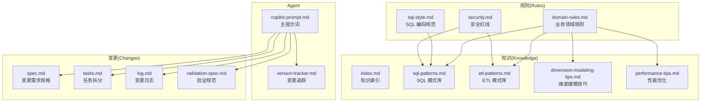
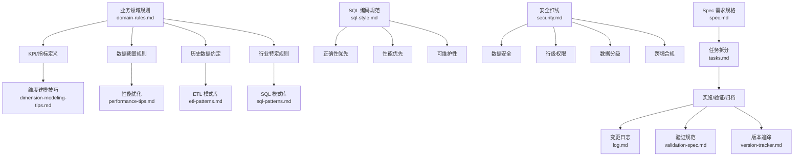
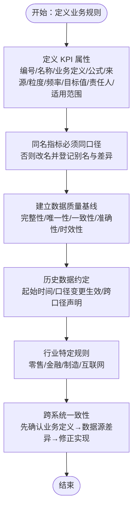
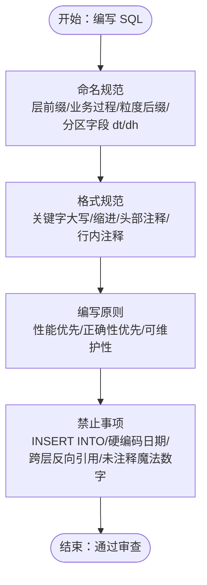
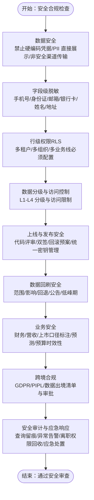
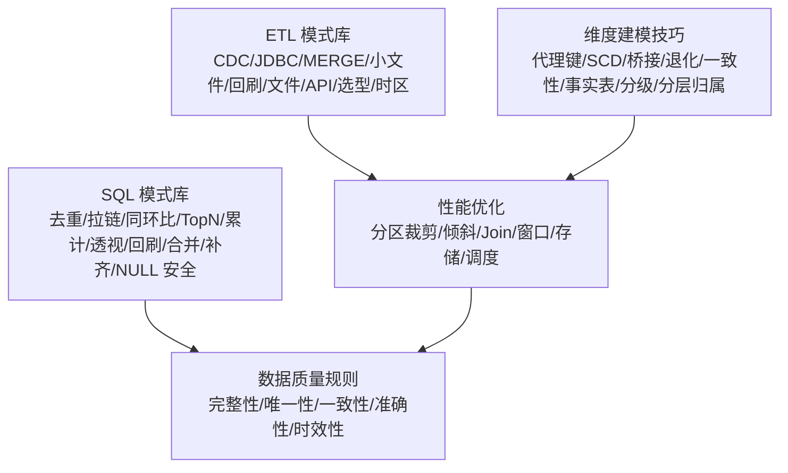
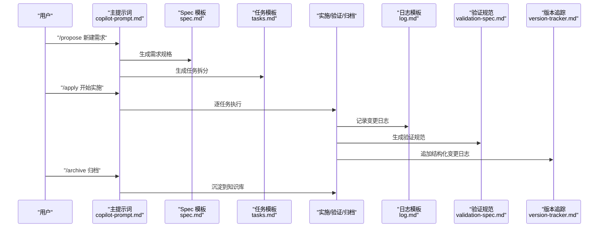
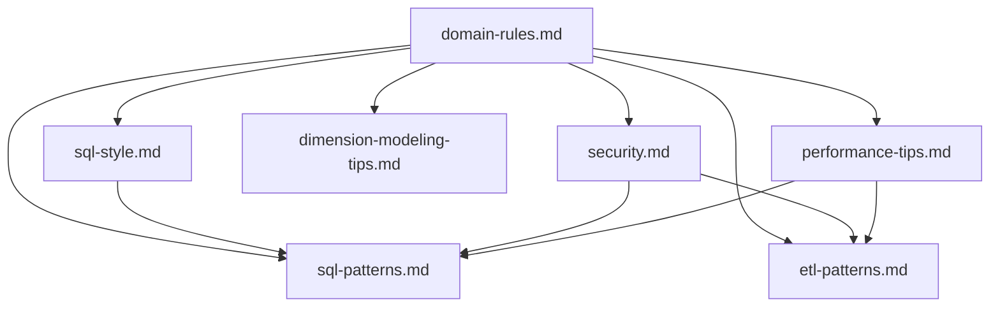

# 业务领域规则

<cite>
**本文引用的文件**
- [目录结构和设计说明.md](file://目录结构和设计说明.md)
- [domain-rules.md](file://rules/domain-rules.md)
- [sql-style.md](file://rules/sql-style.md)
- [security.md](file://rules/security.md)
- [index.md](file://knowledge/index.md)
- [sql-patterns.md](file://knowledge/sql-patterns.md)
- [etl-patterns.md](file://knowledge/etl-patterns.md)
- [dimension-modeling-tips.md](file://knowledge/dimension-modeling-tips.md)
- [performance-tips.md](file://knowledge/performance-tips.md)
- [copilot-prompt.md](file://agents/copilot-prompt.md)
- [version-tracker.md](file://agents/version-tracker.md)
- [spec.md](file://changes/templates/spec.md)
- [tasks.md](file://changes/templates/tasks.md)
- [log.md](file://changes/templates/log.md)
- [validation-spec.md](file://changes/templates/validation-spec.md)
</cite>

## 目录
1. [简介](#简介)
2. [项目结构](#项目结构)
3. [核心组件](#核心组件)
4. [架构总览](#架构总览)
5. [详细组件分析](#详细组件分析)
6. [依赖分析](#依赖分析)
7. [性能考虑](#性能考虑)
8. [故障排查指南](#故障排查指南)
9. [结论](#结论)
10. [附录](#附录)

## 简介
本文件面向数据仓库工程中的“业务领域规则”，系统化阐述规则在数据仓库中的重要性与应用场景，涵盖业务逻辑验证、数据转换规则、计算公式、规则建模方法（规则表达式、决策树、状态机）、规则维护与演进机制（版本管理、影响分析、测试验证），并提供财务、销售、库存等常见业务场景的规则设计与应用思路。文档以仓库现有规范与知识库为基础，结合 AI 协作流程，帮助团队在统一的“Spec 驱动 + 三段式知识库 + 强制变更追踪”范式下，高质量地落地业务规则。

## 项目结构
仓库采用“Agent + Changes + Knowledge + Rules”的协同结构：
- Rules：项目约束与规范（强制约束），包含业务领域规则、SQL 编码规范、安全红线、建模与调度标准等
- Knowledge：经验与模式库（推荐复用），包含 SQL 模式、ETL 模式、维度建模技巧、性能优化等
- Agents：AI 角色与子 Agent 提示词，驱动规范执行与变更追踪
- Changes：变更管理模板（Spec、任务、日志、验证规范），贯穿需求 → 实施 → 审查 → 归档的闭环

**图表来源**
- [目录结构和设计说明.md:19-55](file://目录结构和设计说明.md#L19-L55)
- [copilot-prompt.md:23-147](file://agents/copilot-prompt.md#L23-L147)
- [version-tracker.md](file://agents/version-tracker.md)
- [domain-rules.md:1-142](file://rules/domain-rules.md#L1-L142)
- [sql-style.md:1-254](file://rules/sql-style.md#L1-L254)
- [security.md:1-98](file://rules/security.md#L1-L98)
- [index.md:1-60](file://knowledge/index.md#L1-L60)
- [sql-patterns.md:1-331](file://knowledge/sql-patterns.md#L1-L331)
- [etl-patterns.md:1-220](file://knowledge/etl-patterns.md#L1-L220)
- [dimension-modeling-tips.md:1-253](file://knowledge/dimension-modeling-tips.md#L1-L253)
- [performance-tips.md:1-349](file://knowledge/performance-tips.md#L1-L349)

**章节来源**
- [目录结构和设计说明.md:19-55](file://目录结构和设计说明.md#L19-L55)

## 核心组件
- 业务领域规则（domain-rules.md）：定义通用业务规则、KPI/指标标准、数据质量规则、历史数据约定、行业特定规则、跨系统一致性、项目特定规则等
- SQL 编码规范（sql-style.md）：统一命名、格式、编写原则与禁止事项，保障正确性、性能与可维护性
- 安全红线（security.md）：数据安全、字段级脱敏、行级权限、数据分级、上线与发布安全、回刷安全、业务安全、跨境合规、安全审计与应急响应
- 知识库（knowledge/*）：SQL 模式、ETL 模式、维度建模技巧、性能优化等经验沉淀
- 变更模板（changes/templates/*）：Spec、任务、日志、验证规范，支撑变更即记录与可审计
- Agent（agents/*）：主提示词与版本追踪，驱动规范执行与变更追踪

**章节来源**
- [domain-rules.md:6-142](file://rules/domain-rules.md#L6-L142)
- [sql-style.md:7-254](file://rules/sql-style.md#L7-L254)
- [security.md:5-98](file://rules/security.md#L5-L98)
- [index.md:1-60](file://knowledge/index.md#L1-L60)

## 架构总览
业务领域规则在数据仓库中的作用路径如下：
- 规则驱动：以 domain-rules.md 为业务规则基线，指导 KPI 定义、计算口径、数据质量与历史一致性
- 规范落地：以 sql-style.md 与 security.md 为执行约束，确保 SQL 正确性、性能与安全
- 模式复用：以 knowledge/* 为工具箱，提供 SQL/ETL/建模/性能优化的可复用模式
- 变更闭环：以 changes/templates/* 为载体，实现 Spec 驱动、任务拆分、验证与归档
- 追踪审计：以 agents/version-tracker.md 为保障，自动记录每次变更的模块、分层、操作类型与影响

**图表来源**
- [domain-rules.md:45-142](file://rules/domain-rules.md#L45-L142)
- [sql-style.md:165-189](file://rules/sql-style.md#L165-L189)
- [security.md:46-98](file://rules/security.md#L46-L98)
- [dimension-modeling-tips.md:1-253](file://knowledge/dimension-modeling-tips.md#L1-L253)
- [performance-tips.md:1-349](file://knowledge/performance-tips.md#L1-L349)
- [etl-patterns.md:1-220](file://knowledge/etl-patterns.md#L1-L220)
- [sql-patterns.md:1-331](file://knowledge/sql-patterns.md#L1-L331)
- [spec.md](file://changes/templates/spec.md)
- [tasks.md](file://changes/templates/tasks.md)
- [log.md](file://changes/templates/log.md)
- [validation-spec.md](file://changes/templates/validation-spec.md)
- [version-tracker.md](file://agents/version-tracker.md)

## 详细组件分析

### 业务领域规则（domain-rules.md）
- 通用业务规则：金额单位、报表展示、百分比格式、时间维度、同比/环比空值处理等
- KPI/指标定义标准：必备属性、同名指标口径一致性
- 数据质量规则：完整性/唯一性/一致性/准确性/时效性、严重等级、边界值定义
- 历史数据约定：起始时间、口径变更生效时间、跨口径对比声明
- 行业特定规则：零售/电商、金融、制造、互联网/用户行为的关键指标与口径
- 跨系统一致性：与 BI/后台展示一致、差异分析流程
- 项目特定规则：待实践中补充

**图表来源**
- [domain-rules.md:45-134](file://rules/domain-rules.md#L45-L134)

**章节来源**
- [domain-rules.md:8-134](file://rules/domain-rules.md#L8-L134)

### SQL 编码规范（sql-style.md）
- 命名约定：库/表/字段命名、分区字段 dt/dh、命名禁忌
- 格式规范：关键字大小写、缩进与换行、头部注释、行内注释
- SQL 编写原则：性能优先、正确性优先、可维护性
- 禁止事项：INSERT INTO 写分区表、DROP TABLE、硬编码业务日期、跨层反向引用、ADS/DWS 直接 JOIN ODS、魔法数字、调试代码残留

**图表来源**
- [sql-style.md:7-201](file://rules/sql-style.md#L7-L201)

**章节来源**
- [sql-style.md:7-201](file://rules/sql-style.md#L7-L201)

### 安全红线（security.md）
- 数据安全：禁止硬编码凭据、禁止直接展示 PII、禁止非安全渠道传输、测试环境使用脱敏样本、禁止在公共仓库提交密钥/内部数据
- 字段级脱敏：手机号、身份证、邮箱、银行卡、姓名（中文）、地址等脱敏方式与示例
- 行级权限（RLS）：多租户/多组织/多业务线必须配置 RLS，变更需人工审查与验证
- 数据分级与访问控制：L1-L4 分级与访问限制、L4 审计日志、跨级别合并表管控
- 上线与发布安全：代码评审、涉及 PII/财务表双签、DDL 变更回滚预案、统一密钥管理、临时探索查询禁止落地生产
- 数据回刷安全：明确范围/影响/回退方案、涉及对外指标需公告、低峰期执行
- 业务安全：财务/营收/上市口径必须标注精度与披露口径、预测/预算明确时效性与可靠性
- 跨境合规：GDPR/PIPL 等法规、数据出境清单与审批
- 安全审计与应急响应：查询留痕、异常访问告警、离职权限回收、数据泄露/错误数据流出/SQL 注入处置流程

**图表来源**
- [security.md:7-98](file://rules/security.md#L7-L98)

**章节来源**
- [security.md:7-98](file://rules/security.md#L7-L98)

### 知识库（knowledge/*）
- SQL 模式库：去重保留最新、拉链表（SCD2）、同环比、TopN、累计求和、行转列/列转行、数据回刷、增量+全量合并、缺失日期补齐、NULL 安全比较等
- ETL 模式库：CDC 增量同步、JDBC 增量抽取、MERGE/UPSERT、小文件控制、历史回刷、文件接入、API 拉取、全量/增量/CDC 选型对照、数据漂移与时区处理
- 维度建模技巧：代理键 vs 业务键、SCD 三种类型、桥接表、退化维度、一致性维度、事实表类型选择、维度表分级、分层归属判定
- 性能优化：分区裁剪、数据倾斜、Map Join/Broadcast Join、小文件问题、CTE/ WITH 物化策略、谓词下推与列裁剪、Join 顺序与类型、窗口函数性能、存储格式与压缩、调度与资源、性能分析工具

**图表来源**
- [sql-patterns.md:1-331](file://knowledge/sql-patterns.md#L1-L331)
- [etl-patterns.md:1-220](file://knowledge/etl-patterns.md#L1-L220)
- [dimension-modeling-tips.md:1-253](file://knowledge/dimension-modeling-tips.md#L1-L253)
- [performance-tips.md:1-349](file://knowledge/performance-tips.md#L1-L349)

**章节来源**
- [index.md:6-60](file://knowledge/index.md#L6-L60)
- [sql-patterns.md:1-331](file://knowledge/sql-patterns.md#L1-L331)
- [etl-patterns.md:1-220](file://knowledge/etl-patterns.md#L1-L220)
- [dimension-modeling-tips.md:1-253](file://knowledge/dimension-modeling-tips.md#L1-L253)
- [performance-tips.md:1-349](file://knowledge/performance-tips.md#L1-L349)

### 变更管理（changes/templates/*）
- Spec：变更需求规格，含背景、口径、DDL、DQ
- Tasks：任务拆分，按 ODS→DIM→DWD→DWS→ADS 顺序
- Log：变更日志，记录决策、踩坑、知识发现
- Validation Spec：验证规范，行数/对账/性能/DQ

**图表来源**
- [copilot-prompt.md:121-147](file://agents/copilot-prompt.md#L121-L147)
- [spec.md](file://changes/templates/spec.md)
- [tasks.md](file://changes/templates/tasks.md)
- [log.md](file://changes/templates/log.md)
- [validation-spec.md](file://changes/templates/validation-spec.md)
- [version-tracker.md](file://agents/version-tracker.md)

**章节来源**
- [copilot-prompt.md:121-147](file://agents/copilot-prompt.md#L121-L147)

## 依赖分析
- 规则与规范耦合：domain-rules.md 与 sql-style.md、security.md 在实施层面相互依赖，共同保障正确性与安全性
- 知识复用：knowledge/* 为 rules/* 提供可复用的模式与最佳实践，降低重复劳动
- 变更追踪：agents/version-tracker.md 与 changes/templates/* 形成闭环，确保所有变更可审计、可回溯
- 分层与建模：dimension-modeling-tips.md 与 sql-style.md 的命名/粒度约定共同决定分层归属与表结构

**图表来源**
- [domain-rules.md:45-142](file://rules/domain-rules.md#L45-L142)
- [sql-style.md:165-189](file://rules/sql-style.md#L165-L189)
- [security.md:46-98](file://rules/security.md#L46-L98)
- [sql-patterns.md:1-331](file://knowledge/sql-patterns.md#L1-L331)
- [etl-patterns.md:1-220](file://knowledge/etl-patterns.md#L1-L220)
- [dimension-modeling-tips.md:1-253](file://knowledge/dimension-modeling-tips.md#L1-L253)
- [performance-tips.md:1-349](file://knowledge/performance-tips.md#L1-L349)

**章节来源**
- [domain-rules.md:45-142](file://rules/domain-rules.md#L45-L142)
- [sql-style.md:165-189](file://rules/sql-style.md#L165-L189)
- [security.md:46-98](file://rules/security.md#L46-L98)

## 性能考虑
- 分区裁剪：WHERE 条件必须直接命中分区字段，禁止函数包裹
- 数据倾斜：热点键/空值/默认值导致倾斜，可通过过滤/单独处理、加盐打散、Map Join 等手段缓解
- Join 优化：小表广播、分桶 Join、Join 顺序与类型选择
- 窗口函数：合理设置 PARTITION BY/ORDER BY，避免全局排序
- 存储格式：优先 ORC/Parquet，结合列裁剪与谓词下推
- 调度与资源：错峰调度、SLA 基线、失败重试策略

**章节来源**
- [performance-tips.md:5-349](file://knowledge/performance-tips.md#L5-L349)

## 故障排查指南
- 诊断层级：数据源层 → 抽取层 → ODS 层 → DWD 层 → DWS 层 → ADS 层 → 应用层
- 五大维度：完整性/唯一性/一致性/准确性/时效性，为每条规则产出可执行的对账 SQL
- 常见错误对照：SELECT *、函数包裹分区字段、FLOAT 存金额、保留字作字段名、硬编码日期等

**章节来源**
- [copilot-prompt.md:133-147](file://agents/copilot-prompt.md#L133-L147)
- [sql-style.md:226-254](file://rules/sql-style.md#L226-L254)

## 结论
业务领域规则是数据仓库工程的“第一性原理”。通过 domain-rules.md 的业务基线、sql-style.md 的正确性与性能约束、security.md 的安全治理，以及 knowledge/* 的模式复用与 agents/version-tracker.md 的变更追踪，团队可以在统一范式下高效、安全、可审计地落地复杂业务需求。建议在每次变更中坚持“先 Spec、后实施、再审查、后归档”，并在实施过程中持续沉淀知识，形成知识飞轮。

## 附录

### 常见业务场景的规则设计与应用思路
- 财务计算
  - KPI 定义：明确“简单收益率/复合收益率”口径，金额精度 DECIMAL(18,6)，单位统一为元
  - 数据质量：准确性与一致性优先，与业务库直查对账，跨系统差异 > 0.5% 必须分析根因
  - ETL：CDC 或 JDBC 增量抽取，MERGE/UPSERT 幂等写入，小文件合并
  - 安全：涉及财务的表上线必须数据负责人 + 安全负责人双签，审计日志保留 ≥ 6 个月
- 销售统计
  - 指标口径：GMV（含/不含退款）、客单价（AOV）、复购率、退货率，明确“用户首次购买”判定
  - 同环比：处理空值与除零，YoY 基准为去年同期，MoM 基准为上月
  - 维度建模：一致性维度（dim_user、dim_date），桥接表处理多标签或多销售员
  - 性能：分区裁剪、Map Join、窗口函数优化
- 库存管理
  - 事实表类型：周期快照（日/月）记录库存余额，注意幂等更新
  - 历史回刷：分批回刷 + 进度跟踪 + 失败重试，避免影响日常基线
  - 安全：PII/敏感数据脱敏，RLS 与数据分级管控

**章节来源**
- [domain-rules.md:102-125](file://rules/domain-rules.md#L102-L125)
- [sql-patterns.md:97-141](file://knowledge/sql-patterns.md#L97-L141)
- [etl-patterns.md:122-152](file://knowledge/etl-patterns.md#L122-L152)
- [dimension-modeling-tips.md:179-204](file://knowledge/dimension-modeling-tips.md#L179-L204)
- [security.md:61-98](file://rules/security.md#L61-L98)