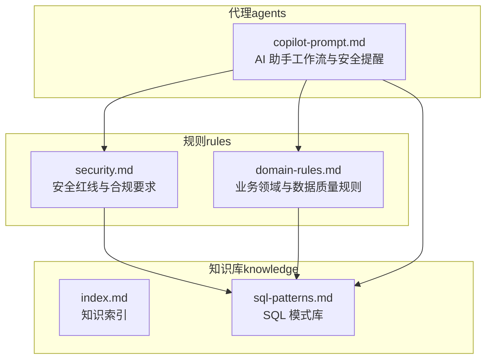
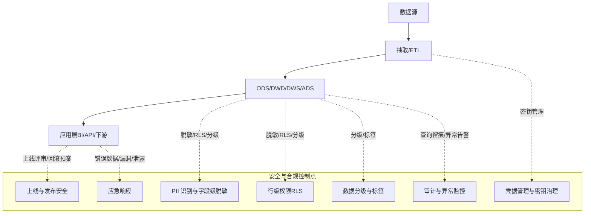
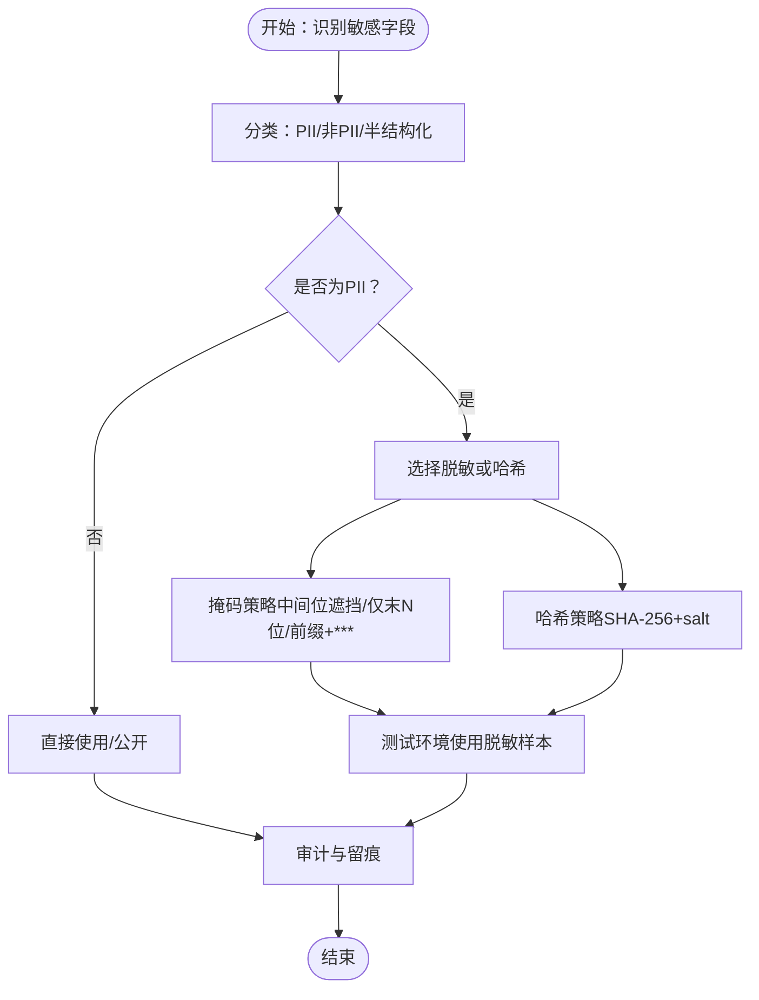
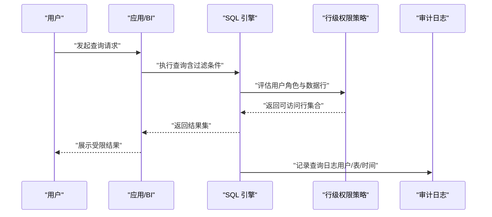
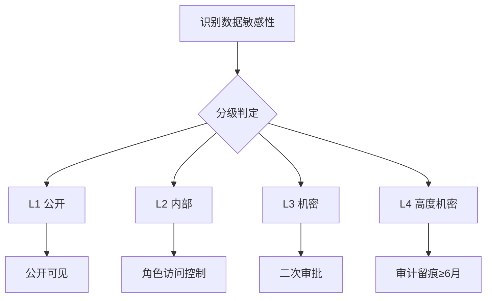
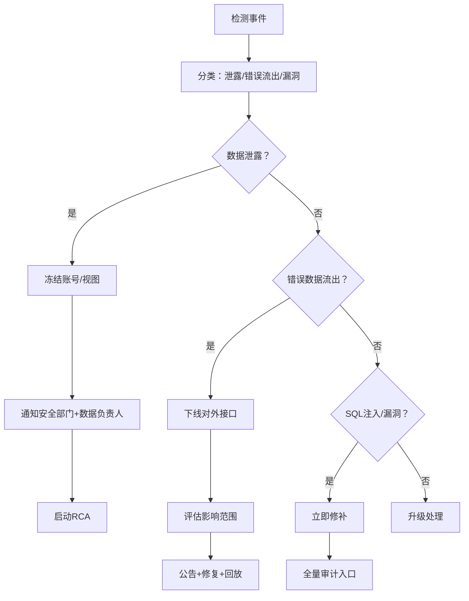
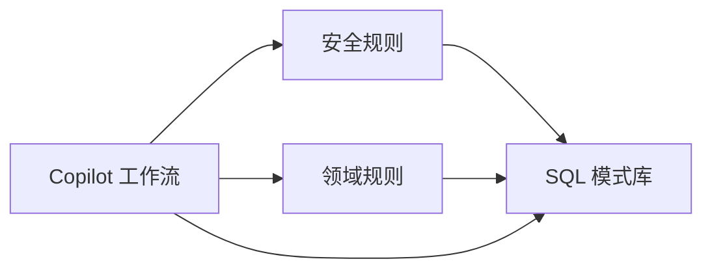

# 安全与合规规范

<cite>
**本文引用的文件**
- [rules/security.md](file://rules/security.md)
- [rules/domain-rules.md](file://rules/domain-rules.md)
- [agents/copilot-prompt.md](file://agents/copilot-prompt.md)
- [knowledge/index.md](file://knowledge/index.md)
- [knowledge/sql-patterns.md](file://knowledge/sql-patterns.md)
</cite>

## 目录
1. [简介](#简介)
2. [项目结构](#项目结构)
3. [核心组件](#核心组件)
4. [架构总览](#架构总览)
5. [详细组件分析](#详细组件分析)
6. [依赖关系分析](#依赖关系分析)
7. [性能考量](#性能考量)
8. [故障排查指南](#故障排查指南)
9. [结论](#结论)
10. [附录](#附录)

## 简介
本文件面向数据仓库工程的安全与合规规范，围绕数据安全保护、PII识别与处理、行级权限控制（RLS）、数据分级与标签管理、数据脱敏与加密、安全事件响应与合规检查等方面，结合仓库现有规则与知识库，形成可执行、可审计、可落地的体系化文档。目标是帮助团队在设计、开发、上线、运维各阶段，系统性地落实安全与合规要求。

## 项目结构
仓库采用“规则（rules）+ 知识库（knowledge）+ 代理（agents）”的组织方式，安全与合规相关内容主要集中在规则文件中，辅以知识库中的模式与最佳实践，以及代理提示词对安全要点进行强调与贯穿。

图表来源
- [rules/security.md:1-98](file://rules/security.md#L1-L98)
- [rules/domain-rules.md:1-142](file://rules/domain-rules.md#L1-L142)
- [knowledge/index.md:1-60](file://knowledge/index.md#L1-L60)
- [knowledge/sql-patterns.md:1-331](file://knowledge/sql-patterns.md#L1-L331)
- [agents/copilot-prompt.md:1-147](file://agents/copilot-prompt.md#L1-L147)

章节来源
- [rules/security.md:1-98](file://rules/security.md#L1-L98)
- [rules/domain-rules.md:1-142](file://rules/domain-rules.md#L1-L142)
- [agents/copilot-prompt.md:1-147](file://agents/copilot-prompt.md#L1-L147)
- [knowledge/index.md:1-60](file://knowledge/index.md#L1-L60)
- [knowledge/sql-patterns.md:1-331](file://knowledge/sql-patterns.md#L1-L331)

## 核心组件
- 安全红线与合规要求：明确禁止事项、字段级脱敏标准、行级权限（RLS）要求、数据分级与访问控制、上线与发布安全、数据回刷安全、业务安全、跨境合规、安全审计与应急响应。
- 业务领域与数据质量规则：统一金额/百分比/时间维度口径，KPI 定义标准，数据质量五大维度与严重等级划分。
- SQL 模式库：提供可复用的高质量 SQL 模式，支撑脱敏、回刷、幂等写入等安全相关场景。
- AI 助手工作流：在 SQL/ETL/建模/调度等全流程中强调安全提醒与变更记录。

章节来源
- [rules/security.md:5-98](file://rules/security.md#L5-L98)
- [rules/domain-rules.md:6-142](file://rules/domain-rules.md#L6-L142)
- [knowledge/sql-patterns.md:1-331](file://knowledge/sql-patterns.md#L1-L331)
- [agents/copilot-prompt.md:15-34](file://agents/copilot-prompt.md#L15-L34)

## 架构总览
安全与合规体系以“规则驱动 + 模式复用 + 流程约束 + 审计留痕”为核心，贯穿数据生命周期：

图表来源
- [rules/security.md:7-98](file://rules/security.md#L7-L98)
- [rules/domain-rules.md:69-100](file://rules/domain-rules.md#L69-L100)
- [knowledge/sql-patterns.md:232-255](file://knowledge/sql-patterns.md#L232-L255)

## 详细组件分析

### 数据安全保护与PII处理
- PII识别与分类
  - 明确禁止在 ADS/视图中直接展示身份证号、手机号、银行卡号、密码等敏感字段，必须进行脱敏或哈希处理。
  - 字段级脱敏标准涵盖手机号、身份证、邮箱、银行卡、姓名（中文）、地址等，提供掩码与哈希示例。
- 脱敏与加密实施
  - 提供脱敏示例（掩码、仅保留末 N 位、用户名前缀 + *** 等）与哈希（SHA-256 + salt）用于去重而不暴露明文。
  - 强调测试环境不得使用真实生产数据，应使用脱敏样本；禁止在公共仓库提交包含密钥/内部样本的文件。
- 加密与密钥治理
  - 数据网关/服务账号必须使用统一密钥管理（KMS/Vault），不得使用个人账号；禁止在 SQL/ETL/调度配置中硬编码数据库密码、API Key、连接串中的凭据。

图表来源
- [rules/security.md:9-25](file://rules/security.md#L9-L25)
- [rules/security.md:12-13](file://rules/security.md#L12-L13)

章节来源
- [rules/security.md:7-26](file://rules/security.md#L7-L26)
- [rules/security.md:9-13](file://rules/security.md#L9-L13)

### 行级权限控制（RLS）
- 设计要求
  - 涉及多租户/多组织/多业务线的数仓表，必须配置行级权限。
  - RLS 规则必须在 spec 中明确定义，并经人工审查后方可实施。
  - 严禁使用代码绕过权限校验（如直接读底层文件）。
- 验证与变更管理
  - RLS 规则变更必须验证：每个角色/用户只能看到授权数据；无角色用户被正确拒绝；管理员/超级权限的访问范围。
- 与模式库协同
  - 在 SQL 模式库中，回刷/幂等写入等场景强调 INSERT OVERWRITE 的幂等性，避免越权写入与重复数据导致的权限绕过风险。

图表来源
- [rules/security.md:36-44](file://rules/security.md#L36-L44)
- [knowledge/sql-patterns.md:238-251](file://knowledge/sql-patterns.md#L238-L251)

章节来源
- [rules/security.md:36-44](file://rules/security.md#L36-L44)
- [knowledge/sql-patterns.md:232-255](file://knowledge/sql-patterns.md#L232-L255)

### 数据分级与标签管理
- 分级定义
  - L1 公开：可对外公开（如公开统计报告）
  - L2 内部：公司内部使用（如业务运营数据）
  - L3 机密：部分人员访问（如财务、薪酬）
  - L4 高度机密：严格管控（如个人 PII/客户隐私，必须工单 + 审计）
- 访问控制与审计
  - L4 数据访问必须留痕（审计日志保留 ≥ 6 个月）
  - L3+ 数据导出必须二次审批
  - 跨级别合并表必须按最高级别管控
- 标签与留痕
  - 在数据生命周期中对敏感字段与表进行分级标注，确保查询与导出均受控。

图表来源
- [rules/security.md:46-60](file://rules/security.md#L46-L60)

章节来源
- [rules/security.md:46-60](file://rules/security.md#L46-L60)

### 数据脱敏与加密技术要求
- 字段级脱敏
  - 手机号：中间 4 位掩码
  - 身份证：出生日期段掩码
  - 邮箱：用户名前 3 位 + ***
  - 银行卡：仅末 4 位
  - 姓名（中文）：仅姓 + *
  - 地址：区县级以下掩码
  - 身份证号哈希：SHA-256 + salt，用于去重而不暴露明文
- 实施示例
  - 提供掩码与哈希的 SQL 示例，便于在 DWD/DWS/ADS 层统一实现。
- 加密与密钥治理
  - 服务账号与数据网关必须使用统一密钥管理（KMS/Vault），不得使用个人账号；禁止在配置中硬编码凭据。

章节来源
- [rules/security.md:15-34](file://rules/security.md#L15-L34)
- [rules/security.md:66-67](file://rules/security.md#L66-L67)

### 安全事件响应流程
- 数据泄露
  - 立即冻结相关账号/视图 → 通知安全团队 + 数据负责人 → 启动 RCA
- 错误数据流出
  - 立即下线对外接口 → 评估影响范围 → 公告 + 修复 + 回放
- SQL 注入/漏洞
  - 立即修补 + 全量审计相关入口

图表来源
- [rules/security.md:93-98](file://rules/security.md#L93-L98)

章节来源
- [rules/security.md:93-98](file://rules/security.md#L93-L98)

### 合规性检查清单
- 数据安全
  - 禁止硬编码凭据；禁止在 ADS/视图直接展示 PII；禁止通过非安全渠道传输敏感结果；测试环境使用脱敏样本；禁止在公共仓库提交密钥/样本。
- 字段级脱敏
  - 按标准对手机号、身份证、邮箱、银行卡、姓名、地址进行脱敏；身份证号哈希用于去重。
- 行级权限（RLS）
  - 多租户/多组织/多业务线表必须配置 RLS；变更需验证；严禁绕过校验。
- 数据分级与访问控制
  - L4 数据留痕（≥6月）；L3+ 导出二次审批；跨级别合并按最高级别管控。
- 上线与发布安全
  - 生产 SQL 必须 PR Review；涉及 PII/财务的表需数据负责人+安全负责人双签；DDL 变更必须有回滚预案；服务账号使用统一密钥管理；临时探索查询禁止落地生产库。
- 数据回刷安全
  - 明确范围/影响/回退方案；对外指标回刷需发布“数据修订公告”；回刷在低峰期执行。
- 业务安全
  - 财务/营收/上市口径指标需标注精度、四舍五入规则、对外披露口径；预测/预算指标明确时效性与可靠性；对外报表需数据准确性审查与法务合规审查。
- 跨境合规
  - 涉及跨境数据传输需符合 GDPR/PIPL；出境数据做去标识化；跨境数据分类需有数据出境清单+审批记录。
- 安全审计
  - L3+ 查询留痕；异常访问行为（如非工作时间高频访问 PII 表）告警；离职员工权限在 24 小时内回收。

章节来源
- [rules/security.md:7-98](file://rules/security.md#L7-L98)

## 依赖关系分析
- 规则与知识库耦合
  - 安全规则与领域规则共同指导数据口径与质量；SQL 模式库提供可复用的脱敏、回刷、幂等写入等实现范式。
- 代理与流程耦合
  - AI 助手在 SQL/ETL/建模/调度等环节强调“Spec 驱动”“No Spec, No Change”，并在涉及生产数据/PII/财务/历史回刷时高亮提醒人工审查，强化安全约束。

图表来源
- [rules/security.md:1-98](file://rules/security.md#L1-L98)
- [rules/domain-rules.md:1-142](file://rules/domain-rules.md#L1-L142)
- [knowledge/sql-patterns.md:1-331](file://knowledge/sql-patterns.md#L1-L331)
- [agents/copilot-prompt.md:15-34](file://agents/copilot-prompt.md#L15-L34)

章节来源
- [rules/security.md:1-98](file://rules/security.md#L1-L98)
- [rules/domain-rules.md:1-142](file://rules/domain-rules.md#L1-L142)
- [knowledge/sql-patterns.md:1-331](file://knowledge/sql-patterns.md#L1-L331)
- [agents/copilot-prompt.md:15-34](file://agents/copilot-prompt.md#L15-L34)

## 性能考量
- 脱敏与哈希的成本
  - 脱敏多为字符串函数组合，成本较低；哈希需注意盐值管理与索引策略，避免重复计算。
- RLS 的性能
  - RLS 规则应尽量简单且可下推，避免复杂表达式导致全表扫描；合理使用分区裁剪与物化视图。
- 回刷与幂等写入
  - 使用 INSERT OVERWRITE 单分区进行回刷，减少全表重写成本；控制并发与队列资源占用。
- 审计日志
  - 审计日志写入应异步化或落盘到专用存储，避免阻塞主查询路径。

## 故障排查指南
- PII 泄露
  - 检查 ADS/视图是否直接展示敏感字段；确认脱敏/哈希是否生效；核查传输渠道是否安全。
- 权限绕过
  - 核查 RLS 规则是否正确配置与生效；验证角色/用户授权范围；检查是否存在直接读底层文件的行为。
- 数据分级不当
  - 检查分级标注是否准确；确认导出流程是否触发二次审批；评估跨级别合并是否按最高级别管控。
- 审计缺失
  - 确认 L3+ 查询是否留痕；检查异常访问行为告警是否开启；核查权限回收是否及时。

章节来源
- [rules/security.md:87-92](file://rules/security.md#L87-L92)

## 结论
本规范以规则为纲、以模式为目、以流程为纲、以审计为尺，构建了覆盖数据全生命周期的安全与合规体系。通过严格的 PII 识别与处理、行级权限控制、数据分级与标签管理、脱敏与加密、上线与发布安全、数据回刷安全、业务与跨境合规以及安全事件响应，确保数据仓库在满足业务需求的同时，满足内外部合规要求与安全底线。

## 附录
- 术语
  - PII：个人身份信息
  - RLS：行级权限控制
  - KMS：密钥管理服务
  - SQL 模式：可复用的高质量 SQL 实现范式
- 参考文件
  - [rules/security.md](file://rules/security.md)
  - [rules/domain-rules.md](file://rules/domain-rules.md)
  - [knowledge/sql-patterns.md](file://knowledge/sql-patterns.md)
  - [agents/copilot-prompt.md](file://agents/copilot-prompt.md)
  - [knowledge/index.md](file://knowledge/index.md)