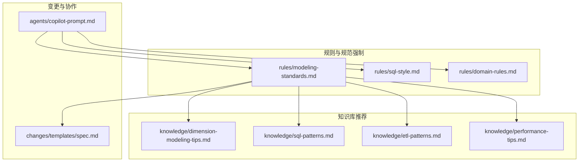
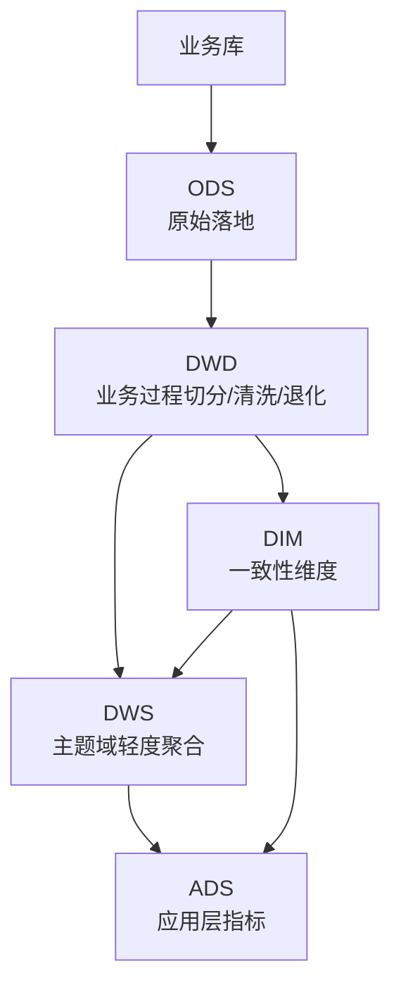
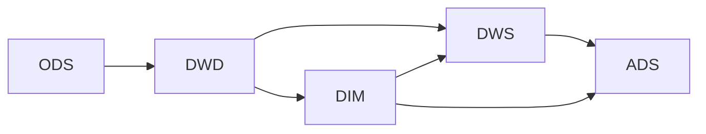

# 建模与分层规范

<cite>
**本文引用的文件**
- [目录结构和设计说明.md](file://目录结构和设计说明.md)
- [建模与分层规范.md](file://rules/modeling-standards.md)
- [维度建模技巧.md](file://knowledge/dimension-modeling-tips.md)
- [SQL 常用模式库.md](file://knowledge/sql-patterns.md)
- [ETL 模式库.md](file://knowledge/etl-patterns.md)
- [性能优化知识库.md](file://knowledge/performance-tips.md)
- [SQL 编码规范.md](file://rules/sql-style.md)
- [业务领域约束.md](file://rules/domain-rules.md)
- [AI 协作助手提示词.md](file://agents/copilot-prompt.md)
</cite>

## 目录
1. [简介](#简介)
2. [项目结构](#项目结构)
3. [核心组件](#核心组件)
4. [架构总览](#架构总览)
5. [详细组件分析](#详细组件分析)
6. [依赖分析](#依赖分析)
7. [性能考虑](#性能考虑)
8. [故障排查指南](#故障排查指南)
9. [结论](#结论)
10. [附录](#附录)

## 简介
本文件面向数据仓库（Data Warehouse）建模与分层开发，系统化阐述 ODS（操作数据存储）、DWD（数据明细层）、DWS（数据汇总层）、ADS（数据应用层）、DIM（维度层）的职责边界、设计原则与落地规范。围绕事实表与维度表的设计，给出表结构、字段定义、关系约束、命名规范、分区策略、存储格式与生命周期等技术要求，并提供建模案例与最佳实践，帮助开发者正确设计数据模型，确保可维护性、性能与一致性。

## 项目结构
本项目采用“提示词驱动 + 知识库 + 变更追踪”的工程化协作体系：
- rules/：项目约束与规范（强制）
- knowledge/：领域知识与模式库（推荐复用）
- changes/：变更管理与过程记录（历史沉淀）
- agents/：AI 协作角色与命令体系

图表来源
- [目录结构和设计说明.md:19-55](file://目录结构和设计说明.md#L19-L55)
- [AI 协作助手提示词.md:1-61](file://agents/copilot-prompt.md#L1-L61)

章节来源
- [目录结构和设计说明.md:19-55](file://目录结构和设计说明.md#L19-L55)

## 核心组件
- 分层架构与职责边界：ODS/DWD/DWS/ADS/DIM 的定位、是否对外、生命周期
- 模型架构：星型模型优先，维度表代理键+业务键双键并存
- 表类型与命名：事实表（事务/快照）、维度表（SCD1/SCD2/桥接/退化）、中间表
- 关系与关联：外键=维度代理键，拉链维度关联带时间窗口，禁止跨层反向与循环依赖
- 物理设计：分区 dt/二级分区、分桶、存储格式（ORC/Parquet）、生命周期
- 指标与口径：原子/派生/复合指标分级，跨表口径对齐
- 禁止事项与评审清单：明确红线与自查清单

章节来源
- [建模与分层规范.md:7-46](file://rules/modeling-standards.md#L7-L46)
- [建模与分层规范.md:49-70](file://rules/modeling-standards.md#L49-L70)
- [建模与分层规范.md:118-149](file://rules/modeling-standards.md#L118-L149)
- [建模与分层规范.md:151-168](file://rules/modeling-standards.md#L151-L168)
- [建模与分层规范.md:171-193](file://rules/modeling-standards.md#L171-L193)
- [建模与分层规范.md:196-221](file://rules/modeling-standards.md#L196-L221)
- [建模与分层规范.md:224-242](file://rules/modeling-standards.md#L224-L242)

## 架构总览
数仓分层采用“贴源—明细—汇总—应用—维度”五层结构，强调：
- ODS：原始落地，保留源端字段，不做加工
- DWD：业务过程切分、清洗、维度退化、关联维度
- DIM：一致性维度，跨主题复用
- DWS：主题域轻度聚合，可加和指标
- ADS：业务口径完整指标，直接服务报表/API

图表来源
- [建模与分层规范.md:10-34](file://rules/modeling-standards.md#L10-L34)

章节来源
- [建模与分层规范.md:10-34](file://rules/modeling-standards.md#L10-L34)

## 详细组件分析

### ODS（操作数据存储）
- 职责：原始落地，保留源端字段，不做加工；增量永久或全量短期
- 设计要点：分区 dt，字段 COMMENT，生命周期可按法规保留
- ETL 选型：全量/增量/CDC 三选一，优先幂等与回放能力
- 命名与字段：ods_{source}.{table}_{inc/full/df/…}

章节来源
- [建模与分层规范.md](file://rules/modeling-standards.md#L40)
- [ETL 模式库.md:192-203](file://knowledge/etl-patterns.md#L192-L203)

### DWD（数据明细层）
- 职责：业务过程切分、清洗、维度退化、关联维度
- 设计要点：事实表只保留外键、退化维度、度量值；按 dt 分区；事务事实表 di 与累积快照 da 区分
- 关系：外键=维度代理键；拉链维度关联带时间窗口；默认 LEFT JOIN
- 命名与字段：dwd_{biz}_{grain}（di/df/da）

章节来源
- [建模与分层规范.md:41-44](file://rules/modeling-standards.md#L41-L44)
- [建模与分层规范.md:75-88](file://rules/modeling-standards.md#L75-L88)
- [建模与分层规范.md:153-161](file://rules/modeling-standards.md#L153-L161)

### DIM（维度层）
- 职责：一致性维度，跨主题复用
- 设计要点：代理键+业务键双键并存；拉链表（SCD2）必须有 start_date/end_date/is_current；小型维度可用全量快照
- 必备维度：dim_date、dim_user、dim_org
- 命名与字段：dim_{entity}、dim_{entity}_zip

章节来源
- [建模与分层规范.md:42-44](file://rules/modeling-standards.md#L42-L44)
- [建模与分层规范.md:120-148](file://rules/modeling-standards.md#L120-L148)

### DWS（数据汇总层）
- 职责：主题域轻度聚合，可加和指标
- 设计要点：按天/小时/月等粒度聚合；避免在 DWD 做主题汇总
- 命名与字段：dws_{domain}_{grain}（1d/1h/1m）

章节来源
- [建模与分层规范.md:43-44](file://rules/modeling-standards.md#L43-L44)
- [建模与分层规范.md:218-219](file://rules/modeling-standards.md#L218-L219)

### ADS（数据应用层）
- 职责：业务口径完整指标，直接服务报表/API
- 设计要点：直接服务于报表/API（指标级）；避免在 ADS 做底层清洗
- 命名与字段：ads_{domain}（如 ads_sales_dashboard_1d）

章节来源
- [建模与分层规范.md:43-44](file://rules/modeling-standards.md#L43-L44)
- [建模与分层规范.md:220-221](file://rules/modeling-standards.md#L220-L221)

### 事实表设计规范
- 设计原则：只保留外键、退化维度、度量值；描述性属性不冗余到事实表；大型事实表必须按 dt 分区；事务事实表 di 与累积快照 da 严格区分
- 类型与写入：事务事实表 di 使用 INSERT OVERWRITE 当日分区；周期快照 1d 使用 INSERT OVERWRITE 当日分区；累积快照 da 使用 MERGE/全量重写
- 标准字段：业务键、外键（维度代理键）、退化维度、度量值（金额/数量/比率）、时间戳、元信息 etl_time

章节来源
- [建模与分层规范.md:75-88](file://rules/modeling-standards.md#L75-L88)
- [建模与分层规范.md:89-114](file://rules/modeling-standards.md#L89-L114)

### 维度表设计规范
- 设计原则：代理键+业务键双键并存；包含所有描述性属性；拉链表（SCD2）必须有 start_date/end_date/is_current；小型维度可用全量快照
- 标准字段：代理键、业务键、描述性属性、SCD2 标记字段、元信息 etl_time
- 必备维度：dim_date（覆盖未来 5-10 年）、dim_user、dim_org

章节来源
- [建模与分层规范.md:120-148](file://rules/modeling-standards.md#L120-L148)
- [维度建模技巧.md:5-36](file://knowledge/dimension-modeling-tips.md#L5-L36)

### 关系与关联约束
- 外键=维度代理键（性能+历史一致性）
- 拉链维度关联必须带时间窗口：f.biz_date BETWEEN u.start_date AND u.end_date
- 默认 LEFT JOIN；INNER JOIN 仅在业务上要求“必须有维度”时使用
- 禁止跨层反向（DWD 不能读 DWS/ADS）、跨层跳跃（ADS 不能直接读 ODS）、循环依赖、跨主题强耦合

章节来源
- [建模与分层规范.md:153-167](file://rules/modeling-standards.md#L153-L167)

### 命名规范与字段约定
- 库命名：ods_、dwh_dwd/dwd_domain、dwh_dws/dws_domain、dwh_ads/ads_domain、dwh_dim、tmp_owner、ops_area
- 表命名：{layer}_{biz_process}_{grain}{period}（di/df/da/hi/1d/1h/1m/zip/rt）
- 字段命名：主键/_sk、外键与维度主键同名、金额*_amt、数量*_qty/*_cnt、比率*_rate/*_pct、布尔is_*、时间*_time、日期*_date/*_id、状态*_status、时间戳create_time/update_time
- 分区字段：统一 dt（YYYYMMDD），小时分区 dh（YYYYMMDDHH）

章节来源
- [SQL 编码规范.md:9-87](file://rules/sql-style.md#L9-L87)

### 分区策略与存储格式
- 分区：主分区统一 dt；二级分区按需（dh/region）；单表分区数建议≤5000
- 分桶：大表 Join 同一主键时启用，桶数为 2 的幂（128/256/512）；Bucket Join
- 存储格式：大表 ORC（Hive）/Parquet（Spark/Iceberg）；ZSTD 优先；临时表 Parquet+Snappy
- 生命周期：ODS 增量分区（永久/按法规）；DWD/DWS/ADS 永久；mid_/tmp_（短期）

章节来源
- [建模与分层规范.md:173-192](file://rules/modeling-standards.md#L173-L192)

### 指标与口径分级
- 原子指标：*_amt/*_cnt/*_qty（不可拆分）
- 派生指标：*_rate/*_pct/avg_*（原子指标运算）
- 复合指标：kpi_*（多原子+派生组合）
- 跨表口径对齐：同名指标口径必须一致；出现差异必须改名并在 domain-rules.md 登记

章节来源
- [建模与分层规范.md:196-209](file://rules/modeling-standards.md#L196-L209)
- [业务领域约束.md:45-66](file://rules/domain-rules.md#L45-L66)

### 建模案例与最佳实践
- 事务事实表 di：订单交易明细（天增量），包含业务键、外键、退化维度、度量值、时间戳、分区 dt
- 周期快照 1d：按日余额快照，按实体×日期粒度
- 累积快照 da：订单生命周期（下单→支付→发货→签收），记录里程碑时间
- 拉链维度 zip：用户维度保留历史版本，带 start_date/end_date/is_current
- 桥接表 bridge：多对多关系（如用户标签），带权重字段与时间窗口
- 退化维度：低基数/仅事实表内使用（如订单号、支付渠道）直接退化为事实表列

章节来源
- [建模与分层规范.md:89-114](file://rules/modeling-standards.md#L89-L114)
- [维度建模技巧.md:125-155](file://knowledge/dimension-modeling-tips.md#L125-L155)
- [维度建模技巧.md:41-83](file://knowledge/dimension-modeling-tips.md#L41-L83)
- [维度建模技巧.md:86-122](file://knowledge/dimension-modeling-tips.md#L86-L122)

## 依赖分析
- 分层依赖：ODS→DWD→DWS→ADS；DIM 为共享依赖
- 关联依赖：事实表外键→维度代理键；拉链维度关联带时间窗口
- 禁止依赖：跨层反向、跨层跳跃、循环依赖、跨主题强耦合

图表来源
- [建模与分层规范.md:163-167](file://rules/modeling-standards.md#L163-L167)

章节来源
- [建模与分层规范.md:163-167](file://rules/modeling-standards.md#L163-L167)

## 性能考虑
- 分区裁剪：WHERE 条件直接命中分区字段，禁止函数包裹；验证 EXPLAIN/EXTENDED
- 数据倾斜：热点键过滤/单独处理、加盐打散（Salt+二次聚合）、Map Join 小表
- 小文件：控制 reduce 数、DISTRIBUTE BY、AQE 自动合并、周期性合并
- CTE 物化：Hive/Spark 默认不物化，多次引用的复杂 CTE 先落临时表或 CACHE
- 谓词下推与列裁剪：WHERE 下推、只读必要列、列存格式收益显著
- Join 顺序与类型：Broadcast Hash Join（小表）最快；Sort Merge Join（两侧都大）代价高；Bucket Join 跳过 Shuffle
- 窗口函数：PARTITION BY 列基数适中；配合 DISTRIBUTE BY/SORT BY 优化
- 存储格式与压缩：ORC+ZSTD（Hive）/Parquet+ZSTD（Spark）；列存 + 列裁剪 + 统计信息

章节来源
- [性能优化知识库.md:5-39](file://knowledge/performance-tips.md#L5-L39)
- [性能优化知识库.md:42-98](file://knowledge/performance-tips.md#L42-L98)
- [性能优化知识库.md:138-164](file://knowledge/performance-tips.md#L138-L164)
- [性能优化知识库.md:167-193](file://knowledge/performance-tips.md#L167-L193)
- [性能优化知识库.md:196-229](file://knowledge/performance-tips.md#L196-L229)
- [性能优化知识库.md:232-256](file://knowledge/performance-tips.md#L232-L256)
- [性能优化知识库.md:259-283](file://knowledge/performance-tips.md#L259-L283)
- [性能优化知识库.md:286-305](file://knowledge/performance-tips.md#L286-L305)

## 故障排查指南
- 诊断层级：数据源层→抽取层→ODS→DWD→DWS→ADS→应用层
- 常见问题与对策：
  - 分区裁剪失效：检查 WHERE 条件是否直接命中 dt；确认子查询/JOIN 中裁剪生效
  - 数据倾斜：热点键过滤/加盐；Map Join 小表；开启自适应优化
  - 小文件爆炸：控制 reduce 数、DISTRIBUTE BY、AQE 合并、周期性合并
  - 拉链维度关联错误：必须带时间窗口 f.dt BETWEEN u.start_date AND u.end_date
  - 跨层反向/循环依赖：严格按 ODS→DWD→DWS→ADS 顺序，避免跨层跳跃
  - 指标口径不一致：同名指标必须改名并在 domain-rules.md 登记

章节来源
- [AI 协作助手提示词.md:133-147](file://agents/copilot-prompt.md#L133-L147)
- [建模与分层规范.md:155-161](file://rules/modeling-standards.md#L155-L161)
- [建模与分层规范.md:163-167](file://rules/modeling-standards.md#L163-L167)

## 结论
本规范以“分层架构 + 星型模型 + 维度建模技巧 + 性能优化”为核心，提供从建模到落地的全流程指导。通过严格的命名与字段约定、分区与存储策略、指标口径对齐与禁止事项清单，确保模型可维护、可扩展、可审计。建议在实施过程中坚持“Spec 驱动 + 三段式知识库 + 强制变更追踪”，持续沉淀最佳实践，提升团队整体效率与质量。

## 附录

### 建模评审清单（实施前自查）
- [ ] 表名前缀符合分层规范
- [ ] 表名包含粒度后缀
- [ ] 业务过程清晰（一个事实表只表达一个业务过程）
- [ ] 主键/外键命名规范
- [ ] 分区字段为 dt STRING
- [ ] 字段类型最小化（不滥用 BIGINT/STRING）
- [ ] 金额字段为 DECIMAL，精度合理
- [ ] 字段全部有 COMMENT
- [ ] 表有 COMMENT 描述用途
- [ ] 配置了生命周期（lifecycle）
- [ ] 选择了合适的存储格式与压缩
- [ ] 分层归属正确（不跨层）
- [ ] 维度复用一致性维度，未重复建设
- [ ] 已声明上下游依赖

章节来源
- [建模与分层规范.md:224-242](file://rules/modeling-standards.md#L224-L242)