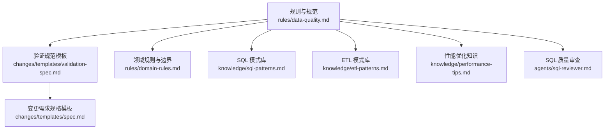
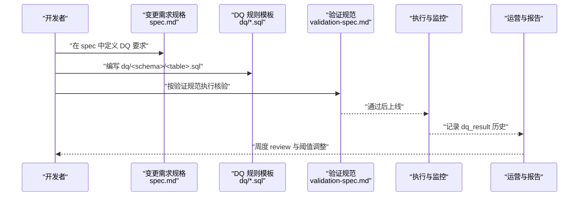
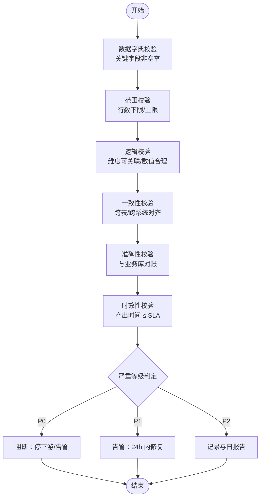
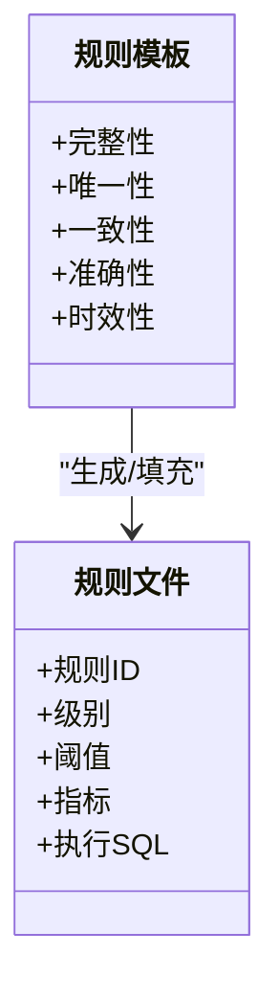
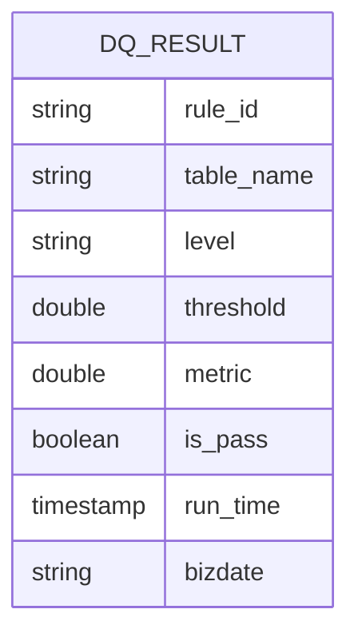
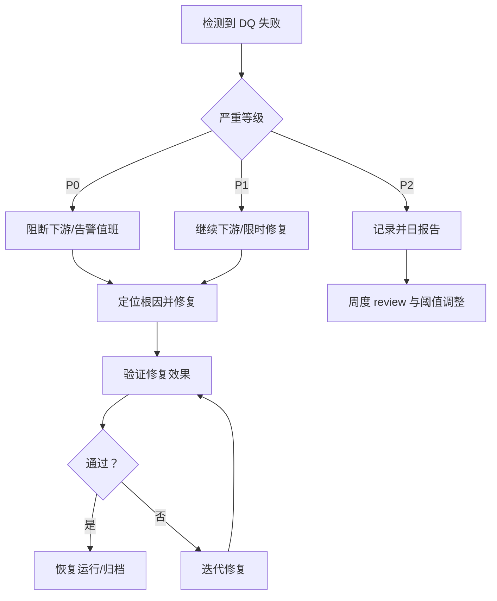
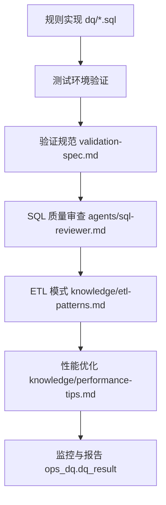
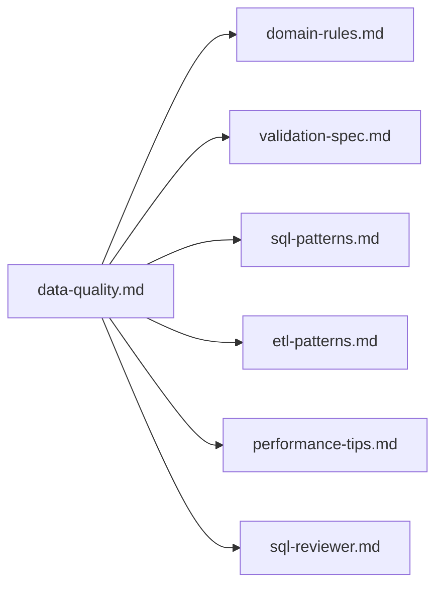

# 数据质量规范

<cite>
**本文引用的文件**
- [目录结构和设计说明.md](file://目录结构和设计说明.md)
- [data-quality.md](file://rules/data-quality.md)
- [domain-rules.md](file://rules/domain-rules.md)
- [validation-spec.md](file://changes/templates/validation-spec.md)
- [sql-patterns.md](file://knowledge/sql-patterns.md)
- [etl-patterns.md](file://knowledge/etl-patterns.md)
- [performance-tips.md](file://knowledge/performance-tips.md)
- [sql-reviewer.md](file://agents/sql-reviewer.md)
</cite>

## 目录
1. [简介](#简介)
2. [项目结构](#项目结构)
3. [核心组件](#核心组件)
4. [架构总览](#架构总览)
5. [详细组件分析](#详细组件分析)
6. [依赖分析](#依赖分析)
7. [性能考量](#性能考量)
8. [故障排查指南](#故障排查指南)
9. [结论](#结论)
10. [附录](#附录)

## 简介
本文件面向数据仓库工程团队，系统化阐述数据质量五维度（完整性、准确性、一致性、及时性、唯一性）的评估标准、检查方法与落地流程。结合仓库中的规范模板与知识库，给出可执行的规则设计、自动化校验、监控与报告机制，以及问题处理与修复策略，帮助在数仓全生命周期中持续保障数据质量。

## 项目结构
围绕数据质量规范，本仓库的关键位置如下：
- 规范与规则：rules/data-quality.md（五维度与规则模板）、rules/domain-rules.md（业务领域与质量边界）
- 变更与验证：changes/templates/validation-spec.md（验证规范模板）、changes/templates/spec.md（变更需求规格模板，含 DQ 要求）
- 知识与模式：knowledge/sql-patterns.md（常见 SQL 模式，支撑质量检查）、knowledge/etl-patterns.md（ETL 模式，支撑一致性与及时性）、knowledge/performance-tips.md（性能优化，支撑及时性与稳定性）
- 审查与质量：agents/sql-reviewer.md（SQL 质量审查要点，辅助 DQ）

**图表来源**
- [data-quality.md:1-195](file://rules/data-quality.md#L1-L195)
- [validation-spec.md:1-123](file://changes/templates/validation-spec.md#L1-L123)
- [domain-rules.md:1-142](file://rules/domain-rules.md#L1-L142)
- [sql-patterns.md:1-331](file://knowledge/sql-patterns.md#L1-L331)
- [etl-patterns.md:1-220](file://knowledge/etl-patterns.md#L1-L220)
- [performance-tips.md:1-349](file://knowledge/performance-tips.md#L1-L349)
- [sql-reviewer.md:1-68](file://agents/sql-reviewer.md#L1-L68)

**章节来源**
- [目录结构和设计说明.md:1-204](file://目录结构和设计说明.md#L1-L204)

## 核心组件
- 数据质量五维度与阈值：完整性（非空率 ≥ 99.9%）、唯一性（重复行数 = 0）、一致性（行数差异 < 0.1%）、准确性（与业务库对账误差 < 0.5%）、时效性（产出时间 ≤ SLA 基线）
- 规则强制要求：行数下限/上限、主键唯一、关键字段非空；维度/事实表额外规则
- 规则模板与文件结构：dq/<schema>/<table>.sql，单表规则集，包含规则 ID、级别、阈值、指标
- 规则上线流程：设计 → 实现 → 测试 → 上线 → 运营
- 历史趋势与结果表：ops_dq.dq_result，支持趋势分析与治理评估

**章节来源**
- [data-quality.md:9-121](file://rules/data-quality.md#L9-L121)
- [data-quality.md:123-181](file://rules/data-quality.md#L123-L181)

## 架构总览
数据质量贯穿“变更设计—实现—验证—上线—运营”的全生命周期，形成闭环：

**图表来源**
- [data-quality.md:115-121](file://rules/data-quality.md#L115-L121)
- [validation-spec.md:1-123](file://changes/templates/validation-spec.md#L1-L123)
- [data-quality.md:164-181](file://rules/data-quality.md#L164-L181)

## 详细组件分析

### 完整性（完整性、准确性、一致性、及时性、唯一性）
- 定义与阈值
  - 完整性：关键字段非空率 ≥ 99.9%
  - 唯一性：重复行数 = 0
  - 一致性：行数差异 < 0.1%，金额差异 < 0.5%
  - 准确性：与业务库直查对账误差 < 0.5%
  - 时效性：产出时间 ≤ SLA 基线
- 检查方法
  - 数据字典校验：关键字段非空率（见规则模板）
  - 范围校验：行数下限/上限（历史 P10/P95 倍数）
  - 逻辑校验：维度可关联率、数值合理性（金额/数量/比率范围）
  - 一致性校验：跨表/跨系统对齐（行数/金额）
  - 时效性校验：分区最大更新时间与 SLA 比较
- 严重等级
  - P0：阻断（主键唯一、行数下限、关键字段非空）
  - P1：告警（一致性、指标对账）
  - P2：监控（字段分布、典型值占比）

**图表来源**
- [data-quality.md:9-18](file://rules/data-quality.md#L9-L18)
- [data-quality.md:19-34](file://rules/data-quality.md#L19-L34)
- [domain-rules.md:69-91](file://rules/domain-rules.md#L69-L91)

**章节来源**
- [data-quality.md:9-34](file://rules/data-quality.md#L9-L34)
- [domain-rules.md:69-91](file://rules/domain-rules.md#L69-L91)

### 规则模板与实现
- 规则模板（完整性/唯一性/一致性/准确性/时效性）提供 SQL 检查骨架，便于快速落地
- 规则文件结构：dq/<schema>/<table>.sql，单表规则集，包含规则 ID、级别、阈值、指标
- 建议：按表组织，避免超大文件；规则与业务变化同步评审

**图表来源**
- [data-quality.md:35-101](file://rules/data-quality.md#L35-L101)
- [data-quality.md:123-162](file://rules/data-quality.md#L123-L162)

**章节来源**
- [data-quality.md:35-101](file://rules/data-quality.md#L35-L101)
- [data-quality.md:123-162](file://rules/data-quality.md#L123-L162)

### 监控与报告机制
- 历史趋势表：ops_dq.dq_result，记录规则执行结果，支持趋势分析与治理评估
- 报告维度：通过率、Top 失败规则、改进措施
- 与业务方 SLA：核心 ADS 明示 DQ 通过标准，月度提供 DQ 报告

**图表来源**
- [data-quality.md:164-181](file://rules/data-quality.md#L164-L181)

**章节来源**
- [data-quality.md:164-195](file://rules/data-quality.md#L164-L195)

### 问题处理流程与修复策略
- 等级与处置
  - P0：阻断（停下游、短信+电话告警）
  - P1：告警（下游继续运行，24h 内修复）
  - P2：监控（仅记录，进入日报）
- 修复策略
  - 完整性：补齐缺失字段、修正上游数据源
  - 唯一性：识别重复主键、清洗或去重
  - 一致性：对齐口径、修正上游/下游逻辑
  - 准确性：回归业务库对账、修正计算逻辑
  - 时效性：优化作业性能、调整 SLA 或资源

**图表来源**
- [data-quality.md:102-114](file://rules/data-quality.md#L102-L114)

**章节来源**
- [data-quality.md:102-114](file://rules/data-quality.md#L102-L114)

### 自动化工具与使用指南
- 规则实现与测试：在 dq/<schema>/<table>.sql 中编写规则，测试环境跑 7 天确认阈值合理
- 验证规范：validation-spec.md 提供“行数核验/抽样对比/对账 SQL”三选一证据要求
- SQL 质量审查：agents/sql-reviewer.md 提供审查分级与性能清单，辅助 DQ
- ETL 与一致性：etl-patterns.md 的 CDC/JDBC/幂等写入等模式有助于一致性与及时性
- 性能优化：performance-tips.md 的分区裁剪、倾斜处理、小文件控制等提升及时性与稳定性

**图表来源**
- [data-quality.md:115-121](file://rules/data-quality.md#L115-L121)
- [validation-spec.md:1-123](file://changes/templates/validation-spec.md#L1-L123)
- [sql-reviewer.md:1-68](file://agents/sql-reviewer.md#L1-L68)
- [etl-patterns.md:1-220](file://knowledge/etl-patterns.md#L1-L220)
- [performance-tips.md:1-349](file://knowledge/performance-tips.md#L1-L349)

**章节来源**
- [data-quality.md:115-121](file://rules/data-quality.md#L115-L121)
- [validation-spec.md:6-13](file://changes/templates/validation-spec.md#L6-L13)
- [sql-reviewer.md:1-68](file://agents/sql-reviewer.md#L1-L68)
- [etl-patterns.md:1-220](file://knowledge/etl-patterns.md#L1-L220)
- [performance-tips.md:1-349](file://knowledge/performance-tips.md#L1-L349)

## 依赖分析
- 规则依赖：data-quality.md 依赖 domain-rules.md 的业务边界与行业规则
- 实施依赖：validation-spec.md 为实施提供证据与检查清单
- 工具依赖：sql-patterns.md、etl-patterns.md、performance-tips.md 为规则实现提供模式与性能保障
- 审查依赖：sql-reviewer.md 为 SQL 质量提供前置保障

**图表来源**
- [data-quality.md:1-195](file://rules/data-quality.md#L1-L195)
- [domain-rules.md:1-142](file://rules/domain-rules.md#L1-L142)
- [validation-spec.md:1-123](file://changes/templates/validation-spec.md#L1-L123)
- [sql-patterns.md:1-331](file://knowledge/sql-patterns.md#L1-L331)
- [etl-patterns.md:1-220](file://knowledge/etl-patterns.md#L1-L220)
- [performance-tips.md:1-349](file://knowledge/performance-tips.md#L1-L349)
- [sql-reviewer.md:1-68](file://agents/sql-reviewer.md#L1-L68)

**章节来源**
- [data-quality.md:1-195](file://rules/data-quality.md#L1-L195)
- [domain-rules.md:1-142](file://rules/domain-rules.md#L1-L142)
- [validation-spec.md:1-123](file://changes/templates/validation-spec.md#L1-L123)
- [sql-patterns.md:1-331](file://knowledge/sql-patterns.md#L1-L331)
- [etl-patterns.md:1-220](file://knowledge/etl-patterns.md#L1-L220)
- [performance-tips.md:1-349](file://knowledge/performance-tips.md#L1-L349)
- [sql-reviewer.md:1-68](file://agents/sql-reviewer.md#L1-L68)

## 性能考量
- 及时性保障：分区裁剪、倾斜处理、小文件合并、资源队列与错峰调度
- 稳定性保障：幂等写入（MERGE/INSERT OVERWRITE）、回放与重试策略
- 可观测性：执行计划分析、作业历史与 Profile、数据采样定位热点

**章节来源**
- [performance-tips.md:5-349](file://knowledge/performance-tips.md#L5-L349)
- [etl-patterns.md:1-220](file://knowledge/etl-patterns.md#L1-L220)

## 故障排查指南
- 完整性问题：检查关键字段是否缺失，核对上游数据源与清洗逻辑
- 唯一性问题：定位重复主键，核查去重策略与幂等写入
- 一致性问题：对齐业务口径，检查跨表/跨系统数据源与分区
- 准确性问题：回溯业务库对账，修正聚合与口径差异
- 时效性问题：分析慢任务、资源瓶颈与 SLA 设置

**章节来源**
- [data-quality.md:183-195](file://rules/data-quality.md#L183-L195)
- [sql-reviewer.md:7-30](file://agents/sql-reviewer.md#L7-L30)

## 结论
通过“五维度规则 + 规则模板 + 验证规范 + 自动化工具 + 监控报告”的闭环，可在数仓全生命周期中系统化保障数据质量。建议将 DQ 与变更同步上线，持续运营与阈值优化，确保数据可信、可追溯、可持续。

## 附录
- 变更需求规格模板（含 DQ 要求）：changes/templates/spec.md
- 验证规范模板（行数/对账/性能/DQ）：changes/templates/validation-spec.md
- SQL 模式库（去重/拉链/同环比/TopN 等）：knowledge/sql-patterns.md
- ETL 模式库（CDC/JDBC/MERGE/回刷等）：knowledge/etl-patterns.md
- 性能优化知识库（分区裁剪/倾斜/小文件/Join）：knowledge/performance-tips.md
- SQL 质量审查要点：agents/sql-reviewer.md

**章节来源**
- [目录结构和设计说明.md:196-204](file://目录结构和设计说明.md#L196-L204)