# 规范约束系统

<cite>
**本文档引用的文件**
- [sql-style.md](file://data_warehouse_engineering_code_copilot/rules/sql-style.md)
- [domain-rules.md](file://data_warehouse_engineering_code_copilot/rules/domain-rules.md)
- [security.md](file://data_warehouse_engineering_code_copilot/rules/security.md)
- [dimension-modeling-tips.md](file://data_warehouse_engineering_code_copilot/knowledge/dimension-modeling-tips.md)
- [etl-patterns.md](file://data_warehouse_engineering_code_copilot/knowledge/etl-patterns.md)
- [performance-tips.md](file://data_warehouse_engineering_code_copilot/knowledge/performance-tips.md)
- [sql-patterns.md](file://data_warehouse_engineering_code_copilot/knowledge/sql-patterns.md)
- [index.md](file://data_warehouse_engineering_code_copilot/knowledge/index.md)
- [copilot-prompt.md](file://data_warehouse_engineering_code_copilot/agents/copilot-prompt.md)
- [sql-reviewer.md](file://data_warehouse_engineering_code_copilot/agents/sql-reviewer.md)
- [version-tracker.md](file://data_warehouse_engineering_code_copilot/agents/version-tracker.md)
- [spec.md](file://data_warehouse_engineering_code_copilot/changes/templates/spec.md)
- [tasks.md](file://data_warehouse_engineering_code_copilot/changes/templates/tasks.md)
- [log.md](file://data_warehouse_engineering_code_copilot/changes/templates/log.md)
</cite>

## 目录
1. [简介](#简介)
2. [项目结构](#项目结构)
3. [核心组件](#核心组件)
4. [架构概览](#架构概览)
5. [详细组件分析](#详细组件分析)
6. [依赖分析](#依赖分析)
7. [性能考虑](#性能考虑)
8. [故障排除指南](#故障排除指南)
9. [结论](#结论)
10. [附录](#附录)

## 简介

规范约束系统是一个面向数据仓库工程的标准化管理系统，旨在确保数据质量、安全合规和运维效率。该系统通过统一的编码规范、建模标准、调度规则和安全要求，为数据仓库项目提供了一套完整的约束体系。

系统采用"规范驱动"的理念，强调规范文件（Spec）的权威性和可执行性，确保所有技术实现都遵循既定的标准和流程。通过AI协作助手（dwh-copilot）和自动化工具链，实现了从需求分析到上线运维的全流程标准化管理。

## 项目结构

规范约束系统采用模块化设计，主要包含以下核心目录：

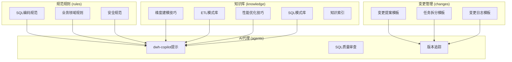

**图表来源**
- [sql-style.md:1-254](file://data_warehouse_engineering_code_copilot/rules/sql-style.md#L1-L254)
- [domain-rules.md:1-142](file://data_warehouse_engineering_code_copilot/rules/domain-rules.md#L1-L142)
- [security.md:1-98](file://data_warehouse_engineering_code_copilot/rules/security.md#L1-L98)

**章节来源**
- [index.md:1-60](file://data_warehouse_engineering_code_copilot/knowledge/index.md#L1-L60)

## 核心组件

### SQL编码规范组件

SQL编码规范组件提供了完整的SQL编写标准，涵盖命名约定、格式规范、编写原则和禁止事项四个维度。

#### 命名约定规范

系统采用统一的命名约定体系，确保表名、字段名和库名的一致性：

| 层级 | 前缀 | 示例 | 说明 |
|------|------|------|------|
| 原始落地 | `ods_` | `ods_mysql_orders` | 业务库镜像 |
| 明细层 | `dwd_` | `dwd_trade_order_di` | 明细事实表 |
| 汇总层 | `dws_` | `dws_user_active_1d` | 轻度汇总表 |
| 应用层 | `ads_` | `ads_sales_dashboard_1d` | 应用层指标表 |
| 维度层 | `dim_` | `dim_user` | 维度表 |

#### 字段命名标准

字段命名采用语义化命名，确保业务含义清晰：
- 金额字段：`*_amt`（DECIMAL(18,4)）
- 数量字段：`*_qty`/`*_cnt`（BIGINT）
- 比率字段：`*_rate`/`*_pct`（DECIMAL(10,6)）
- 布尔字段：`is_*`/`has_*`（BOOLEAN）
- 时间字段：`*_time`（TIMESTAMP）、`*_date`/`*_id`（YYYYMMDD）

**章节来源**
- [sql-style.md:7-94](file://data_warehouse_engineering_code_copilot/rules/sql-style.md#L7-L94)

### 建模与分层规范组件

建模与分层规范组件基于Kimball维度建模理论，提供了完整的数据仓库分层标准：

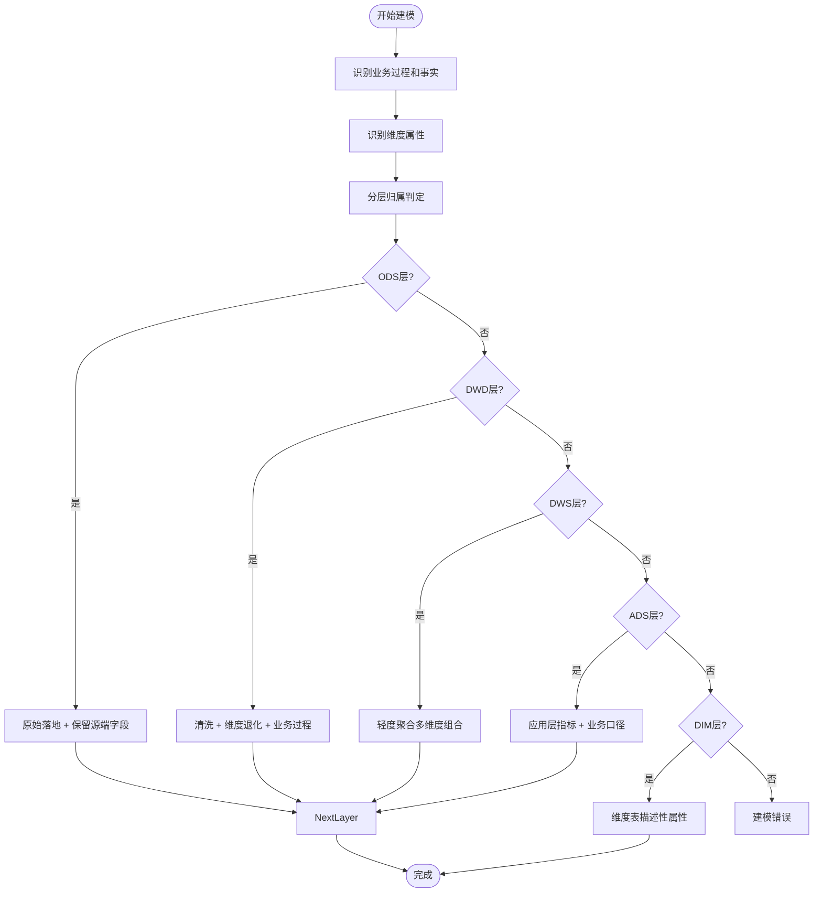

**图表来源**
- [dimension-modeling-tips.md:233-253](file://data_warehouse_engineering_code_copilot/knowledge/dimension-modeling-tips.md#L233-L253)

**章节来源**
- [dimension-modeling-tips.md:233-253](file://data_warehouse_engineering_code_copilot/knowledge/dimension-modeling-tips.md#L233-L253)

### 调度与运维规范组件

调度与运维规范组件提供了完整的作业调度标准和运维流程：

#### 调度时间窗设计

调度系统采用错峰调度策略，避免与数据库备份等系统维护时间冲突：
- 避开0:00-2:00的数据库备份高峰期
- 核心表SLA基线：7:00前必须产出
- 依赖紧凑：上游就绪后立即触发

#### 资源队列管理

按主题和优先级划分资源队列：
- 高优先级任务（核心ADS）独占队列
- 低优先级任务（探索/回刷）共享队列，限制并发

**章节来源**
- [performance-tips.md:308-325](file://data_warehouse_engineering_code_copilot/knowledge/performance-tips.md#L308-L325)

### 数据质量规范组件

数据质量规范组件建立了五维度的质量评估模型：

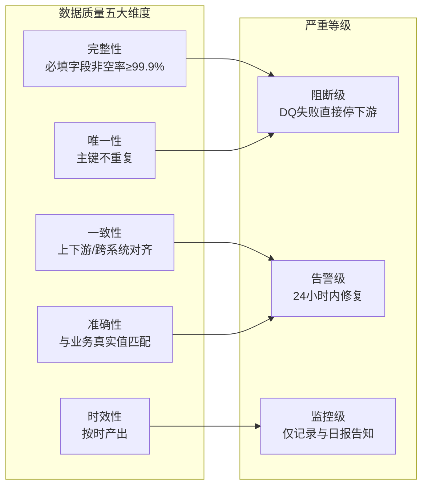

**图表来源**
- [domain-rules.md:69-91](file://data_warehouse_engineering_code_copilot/rules/domain-rules.md#L69-L91)

**章节来源**
- [domain-rules.md:69-91](file://data_warehouse_engineering_code_copilot/rules/domain-rules.md#L69-L91)

### 安全规范组件

安全规范组件涵盖了数据安全、PII处理、行级权限和数据分级等要求：

#### PII处理标准

| 字段类型 | 脱敏方式 | 示例 |
|----------|----------|------|
| 手机号 | 中间4位掩码 | 138****1234 |
| 身份证 | 出生日期段掩码 | 110101********1234 |
| 邮箱 | 用户名前3位+*** | abc***@example.com |
| 银行卡 | 仅末4位 | ************1234 |
| 姓名（中文） | 仅姓+* | 张** |
| 地址 | 区县级以下掩码 | 北京市朝阳区**** |

#### 数据分级管理

| 级别 | 含义 | 示例 | 访问限制 |
|------|------|------|---------|
| L1公开 | 可对外公开 | 公开统计报告 | 无 |
| L2内部 | 公司内部使用 | 业务运营数据 | 公司员工 |
| L3机密 | 部分人员访问 | 财务、薪酬 | 授权岗位 |
| L4高度机密 | 严格管控 | 个人PII/客户隐私 | 必须工单+审计 |

**章节来源**
- [security.md:15-67](file://data_warehouse_engineering_code_copilot/rules/security.md#L15-L67)

## 架构概览

规范约束系统采用分层架构设计，通过AI协作助手统一协调各个组件：

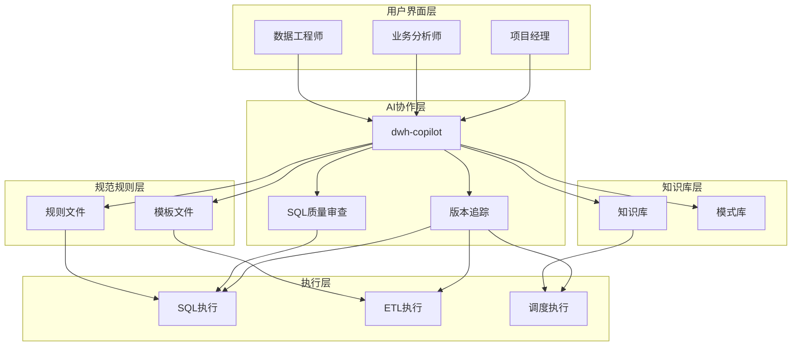

**图表来源**
- [copilot-prompt.md:1-147](file://data_warehouse_engineering_code_copilot/agents/copilot-prompt.md#L1-L147)

**章节来源**
- [copilot-prompt.md:1-147](file://data_warehouse_engineering_code_copilot/agents/copilot-prompt.md#L1-L147)

## 详细组件分析

### SQL编码规范详细分析

#### 格式规范实现

SQL格式规范确保代码的可读性和一致性：

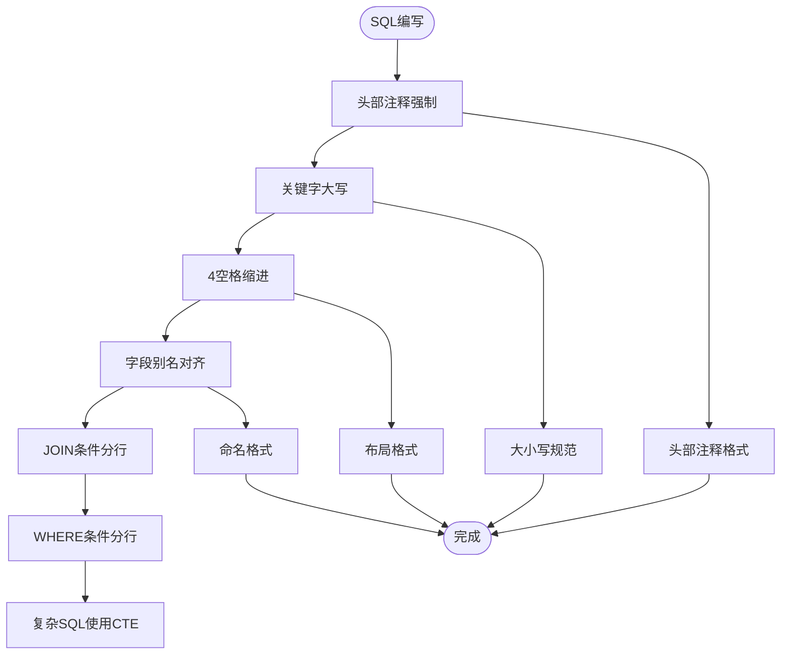

**图表来源**
- [sql-style.md:97-163](file://data_warehouse_engineering_code_copilot/rules/sql-style.md#L97-L163)

**章节来源**
- [sql-style.md:97-163](file://data_warehouse_engineering_code_copilot/rules/sql-style.md#L97-L163)

#### 禁止事项清单

系统明确规定了SQL编写中的禁止事项，确保代码质量和安全性：

| 禁止事项类别 | 具体内容 | 说明 |
|-------------|----------|------|
| 写入方式 | 禁止INSERT INTO写入分区表 | 必须使用INSERT OVERWRITE保证幂等 |
| 表操作 | 禁止在调度脚本中DROP TABLE | 删表必须走运维变更流程 |
| 日期处理 | 禁止在SQL中硬编码业务日期 | 必须使用${bizdate}等变量 |
| 层级引用 | 禁止跨层反向引用 | 如DWD直接读ADS |
| 魔法数字 | 禁止使用未注释的"魔法数字" | 必须有明确业务含义 |
| 调试代码 | 禁止保留SELECT * FROM xxx LIMIT 10等调试代码 | 生产SQL中不允许存在 |

**章节来源**
- [sql-style.md:192-201](file://data_warehouse_engineering_code_copilot/rules/sql-style.md#L192-L201)

### 维度建模技巧详细分析

#### SCD（缓慢变化维）实现

系统支持三种SCD类型，满足不同的业务需求：

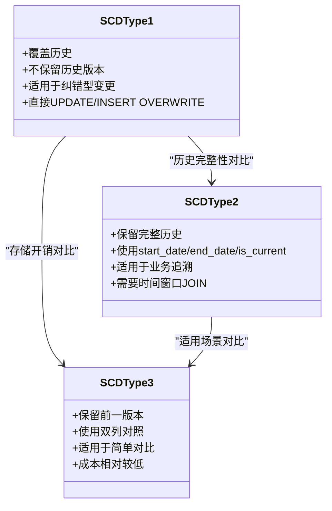

**图表来源**
- [dimension-modeling-tips.md:39-83](file://data_warehouse_engineering_code_copilot/knowledge/dimension-modeling-tips.md#L39-L83)

**章节来源**
- [dimension-modeling-tips.md:39-83](file://data_warehouse_engineering_code_copilot/knowledge/dimension-modeling-tips.md#L39-L83)

#### 桥接表设计

桥接表用于解决多对多和多值维度问题：

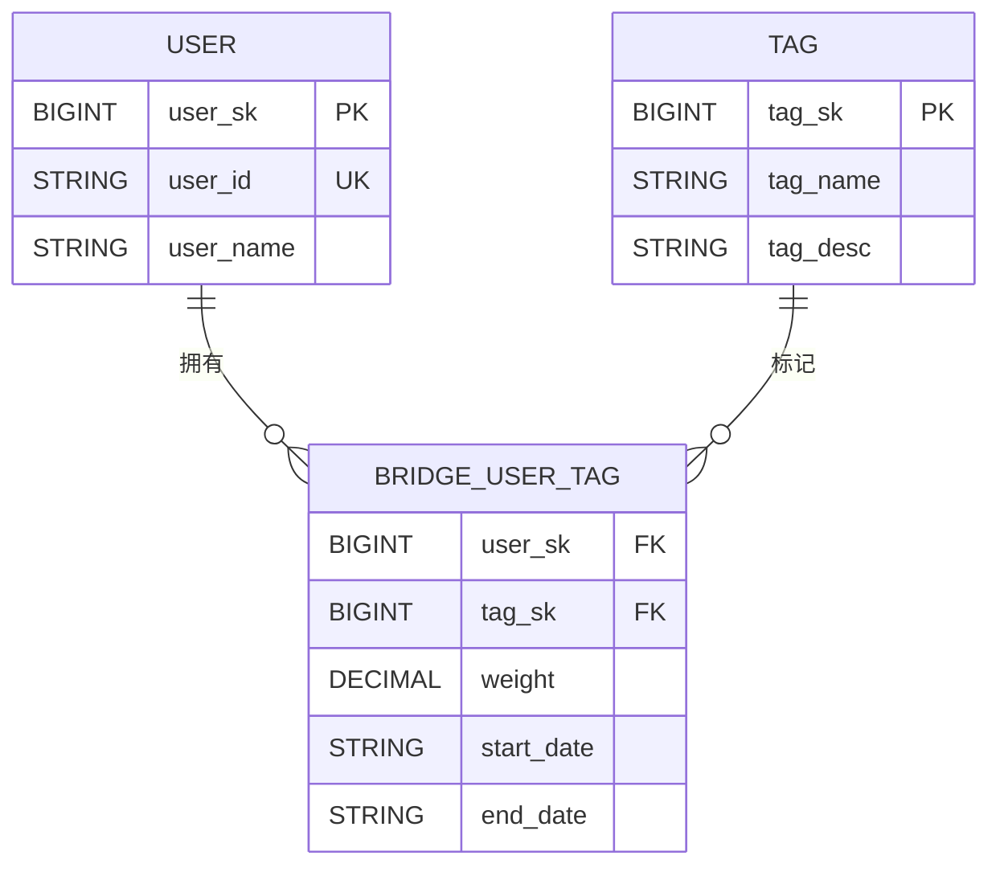

**图表来源**
- [dimension-modeling-tips.md:86-122](file://data_warehouse_engineering_code_copilot/knowledge/dimension-modeling-tips.md#L86-L122)

**章节来源**
- [dimension-modeling-tips.md:86-122](file://data_warehouse_engineering_code_copilot/knowledge/dimension-modeling-tips.md#L86-L122)

### ETL模式库详细分析

#### CDC增量同步模式

系统支持基于Flink CDC的实时增量同步：

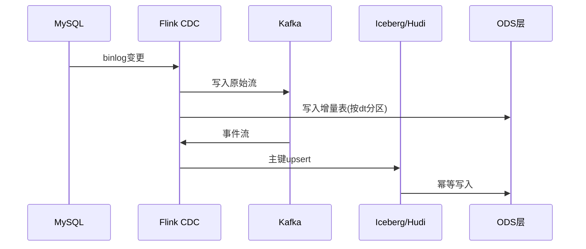

**图表来源**
- [etl-patterns.md:6-27](file://data_warehouse_engineering_code_copilot/knowledge/etl-patterns.md#L6-L27)

**章节来源**
- [etl-patterns.md:6-27](file://data_warehouse_engineering_code_copilot/knowledge/etl-patterns.md#L6-L27)

#### 历史回刷流程

系统提供完整的回刷流程管理：

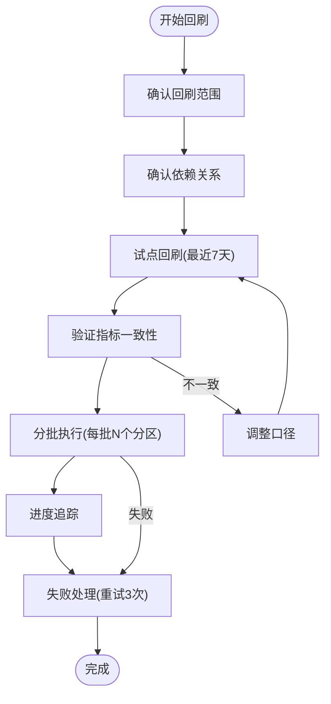

**图表来源**
- [etl-patterns.md:122-152](file://data_warehouse_engineering_code_copilot/knowledge/etl-patterns.md#L122-L152)

**章节来源**
- [etl-patterns.md:122-152](file://data_warehouse_engineering_code_copilot/knowledge/etl-patterns.md#L122-L152)

### 性能优化技巧详细分析

#### 分区裁剪优化

分区裁剪是性能优化的关键：

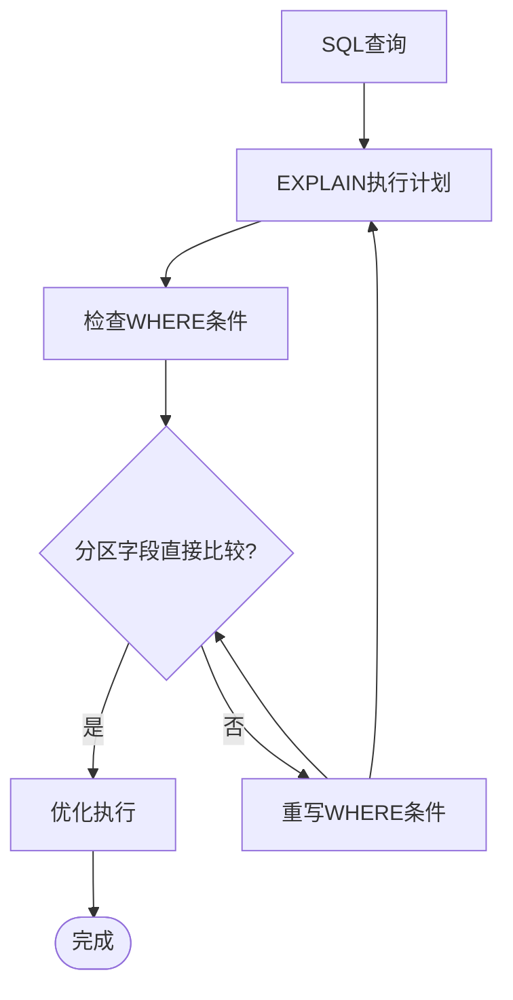

**图表来源**
- [performance-tips.md:5-39](file://data_warehouse_engineering_code_copilot/knowledge/performance-tips.md#L5-L39)

**章节来源**
- [performance-tips.md:5-39](file://data_warehouse_engineering_code_copilot/knowledge/performance-tips.md#L5-L39)

#### 数据倾斜处理

系统提供多种数据倾斜处理方案：

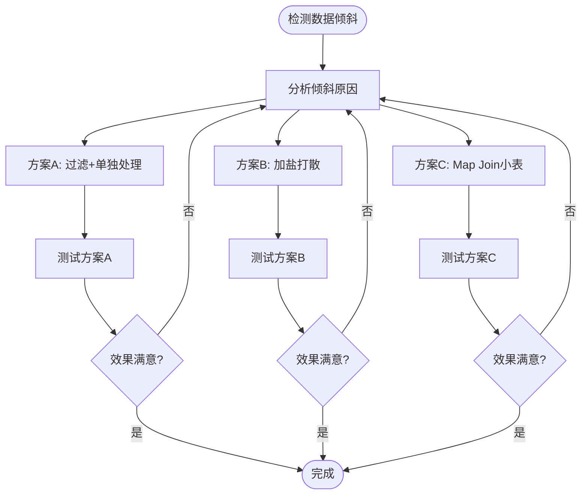

**图表来源**
- [performance-tips.md:42-99](file://data_warehouse_engineering_code_copilot/knowledge/performance-tips.md#L42-L99)

**章节来源**
- [performance-tips.md:42-99](file://data_warehouse_engineering_code_copilot/knowledge/performance-tips.md#L42-L99)

### SQL模式库详细分析

#### 常用SQL模式

系统提供了经过验证的高质量SQL模式：

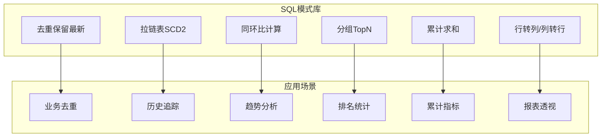

**图表来源**
- [sql-patterns.md:1-331](file://data_warehouse_engineering_code_copilot/knowledge/sql-patterns.md#L1-L331)

**章节来源**
- [sql-patterns.md:1-331](file://data_warehouse_engineering_code_copilot/knowledge/sql-patterns.md#L1-L331)

## 依赖分析

规范约束系统各组件之间存在紧密的依赖关系：

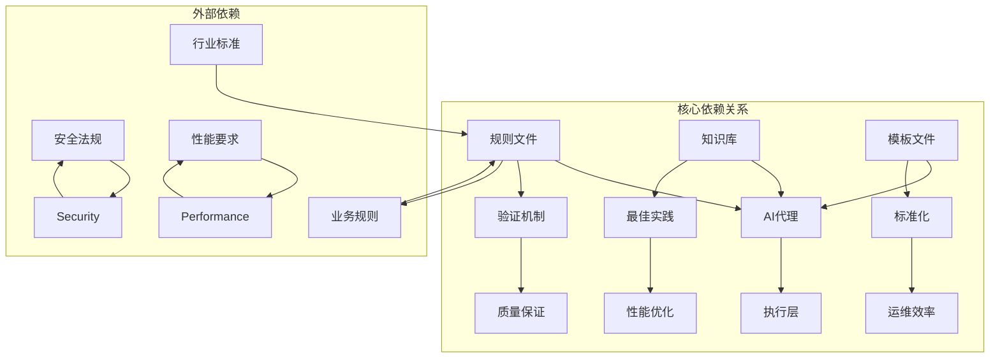

**图表来源**
- [copilot-prompt.md:63-147](file://data_warehouse_engineering_code_copilot/agents/copilot-prompt.md#L63-L147)

**章节来源**
- [copilot-prompt.md:63-147](file://data_warehouse_engineering_code_copilot/agents/copilot-prompt.md#L63-L147)

## 性能考虑

规范约束系统在设计时充分考虑了性能优化要求：

### 性能优化策略

1. **分区裁剪优化**：确保WHERE条件直接命中分区字段
2. **数据倾斜处理**：提供多种倾斜处理方案
3. **内存管理**：合理控制广播表大小，避免Driver OOM
4. **存储格式选择**：推荐使用ORC/Parquet等列存格式
5. **查询优化**：优先使用谓词下推和列裁剪

### 资源管理

- **队列管理**：按优先级划分资源队列
- **并发控制**：限制低优先级任务并发数
- **监控告警**：建立完善的性能监控体系

## 故障排除指南

### 常见问题诊断

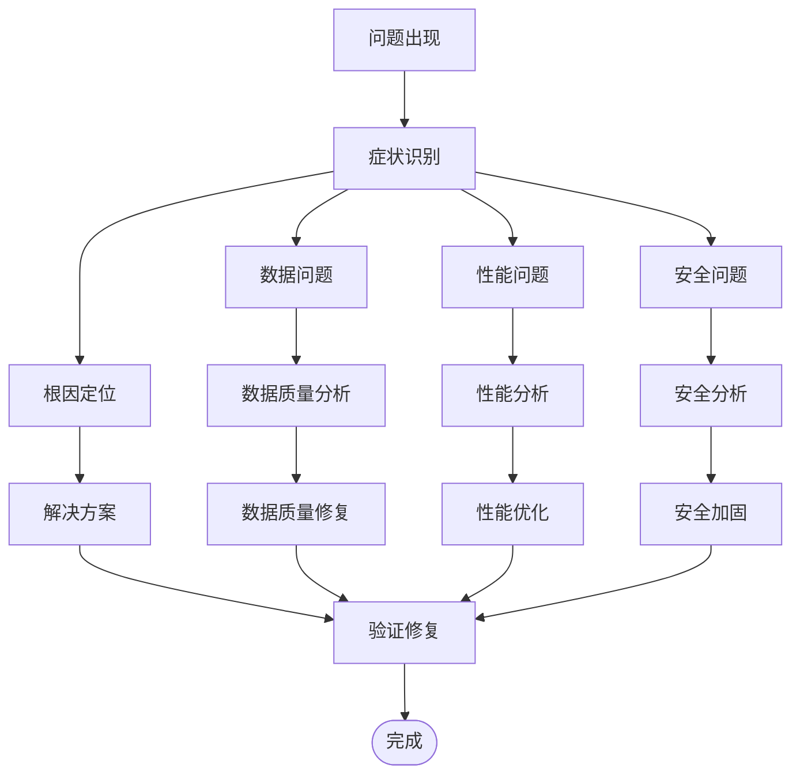

**图表来源**
- [copilot-prompt.md:133-147](file://data_warehouse_engineering_code_copilot/agents/copilot-prompt.md#L133-L147)

### 诊断流程

系统提供四阶段诊断流程：
1. **现象收集**：收集问题详细信息
2. **根因定位**：逐层排查问题根源
3. **方案验证**：验证修复方案有效性
4. **实施修复**：执行修复并监控效果

**章节来源**
- [copilot-prompt.md:133-147](file://data_warehouse_engineering_code_copilot/agents/copilot-prompt.md#L133-L147)

## 结论

规范约束系统通过标准化的规则、规范和流程，为数据仓库项目提供了全面的约束保障。系统的主要优势包括：

1. **完整性**：覆盖SQL编码、建模、调度、安全、质量等各个方面
2. **可执行性**：通过AI代理和模板文件确保规范的有效执行
3. **可维护性**：建立完善的变更管理和知识沉淀机制
4. **可扩展性**：模块化设计支持功能扩展和定制化

通过实施这套规范约束系统，可以显著提升数据仓库项目的质量、效率和安全性，降低项目风险，提高团队协作效率。

## 附录

### 变更管理流程

系统提供完整的变更管理流程，确保所有变更都有据可依：

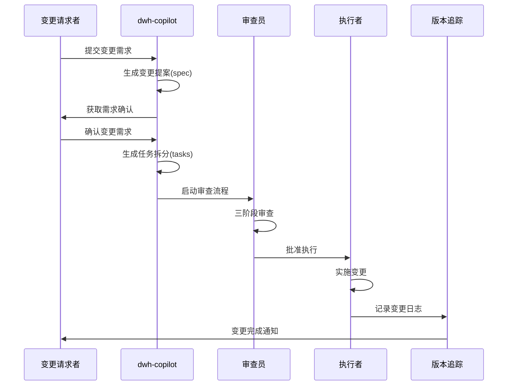

**图表来源**
- [spec.md:1-132](file://data_warehouse_engineering_code_copilot/changes/templates/spec.md#L1-L132)

### 最佳实践建议

1. **规范先行**：在实施任何技术方案前，先制定相应的规范
2. **持续改进**：定期回顾和优化规范，适应业务发展
3. **培训推广**：加强团队对规范的理解和执行
4. **工具支撑**：利用AI代理和自动化工具提升执行效率