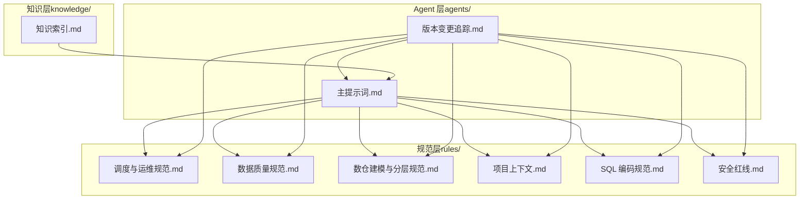
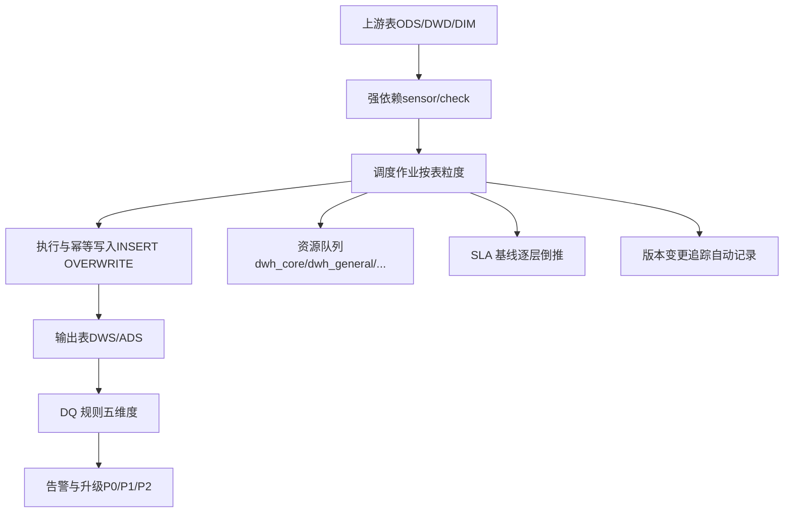
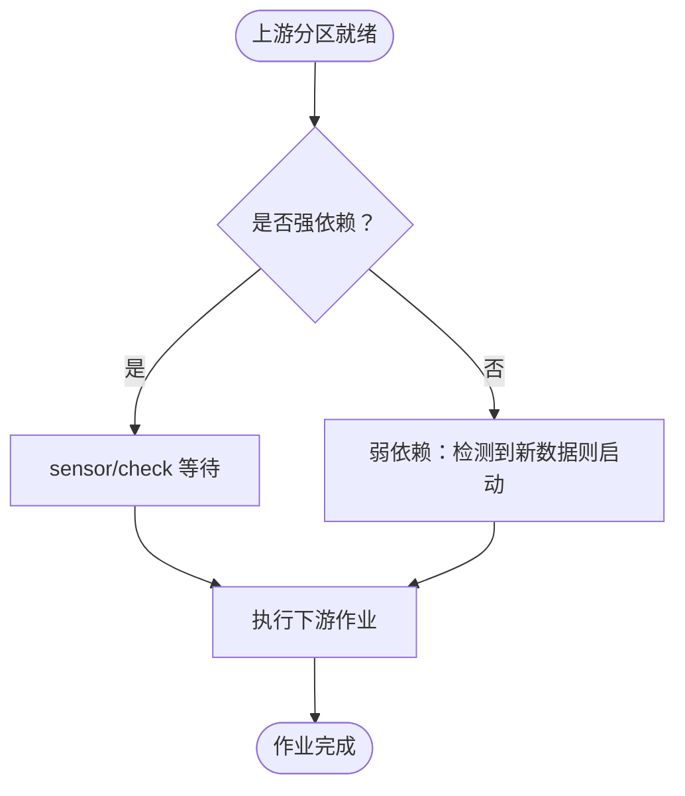
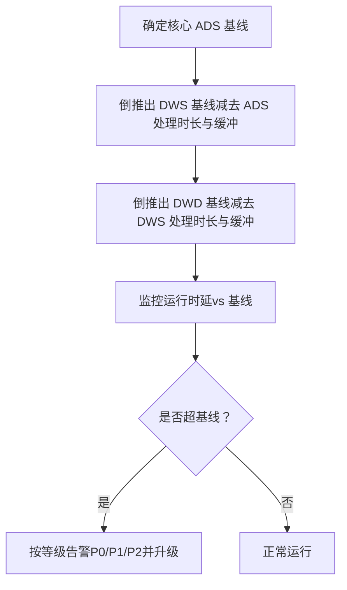
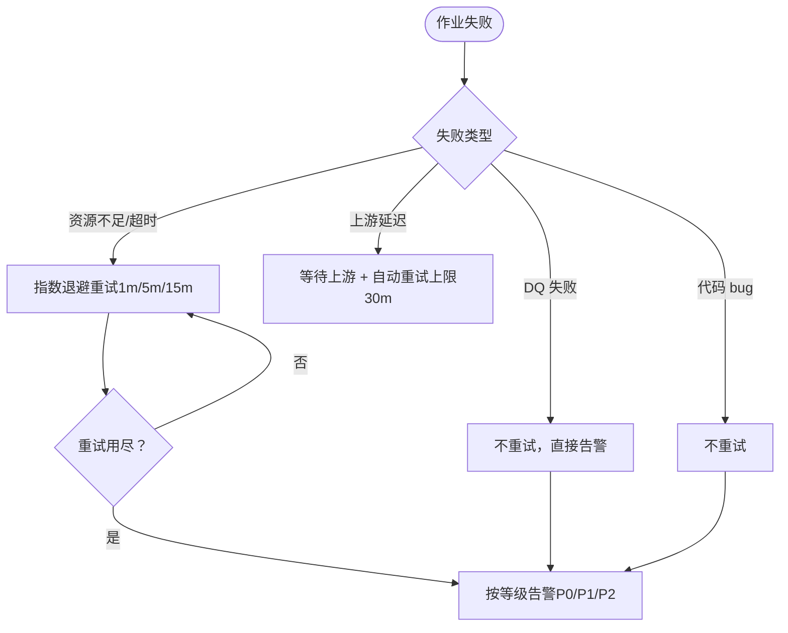
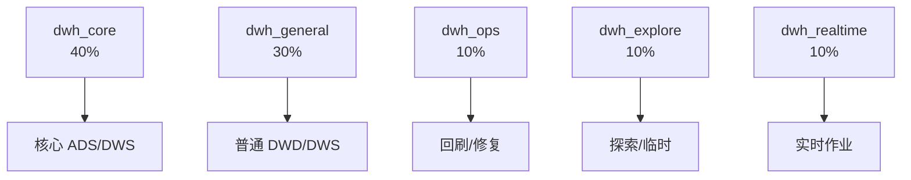
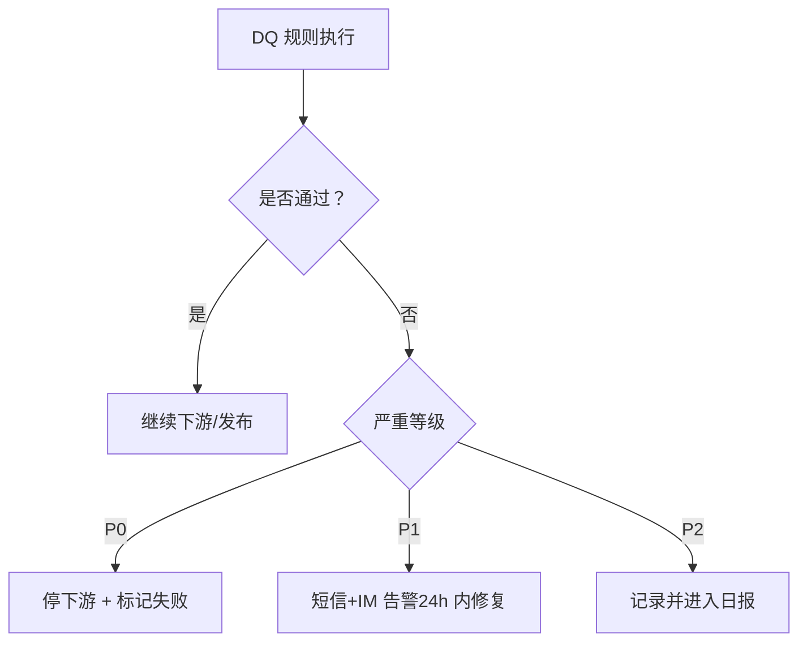
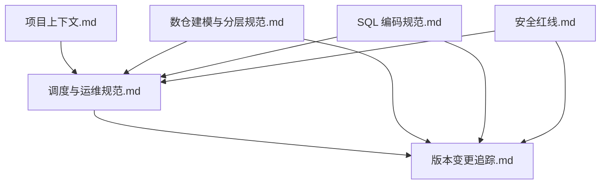

# 调度与运维规范

<cite>
**本文引用的文件**
- [目录结构和设计说明.md](file://目录结构和设计说明.md)
- [调度与运维规范.md](file://rules/scheduling-standards.md)
- [数据质量规范.md](file://rules/data-quality.md)
- [数仓建模与分层规范.md](file://rules/modeling-standards.md)
- [项目上下文.md](file://rules/project-context.md)
- [SQL 编码规范.md](file://rules/sql-style.md)
- [安全红线.md](file://rules/security.md)
- [Agent：主提示词.md](file://agents/copilot-prompt.md)
- [Agent：版本变更追踪.md](file://agents/version-tracker.md)
- [知识索引.md](file://knowledge/index.md)
</cite>

## 目录
1. [简介](#简介)
2. [项目结构](#项目结构)
3. [核心组件](#核心组件)
4. [架构总览](#架构总览)
5. [详细组件分析](#详细组件分析)
6. [依赖分析](#依赖分析)
7. [性能考虑](#性能考虑)
8. [故障排查指南](#故障排查指南)
9. [结论](#结论)
10. [附录](#附录)

## 简介
本文件面向数据仓库工程的调度与运维，系统化阐述作业调度的设计原则、依赖关系、执行顺序与并行度控制；明确 SLA（服务等级协议）的设定与监控要求；制定资源管理规范（CPU、内存、存储）；建立运维监控与告警机制；并提供调度配置最佳实践与故障排查指南。内容以“规范 + 知识 + 变更追踪”三位一体的方式组织，确保调度与运维可审计、可回溯、可演进。

## 项目结构
围绕调度与运维的关键文件与职责如下：
- 规范层（rules/）：提供调度、数据质量、建模、安全等强制约束与最佳实践
- 知识层（knowledge/）：沉淀 SQL 模式、ETL 模式、维度建模技巧、性能优化经验
- Agent 层（agents/）：驱动命令式协作，保障变更即记录、可审计
- 项目上下文（rules/project-context.md）：为调度与运维提供引擎、调度系统、主题域、SLA 等上下文

**图表来源**
- [目录结构和设计说明.md:19-55](file://目录结构和设计说明.md#L19-L55)
- [调度与运维规范.md:1-233](file://rules/scheduling-standards.md#L1-L233)
- [数据质量规范.md:1-195](file://rules/data-quality.md#L1-L195)
- [数仓建模与分层规范.md:1-242](file://rules/modeling-standards.md#L1-L242)
- [项目上下文.md:1-104](file://rules/project-context.md#L1-L104)
- [SQL 编码规范.md:1-254](file://rules/sql-style.md#L1-L254)
- [安全红线.md:1-98](file://rules/security.md#L1-L98)
- [Agent：主提示词.md:1-147](file://agents/copilot-prompt.md#L1-L147)
- [Agent：版本变更追踪.md:1-120](file://agents/version-tracker.md#L1-L120)
- [知识索引.md:1-60](file://knowledge/index.md#L1-L60)

**章节来源**
- [目录结构和设计说明.md:19-55](file://目录结构和设计说明.md#L19-L55)

## 核心组件
- 调度与运维规范：定义调度系统约定、依赖关系、周期、SLA 基线、重试与告警、资源队列、脚本规范、上线流程、监控与可观测性、失败回放与回退
- 数据质量规范：定义 DQ 五维度、规则模板、严重等级、上线流程、规则文件结构与历史趋势
- 数仓建模与分层规范：定义分层架构、模型与表类型、事实/维度设计、物理设计、指标分级与口径对齐
- 项目上下文：提供引擎、调度系统、主题域、核心表、关键 ADS、SLA 等上下文
- SQL 编码规范：统一命名、格式、性能与正确性原则，以及禁止事项
- 安全红线：数据安全、字段级脱敏、行级权限、数据分级、上线与发布安全、跨境合规、安全审计与应急响应
- Agent：主提示词与版本变更追踪，确保每次变更可审计、可回溯

**章节来源**
- [调度与运维规范.md:1-233](file://rules/scheduling-standards.md#L1-L233)
- [数据质量规范.md:1-195](file://rules/data-quality.md#L1-L195)
- [数仓建模与分层规范.md:1-242](file://rules/modeling-standards.md#L1-L242)
- [项目上下文.md:1-104](file://rules/project-context.md#L1-L104)
- [SQL 编码规范.md:1-254](file://rules/sql-style.md#L1-L254)
- [安全红线.md:1-98](file://rules/security.md#L1-L98)
- [Agent：主提示词.md:1-147](file://agents/copilot-prompt.md#L1-L147)
- [Agent：版本变更追踪.md:1-120](file://agents/version-tracker.md#L1-L120)

## 架构总览
调度与运维体系以“规范驱动 + 知识复用 + 变更可审计”为核心，围绕以下关键要素协同：
- 以“上游就绪触发”的强依赖为主，弱依赖为辅，避免固定时间耦合
- 以 SLA 倒推各层基线，形成“核心 ADS → DWS → DWD”的逐层缓冲
- 以资源队列隔离核心、普通、回刷、探索与实时作业
- 以 DQ 五维度与规则模板保障数据质量，P0 阻断、P1 告警、P2 监控
- 以 Agent 自动记录变更，确保可审计、可回溯

**图表来源**
- [调度与运维规范.md:29-135](file://rules/scheduling-standards.md#L29-L135)
- [数据质量规范.md:9-122](file://rules/data-quality.md#L9-L122)
- [Agent：版本变更追踪.md:44-90](file://agents/version-tracker.md#L44-L90)

## 详细组件分析

### 1. 作业依赖关系与执行顺序
- 强依赖：上游表当日分区就绪后才触发下游，跨集群依赖需配置 webhook 或跨集群 sensor
- 弱依赖：仅在上游存在新数据时启动，适用于事件驱动型作业（CDC/实时）
- 依赖配置示例（概念结构）：作业名、调度周期、上游依赖、SLA、重试次数与间隔、优先级、队列、告警接收人

**图表来源**
- [调度与运维规范.md:29-58](file://rules/scheduling-standards.md#L29-L58)

**章节来源**
- [调度与运维规范.md:29-58](file://rules/scheduling-standards.md#L29-L58)

### 2. SLA（服务等级协议）设定与监控
- 基线定义：核心基线决定全公司报表产出时间；业务基线由业务方提出；观察基线用于监控但不告警
- 基线倒推：DWS 基线 = ADS 基线 − ADS 处理时长 − 缓冲；DWD 基线 = DWS 基线 − DWS 处理时长 − 缓冲；每层留 30 分钟缓冲
- 基线告警：基线前 1 小时预警；基线前 30 分钟未启动告警并升级；错过基线启动 RCA
- 时效性规则：当日分区产出时间 ≤ SLA 基线

**图表来源**
- [调度与运维规范.md:74-92](file://rules/scheduling-standards.md#L74-L92)
- [数据质量规范.md:91-100](file://rules/data-quality.md#L91-L100)

**章节来源**
- [调度与运维规范.md:74-92](file://rules/scheduling-standards.md#L74-L92)
- [数据质量规范.md:91-100](file://rules/data-quality.md#L91-L100)

### 3. 重试与告警机制
- 重试策略：资源不足/超时指数退避（1m → 5m → 15m）；上游延迟等待并自动重试（上限 30m）；DQ 失败不重试；代码 bug 不重试
- 告警等级：P0（核心基线失败/数据错误）电话+短信+IM；P1（重要作业失败/SLA 失守）短信+IM；P2（普通作业失败）IM；P3（DQ 告警）邮件/日报
- 告警去重：同作业 5 分钟内仅告警 1 次；上游失败导致下游级联失败仅告警上游；重试中不告警，重试用尽才告警

**图表来源**
- [调度与运维规范.md:94-116](file://rules/scheduling-standards.md#L94-L116)

**章节来源**
- [调度与运维规范.md:94-116](file://rules/scheduling-standards.md#L94-L116)

### 4. 资源管理规范
- 队列划分：核心 ADS/关键 DWS（40%）、普通 DWD/DWS（30%）、回刷/数据修复（10%）、探索/临时查询（10%）、实时作业（10%）
- 资源申请：默认资源规格由模板提供；大型作业（>1TB/>1 小时）需评审申请；紧急回刷使用 dwh_ops 队列
- 调度脚本规范：统一使用调度系统标准变量（bizdate、cyctime 等）；所有写入必须 INSERT OVERWRITE 单分区；禁止 DROP TABLE 出现在调度脚本

**图表来源**
- [调度与运维规范.md:119-135](file://rules/scheduling-standards.md#L119-L135)

**章节来源**
- [调度与运维规范.md:119-166](file://rules/scheduling-standards.md#L119-L166)

### 5. 监控与可观测性
- 必备监控：作业成功率（按层/按主题）、运行时长（P50/P95/异常）、数据产出延迟（vs 基线）、数据量趋势（行数环比/同比）、DQ 通过率、资源消耗趋势
- 异常分析：单作业耗时 > P95×1.5 告警；行数环比下降 > 30%/上升 > 200% 告警；关键字段非空率下降 > 1pp 告警

**章节来源**
- [调度与运维规范.md:188-202](file://rules/scheduling-standards.md#L188-L202)

### 6. 失败回放与回退
- 回放：单分区失败重试或人工补跑；多分区批量失败确认根因后批量回刷；上游补数等上游就绪后人工触发
- 回退：代码 bug 回滚至上一版本并回刷受影响分区；模型 bug 先停下游，修模型后从 DWD 开始回刷；数据错误禁用下游报表并对外说明 ETA

**章节来源**
- [调度与运维规范.md:205-233](file://rules/scheduling-standards.md#L205-L233)

### 7. 数据质量（DQ）与 SLA 的联动
- DQ 五维度：完整性（非空率 ≥ 99.9%）、唯一性（主键唯一）、一致性（跨表/跨系统对齐）、准确性（与业务库直查误差 < 0.5%）、时效性（产出时间 ≤ SLA 基线）
- 严重等级：P0（阻断）→ DQ 失败停下游并标记失败；P1（告警）→ 下游继续运行但需 24 小时内修复；P2（监控）→ 仅记录进入日报
- DQ 规则上线流程：设计 → 实现 → 测试 → 同步上线 → 运营周度 review 与阈值调整

**图表来源**
- [数据质量规范.md:9-122](file://rules/data-quality.md#L9-L122)

**章节来源**
- [数据质量规范.md:9-122](file://rules/data-quality.md#L9-L122)

### 8. 调度脚本规范与幂等保证
- 脚本头：必须包含作业名、用途、调度、上游、下游、责任人
- 变量约定：统一使用 bizdate、bizdate_minus_1、bizdate_plus_1、cyctime、gmtdate 等
- 幂等保证：所有写入使用 INSERT OVERWRITE 单分区；多分区批量写入前校验目标分区是否存在数据；禁止 DROP TABLE 出现在调度脚本

**章节来源**
- [调度与运维规范.md:137-166](file://rules/scheduling-standards.md#L137-L166)

### 9. 上线流程与变更追踪
- 上线流程：代码评审 → 测试环境验证（7 天数据对比基准）→ DQ 规则上线 → 生产首跑 → 历史回刷 → 观察期（7 天人工 review）→ 变更日志
- 变更追踪：每次 DDL/SQL/ETL/调度变更后自动记录结构化条目，包含模块、分层、任务、操作、变更内容、关联文件、回刷范围、影响下游、备注等

**章节来源**
- [调度与运维规范.md:169-186](file://rules/scheduling-standards.md#L169-L186)
- [Agent：版本变更追踪.md:44-90](file://agents/version-tracker.md#L44-L90)

## 依赖分析
- 调度系统与上下文：项目上下文提供调度系统、主题域、核心表、SLA 等，支撑调度与运维规范落地
- 规范与知识：调度与运维规范与建模规范、SQL 规范、安全规范共同构成“强制约束 + 经验复用”
- Agent 与变更追踪：Agent 在每次命令完成后触发版本追踪，确保所有变更可审计、可回溯

**图表来源**
- [项目上下文.md:1-104](file://rules/project-context.md#L1-L104)
- [调度与运维规范.md:1-233](file://rules/scheduling-standards.md#L1-L233)
- [数仓建模与分层规范.md:1-242](file://rules/modeling-standards.md#L1-L242)
- [SQL 编码规范.md:1-254](file://rules/sql-style.md#L1-L254)
- [安全红线.md:1-98](file://rules/security.md#L1-L98)
- [Agent：版本变更追踪.md:1-120](file://agents/version-tracker.md#L1-L120)

**章节来源**
- [项目上下文.md:1-104](file://rules/project-context.md#L1-L104)
- [Agent：版本变更追踪.md:1-120](file://agents/version-tracker.md#L1-L120)

## 性能考虑
- 分区裁剪与分区字段：大型分区表必须有分区裁剪；分区字段统一 dt（YYYYMMDD），小时分区使用 dh（YYYYMMDDHH）
- Join 顺序与广播：大表在前、小表在后；小表可广播加速；避免函数包裹分区字段阻断裁剪
- 聚合与物化：优先 GROUP BY 替代 DISTINCT；CTE 可物化为临时表；避免最外层不必要的 ORDER BY
- 存储格式与压缩：大表优先 ORC/Parquet，ZSTD 优先，Snappy 次之；临时表使用 Parquet+Snappy

**章节来源**
- [SQL 编码规范.md:165-190](file://rules/sql-style.md#L165-L190)
- [数仓建模与分层规范.md:171-193](file://rules/modeling-standards.md#L171-L193)

## 故障排查指南
- 现象收集 → 根因定位 → 方案验证 → 实施修复（四阶段）
- 诊断层级：数据源层 → 抽取层 → ODS/DWD/DWS/ADS → 应用层；逐层确认结构变更、同步成功性、分区完整性、口径一致性与下游消费
- 常见问题与处置：
  - 上游延迟：等待上游就绪并自动重试（上限 30m）
  - 资源不足/超时：指数退避重试（1m/5m/15m），必要时提升队列或资源
  - DQ 失败：P0 阻断下游；P1 告警并 24h 内修复；P2 记录并进入日报
  - 代码 bug：回滚至上一版本并回刷受影响分区
  - 模型 bug：先停下游，修模型后从 DWD 开始回刷
  - 数据错误：禁用下游报表并对外说明 ETA

**章节来源**
- [Agent：主提示词.md:133-147](file://agents/copilot-prompt.md#L133-L147)
- [调度与运维规范.md:94-116](file://rules/scheduling-standards.md#L94-L116)
- [调度与运维规范.md:205-233](file://rules/scheduling-standards.md#L205-L233)

## 结论
本规范以“上游就绪触发 + SLA 倒推 + 资源队列隔离 + DQ 五维度 + 变更可审计”为主线，构建了数据仓库调度与运维的闭环体系。通过严格的依赖管理、重试与告警策略、资源与存储优化、监控与可观测性，以及标准化的上线与回放/回退流程，确保数据仓库在高可靠、高性能、可治理的前提下持续交付价值。

## 附录
- 调度配置最佳实践
  - 一张表 = 一个调度作业；作业名 = 输出表名；严格基于上游完成度触发
  - 统一使用调度系统标准变量；所有写入使用 INSERT OVERWRITE 单分区
  - 为关键作业配置 SLA、重试与告警；核心作业进入 dwh_core 队列
- 变更追踪最佳实践
  - 每次 DDL/SQL/ETL/调度变更后触发版本追踪；条目必须精确到对象名称与文件路径
  - 任务可追溯、下游必标注、回刷必声明、时间精确到分钟

**章节来源**
- [调度与运维规范.md:9-26](file://rules/scheduling-standards.md#L9-L26)
- [调度与运维规范.md:137-166](file://rules/scheduling-standards.md#L137-L166)
- [Agent：版本变更追踪.md:44-90](file://agents/version-tracker.md#L44-L90)