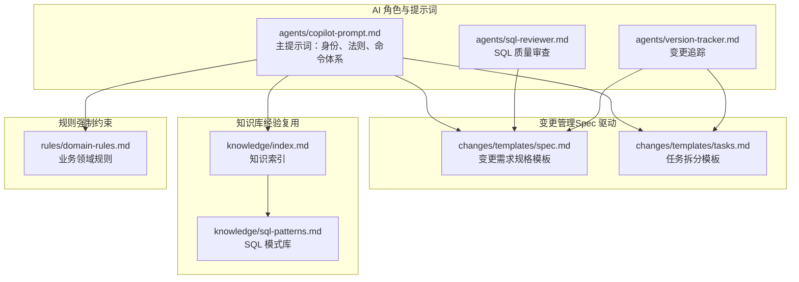
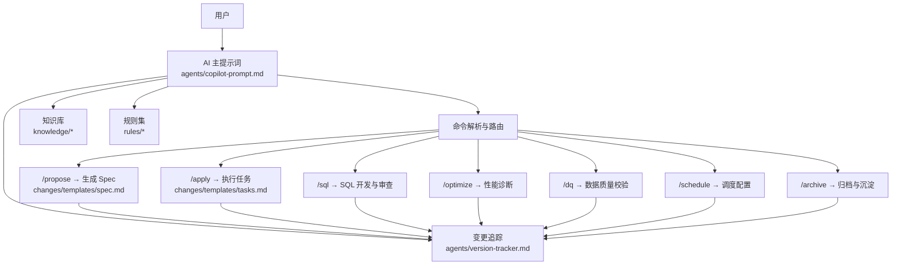
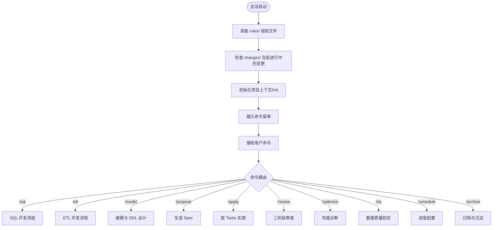
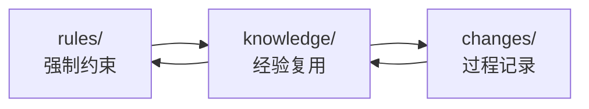
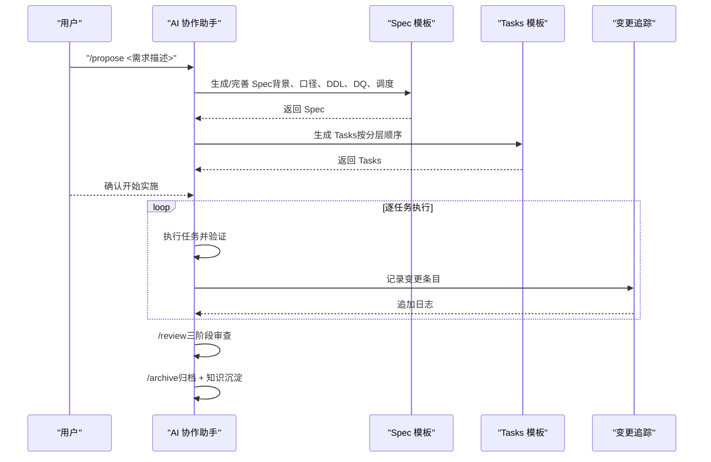
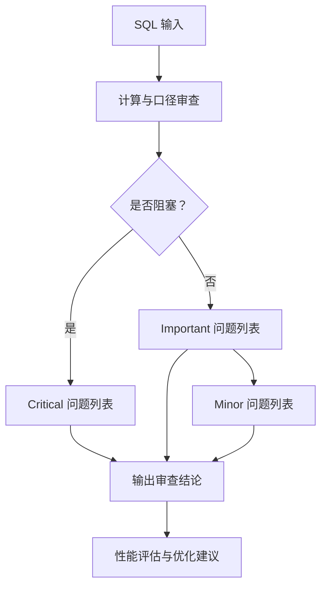
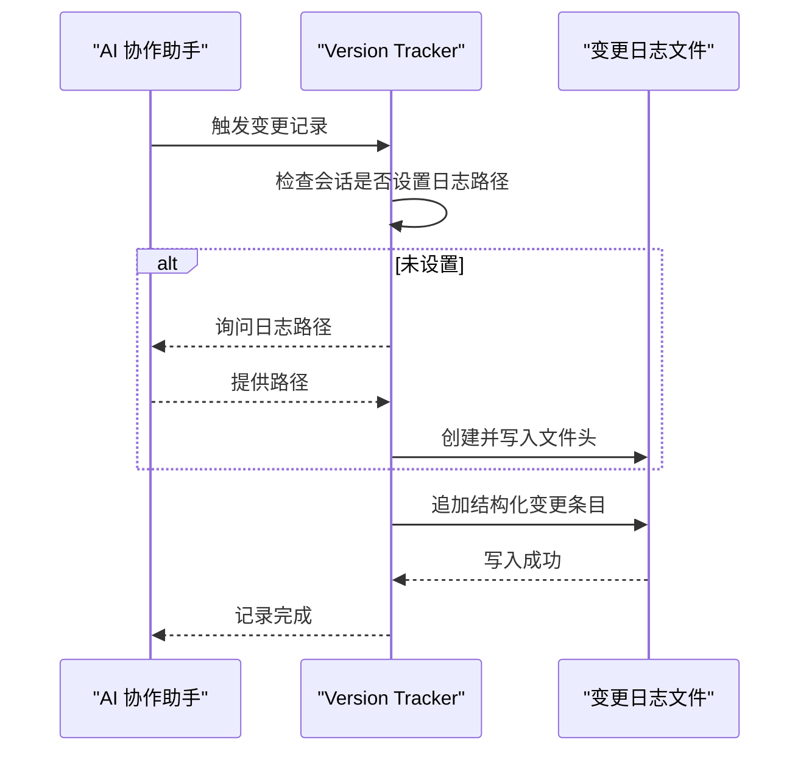
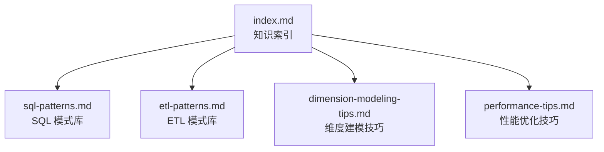
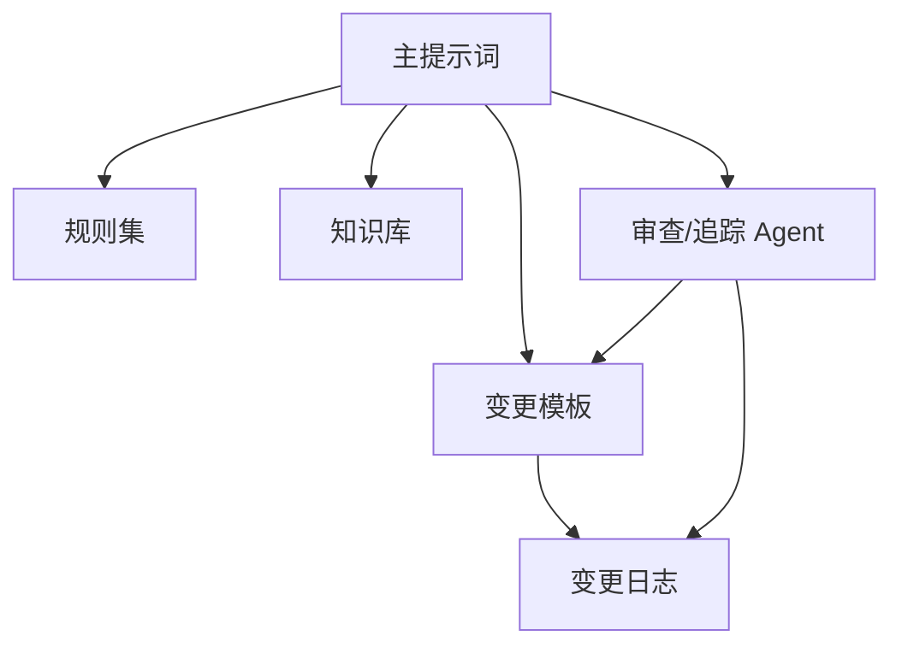

# 项目概述

<cite>
**本文引用的文件**
- [目录结构和设计说明.md](file://目录结构和设计说明.md)
- [copilot-prompt.md](file://agents/copilot-prompt.md)
- [sql-reviewer.md](file://agents/sql-reviewer.md)
- [version-tracker.md](file://agents/version-tracker.md)
- [spec.md](file://changes/templates/spec.md)
- [tasks.md](file://changes/templates/tasks.md)
- [index.md](file://knowledge/index.md)
- [sql-patterns.md](file://knowledge/sql-patterns.md)
- [domain-rules.md](file://rules/domain-rules.md)
</cite>

## 目录
1. [简介](#简介)
2. [项目结构](#项目结构)
3. [核心组件](#核心组件)
4. [架构总览](#架构总览)
5. [详细组件分析](#详细组件分析)
6. [依赖关系分析](#依赖关系分析)
7. [性能考量](#性能考量)
8. [故障排查指南](#故障排查指南)
9. [结论](#结论)
10. [附录](#附录)

## 简介
本项目“数据仓库工程协作助手”是一个面向数据仓库（Data Warehouse）开发场景的 AI 协作框架，旨在将“规范、流程、知识”三者系统化地注入到 AI 编码助手之中，帮助团队在数仓开发中实现：
- 规范化协作：统一 SQL、建模、调度、安全等规范
- 流程化管控：从需求到上线的完整闭环（需求 → Spec → 任务 → 实施 → 审查 → 归档）
- 知识复用：沉淀可复用的 SQL 模式、ETL 模式、建模技巧与性能优化经验
- 强制变更追踪：对 DDL、SQL、ETL、调度等变更进行可审计、可回溯的结构化记录

项目的核心理念是“Spec 驱动 + 三段式知识结构 + 强制变更追踪”，并通过命令式协作（/sql、/etl、/model、/propose、/apply、/review、/optimize、/dq、/schedule、/archive）确保 AI 在固定流程内高效工作，避免发散与遗漏。

## 项目结构
项目采用“提示词工程 + 模板 + 知识库 + 规则”的组织方式，围绕 AI 协作助手构建工程化提示词与工作流。

图表来源
- [目录结构和设计说明.md:19-55](file://目录结构和设计说明.md#L19-L55)
- [copilot-prompt.md:1-147](file://agents/copilot-prompt.md#L1-L147)
- [sql-reviewer.md:1-68](file://agents/sql-reviewer.md#L1-L68)
- [version-tracker.md:1-120](file://agents/version-tracker.md#L1-L120)
- [spec.md:1-132](file://changes/templates/spec.md#L1-L132)
- [tasks.md:1-74](file://changes/templates/tasks.md#L1-L74)
- [index.md:1-60](file://knowledge/index.md#L1-L60)
- [sql-patterns.md:1-200](file://knowledge/sql-patterns.md#L1-L200)
- [domain-rules.md:1-142](file://rules/domain-rules.md#L1-L142)

章节来源
- [目录结构和设计说明.md:19-55](file://目录结构和设计说明.md#L19-L55)

## 核心组件
- 主提示词与命令体系：定义 AI 的身份、法则、回答框架与命令映射，确保每次协作都有明确的输入输出与流程约束。
- 变更模板：通过 Spec 与 Tasks 模板，将需求转化为可执行、可验证、可审计的变更计划。
- 知识库：沉淀 SQL 模式、ETL 模式、建模技巧与性能优化经验，支持快速检索与复用。
- 规则集：覆盖建模分层、SQL 编码、调度与运维、数据质量、安全等强制约束，保障工程化质量。
- 变更追踪：在关键节点自动记录结构化变更日志，确保所有变更可审计、可回溯。

章节来源
- [copilot-prompt.md:1-147](file://agents/copilot-prompt.md#L1-L147)
- [spec.md:1-132](file://changes/templates/spec.md#L1-L132)
- [tasks.md:1-74](file://changes/templates/tasks.md#L1-L74)
- [index.md:1-60](file://knowledge/index.md#L1-L60)
- [domain-rules.md:1-142](file://rules/domain-rules.md#L1-L142)
- [version-tracker.md:1-120](file://agents/version-tracker.md#L1-L120)

## 架构总览
整体架构围绕“提示词驱动 + 模板化流程 + 知识复用 + 规则约束 + 变更追踪”展开，形成“需求—Spec—任务—实施—审查—归档”的闭环。

图表来源
- [目录结构和设计说明.md:80-123](file://目录结构和设计说明.md#L80-L123)
- [copilot-prompt.md:63-147](file://agents/copilot-prompt.md#L63-L147)
- [version-tracker.md:5-15](file://agents/version-tracker.md#L5-L15)
- [spec.md:1-132](file://changes/templates/spec.md#L1-L132)
- [tasks.md:1-74](file://changes/templates/tasks.md#L1-L74)

## 详细组件分析

### 组件 A：主提示词与命令体系（agents/copilot-prompt.md）
- 身份与原则：强调“顶尖数仓工程师搭档”，技术术语保留英文，不确定就问，不编造不存在的对象。
- 核心法则：Spec 驱动四条铁律（No Spec, No Change；Spec is Truth；Reverse Sync；变更即记录）。
- 回答框架：问题理解 → 现状分析 → 方案设计 → 具体实现 → 验证方法 → 性能与成本考量 → 注意事项。
- 命令体系：覆盖 SQL、ETL、建模、提案、实施、审查、优化、数据质量、调度、归档等全流程命令。
- 启动流程：会话开始时自动读取 rules/ 与 changes/，并展示命令菜单。

图表来源
- [copilot-prompt.md:55-147](file://agents/copilot-prompt.md#L55-L147)

章节来源
- [copilot-prompt.md:1-147](file://agents/copilot-prompt.md#L1-L147)

### 组件 B：三段式知识结构（rules/knowledge/changes）
- rules/：强制约束（建模分层、SQL 编码、调度与运维、数据质量、安全、业务领域规则）。
- knowledge/：经验复用（SQL 模式、ETL 模式、维度建模技巧、性能优化、业务知识、技术约定、踩坑记录）。
- changes/：过程记录（Spec、Tasks、Log、Validation Spec），形成“实践 → 知识发现 → 归档沉淀 → 复用”的知识飞轮。

图表来源
- [目录结构和设计说明.md:70-78](file://目录结构和设计说明.md#L70-L78)
- [index.md:1-60](file://knowledge/index.md#L1-L60)
- [domain-rules.md:1-142](file://rules/domain-rules.md#L1-L142)

章节来源
- [目录结构和设计说明.md:70-78](file://目录结构和设计说明.md#L70-L78)
- [index.md:1-60](file://knowledge/index.md#L1-L60)
- [domain-rules.md:1-142](file://rules/domain-rules.md#L1-L142)

### 组件 C：Spec 驱动的变更管理模式
- Spec 模板：覆盖背景与目标、现状分析、功能点、业务规则与口径、模型变更（DDL）、SQL 加工设计、ETL/同步变更、调度变更、数据质量规则、影响范围、风险与关注点、验证策略、技术决策、执行日志、审查结论、确认记录等。
- Tasks 模板：按 ODS→DIM→DWD→DWS→ADS 的分层顺序拆分任务，每个任务为可独立验证的原子变更，明确 DDL/SQL/ETL/调度涉及对象、关键逻辑、依赖、验收标准与验证方法、回刷计划等。

图表来源
- [spec.md:1-132](file://changes/templates/spec.md#L1-L132)
- [tasks.md:1-74](file://changes/templates/tasks.md#L1-L74)
- [version-tracker.md:5-15](file://agents/version-tracker.md#L5-L15)

章节来源
- [spec.md:1-132](file://changes/templates/spec.md#L1-L132)
- [tasks.md:1-74](file://changes/templates/tasks.md#L1-L74)

### 组件 D：AI 审查与质量保障
- SQL 质量审查：涵盖计算结果错误、Join 笛卡尔积、全表扫描、重复键、回刷幂等性、PII 脱敏等 Critical 问题，以及可读性、类型转换、分区裁剪、字段别名等 Important/Minor 问题。
- 性能审查清单：分区裁剪、Join 顺序、Map/Broadcast Join、数据倾斜、聚合下推、SELECT *、ORDER BY、DISTINCT 与 GROUP BY 替代、窗口函数分区合理性、CTE 物化策略等。

图表来源
- [sql-reviewer.md:1-68](file://agents/sql-reviewer.md#L1-L68)

章节来源
- [sql-reviewer.md:1-68](file://agents/sql-reviewer.md#L1-L68)

### 组件 E：强制变更追踪（agents/version-tracker.md）
- 触发时机：/sql、/etl、/model、/schedule、/dq、/apply 每个任务完成后、用户手动记录等。
- 记录格式：时间（精确到分）、模块、分层、任务、操作、变更内容、关联文件、回刷范围、影响下游、备注。
- 记录规则：原子化、精确引用、任务可追溯、下游必标注、回刷必声明、时间精确到分钟、不阻塞主流程。

图表来源
- [version-tracker.md:5-15](file://agents/version-tracker.md#L5-L15)
- [version-tracker.md:44-64](file://agents/version-tracker.md#L44-L64)
- [version-tracker.md:80-89](file://agents/version-tracker.md#L80-L89)

章节来源
- [version-tracker.md:1-120](file://agents/version-tracker.md#L1-L120)

### 组件 F：知识库与模式复用（knowledge/）
- 索引：一句话索引，便于 AI 快速命中 SQL 模式、ETL 模式、维度建模技巧、性能优化技巧、业务知识、技术约定、踩坑记录。
- SQL 模式库：去重保留最新、拉链表（SCD2）、同环比、TopN、累计求和、行转列/列转行等，覆盖常见场景与性能说明。
- ETL 模式库：CDC 增量同步、JDBC 增量抽取、MERGE/UPSERT、小文件合并、历史回刷等。
- 维度建模技巧：代理键 vs 业务键、SCD 全策略、桥接表、退化维度、一致性维度、快照事实表等。
- 性能优化技巧：分区裁剪、数据倾斜、Map Join、广播阈值、小文件合并、CTE 物化等。

图表来源
- [index.md:1-60](file://knowledge/index.md#L1-L60)
- [sql-patterns.md:1-200](file://knowledge/sql-patterns.md#L1-L200)

章节来源
- [index.md:1-60](file://knowledge/index.md#L1-L60)
- [sql-patterns.md:1-200](file://knowledge/sql-patterns.md#L1-L200)

### 组件 G：规则与约束（rules/）
- 业务领域规则：金额精度、百分比格式、同比/环比口径、排名与排序键、状态颜色、KPI 定义标准、数据质量五大维度、历史数据约定、行业特定规则、跨系统一致性、项目特定规则等。
- 建模与分层规范、SQL 编码规范、调度与运维规范、数据质量规范、安全红线等，确保工程化质量与合规。

章节来源
- [domain-rules.md:1-142](file://rules/domain-rules.md#L1-L142)

### 组件 H：典型工作流（场景 A：新建数据需求；场景 B：性能优化）
- 场景 A：用户提出需求 → AI 识别为 /propose → Research + 逐项澄清 → 生成 Spec 与 Tasks → 硬性 Gate 确认 → /apply 逐任务实施 → 每任务完成后验证与变更记录 → /review 三阶段审查 → /archive 归档与沉淀。
- 场景 B：用户反馈性能问题 → AI 走 /optimize → 五层诊断（数据源→抽取→数仓→SQL→应用）→ 根因定位与优化建议 → 触发变更记录 → 沉淀到知识库。

章节来源
- [目录结构和设计说明.md:126-166](file://目录结构和设计说明.md#L126-L166)

## 依赖关系分析
- 组件耦合与内聚：主提示词（agents/copilot-prompt.md）是中枢，协调各 Agent 与模板；变更追踪贯穿所有关键操作；知识库与规则为 AI 提供上下文与约束。
- 直接依赖：
  - 主提示词依赖规则集与知识库，用于回答与建议。
  - 变更追踪依赖 Spec/Tasks 模板与日志路径。
  - 审查 Agent 依赖规则集与模板，提供质量把关。
- 外部依赖与集成点：
  - 可扩展集成数据血缘平台（DataHub/OpenMetadata）进行变更影响分析自动化。
  - 可集成 dbt/SQLMesh 自动生成模型与测试。
  - 可扩展实时数仓（Flink）、湖仓一体（Iceberg/Hudi/Delta）、成本优化（按量计费）专题。

图表来源
- [目录结构和设计说明.md:196-204](file://目录结构和设计说明.md#L196-L204)
- [copilot-prompt.md:55-147](file://agents/copilot-prompt.md#L55-L147)
- [version-tracker.md:5-15](file://agents/version-tracker.md#L5-L15)

章节来源
- [目录结构和设计说明.md:196-204](file://目录结构和设计说明.md#L196-L204)

## 性能考量
- 分区裁剪：WHERE 条件直接命中分区字段，禁止函数包裹，避免全表扫描。
- Join 顺序与广播：大表在前、小表广播；根据引擎阈值选择 Map/Broadcast Join。
- 数据倾斜：高频空值/默认值加盐打散或拆分 SQL；窗口函数分区避免单分区过大。
- 小文件合并：通过 distribute by + reduce 数控制，降低小文件数量。
- CTE 物化：依据引擎策略决定是否物化 WITH 语句，减少重复计算。
- 性能评估：量化优化前后的扫描量、运行耗时、资源消耗与成本，形成可复用的性能优化经验。

章节来源
- [sql-reviewer.md:31-42](file://agents/sql-reviewer.md#L31-L42)
- [sql-patterns.md:37-40](file://knowledge/sql-patterns.md#L37-L40)
- [sql-patterns.md:92-94](file://knowledge/sql-patterns.md#L92-L94)
- [sql-patterns.md:166-168](file://knowledge/sql-patterns.md#L166-L168)

## 故障排查指南
- 调试流程：现象收集 → 根因定位 → 方案验证 → 实施修复，禁止在未确认根因前直接修改。
- 诊断层级：数据源层 → 抽取层 → ODS/DWD/DWS/ADS 层 → 应用层，逐层定位问题。
- 变更追踪：每次 DDL/SQL/ETL/调度变更后必须记录，确保可审计、可回溯。
- 审查流程：三阶段审查（Spec 合规 → 模型质量 → SQL 质量），不通过不进入下一阶段。

章节来源
- [copilot-prompt.md:133-147](file://agents/copilot-prompt.md#L133-L147)
- [version-tracker.md:5-15](file://agents/version-tracker.md#L5-L15)
- [sql-reviewer.md:1-68](file://agents/sql-reviewer.md#L1-L68)

## 结论
本项目通过“Spec 驱动 + 三段式知识结构 + 强制变更追踪”的工程化设计，将 AI 协作助手从“智能工具”升级为“规范执行者与流程守护者”。它不仅提升了数据仓库开发的标准化程度与可复用性，还通过严格的审查与追踪机制保障了质量与可审计性。相较传统开发方式，本框架在流程管控、知识沉淀与工程化落地方面具备显著优势，适合在规模化团队与复杂数据管线中推广使用。

## 附录
- 与 Power BI 协作助手的差异：本项目将 Power BI 的 DAX/Power Query 替换为 SQL（Hive/Spark/MaxCompute）/ETL，模型替换为数仓分层 + 维度建模，可视化替换为 ADS 表 + 调度 + DQ，安全替换为 RLS + 字段脱敏 + 数据分级。
- 使用方式：将项目目录加载到 AI 编码助手工作区，AI 阅读主提示词，会话开始时自动扫描 rules/ 与 changes/，通过命令开展协作，首次使用执行 /init 初始化项目上下文。

章节来源
- [目录结构和设计说明.md:170-193](file://目录结构和设计说明.md#L170-L193)