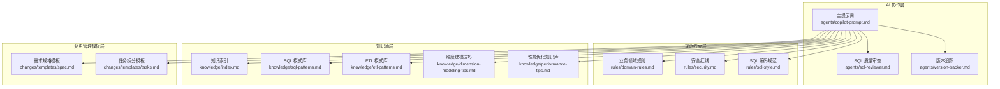
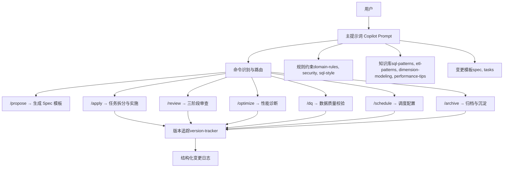
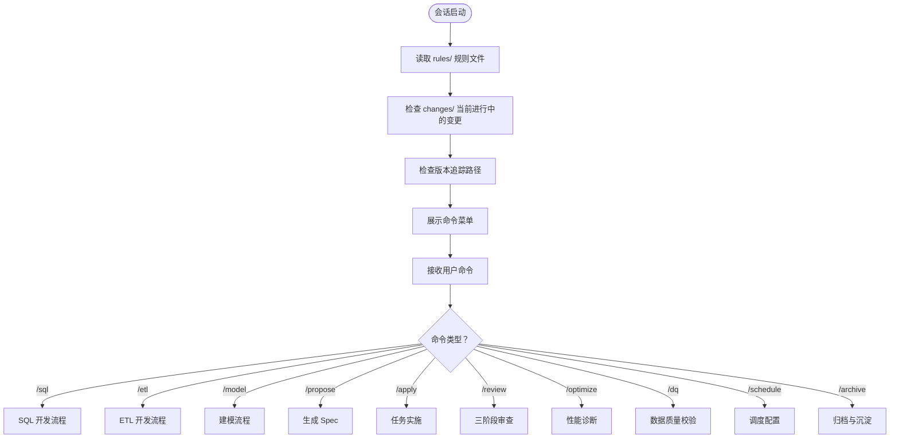
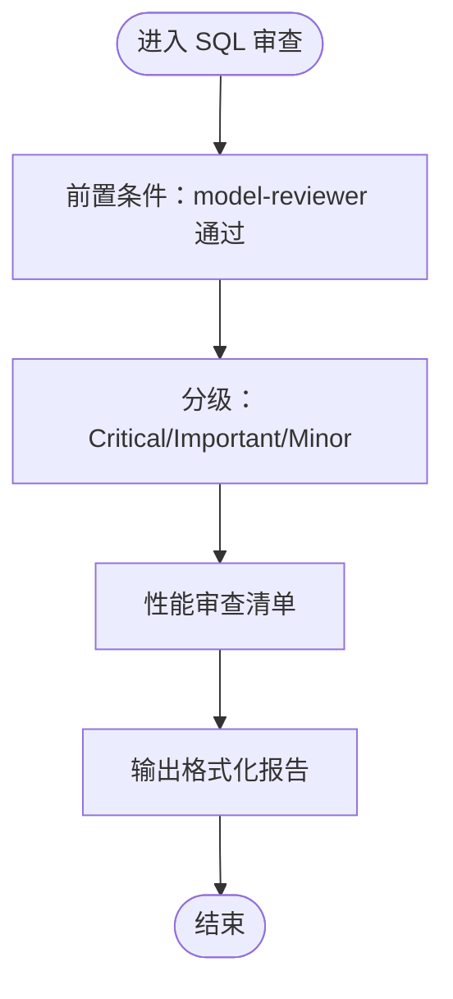
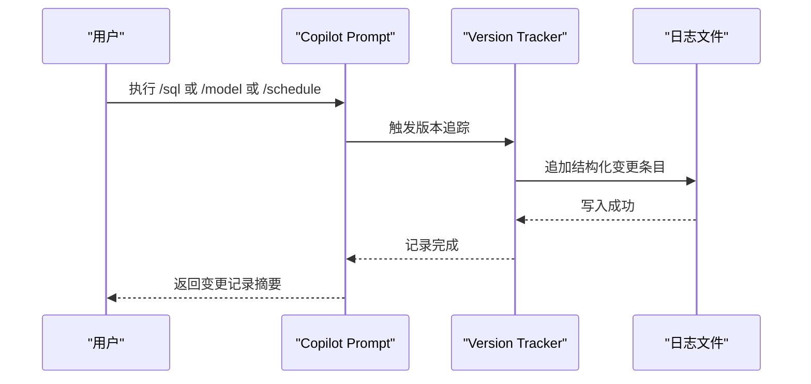
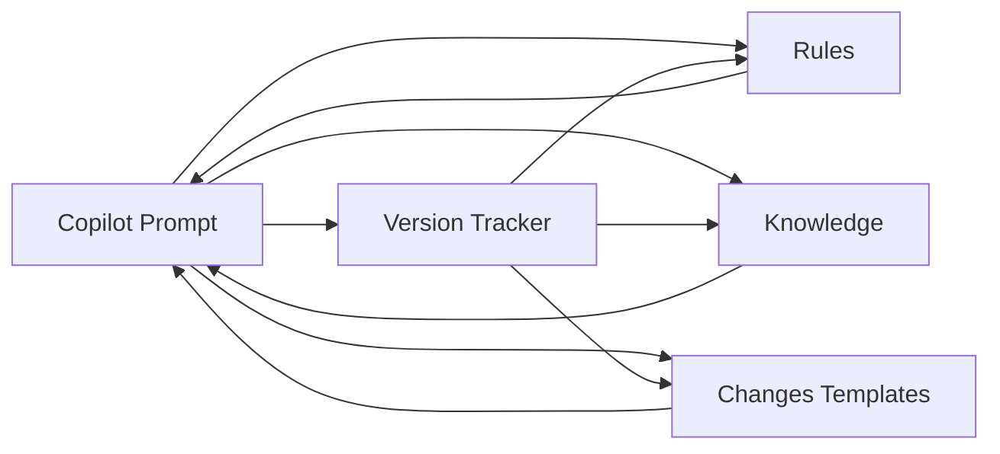

# 架构概览

<cite>
**本文引用的文件**
- [目录结构和设计说明.md](file://data_warehouse_engineering_code_copilot/目录结构和设计说明.md)
- [copilot-prompt.md](file://data_warehouse_engineering_code_copilot/agents/copilot-prompt.md)
- [sql-reviewer.md](file://data_warehouse_engineering_code_copilot/agents/sql-reviewer.md)
- [version-tracker.md](file://data_warehouse_engineering_code_copilot/agents/version-tracker.md)
- [domain-rules.md](file://data_warehouse_engineering_code_copilot/rules/domain-rules.md)
- [security.md](file://data_warehouse_engineering_code_copilot/rules/security.md)
- [sql-style.md](file://data_warehouse_engineering_code_copilot/rules/sql-style.md)
- [index.md](file://data_warehouse_engineering_code_copilot/knowledge/index.md)
- [sql-patterns.md](file://data_warehouse_engineering_code_copilot/knowledge/sql-patterns.md)
- [etl-patterns.md](file://data_warehouse_engineering_code_copilot/knowledge/etl-patterns.md)
- [dimension-modeling-tips.md](file://data_warehouse_engineering_code_copilot/knowledge/dimension-modeling-tips.md)
- [performance-tips.md](file://data_warehouse_engineering_code_copilot/knowledge/performance-tips.md)
- [spec.md](file://data_warehouse_engineering_code_copilot/changes/templates/spec.md)
- [tasks.md](file://data_warehouse_engineering_code_copilot/changes/templates/tasks.md)
</cite>

## 目录
1. [简介](#简介)
2. [项目结构](#项目结构)
3. [核心组件](#核心组件)
4. [架构总览](#架构总览)
5. [详细组件分析](#详细组件分析)
6. [依赖关系分析](#依赖关系分析)
7. [性能考量](#性能考量)
8. [故障排查指南](#故障排查指南)
9. [结论](#结论)
10. [附录](#附录)

## 简介
本项目是一个面向数据仓库（Data Warehouse）开发场景的 AI 协作助手，核心理念为“Spec 驱动 + 三段式知识库 + 强制变更追踪”。系统通过统一的提示词工程、规范约束、知识库与变更模板，帮助 AI 在数仓开发中遵循统一的 SQL、建模、调度与安全规范，强制走“需求 → spec → 任务 → 实施 → 审查 → 归档”的完整闭环，并自动追踪每次 DDL/SQL/ETL/调度变更，形成可审计的变更日志。

## 项目结构
项目采用“提示词 + 规则 + 知识库 + 变更模板”的工程化组织方式：
- agents：AI 角色与子 Agent 的提示词，定义协作命令体系与审查流程
- rules：项目约束与规范（强制约束）
- knowledge：领域知识库（可复用的经验与模式）
- changes/templates：变更管理模板（spec、tasks、log、validation-spec）

图表来源
- [目录结构和设计说明.md:19-55](file://data_warehouse_engineering_code_copilot/目录结构和设计说明.md#L19-L55)
- [copilot-prompt.md:1-147](file://data_warehouse_engineering_code_copilot/agents/copilot-prompt.md#L1-L147)
- [sql-reviewer.md:1-68](file://data_warehouse_engineering_code_copilot/agents/sql-reviewer.md#L1-L68)
- [version-tracker.md:1-120](file://data_warehouse_engineering_code_copilot/agents/version-tracker.md#L1-L120)
- [domain-rules.md:1-142](file://data_warehouse_engineering_code_copilot/rules/domain-rules.md#L1-L142)
- [security.md:1-98](file://data_warehouse_engineering_code_copilot/rules/security.md#L1-L98)
- [sql-style.md:1-254](file://data_warehouse_engineering_code_copilot/rules/sql-style.md#L1-L254)
- [index.md:1-60](file://data_warehouse_engineering_code_copilot/knowledge/index.md#L1-L60)
- [sql-patterns.md:1-331](file://data_warehouse_engineering_code_copilot/knowledge/sql-patterns.md#L1-L331)
- [etl-patterns.md:1-220](file://data_warehouse_engineering_code_copilot/knowledge/etl-patterns.md#L1-L220)
- [dimension-modeling-tips.md:1-253](file://data_warehouse_engineering_code_copilot/knowledge/dimension-modeling-tips.md#L1-L253)
- [performance-tips.md:1-349](file://data_warehouse_engineering_code_copilot/knowledge/performance-tips.md#L1-L349)
- [spec.md:1-132](file://data_warehouse_engineering_code_copilot/changes/templates/spec.md#L1-L132)
- [tasks.md:1-74](file://data_warehouse_engineering_code_copilot/changes/templates/tasks.md#L1-L74)

章节来源
- [目录结构和设计说明.md:19-55](file://data_warehouse_engineering_code_copilot/目录结构和设计说明.md#L19-L55)

## 核心组件
- 主提示词（Copilot Prompt）：定义 AI 的身份、法则、命令体系与回答框架，指导 AI 在数仓开发中遵循 Spec 驱动与三段式知识结构。
- SQL 质量审查 Agent：对 SQL 代码进行质量、性能与可维护性审查，按 Critical/Important/Minor 分级，提供量化评估与优化建议。
- 版本追踪 Agent：在每次 DDL/SQL/ETL/调度变更后，自动记录结构化变更条目，确保所有变更可审计、可回溯。
- 规范约束（Rules）：包含业务领域规则、安全红线、SQL 编码规范等强制约束，保障实现与规范一致。
- 知识库（Knowledge）：涵盖 SQL 模式、ETL 模式、维度建模技巧、性能优化等经验与模式，支持复用与沉淀。
- 变更模板（Changes/Templates）：提供需求规格（spec）与任务拆分（tasks）模板，支撑“Propose → Apply → Review → Archive”流程。

章节来源
- [copilot-prompt.md:1-147](file://data_warehouse_engineering_code_copilot/agents/copilot-prompt.md#L1-L147)
- [sql-reviewer.md:1-68](file://data_warehouse_engineering_code_copilot/agents/sql-reviewer.md#L1-L68)
- [version-tracker.md:1-120](file://data_warehouse_engineering_code_copilot/agents/version-tracker.md#L1-L120)
- [domain-rules.md:1-142](file://data_warehouse_engineering_code_copilot/rules/domain-rules.md#L1-L142)
- [security.md:1-98](file://data_warehouse_engineering_code_copilot/rules/security.md#L1-L98)
- [sql-style.md:1-254](file://data_warehouse_engineering_code_copilot/rules/sql-style.md#L1-L254)
- [index.md:1-60](file://data_warehouse_engineering_code_copilot/knowledge/index.md#L1-L60)
- [sql-patterns.md:1-331](file://data_warehouse_engineering_code_copilot/knowledge/sql-patterns.md#L1-L331)
- [etl-patterns.md:1-220](file://data_warehouse_engineering_code_copilot/knowledge/etl-patterns.md#L1-L220)
- [dimension-modeling-tips.md:1-253](file://data_warehouse_engineering_code_copilot/knowledge/dimension-modeling-tips.md#L1-L253)
- [performance-tips.md:1-349](file://data_warehouse_engineering_code_copilot/knowledge/performance-tips.md#L1-L349)
- [spec.md:1-132](file://data_warehouse_engineering_code_copilot/changes/templates/spec.md#L1-L132)
- [tasks.md:1-74](file://data_warehouse_engineering_code_copilot/changes/templates/tasks.md#L1-L74)

## 架构总览
系统采用“提示词驱动 + 规范约束 + 知识复用 + 变更闭环”的整体架构。AI 通过主提示词识别用户意图并映射到命令，结合规则与知识库进行设计与审查，最终通过版本追踪记录变更，形成可审计的历史。

图表来源
- [copilot-prompt.md:63-147](file://data_warehouse_engineering_code_copilot/agents/copilot-prompt.md#L63-L147)
- [version-tracker.md:1-120](file://data_warehouse_engineering_code_copilot/agents/version-tracker.md#L1-L120)
- [domain-rules.md:1-142](file://data_warehouse_engineering_code_copilot/rules/domain-rules.md#L1-L142)
- [security.md:1-98](file://data_warehouse_engineering_code_copilot/rules/security.md#L1-L98)
- [sql-style.md:1-254](file://data_warehouse_engineering_code_copilot/rules/sql-style.md#L1-L254)
- [sql-patterns.md:1-331](file://data_warehouse_engineering_code_copilot/knowledge/sql-patterns.md#L1-L331)
- [etl-patterns.md:1-220](file://data_warehouse_engineering_code_copilot/knowledge/etl-patterns.md#L1-L220)
- [dimension-modeling-tips.md:1-253](file://data_warehouse_engineering_code_copilot/knowledge/dimension-modeling-tips.md#L1-L253)
- [performance-tips.md:1-349](file://data_warehouse_engineering_code_copilot/knowledge/performance-tips.md#L1-L349)
- [spec.md:1-132](file://data_warehouse_engineering_code_copilot/changes/templates/spec.md#L1-L132)
- [tasks.md:1-74](file://data_warehouse_engineering_code_copilot/changes/templates/tasks.md#L1-L74)

## 详细组件分析

### 主提示词（Copilot Prompt）
- 职责：定义 AI 身份、核心法则（Spec 驱动、现状必须有出处、变更即记录）、回答框架与命令体系
- 关键特性：
  - 意图确认：将自然语言映射到命令（/sql、/etl、/model、/propose、/apply、/review、/optimize、/dq、/schedule、/archive）
  - 启动流程：读取 rules、检查 changes、检查版本追踪路径
  - 命令流程：每个命令包含需求理解、现状分析、方案设计、具体实现、验证方法、性能与成本考量、注意事项

图表来源
- [copilot-prompt.md:55-147](file://data_warehouse_engineering_code_copilot/agents/copilot-prompt.md#L55-L147)

章节来源
- [copilot-prompt.md:1-147](file://data_warehouse_engineering_code_copilot/agents/copilot-prompt.md#L1-L147)

### SQL 质量审查 Agent
- 职责：对 SQL 代码进行质量、性能与可维护性审查，按 Critical/Important/Minor 分级
- 审查清单：分区裁剪、Join 顺序、Map/Broadcast Join、倾斜风险、聚合下推、字段别名、头部注释等
- 输出格式：分层列出问题与建议，提供性能评估摘要与量化影响

图表来源
- [sql-reviewer.md:1-68](file://data_warehouse_engineering_code_copilot/agents/sql-reviewer.md#L1-L68)

章节来源
- [sql-reviewer.md:1-68](file://data_warehouse_engineering_code_copilot/agents/sql-reviewer.md#L1-L68)

### 版本追踪 Agent
- 职责：在每次 DDL/SQL/ETL/调度变更后，自动记录结构化变更条目
- 触发时机：/sql、/etl、/model、/schedule、/dq、/apply 每个 Task 完成后、手动记录
- 记录规则：原子化、精确引用、任务可追溯、下游必标注、回刷必声明、时间精确到分钟
- 条目格式：模块、分层、任务、操作、变更内容、关联文件、回刷范围、影响下游、备注

图表来源
- [version-tracker.md:1-120](file://data_warehouse_engineering_code_copilot/agents/version-tracker.md#L1-L120)

章节来源
- [version-tracker.md:1-120](file://data_warehouse_engineering_code_copilot/agents/version-tracker.md#L1-L120)

### 规范约束系统
- 业务领域规则：KPI 定义、同环比口径、排序键、状态颜色、历史数据约定、行业特定规则、跨系统一致性
- 安全红线：数据安全、字段级脱敏、行级权限（RLS）、数据分级与访问控制、上线与发布安全、数据回刷安全、业务安全、跨境合规、安全审计、应急响应
- SQL 编码规范：命名约定（库/表/字段/分区）、格式规范、SQL 编写原则、禁止事项、命名检查清单、常见错误对照

章节来源
- [domain-rules.md:1-142](file://data_warehouse_engineering_code_copilot/rules/domain-rules.md#L1-L142)
- [security.md:1-98](file://data_warehouse_engineering_code_copilot/rules/security.md#L1-L98)
- [sql-style.md:1-254](file://data_warehouse_engineering_code_copilot/rules/sql-style.md#L1-L254)

### 知识库系统
- 知识索引：一句话索引，便于 AI 快速命中 SQL 模式、ETL 模式、维度建模技巧、性能优化技巧
- SQL 模式库：去重保留最新、拉链表（SCD2）、同环比、TopN 分组排名、累计求和、行转列/列转行、数据回刷、Lambda 合并、缺失日期补齐、NULL 安全比较
- ETL 模式库：CDC 增量同步、JDBC 增量抽取、MERGE/UPSERT、小文件控制、历史回刷、文件接入、API 拉取、全量/增量/CDC 选型对照、数据漂移与时区处理
- 维度建模技巧：代理键 vs 业务键、SCD 三种类型、桥接表、退化维度、一致性维度、事实表类型选择、维度表分级、分层归属判定
- 性能优化知识库：分区裁剪、数据倾斜、Map Join/Broadcast Join、小文件问题、CTE 物化策略、谓词下推与列裁剪、Join 顺序与类型、窗口函数性能、存储格式与压缩、调度与资源、性能分析工具

章节来源
- [index.md:1-60](file://data_warehouse_engineering_code_copilot/knowledge/index.md#L1-L60)
- [sql-patterns.md:1-331](file://data_warehouse_engineering_code_copilot/knowledge/sql-patterns.md#L1-L331)
- [etl-patterns.md:1-220](file://data_warehouse_engineering_code_copilot/knowledge/etl-patterns.md#L1-L220)
- [dimension-modeling-tips.md:1-253](file://data_warehouse_engineering_code_copilot/knowledge/dimension-modeling-tips.md#L1-L253)
- [performance-tips.md:1-349](file://data_warehouse_engineering_code_copilot/knowledge/performance-tips.md#L1-L349)

### 变更管理系统
- 需求规格模板（spec）：背景与目标、现状分析、功能点、业务规则与口径、模型变更（DDL）、SQL 加工设计、ETL/同步变更、调度变更、数据质量规则、影响范围、风险与关注点、验证策略、待澄清、技术决策、执行日志、审查结论、确认记录
- 任务拆分模板（tasks）：按 ODS→DIM→DWD→DWS→ADS 顺序拆分，每个任务原子化，精确到库.表.字段/作业名/调度依赖，包含验收标准与验证方法

章节来源
- [spec.md:1-132](file://data_warehouse_engineering_code_copilot/changes/templates/spec.md#L1-L132)
- [tasks.md:1-74](file://data_warehouse_engineering_code_copilot/changes/templates/tasks.md#L1-L74)

## 依赖关系分析
系统各组件之间的依赖关系如下：
- 主提示词依赖规则与知识库，用于生成符合规范的方案与代码
- SQL 质量审查依赖建模与 SQL 编码规范，确保审查结果与规范一致
- 版本追踪依赖变更模板与命令流程，确保每次变更都被结构化记录
- 规范约束与知识库共同支撑 AI 的设计与审查决策

图表来源
- [copilot-prompt.md:1-147](file://data_warehouse_engineering_code_copilot/agents/copilot-prompt.md#L1-L147)
- [version-tracker.md:1-120](file://data_warehouse_engineering_code_copilot/agents/version-tracker.md#L1-L120)
- [domain-rules.md:1-142](file://data_warehouse_engineering_code_copilot/rules/domain-rules.md#L1-L142)
- [security.md:1-98](file://data_warehouse_engineering_code_copilot/rules/security.md#L1-L98)
- [sql-style.md:1-254](file://data_warehouse_engineering_code_copilot/rules/sql-style.md#L1-L254)
- [index.md:1-60](file://data_warehouse_engineering_code_copilot/knowledge/index.md#L1-L60)
- [sql-patterns.md:1-331](file://data_warehouse_engineering_code_copilot/knowledge/sql-patterns.md#L1-L331)
- [etl-patterns.md:1-220](file://data_warehouse_engineering_code_copilot/knowledge/etl-patterns.md#L1-L220)
- [dimension-modeling-tips.md:1-253](file://data_warehouse_engineering_code_copilot/knowledge/dimension-modeling-tips.md#L1-L253)
- [performance-tips.md:1-349](file://data_warehouse_engineering_code_copilot/knowledge/performance-tips.md#L1-L349)
- [spec.md:1-132](file://data_warehouse_engineering_code_copilot/changes/templates/spec.md#L1-L132)
- [tasks.md:1-74](file://data_warehouse_engineering_code_copilot/changes/templates/tasks.md#L1-L74)

## 性能考量
- 分区裁剪：WHERE 条件必须直接命中分区字段，避免函数包裹导致全表扫描
- 数据倾斜：通过过滤单独处理、加盐打散、Map Join 小表等方式缓解
- Join 顺序与类型：依据引擎特性选择 Broadcast Hash Join、Shuffle Hash Join、Sort Merge Join 或 Bucket Join
- CTE 物化：不同引擎对 WITH 的物化策略不同，复杂场景建议落临时表或显式 CACHE
- 存储格式与压缩：优先使用 ORC/Parquet 等列存格式，结合 ZSTD 压缩提升查询性能
- 调度与资源：按主题/优先级划分队列，错峰调度，SLA 基线倒推，失败重试与告警

章节来源
- [performance-tips.md:1-349](file://data_warehouse_engineering_code_copilot/knowledge/performance-tips.md#L1-L349)

## 故障排查指南
- 调试流程：现象收集 → 根因定位 → 方案验证 → 实施修复
- 诊断层级：数据源层 → 抽取层 → ODS/DWD/DWS/ADS 层 → 应用层
- 常见问题：
  - SQL：分区裁剪失效、Join 笛卡尔积、全表扫描、重复计算、NULL 处理缺失
  - ETL：CDC 位点保护、JDBC 水位字段单调性、MERGE/UPSERT 主键冲突、小文件爆炸
  - 调度：依赖识别、重试与告警、SLA 基线、资源队列、失败回放策略
  - 安全：PII 脱敏、RLS 配置、数据分级、跨境合规、审计日志

章节来源
- [copilot-prompt.md:133-147](file://data_warehouse_engineering_code_copilot/agents/copilot-prompt.md#L133-L147)
- [sql-reviewer.md:1-68](file://data_warehouse_engineering_code_copilot/agents/sql-reviewer.md#L1-L68)
- [security.md:1-98](file://data_warehouse_engineering_code_copilot/rules/security.md#L1-L98)

## 结论
本系统通过“提示词驱动 + 规范约束 + 知识复用 + 变更闭环”的架构，实现了数仓开发的标准化与可审计化。AI 在统一的命令体系下，结合规则与知识库进行设计与审查，并通过版本追踪确保每次变更可追溯、可回放。系统具备良好的扩展性与集成能力，支持未来与 dbt/SQLMesh、数据血缘平台等工具的集成，持续沉淀与复用领域知识。

## 附录
- 命令体系与典型工作流详见主提示词与设计说明文档
- 扩展点：独立的数据质量评审 Agent、实时数仓专题、湖仓一体专题、成本优化专题、dbt/SQLMesh 集成、数据血缘平台集成

章节来源
- [目录结构和设计说明.md:186-204](file://data_warehouse_engineering_code_copilot/目录结构和设计说明.md#L186-L204)