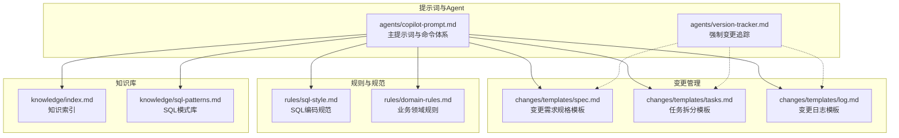
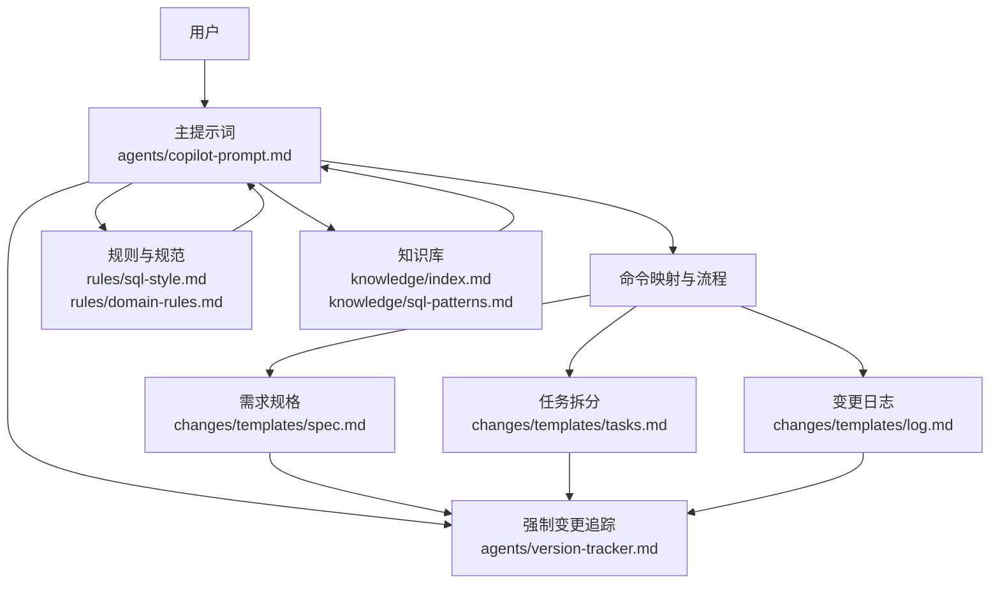
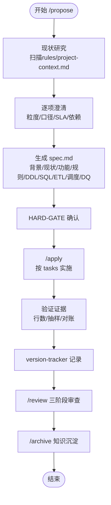
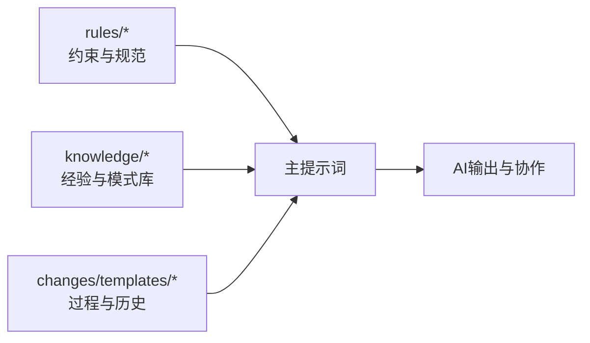
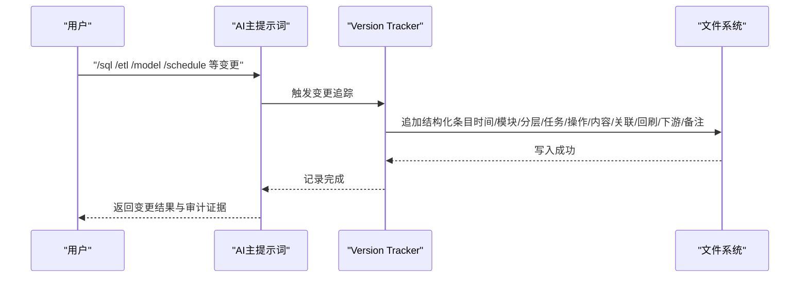
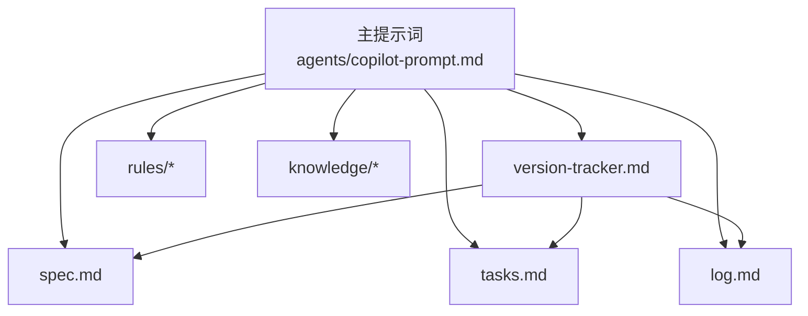

# 核心设计原则

<cite>
**本文引用的文件**
- [目录结构和设计说明.md](file://目录结构和设计说明.md)
- [copilot-prompt.md](file://agents/copilot-prompt.md)
- [version-tracker.md](file://agents/version-tracker.md)
- [spec.md](file://changes/templates/spec.md)
- [tasks.md](file://changes/templates/tasks.md)
- [log.md](file://changes/templates/log.md)
- [sql-style.md](file://rules/sql-style.md)
- [domain-rules.md](file://rules/domain-rules.md)
- [index.md](file://knowledge/index.md)
- [sql-patterns.md](file://knowledge/sql-patterns.md)
</cite>

## 目录
1. [引言](#引言)
2. [项目结构](#项目结构)
3. [核心组件](#核心组件)
4. [架构总览](#架构总览)
5. [详细组件分析](#详细组件分析)
6. [依赖分析](#依赖分析)
7. [性能考量](#性能考量)
8. [故障排查指南](#故障排查指南)
9. [结论](#结论)
10. [附录](#附录)

## 引言
本项目“数据仓库工程AI协作助手”围绕三大核心设计原则构建：
- Spec驱动开发：以结构化变更需求规格为唯一真相，驱动从需求澄清、任务拆分到实施与归档的全流程。
- 三段式知识结构：rules（约束）、knowledge（经验）、changes（过程）协同，形成“实践—发现—沉淀—复用”的知识飞轮。
- 强制变更追踪：在每次DDL/SQL/ETL/调度变更后自动记录结构化日志，确保可审计、可回溯。

这些原则共同保障了数仓开发的规范性、可追溯性和可持续演进。

## 项目结构
项目采用“提示词工程 + 变更模板 + 规则与知识库”的组织方式，便于AI在固定流程内协作，避免发散与遗漏。

图表来源
- [目录结构和设计说明.md: 19-55:19-55](file://目录结构和设计说明.md#L19-L55)
- [copilot-prompt.md: 1-147:1-147](file://agents/copilot-prompt.md#L1-L147)
- [version-tracker.md: 1-120:1-120](file://agents/version-tracker.md#L1-L120)
- [spec.md: 1-132:1-132](file://changes/templates/spec.md#L1-L132)
- [tasks.md: 1-74:1-74](file://changes/templates/tasks.md#L1-L74)
- [log.md: 1-61:1-61](file://changes/templates/log.md#L1-L61)
- [sql-style.md: 1-254:1-254](file://rules/sql-style.md#L1-L254)
- [domain-rules.md: 1-142:1-142](file://rules/domain-rules.md#L1-L142)
- [index.md: 1-60:1-60](file://knowledge/index.md#L1-L60)
- [sql-patterns.md: 1-331:1-331](file://knowledge/sql-patterns.md#L1-L331)

章节来源
- [目录结构和设计说明.md: 19-55:19-55](file://目录结构和设计说明.md#L19-L55)

## 核心组件
- 主提示词与命令体系：定义AI身份、法则、命令映射与工作框架，确保每次交互在固定流程内进行。
- 变更模板：spec（需求规格）、tasks（任务拆分）、log（变更日志）构成“需求—计划—执行—沉淀”的闭环。
- 规则与规范：sql-style（编码规范）、domain-rules（业务领域规则）提供强制约束与最佳实践。
- 知识库：index（索引）、sql-patterns（模式库）提供可复用的经验与工具箱。
- 强制变更追踪：version-tracker在关键节点自动记录结构化变更条目，确保可审计与可回溯。

章节来源
- [目录结构和设计说明.md: 59-106:59-106](file://目录结构和设计说明.md#L59-L106)
- [copilot-prompt.md: 63-147:63-147](file://agents/copilot-prompt.md#L63-L147)
- [version-tracker.md: 1-120:1-120](file://agents/version-tracker.md#L1-L120)
- [spec.md: 1-132:1-132](file://changes/templates/spec.md#L1-L132)
- [tasks.md: 1-74:1-74](file://changes/templates/tasks.md#L1-L74)
- [log.md: 1-61:1-61](file://changes/templates/log.md#L1-L61)
- [sql-style.md: 1-254:1-254](file://rules/sql-style.md#L1-L254)
- [domain-rules.md: 1-142:1-142](file://rules/domain-rules.md#L1-L142)
- [index.md: 1-60:1-60](file://knowledge/index.md#L1-L60)
- [sql-patterns.md: 1-331:1-331](file://knowledge/sql-patterns.md#L1-L331)

## 架构总览
整体架构以“提示词工程”为核心入口，围绕“变更模板”组织需求与实施，借助“规则与知识库”提供约束与经验，最后通过“强制变更追踪”实现可审计闭环。

图表来源
- [copilot-prompt.md: 63-147:63-147](file://agents/copilot-prompt.md#L63-L147)
- [spec.md: 1-132:1-132](file://changes/templates/spec.md#L1-L132)
- [tasks.md: 1-74:1-74](file://changes/templates/tasks.md#L1-L74)
- [log.md: 1-61:1-61](file://changes/templates/log.md#L1-L61)
- [sql-style.md: 1-254:1-254](file://rules/sql-style.md#L1-L254)
- [domain-rules.md: 1-142:1-142](file://rules/domain-rules.md#L1-L142)
- [index.md: 1-60:1-60](file://knowledge/index.md#L1-L60)
- [sql-patterns.md: 1-331:1-331](file://knowledge/sql-patterns.md#L1-L331)
- [version-tracker.md: 1-120:1-120](file://agents/version-tracker.md#L1-L120)

## 详细组件分析

### 组件A：Spec驱动开发
- 设计理念
  - “Model is Cheap, Context is Expensive”：强调需求规格（Spec）是昂贵的核心资产，实现可重建，但上下文与共识不可逆。
  - 四条铁律：No Spec, No Change；Spec is Truth；Reverse Sync；变更即记录。
- 实现机制
  - 通过“/propose”引导用户与AI共同澄清需求，产出结构化spec文档，包含背景、现状、功能点、业务规则、DDL、SQL设计、ETL/同步、调度、DQ、影响范围、验证策略、待澄清、技术决策等。
  - 通过“/apply”将spec转化为tasks，按ODS→DIM→DWD→DWS→ADS顺序逐项实施，每个task完成后进行验证与追踪。
  - 通过“/review”三阶段审查（Spec合规→模型质量→SQL质量）确保质量门禁。
  - 通过“/archive”将log中的知识发现沉淀到knowledge，形成知识飞轮。
- 实践示例（路径）
  - 需求澄清与spec生成：[spec.md:1-132](file://changes/templates/spec.md#L1-L132)
  - 任务拆分与验证：[tasks.md:1-74](file://changes/templates/tasks.md#L1-L74)
  - 审查与归档：[copilot-prompt.md: 113-131:113-131](file://agents/copilot-prompt.md#L113-L131)

图表来源
- [目录结构和设计说明.md: 126-151:126-151](file://目录结构和设计说明.md#L126-L151)
- [spec.md: 1-132:1-132](file://changes/templates/spec.md#L1-L132)
- [tasks.md: 1-74:1-74](file://changes/templates/tasks.md#L1-L74)
- [copilot-prompt.md: 103-131:103-131](file://agents/copilot-prompt.md#L103-L131)
- [version-tracker.md: 5-16:5-16](file://agents/version-tracker.md#L5-L16)

章节来源
- [目录结构和设计说明.md: 59-69:59-69](file://目录结构和设计说明.md#L59-L69)
- [copilot-prompt.md: 6-21:6-21](file://agents/copilot-prompt.md#L6-L21)
- [spec.md: 1-132:1-132](file://changes/templates/spec.md#L1-L132)
- [tasks.md: 1-74:1-74](file://changes/templates/tasks.md#L1-L74)
- [copilot-prompt.md: 103-131:103-131](file://agents/copilot-prompt.md#L103-L131)

### 组件B：三段式知识结构（rules/知识库/changes）
- 设计思想
  - rules：约束与红线，强制遵守，确保合规与一致性。
  - knowledge：经验与工具箱，推荐复用，加速开发。
  - changes：过程与历史，记录每次变更的“病历”，支撑审计与回溯。
- 实现机制
  - rules/sql-style.md：统一命名、格式、性能与正确性原则，提供命名检查清单与常见错误对照。
  - rules/domain-rules.md：业务领域规则、KPI口径、数据质量五维度、历史数据约定、行业特定规则、跨系统一致性等。
  - knowledge/index.md：一句话索引，便于AI快速命中；knowledge/sql-patterns.md：SQL常用模式库，涵盖去重、拉链、同环比、TopN、累计求和、行转列/列转行、回刷、Lambda合并、缺失日期补齐、NULL安全比较等。
  - changes/templates：spec（需求规格）、tasks（任务拆分）、log（变更日志）形成“实践—发现—沉淀—复用”的闭环。
- 实践示例（路径）
  - SQL编码规范：[sql-style.md: 1-254:1-254](file://rules/sql-style.md#L1-L254)
  - 业务领域规则：[domain-rules.md: 1-142:1-142](file://rules/domain-rules.md#L1-L142)
  - 知识索引与模式库：[index.md: 1-60:1-60](file://knowledge/index.md#L1-L60)，[sql-patterns.md: 1-331:1-331](file://knowledge/sql-patterns.md#L1-L331)
  - 变更模板：[spec.md: 1-132:1-132](file://changes/templates/spec.md#L1-L132)，[tasks.md: 1-74:1-74](file://changes/templates/tasks.md#L1-L74)，[log.md: 1-61:1-61](file://changes/templates/log.md#L1-L61)

图表来源
- [sql-style.md: 1-254:1-254](file://rules/sql-style.md#L1-L254)
- [domain-rules.md: 1-142:1-142](file://rules/domain-rules.md#L1-L142)
- [index.md: 1-60:1-60](file://knowledge/index.md#L1-L60)
- [sql-patterns.md: 1-331:1-331](file://knowledge/sql-patterns.md#L1-L331)
- [spec.md: 1-132:1-132](file://changes/templates/spec.md#L1-L132)
- [tasks.md: 1-74:1-74](file://changes/templates/tasks.md#L1-L74)
- [log.md: 1-61:1-61](file://changes/templates/log.md#L1-L61)
- [copilot-prompt.md: 1-L147:1-147](file://agents/copilot-prompt.md#L1-L147)

章节来源
- [目录结构和设计说明.md: 70-79:70-79](file://目录结构和设计说明.md#L70-L79)
- [sql-style.md: 1-254:1-254](file://rules/sql-style.md#L1-L254)
- [domain-rules.md: 1-142:1-142](file://rules/domain-rules.md#L1-L142)
- [index.md: 1-60:1-60](file://knowledge/index.md#L1-L60)
- [sql-patterns.md: 1-331:1-331](file://knowledge/sql-patterns.md#L1-L331)
- [spec.md: 1-132:1-132](file://changes/templates/spec.md#L1-L132)
- [tasks.md: 1-74:1-74](file://changes/templates/tasks.md#L1-L74)
- [log.md: 1-61:1-61](file://changes/templates/log.md#L1-L61)

### 组件C：强制变更追踪系统
- 工作原理
  - 在DDL/SQL/ETL/调度等关键变更完成后，version-tracker自动追加结构化条目，包含时间、模块、分层、任务、操作类型、变更内容、关联文件、回刷范围、下游影响、备注等。
  - 路径初始化：首次询问并记忆变更日志路径，支持新建文件并写入文件头。
  - 记录规则：原子化、精确引用、任务可追溯、下游必标注、回刷必声明、时间精确到分钟、不阻塞主流程。
- 价值
  - 可审计：所有变更均有据可查，支持回溯与责任界定。
  - 可回溯：精确到库.表.字段/作业名，便于定位影响范围。
  - 可沉淀：与changes/log.md联动，沉淀知识与踩坑记录。
- 实践示例（路径）
  - 触发时机与条目格式：[version-tracker.md: 5-64:5-64](file://agents/version-tracker.md#L5-L64)
  - 模块分类与记录规则：[version-tracker.md: 66-89:66-89](file://agents/version-tracker.md#L66-L89)
  - 输出示例：[version-tracker.md: 92-111:92-111](file://agents/version-tracker.md#L92-L111)

图表来源
- [version-tracker.md: 5-16:5-16](file://agents/version-tracker.md#L5-L16)
- [version-tracker.md: 44-64:44-64](file://agents/version-tracker.md#L44-L64)
- [version-tracker.md: 80-89:80-89](file://agents/version-tracker.md#L80-L89)
- [copilot-prompt.md: 68-94:68-94](file://agents/copilot-prompt.md#L68-L94)

章节来源
- [目录结构和设计说明.md: 98-106:98-106](file://目录结构和设计说明.md#L98-L106)
- [version-tracker.md: 1-120:1-120](file://agents/version-tracker.md#L1-L120)
- [copilot-prompt.md: 68-94:68-94](file://agents/copilot-prompt.md#L68-L94)

## 依赖分析
- 组件耦合与内聚
  - 主提示词与Agent强耦合：命令体系与流程依赖主提示词定义。
  - 变更模板与Agent弱耦合：模板作为输入，Agent负责组织与执行。
  - 规则与知识库与Agent弱耦合：提供约束与经验，Agent在流程中引用。
  - 强制变更追踪与Agent弱耦合：在关键节点触发，不改变主流程。
- 外部依赖与集成点
  - 文件系统：version-tracker依赖文件路径与写入权限。
  - 项目上下文：/init后填充rules/project-context.md，为AI提供上下文。
- 潜在循环依赖
  - 无直接循环依赖；changes/log.md沉淀到knowledge/属于单向流动。

图表来源
- [copilot-prompt.md: 63-147:63-147](file://agents/copilot-prompt.md#L63-L147)
- [version-tracker.md: 1-120:1-120](file://agents/version-tracker.md#L1-L120)
- [spec.md: 1-132:1-132](file://changes/templates/spec.md#L1-L132)
- [tasks.md: 1-74:1-74](file://changes/templates/tasks.md#L1-L74)
- [log.md: 1-61:1-61](file://changes/templates/log.md#L1-L61)

章节来源
- [目录结构和设计说明.md: 186-193:186-193](file://目录结构和设计说明.md#L186-L193)
- [copilot-prompt.md: 63-147:63-147](file://agents/copilot-prompt.md#L63-L147)
- [version-tracker.md: 1-120:1-120](file://agents/version-tracker.md#L1-L120)

## 性能考量
- 规范先行：sql-style.md强调分区裁剪、CTE替代深层子查询、小表广播、避免SELECT*等，降低性能风险。
- 模式复用：sql-patterns.md提供经验证的高质量SQL模式，减少重复造轮子与性能陷阱。
- 诊断与优化：copilot-prompt.md提供四层诊断（数据源→抽取→数仓→应用），量化优化前后对比，避免盲目调参。
- 回刷与幂等：sql-patterns.md强调INSERT OVERWRITE保证幂等，避免重复数据与资源浪费。

章节来源
- [sql-style.md: 165-201:165-201](file://rules/sql-style.md#L165-L201)
- [sql-patterns.md: 38-94:38-94](file://knowledge/sql-patterns.md#L38-L94)
- [copilot-prompt.md: 117-120:117-120](file://agents/copilot-prompt.md#L117-L120)

## 故障排查指南
- 现象收集：明确问题范围（数据源/抽取/数仓/应用层）与影响面。
- 根因定位：依据四层诊断逐步收敛，优先确认业务定义与数据源差异，再确认代码实现。
- 方案验证：提供可执行的对账SQL与量化对比，避免未确认根因直接修改。
- 实施修复：严格遵循Spec与任务计划，变更完成后触发version-tracker记录。

章节来源
- [copilot-prompt.md: 133-146:133-146](file://agents/copilot-prompt.md#L133-L146)
- [version-tracker.md: 80-89:80-89](file://agents/version-tracker.md#L80-L89)

## 结论
本项目通过Spec驱动、三段式知识结构与强制变更追踪三大原则，构建了面向数据仓库工程的AI协作体系：以需求规格为唯一真相，以规则与知识为约束与工具箱，以结构化变更追踪为审计与回溯保障。这不仅提升了开发效率与质量，也为团队知识沉淀与可持续演进提供了坚实基础。

## 附录
- 命令与触发场景概览（摘自主提示词）
  - /init：新项目初始化数仓上下文
  - /sql：单段SQL加工开发
  - /etl：数据接入/同步任务开发
  - /model：数仓建模（事实/维度/分层）
  - /propose：创建变更提案（生成spec）
  - /apply：按spec/tasks实施
  - /review：三阶段审查（合规→模型→SQL）
  - /optimize：性能诊断与优化
  - /dq：数据质量校验与对账
  - /schedule：调度配置与依赖
  - /archive：归档+知识沉淀

章节来源
- [目录结构和设计说明.md: 80-97:80-97](file://目录结构和设计说明.md#L80-L97)
- [copilot-prompt.md: 65-131:65-131](file://agents/copilot-prompt.md#L65-L131)