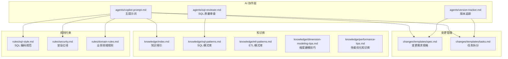
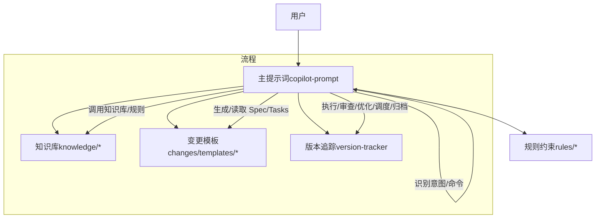
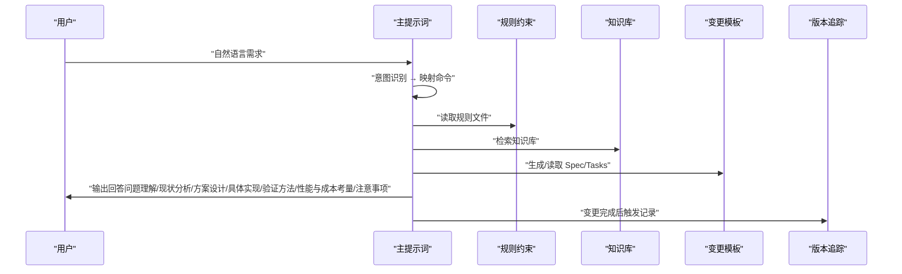
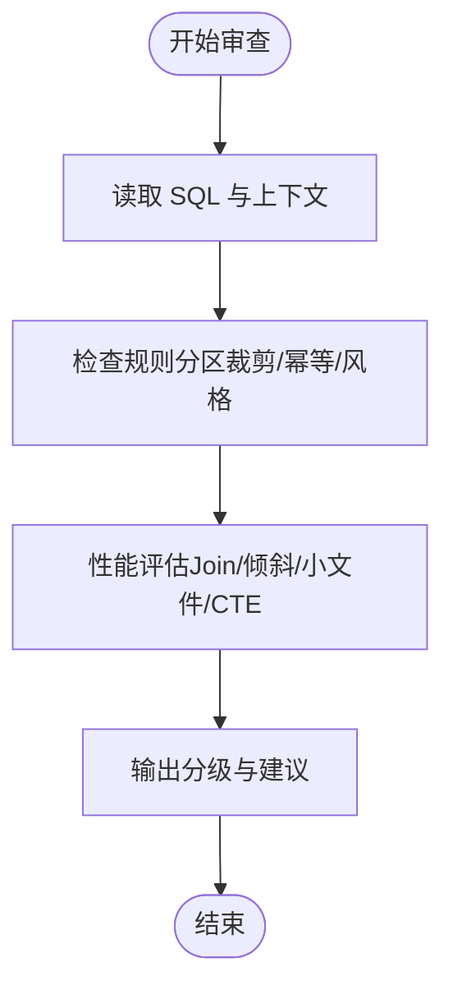
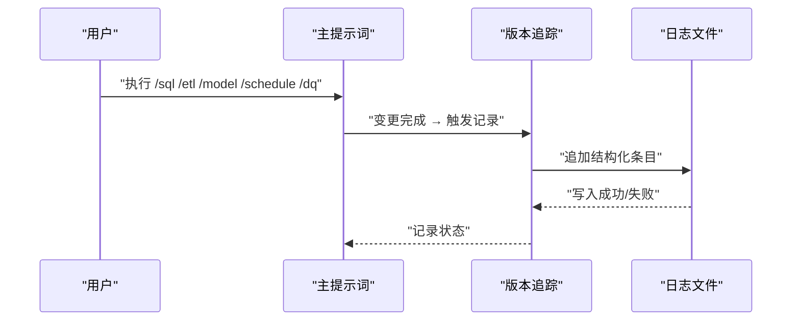
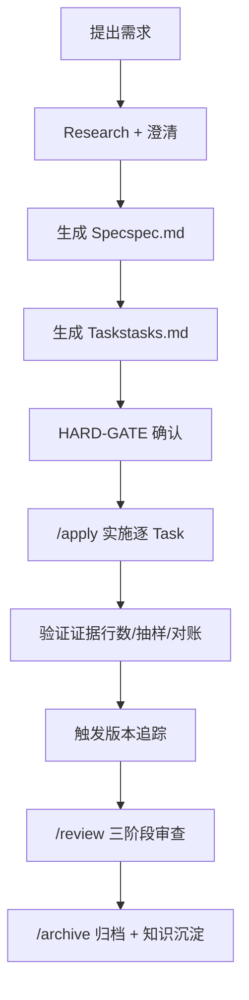
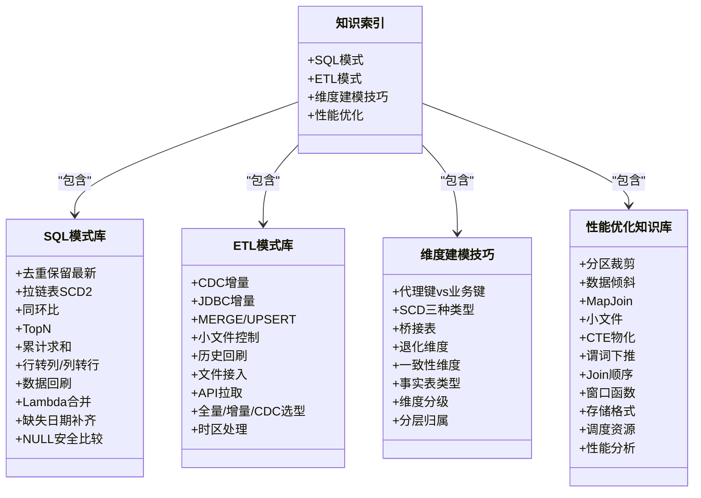
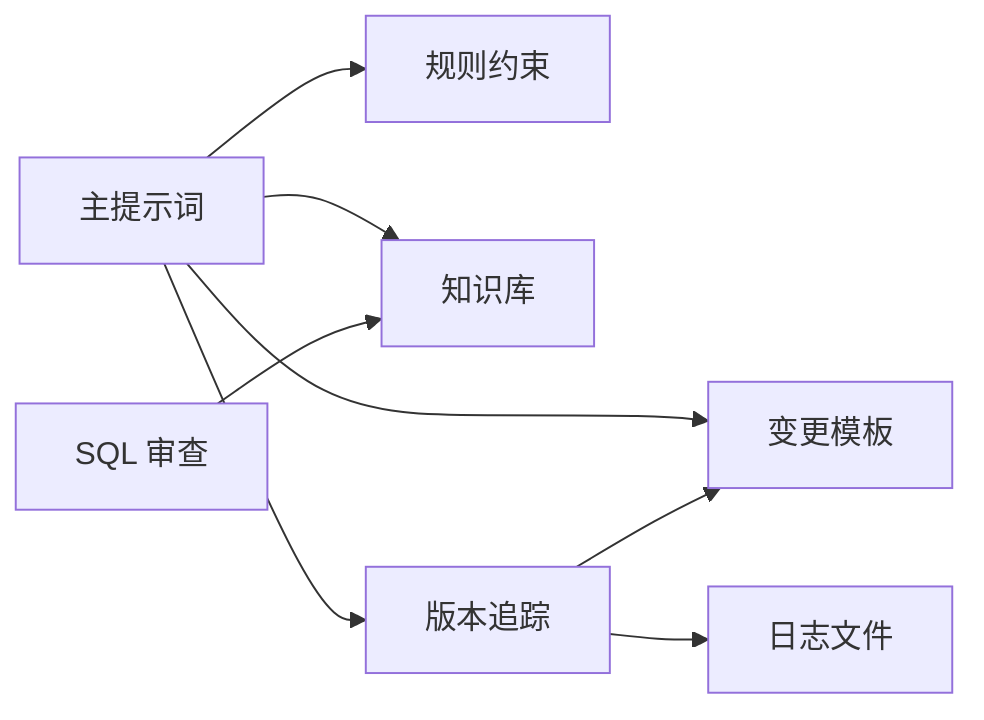

# 竞品对比与差异化

<cite>
**本文引用的文件**
- [目录结构和设计说明.md](file://目录结构和设计说明.md)
- [copilot-prompt.md](file://agents/copilot-prompt.md)
- [sql-reviewer.md](file://agents/sql-reviewer.md)
- [version-tracker.md](file://agents/version-tracker.md)
- [domain-rules.md](file://rules/domain-rules.md)
- [security.md](file://rules/security.md)
- [sql-style.md](file://rules/sql-style.md)
- [index.md](file://knowledge/index.md)
- [sql-patterns.md](file://knowledge/sql-patterns.md)
- [etl-patterns.md](file://knowledge/etl-patterns.md)
- [dimension-modeling-tips.md](file://knowledge/dimension-modeling-tips.md)
- [performance-tips.md](file://knowledge/performance-tips.md)
- [spec.md](file://changes/templates/spec.md)
- [tasks.md](file://changes/templates/tasks.md)
</cite>

## 目录
1. [简介](#简介)
2. [项目结构](#项目结构)
3. [核心组件](#核心组件)
4. [架构总览](#架构总览)
5. [详细组件分析](#详细组件分析)
6. [依赖分析](#依赖分析)
7. [性能考量](#性能考量)
8. [故障排查指南](#故障排查指南)
9. [结论](#结论)
10. [附录](#附录)

## 简介
本项目“数据仓库工程AI协作助手”是一套面向数据仓库（Data Warehouse）开发场景的工程化提示词工程，强调“Spec驱动 + 三段式知识结构 + 强制变更追踪”的系统化方法论。其目标是在数仓开发中：
- 以统一的 SQL/建模/调度/安全规范指导实践
- 强制走“需求 → spec → 任务 → 实施 → 审查 → 归档”的完整闭环
- 复用沉淀的 SQL 模式、ETL 模式、建模技巧、性能优化经验
- 自动追踪每次 DDL/SQL/ETL/调度变更，形成可审计的变更日志

与通用数据分析助手（如 Power BI Code Copilot）相比，本项目在数仓专业领域进行了系统性替换与强化，突出数仓特有的分层建模、指标口径、调度与数据质量、安全与合规等能力。

**章节来源**
- [目录结构和设计说明.md:1-16](file://目录结构和设计说明.md#L1-L16)
- [目录结构和设计说明.md:170-183](file://目录结构和设计说明.md#L170-L183)

## 项目结构
项目采用“三库一环”结构：
- agents/：AI 角色与子 Agent 提示词（主提示词、SQL审查、模型审查、性能诊断、版本追踪）
- changes/：变更管理（Spec 驱动核心，包含模板：spec、tasks、log、validation-spec）
- knowledge/：数仓领域知识库（SQL模式、ETL模式、维度建模技巧、性能优化）
- rules/：项目约束与规范（规则文件，覆盖上下文、SQL风格、建模标准、调度标准、数据质量、安全、领域规则）

**图表来源**
- [目录结构和设计说明.md:19-55](file://目录结构和设计说明.md#L19-L55)
- [copilot-prompt.md:1-147](file://agents/copilot-prompt.md#L1-L147)
- [version-tracker.md:1-120](file://agents/version-tracker.md#L1-L120)
- [sql-reviewer.md:1-68](file://agents/sql-reviewer.md#L1-L68)
- [index.md:1-60](file://knowledge/index.md#L1-L60)
- [sql-patterns.md:1-331](file://knowledge/sql-patterns.md#L1-L331)
- [etl-patterns.md:1-220](file://knowledge/etl-patterns.md#L1-L220)
- [dimension-modeling-tips.md:1-253](file://knowledge/dimension-modeling-tips.md#L1-L253)
- [performance-tips.md:1-349](file://knowledge/performance-tips.md#L1-L349)
- [sql-style.md:1-254](file://rules/sql-style.md#L1-L254)
- [security.md:1-98](file://rules/security.md#L1-L98)
- [domain-rules.md:1-142](file://rules/domain-rules.md#L1-L142)

**章节来源**
- [目录结构和设计说明.md:19-55](file://目录结构和设计说明.md#L19-L55)

## 核心组件
- 主提示词（Spec 驱动 + 命令式协作）：定义 AI 的身份、法则、命令体系与启动流程，确保每次会话自动扫描规则与变更，按固定流程推进。
- SQL 质量审查：对 SQL 的正确性、性能与可维护性进行分级审查，前置条件为模型审查通过。
- 版本追踪：在每次 DDL/SQL/ETL/调度变更后自动记录结构化变更条目，确保可审计、可回溯。
- 变更模板：spec.md 与 tasks.md 作为 Spec 驱动的“需求规格”和“任务拆分”，贯穿实施与归档全过程。
- 知识库：涵盖 SQL 模式、ETL 模式、维度建模技巧、性能优化知识，支撑“经验复用”。
- 规则约束：SQL 编码规范、安全红线、领域规则等，构成“强制约束”。

**章节来源**
- [copilot-prompt.md:4-147](file://agents/copilot-prompt.md#L4-L147)
- [sql-reviewer.md:1-68](file://agents/sql-reviewer.md#L1-L68)
- [version-tracker.md:1-120](file://agents/version-tracker.md#L1-L120)
- [spec.md:1-132](file://changes/templates/spec.md#L1-L132)
- [tasks.md:1-74](file://changes/templates/tasks.md#L1-L74)
- [index.md:1-60](file://knowledge/index.md#L1-L60)
- [sql-style.md:1-254](file://rules/sql-style.md#L1-L254)
- [security.md:1-98](file://rules/security.md#L1-L98)
- [domain-rules.md:1-142](file://rules/domain-rules.md#L1-L142)

## 架构总览
整体架构围绕“Spec 驱动 + 三段式知识结构 + 强制变更追踪”展开，形成“实践 → 变更日志 → 知识沉淀 → 复用”的知识飞轮。

**图表来源**
- [copilot-prompt.md:55-147](file://agents/copilot-prompt.md#L55-L147)
- [version-tracker.md:5-120](file://agents/version-tracker.md#L5-L120)
- [目录结构和设计说明.md:70-78](file://目录结构和设计说明.md#L70-L78)

**章节来源**
- [目录结构和设计说明.md:59-106](file://目录结构和设计说明.md#L59-L106)

## 详细组件分析

### 组件A：主提示词（Spec 驱动 + 命令式协作）
- 核心法则：Spec 驱动四条铁律（无 Spec 不变更、Spec 为真、逆向同步、现状有出处、变更即记录）
- 身份与原则：强调“顶尖数仓工程师搭档”，输出中文、技术术语保留英文，不确定就问、不做假设
- 命令体系：/init、/sql、/etl、/model、/propose、/apply、/review、/optimize、/dq、/schedule、/archive
- 启动流程：自动扫描 rules/ 与 changes/，展示命令菜单

**图表来源**
- [copilot-prompt.md:23-147](file://agents/copilot-prompt.md#L23-L147)

**章节来源**
- [copilot-prompt.md:4-147](file://agents/copilot-prompt.md#L4-L147)

### 组件B：SQL 质量审查（性能、风格、正确性）
- 审查分级：Critical（阻塞）、Important（应修复）、Minor（建议）
- 性能审查清单：分区裁剪、Join 顺序、广播/Map Join、倾斜风险、聚合下推、列裁剪、CTE 物化等
- 输出格式：问题定位 + 影响评估 + 优化建议摘要

**图表来源**
- [sql-reviewer.md:5-68](file://agents/sql-reviewer.md#L5-L68)

**章节来源**
- [sql-reviewer.md:1-68](file://agents/sql-reviewer.md#L1-L68)

### 组件C：版本追踪（强制变更追踪）
- 触发时机：/sql、/etl、/model、/schedule、/dq 产出新规则、/apply 每个 Task 完成后、手动记录
- 记录规则：原子化、精确引用、任务可追溯、下游必标注、回刷必声明、时间精确到分钟、不阻塞主流程
- 条目格式：模块、分层、任务、操作、变更内容、关联文件、回刷范围、影响下游、备注

**图表来源**
- [version-tracker.md:5-120](file://agents/version-tracker.md#L5-L120)

**章节来源**
- [version-tracker.md:1-120](file://agents/version-tracker.md#L1-L120)

### 组件D：变更模板（Spec 驱动核心）
- spec.md：背景与目标、现状分析、功能点、业务规则与口径、模型变更（DDL）、SQL 加工设计、ETL/同步变更、调度变更、数据质量规则、影响范围、风险与关注点、验证策略、待澄清、技术决策、执行日志、审查结论、确认记录
- tasks.md：按 ODS→DIM→DWD→DWS→ADS 顺序的任务拆分，每个任务原子化、可独立验证、精确到库.表.字段/作业名/调度依赖

**图表来源**
- [目录结构和设计说明.md:126-167](file://目录结构和设计说明.md#L126-L167)
- [spec.md:1-132](file://changes/templates/spec.md#L1-L132)
- [tasks.md:1-74](file://changes/templates/tasks.md#L1-L74)

**章节来源**
- [spec.md:1-132](file://changes/templates/spec.md#L1-L132)
- [tasks.md:1-74](file://changes/templates/tasks.md#L1-L74)
- [目录结构和设计说明.md:126-167](file://目录结构和设计说明.md#L126-L167)

### 组件E：知识库（三段式知识结构）
- 知识索引：一句话索引，便于 AI 快速命中 SQL 模式、ETL 模式、维度建模技巧、性能优化技巧
- SQL 模式库：去重保留最新、拉链表（SCD2）、同环比、TopN、累计求和、行转列/列转行、数据回刷、Lambda 合并、缺失日期补齐、NULL 安全比较
- ETL 模式库：CDC 增量同步、JDBC 增量抽取、MERGE/UPSERT、小文件控制、历史回刷、文件接入、API 拉取、全量/增量/CDC 选型对照、数据漂移与时区处理
- 维度建模技巧：代理键 vs 业务键、SCD 三种类型、桥接表、退化维度、一致性维度、事实表类型选择、维度表分级、分层归属判定
- 性能优化知识库：分区裁剪、数据倾斜、Map Join/Broadcast Join、小文件问题、CTE 物化策略、谓词下推与列裁剪、Join 顺序与类型、窗口函数性能、存储格式与压缩、调度与资源、性能分析工具

**图表来源**
- [index.md:1-60](file://knowledge/index.md#L1-L60)
- [sql-patterns.md:1-331](file://knowledge/sql-patterns.md#L1-L331)
- [etl-patterns.md:1-220](file://knowledge/etl-patterns.md#L1-L220)
- [dimension-modeling-tips.md:1-253](file://knowledge/dimension-modeling-tips.md#L1-L253)
- [performance-tips.md:1-349](file://knowledge/performance-tips.md#L1-L349)

**章节来源**
- [index.md:1-60](file://knowledge/index.md#L1-L60)
- [sql-patterns.md:1-331](file://knowledge/sql-patterns.md#L1-L331)
- [etl-patterns.md:1-220](file://knowledge/etl-patterns.md#L1-L220)
- [dimension-modeling-tips.md:1-253](file://knowledge/dimension-modeling-tips.md#L1-L253)
- [performance-tips.md:1-349](file://knowledge/performance-tips.md#L1-L349)

### 组件F：规则约束（强制约束）
- SQL 编码规范：命名约定（库/表/字段/分区）、格式规范（关键字大小写/缩进/注释）、编写原则（性能优先/正确性优先/可维护性）、禁止事项、命名检查清单、常见错误对照
- 安全红线：数据安全、字段级脱敏、行级权限（RLS）、数据分级与访问控制、上线与发布安全、数据回刷安全、业务安全、跨境合规、安全审计、应急响应
- 领域规则：通用业务规则（金额/百分比/时间/排名/状态颜色）、KPI/指标定义标准、数据质量规则（五维度/严重等级/边界值）、历史数据约定、行业特定规则（零售/电商、金融、制造、互联网/用户行为）、跨系统口径一致性、项目特定规则

**章节来源**
- [sql-style.md:1-254](file://rules/sql-style.md#L1-L254)
- [security.md:1-98](file://rules/security.md#L1-L98)
- [domain-rules.md:1-142](file://rules/domain-rules.md#L1-L142)

## 依赖分析
- 组件耦合与内聚：主提示词作为中枢，耦合规则、知识库与变更模板；SQL 审查与版本追踪作为横切关注点，贯穿各命令流程
- 直接与间接依赖：主提示词直接依赖规则与知识库；版本追踪依赖变更模板与外部日志文件；SQL 审查依赖知识库中的 SQL 模式与性能优化知识
- 外部依赖与集成点：与调度系统（Azkaban/DolphinScheduler/MC）、数据质量平台、密钥管理服务、数据血缘平台（DataHub/OpenMetadata）等集成点预留

**图表来源**
- [copilot-prompt.md:55-147](file://agents/copilot-prompt.md#L55-L147)
- [version-tracker.md:5-120](file://agents/version-tracker.md#L5-L120)

**章节来源**
- [copilot-prompt.md:55-147](file://agents/copilot-prompt.md#L55-L147)
- [version-tracker.md:5-120](file://agents/version-tracker.md#L5-L120)

## 性能考量
- 分区裁剪：WHERE 条件必须直接命中分区字段，禁止函数包裹
- 数据倾斜：热点键/默认值/时间集中导致的倾斜，提供过滤/加盐打散/Map Join 等方案
- Join 顺序与类型：依据引擎特性选择 Broadcast Hash Join/Shuffle Hash Join/Bucket Join
- CTE 物化：不同引擎对 WITH 的物化策略差异，复杂场景建议临时表或显式缓存
- 存储格式与压缩：ORC/Parquet 等列存格式的列裁剪与谓词下推收益显著
- 调度与资源：资源队列划分、错峰调度、SLA 基线、失败重试与回放

**章节来源**
- [performance-tips.md:1-349](file://knowledge/performance-tips.md#L1-L349)

## 故障排查指南
- 调试流程：现象收集 → 根因定位 → 方案验证 → 实施修复
- 诊断层级：数据源层 → 抽取层 → ODS/DWD/DWS/ADS 层 → 应用层
- SQL 审查清单：分区裁剪缺失、Join 笛卡尔积、全表扫描、主键/唯一键重复、跨库/跨集群引用未声明、PII 未脱敏、时间过滤函数包裹分区字段、WHERE 条件下推位置不当、未声明字段别名、复杂 SQL 缺少头部注释等

**章节来源**
- [copilot-prompt.md:133-147](file://agents/copilot-prompt.md#L133-L147)
- [sql-reviewer.md:5-68](file://agents/sql-reviewer.md#L5-L68)

## 结论
本项目在数据仓库专业领域的独特价值体现在：
- Spec 驱动的完整开发流程：从需求澄清到实施、审查、归档，确保“先规约、后实现”
- 三段式知识结构的深度整合：规则（约束）、知识库（经验）、变更（过程）协同，形成知识飞轮
- 强制变更追踪的合规保障：版本追踪确保所有变更可审计、可回溯，满足生产级合规要求

与 Power BI Code Copilot 的差异化：
- 语言与建模：DAX/Power Query → SQL（Hive/Spark/MaxCompute）/ETL
- 模型与口径：报表/可视化 → 数仓分层 + 指标/KPI 字典
- 知识库：切片器技巧 → 维度建模技巧（SCD/桥接/退化）
- 安全：RLS → RLS + 字段脱敏 + 数据分级

适用场景建议：
- 新建数据需求：优先使用 /propose 生成 Spec 与 Tasks，再 /apply 实施，最后 /review 与 /archive
- 性能优化：使用 /optimize 五层诊断，结合性能优化知识库给出量化优化建议
- 安全与合规：严格遵循安全红线与领域规则，涉及 PII/财务/跨境需人工审查与双签

**章节来源**
- [目录结构和设计说明.md:170-183](file://目录结构和设计说明.md#L170-L183)
- [目录结构和设计说明.md:111-123](file://目录结构和设计说明.md#L111-L123)

## 附录
- 后续扩展点：独立 DQ 审查 Agent、实时数仓专题、湖仓一体专题、成本优化专题、dbt/SQLMesh 集成、数据血缘平台集成

**章节来源**
- [目录结构和设计说明.md:196-204](file://目录结构和设计说明.md#L196-L204)