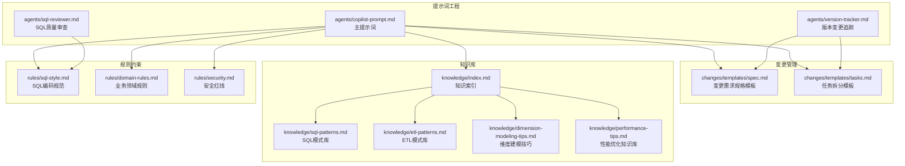
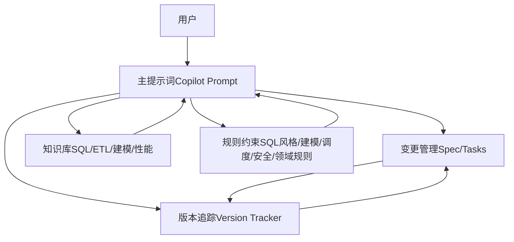
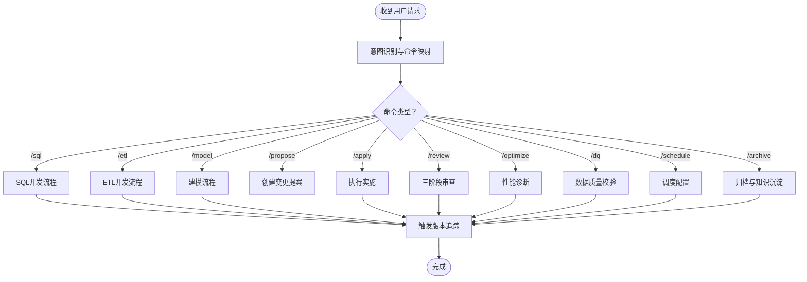
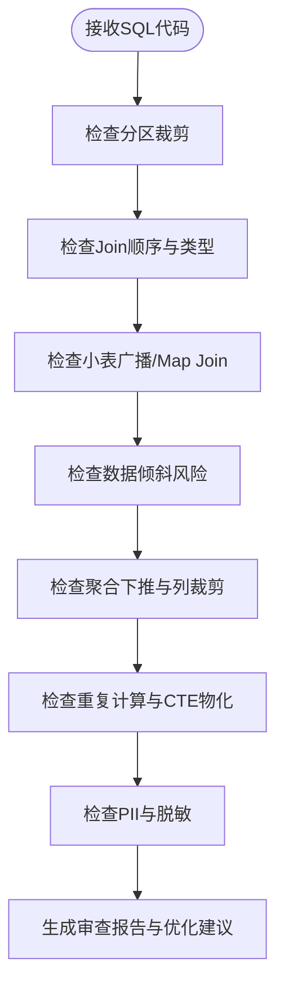
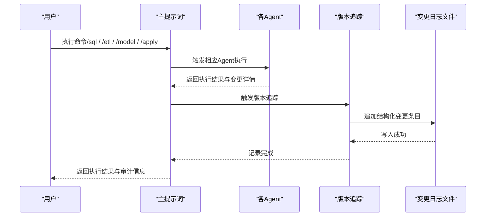
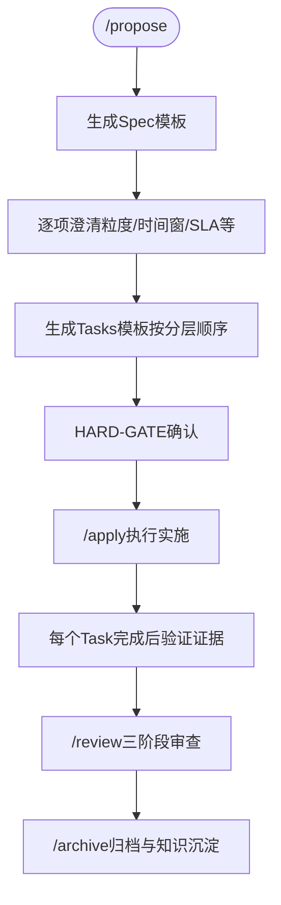
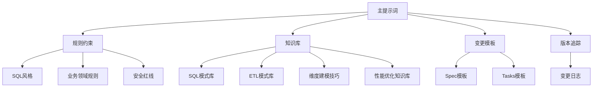

# 项目概述

<cite>
**本文引用的文件**
- [目录结构和设计说明.md](file://data_warehouse_engineering_code_copilot/目录结构和设计说明.md)
- [copilot-prompt.md](file://data_warehouse_engineering_code_copilot/agents/copilot-prompt.md)
- [sql-reviewer.md](file://data_warehouse_engineering_code_copilot/agents/sql-reviewer.md)
- [version-tracker.md](file://data_warehouse_engineering_code_copilot/agents/version-tracker.md)
- [domain-rules.md](file://data_warehouse_engineering_code_copilot/rules/domain-rules.md)
- [security.md](file://data_warehouse_engineering_code_copilot/rules/security.md)
- [sql-style.md](file://data_warehouse_engineering_code_copilot/rules/sql-style.md)
- [index.md](file://data_warehouse_engineering_code_copilot/knowledge/index.md)
- [sql-patterns.md](file://data_warehouse_engineering_code_copilot/knowledge/sql-patterns.md)
- [etl-patterns.md](file://data_warehouse_engineering_code_copilot/knowledge/etl-patterns.md)
- [dimension-modeling-tips.md](file://data_warehouse_engineering_code_copilot/knowledge/dimension-modeling-tips.md)
- [performance-tips.md](file://data_warehouse_engineering_code_copilot/knowledge/performance-tips.md)
- [spec.md](file://data_warehouse_engineering_code_copilot/changes/templates/spec.md)
- [tasks.md](file://data_warehouse_engineering_code_copilot/changes/templates/tasks.md)
</cite>

## 目录
1. [简介](#简介)
2. [项目结构](#项目结构)
3. [核心组件](#核心组件)
4. [架构总览](#架构总览)
5. [详细组件分析](#详细组件分析)
6. [依赖关系分析](#依赖关系分析)
7. [性能考量](#性能考量)
8. [故障排查指南](#故障排查指南)
9. [结论](#结论)
10. [附录](#附录)

## 简介
本项目“数据仓库工程AI协作助手”是一套面向数据仓库（Data Warehouse）开发场景的工程化提示词工程与协作框架，旨在帮助AI在数仓开发中：
- 遵循统一的SQL/建模/调度/安全规范
- 强制走“需求 → spec → 任务 → 实施 → 审查 → 归档”的完整闭环
- 复用沉淀的SQL模式、ETL模式、建模技巧、性能优化经验
- 自动追踪每次DDL/SQL/ETL/调度变更，形成可审计的变更日志

项目的核心理念是“Spec驱动 + 三段式知识结构 + 强制变更追踪”，并通过命令式协作（/sql、/etl、/model、/propose、/apply、/review、/optimize、/dq、/schedule、/archive等）确保AI在固定流程内工作，避免发散与遗漏。

## 项目结构
项目采用“提示词工程 + 变更管理 + 知识库 + 规则约束”的分层组织方式，目录结构如下：
- agents/：AI角色与子Agent提示词（主提示词、SQL审查、性能诊断、版本追踪等）
- changes/：变更管理（包含spec/tasks/log模板）
- knowledge/：数仓领域知识库（SQL模式、ETL模式、维度建模技巧、性能优化等）
- rules/：项目约束与规范（SQL风格、建模标准、调度标准、数据质量、安全红线、业务领域规则等）

图表来源
- [目录结构和设计说明.md:19-55](file://data_warehouse_engineering_code_copilot/目录结构和设计说明.md#L19-L55)
- [copilot-prompt.md:1-147](file://data_warehouse_engineering_code_copilot/agents/copilot-prompt.md#L1-L147)
- [version-tracker.md:1-120](file://data_warehouse_engineering_code_copilot/agents/version-tracker.md#L1-L120)
- [index.md:1-60](file://data_warehouse_engineering_code_copilot/knowledge/index.md#L1-L60)
- [sql-style.md:1-254](file://data_warehouse_engineering_code_copilot/rules/sql-style.md#L1-L254)
- [domain-rules.md:1-142](file://data_warehouse_engineering_code_copilot/rules/domain-rules.md#L1-L142)
- [security.md:1-98](file://data_warehouse_engineering_code_copilot/rules/security.md#L1-L98)

章节来源
- [目录结构和设计说明.md:19-55](file://data_warehouse_engineering_code_copilot/目录结构和设计说明.md#L19-L55)

## 核心组件
- 主提示词（Copilot Prompt）：定义AI身份、核心法则（Spec驱动、身份与原则、回答框架、命令体系）、启动流程与调试流程，确保AI在数仓开发中遵循统一规范与流程。
- SQL质量审查（SQL Reviewer）：对SQL代码进行分级审查（Critical/Important/Minor），涵盖正确性、性能与可维护性，提供量化评估与优化建议。
- 版本变更追踪（Version Tracker）：在DDL/SQL/ETL/调度变更后自动记录结构化日志，包含模块、分层、任务、操作类型、变更内容、关联文件、回刷范围、下游影响等，确保所有变更可审计、可回溯。
- 变更模板（Spec/Tasks）：标准化变更需求规格与任务拆分，确保每个变更都有明确的目标、范围、验证策略与回刷计划。
- 知识库（Knowledge Base）：包含SQL模式、ETL模式、维度建模技巧、性能优化知识，支持快速检索与复用。
- 规则约束（Rules）：涵盖SQL风格、建模标准、调度标准、数据质量、安全红线、业务领域规则，形成强制约束与推荐实践。

章节来源
- [copilot-prompt.md:1-147](file://data_warehouse_engineering_code_copilot/agents/copilot-prompt.md#L1-L147)
- [sql-reviewer.md:1-68](file://data_warehouse_engineering_code_copilot/agents/sql-reviewer.md#L1-L68)
- [version-tracker.md:1-120](file://data_warehouse_engineering_code_copilot/agents/version-tracker.md#L1-L120)
- [spec.md:1-132](file://data_warehouse_engineering_code_copilot/changes/templates/spec.md#L1-L132)
- [tasks.md:1-74](file://data_warehouse_engineering_code_copilot/changes/templates/tasks.md#L1-L74)
- [index.md:1-60](file://data_warehouse_engineering_code_copilot/knowledge/index.md#L1-L60)
- [sql-style.md:1-254](file://data_warehouse_engineering_code_copilot/rules/sql-style.md#L1-L254)
- [domain-rules.md:1-142](file://data_warehouse_engineering_code_copilot/rules/domain-rules.md#L1-L142)
- [security.md:1-98](file://data_warehouse_engineering_code_copilot/rules/security.md#L1-L98)

## 架构总览
项目通过“提示词工程”驱动AI在“变更管理”和“知识库”之间进行智能协作，同时受“规则约束”保障质量与安全。AI在每次命令执行后，自动触发版本追踪，确保变更可审计、可回溯。

图表来源
- [copilot-prompt.md:55-147](file://data_warehouse_engineering_code_copilot/agents/copilot-prompt.md#L55-L147)
- [version-tracker.md:5-16](file://data_warehouse_engineering_code_copilot/agents/version-tracker.md#L5-L16)
- [spec.md:1-132](file://data_warehouse_engineering_code_copilot/changes/templates/spec.md#L1-L132)
- [tasks.md:1-74](file://data_warehouse_engineering_code_copilot/changes/templates/tasks.md#L1-L74)
- [index.md:1-60](file://data_warehouse_engineering_code_copilot/knowledge/index.md#L1-L60)
- [sql-style.md:1-254](file://data_warehouse_engineering_code_copilot/rules/sql-style.md#L1-L254)
- [domain-rules.md:1-142](file://data_warehouse_engineering_code_copilot/rules/domain-rules.md#L1-L142)
- [security.md:1-98](file://data_warehouse_engineering_code_copilot/rules/security.md#L1-L98)

## 详细组件分析

### 组件A：主提示词（Copilot Prompt）
- 身份与原则：强调AI是“顶尖数仓工程师搭档”，输出中文、技术术语保留英文，不确定就问、不假设、不编造。
- 核心法则：Spec驱动（Model is Cheap, Context is Expensive），No Spec, No Change；Spec is Truth；Reverse Sync；现状必须有出处；变更即记录。
- 回答框架：问题理解、现状分析、方案设计、具体实现、验证方法、性能与成本考量、注意事项。
- 命令体系：/init、/sql、/etl、/model、/propose、/apply、/review、/optimize、/dq、/schedule、/archive，以及调试流程与诊断层级。

图表来源
- [copilot-prompt.md:36-147](file://data_warehouse_engineering_code_copilot/agents/copilot-prompt.md#L36-L147)
- [version-tracker.md:5-16](file://data_warehouse_engineering_code_copilot/agents/version-tracker.md#L5-L16)

章节来源
- [copilot-prompt.md:1-147](file://data_warehouse_engineering_code_copilot/agents/copilot-prompt.md#L1-L147)

### 组件B：SQL质量审查（SQL Reviewer）
- 审查分级：Critical（阻塞）、Important（应修复）、Minor（建议），覆盖计算结果、Join、分区裁剪、幂等、PII脱敏、字段别名等。
- 性能审查清单：分区裁剪、Join顺序、Map/Broadcast Join、数据倾斜、聚合下推、SELECT *、ORDER BY、DISTINCT替代、窗口函数PARTITION BY、CTE物化等。
- 输出格式：按分级列出问题与建议，提供性能评估摘要与量化影响。

图表来源
- [sql-reviewer.md:1-68](file://data_warehouse_engineering_code_copilot/agents/sql-reviewer.md#L1-L68)

章节来源
- [sql-reviewer.md:1-68](file://data_warehouse_engineering_code_copilot/agents/sql-reviewer.md#L1-L68)

### 组件C：版本变更追踪（Version Tracker）
- 触发时机：/sql、/etl、/model、/schedule、/dq、/apply每个Task完成后，以及用户手动记录。
- 记录格式：时间、模块、分层、任务、操作、变更内容、关联文件、回刷范围、下游影响、备注。
- 记录规则：原子化、精确引用、任务可追溯、下游必标注、回刷必声明、时间精确到分钟、不阻塞主流程。

图表来源
- [version-tracker.md:1-120](file://data_warehouse_engineering_code_copilot/agents/version-tracker.md#L1-L120)
- [copilot-prompt.md:63-147](file://data_warehouse_engineering_code_copilot/agents/copilot-prompt.md#L63-L147)

章节来源
- [version-tracker.md:1-120](file://data_warehouse_engineering_code_copilot/agents/version-tracker.md#L1-L120)

### 组件D：变更模板（Spec/Tasks）
- Spec模板：背景与目标、现状分析（数据源与数据流、现有模型结构、现有指标/口径、发现与风险）、功能点、业务规则与口径、模型变更（DDL）、SQL加工设计、ETL/同步变更、调度变更、数据质量规则（DQ）、影响范围、风险与关注点、验证策略、待澄清、技术决策、执行日志、审查结论、确认记录（HARD-GATE）。
- Tasks模板：按ODS→DIM→DWD→DWS→ADS顺序拆分，每个Task目标明确、涉及变更精确到库.表.字段/作业名/调度依赖、关键DDL/SQL、依赖、验收标准、验证方法、回刷计划。

图表来源
- [spec.md:1-132](file://data_warehouse_engineering_code_copilot/changes/templates/spec.md#L1-L132)
- [tasks.md:1-74](file://data_warehouse_engineering_code_copilot/changes/templates/tasks.md#L1-L74)
- [copilot-prompt.md:103-131](file://data_warehouse_engineering_code_copilot/agents/copilot-prompt.md#L103-L131)

章节来源
- [spec.md:1-132](file://data_warehouse_engineering_code_copilot/changes/templates/spec.md#L1-L132)
- [tasks.md:1-74](file://data_warehouse_engineering_code_copilot/changes/templates/tasks.md#L1-L74)

### 组件E：知识库（Knowledge Base）
- 索引：一句话索引，便于AI快速命中SQL模式、ETL模式、维度建模技巧、性能优化技巧。
- SQL模式库：去重保留最新、拉链表（SCD2）、同环比、TopN分组排名、累计求和、行转列/列转行、数据回刷、Lambda合并、缺失日期补齐、NULL安全比较。
- ETL模式库：CDC增量同步、JDBC增量抽取、MERGE/UPSERT、小文件控制、历史回刷、文件接入、API拉取、全量/增量/CDC选型对照、数据漂移与时区处理。
- 维度建模技巧：代理键vs业务键、SCD三种类型、桥接表、退化维度、一致性维度、事实表类型选择、维度表分级、分层归属判定。
- 性能优化知识库：分区裁剪、数据倾斜、Map Join/Broadcast Join、小文件问题、CTE物化策略、谓词下推与列裁剪、Join顺序与类型、窗口函数性能、存储格式与压缩、调度与资源、性能分析工具。

```mermaid
graph TB
KIndex["知识索引"] --> KSQL["SQL模式库"]
KIndex --> KETL["ETL模式库"]
KIndex --> KDM["维度建模技巧"]
KIndex --> KPerf["性能优化知识库"]
KSQL --> KSQL1["去重保留最新"]
KSQL --> KSQL2["拉链表SCD2"]
KSQL --> KSQL3["同环比"]
KSQL --> KSQL4["TopN分组排名"]
KSQL --> KSQL5["累计求和"]
KSQL --> KSQL6["行转列/列转行"]
KSQL --> KSQL7["数据回刷"]
KSQL --> KSQL8["Lambda合并"]
KSQL --> KSQL9["缺失日期补齐"]
KSQL --> KSQL10["NULL安全比较"]
KETL --> KETL1["CDC增量同步"]
KETL --> KETL2["JDBC增量抽取"]
KETL --> KETL3["MERGE/UPSERT"]
KETL --> KETL4["小文件控制"]
KETL --> KETL5["历史回刷"]
KETL --> KETL6["文件接入"]
KETL --> KETL7["API拉取"]
KETL --> KETL8["全量/增量/CDC选型对照"]
KETL --> KETL9["数据漂移与时区处理"]
KDM --> KDM1["代理键vs业务键"]
KDM --> KDM2["SCD三种类型"]
KDM --> KDM3["桥接表"]
KDM --> KDM4["退化维度"]
KDM --> KDM5["一致性维度"]
KDM --> KDM6["事实表类型选择"]
KDM --> KDM7["维度表分级"]
KDM --> KDM8["分层归属判定"]
KPerf --> KPerf1["分区裁剪"]
KPerf --> KPerf2["数据倾斜"]
KPerf --> KPerf3["Map Join/Broadcast Join"]
KPerf --> KPerf4["小文件问题"]
KPerf --> KPerf5["CTE物化策略"]
KPerf --> KPerf6["谓词下推与列裁剪"]
KPerf --> KPerf7["Join顺序与类型"]
KPerf --> KPerf8["窗口函数性能"]
KPerf --> KPerf9["存储格式与压缩"]
KPerf --> KPerf10["调度与资源"]
KPerf --> KPerf11["性能分析工具"]
```

图表来源
- [index.md:1-60](file://data_warehouse_engineering_code_copilot/knowledge/index.md#L1-L60)
- [sql-patterns.md:1-331](file://data_warehouse_engineering_code_copilot/knowledge/sql-patterns.md#L1-L331)
- [etl-patterns.md:1-220](file://data_warehouse_engineering_code_copilot/knowledge/etl-patterns.md#L1-L220)
- [dimension-modeling-tips.md:1-253](file://data_warehouse_engineering_code_copilot/knowledge/dimension-modeling-tips.md#L1-L253)
- [performance-tips.md:1-349](file://data_warehouse_engineering_code_copilot/knowledge/performance-tips.md#L1-L349)

章节来源
- [index.md:1-60](file://data_warehouse_engineering_code_copilot/knowledge/index.md#L1-L60)
- [sql-patterns.md:1-331](file://data_warehouse_engineering_code_copilot/knowledge/sql-patterns.md#L1-L331)
- [etl-patterns.md:1-220](file://data_warehouse_engineering_code_copilot/knowledge/etl-patterns.md#L1-L220)
- [dimension-modeling-tips.md:1-253](file://data_warehouse_engineering_code_copilot/knowledge/dimension-modeling-tips.md#L1-L253)
- [performance-tips.md:1-349](file://data_warehouse_engineering_code_copilot/knowledge/performance-tips.md#L1-L349)

### 组件F：规则约束（Rules）
- SQL风格：命名约定（库/表/字段/分区）、格式规范（关键字大小写、缩进/换行、头部注释）、编写原则（性能优先、正确性优先、可维护性）、禁止事项、命名检查清单、常见错误对照。
- 业务领域规则：通用业务规则（金额/百分比/时间维度/同比/环比/排名/排序键/状态颜色）、KPI/指标定义标准（必备属性、同名指标必须同口径）、数据质量规则（五大维度、严重等级、边界值定义）、历史数据约定、行业特定规则（零售/电商、金融、制造、互联网/用户行为）、跨系统口径一致性、项目特定规则。
- 安全红线：数据安全（禁止硬编码凭据/禁止直接展示PII/禁止在测试环境使用真实数据/禁止在公共仓库提交密钥）、字段级脱敏标准（手机号/身份证/邮箱/银行卡/姓名/地址/身份证哈希）、行级权限（RLS）、数据分级与访问控制（L1-L4）、上线与发布安全（代码评审/双签/回滚预案/KMS）、数据回刷安全（明确范围/影响/回退）、业务安全（财务/营收/上市口径标注）、跨境合规（GDPR/PIPL）、安全审计（查询留痕/异常告警/离职回收）、应急响应（泄露/错误数据流出/漏洞）。

```mermaid
flowchart TD
RStart(["读取规则文件"]) --> Style["SQL风格规范"]
RStart --> Domain["业务领域规则"]
RStart --> Security["安全红线"]
Style --> Naming["命名约定"]
Style --> Format["格式规范"]
Style --> Principles["编写原则"]
Style --> Prohibitions["禁止事项"]
Style --> Checklist["命名检查清单"]
Style --> Examples["常见错误对照"]
Domain --> General["通用业务规则"]
Domain --> KPI["KPI/指标定义标准"]
Domain --> DQ["数据质量规则"]
Domain --> History["历史数据约定"]
Domain --> Industry["行业特定规则"]
Domain --> Consistency["跨系统口径一致性"]
Domain --> Project["项目特定规则"]
Security --> Data["数据安全"]
Security --> Mask["字段级脱敏标准"]
Security --> RLS["行级权限RLS"]
Security --> Access["数据分级与访问控制"]
Security --> Release["上线与发布安全"]
Security --> Backfill["数据回刷安全"]
Security --> Business["业务安全"]
Security --> Cross["跨境合规"]
Security --> Audit["安全审计"]
Security --> Incident["应急响应"]
```

图表来源
- [sql-style.md:1-254](file://data_warehouse_engineering_code_copilot/rules/sql-style.md#L1-L254)
- [domain-rules.md:1-142](file://data_warehouse_engineering_code_copilot/rules/domain-rules.md#L1-L142)
- [security.md:1-98](file://data_warehouse_engineering_code_copilot/rules/security.md#L1-L98)

章节来源
- [sql-style.md:1-254](file://data_warehouse_engineering_code_copilot/rules/sql-style.md#L1-L254)
- [domain-rules.md:1-142](file://data_warehouse_engineering_code_copilot/rules/domain-rules.md#L1-L142)
- [security.md:1-98](file://data_warehouse_engineering_code_copilot/rules/security.md#L1-L98)

## 依赖关系分析
- 组件耦合与内聚：主提示词作为中枢，协调各Agent与模板；版本追踪贯穿所有变更流程，形成闭环；知识库与规则约束为AI提供“约束+经验+过程”的三段式知识结构。
- 直接与间接依赖：主提示词依赖规则约束与知识库；SQL审查依赖SQL风格规范；版本追踪依赖变更模板；变更模板依赖规则约束与知识库。
- 变更追踪与审计：版本追踪确保所有DDL/SQL/ETL/调度变更可审计、可回溯，形成完整的变更日志。
- 规则与规范：SQL风格、建模标准、调度标准、数据质量、安全红线、业务领域规则共同构成强制约束，保障质量与合规。

图表来源
- [copilot-prompt.md:1-147](file://data_warehouse_engineering_code_copilot/agents/copilot-prompt.md#L1-L147)
- [version-tracker.md:1-120](file://data_warehouse_engineering_code_copilot/agents/version-tracker.md#L1-L120)
- [spec.md:1-132](file://data_warehouse_engineering_code_copilot/changes/templates/spec.md#L1-L132)
- [tasks.md:1-74](file://data_warehouse_engineering_code_copilot/changes/templates/tasks.md#L1-L74)
- [sql-style.md:1-254](file://data_warehouse_engineering_code_copilot/rules/sql-style.md#L1-L254)
- [domain-rules.md:1-142](file://data_warehouse_engineering_code_copilot/rules/domain-rules.md#L1-L142)
- [security.md:1-98](file://data_warehouse_engineering_code_copilot/rules/security.md#L1-L98)
- [index.md:1-60](file://data_warehouse_engineering_code_copilot/knowledge/index.md#L1-L60)

章节来源
- [copilot-prompt.md:1-147](file://data_warehouse_engineering_code_copilot/agents/copilot-prompt.md#L1-L147)
- [version-tracker.md:1-120](file://data_warehouse_engineering_code_copilot/agents/version-tracker.md#L1-L120)
- [spec.md:1-132](file://data_warehouse_engineering_code_copilot/changes/templates/spec.md#L1-L132)
- [tasks.md:1-74](file://data_warehouse_engineering_code_copilot/changes/templates/tasks.md#L1-L74)
- [sql-style.md:1-254](file://data_warehouse_engineering_code_copilot/rules/sql-style.md#L1-L254)
- [domain-rules.md:1-142](file://data_warehouse_engineering_code_copilot/rules/domain-rules.md#L1-L142)
- [security.md:1-98](file://data_warehouse_engineering_code_copilot/rules/security.md#L1-L98)
- [index.md:1-60](file://data_warehouse_engineering_code_copilot/knowledge/index.md#L1-L60)

## 性能考量
- 分区裁剪：WHERE条件必须直接命中分区字段，禁止函数包裹，确保大型分区表的高效扫描。
- 数据倾斜：通过过滤/单独处理、加盐打散、Map Join等方式缓解热点数据导致的任务卡顿。
- Join优化：根据引擎特性选择Broadcast Hash Join、Shuffle Hash Join或Sort Merge Join，合理设置阈值与Hint。
- CTE物化：在Hive/Spark中谨慎使用WITH，必要时显式物化或临时表，避免重复计算。
- 列裁剪与谓词下推：尽量减少扫描列与行，确保WHERE条件能下推到数据源层。
- 存储格式：优先使用ORC/Parquet等列存格式，结合ZSTD压缩，提升查询性能与存储效率。
- 调度与资源：按主题/优先级划分资源队列，错峰调度，SLA基线倒推，失败重试与告警机制。

章节来源
- [performance-tips.md:1-349](file://data_warehouse_engineering_code_copilot/knowledge/performance-tips.md#L1-L349)
- [sql-reviewer.md:31-42](file://data_warehouse_engineering_code_copilot/agents/sql-reviewer.md#L31-L42)

## 故障排查指南
- 调试流程：现象收集 → 根因定位 → 方案验证 → 实施修复，禁止在未确认根因前直接修改SQL/DDL/调度作业。
- 诊断层级：数据源层 → 抽取层 → ODS层 → DWD层 → DWS层 → ADS层 → 应用层，逐层定位问题。
- 常见问题：全表扫描、笛卡尔积、重复维度行膨胀、分区裁剪失效、数据倾斜、小文件过多、CTE未物化、NULL处理缺失、时间过滤函数包裹分区字段等。
- 安全与合规：PII脱敏、RLS配置、数据分级、密钥管理、回刷审批与公告、跨境合规、安全审计与应急响应。

章节来源
- [copilot-prompt.md:133-147](file://data_warehouse_engineering_code_copilot/agents/copilot-prompt.md#L133-L147)
- [sql-reviewer.md:7-30](file://data_warehouse_engineering_code_copilot/agents/sql-reviewer.md#L7-L30)
- [security.md:1-98](file://data_warehouse_engineering_code_copilot/rules/security.md#L1-L98)

## 结论
本项目通过“Spec驱动 + 三段式知识结构 + 强制变更追踪”的设计，构建了面向数据仓库开发的AI协作框架。主提示词确保AI遵循统一规范与流程，SQL质量审查保障代码质量与性能，版本追踪实现可审计、可回溯的变更管理，变更模板与知识库支撑完整闭环与知识复用。与Power BI Code Copilot相比，本项目针对数仓场景强化了建模分层、SQL规范、ETL模式、调度与数据质量、安全与合规等方面，形成更贴合数仓工程实践的协作体系。

## 附录
- 使用方式：将项目目录加载到AI编码助手的工作区/系统提示词，AI自动扫描rules/、changes/当前进行中的变更，通过命令（/sql、/propose、/apply等）开展协作，首次使用执行/init填充rules/project-context.md。
- 后续扩展点：独立的数据质量评审Agent、实时数仓专题、湖仓一体专题、云数仓成本优化、dbt/SQLMesh集成、数据血缘平台集成等。

章节来源
- [目录结构和设计说明.md:186-204](file://data_warehouse_engineering_code_copilot/目录结构和设计说明.md#L186-L204)