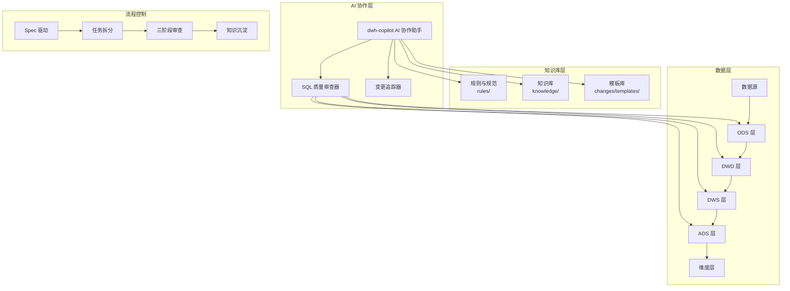
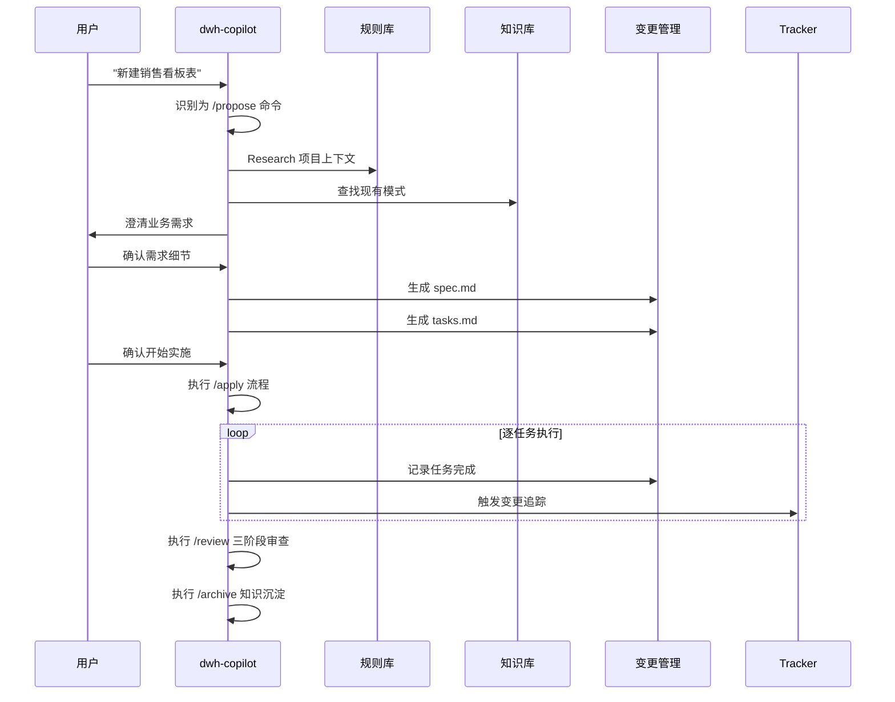
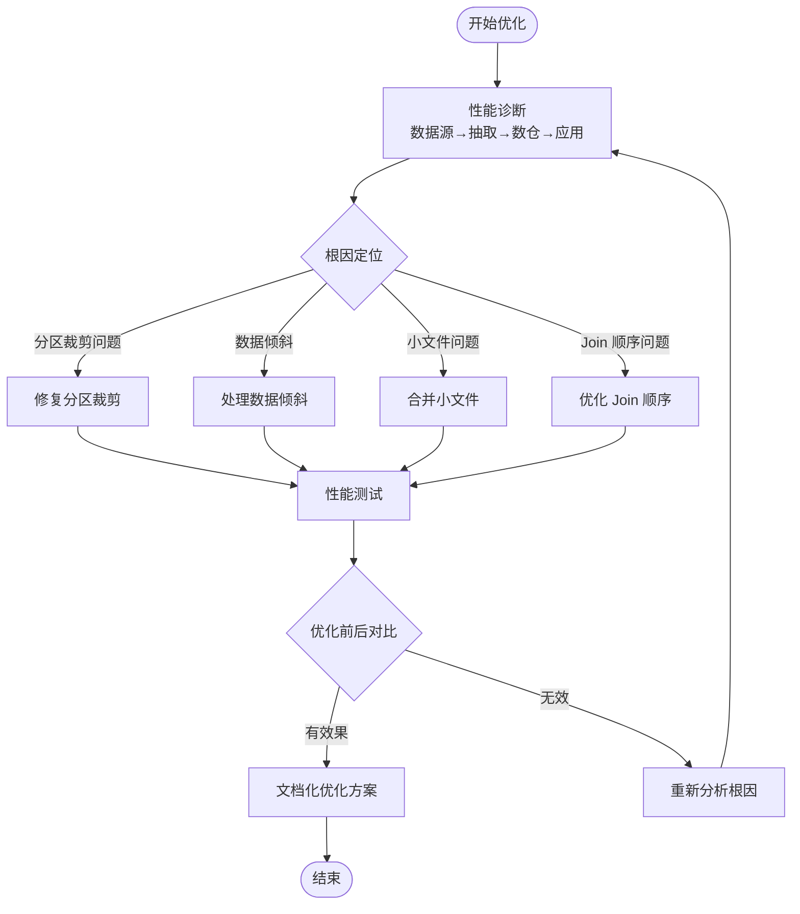
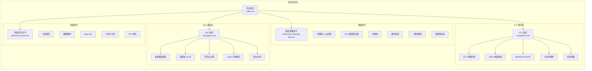
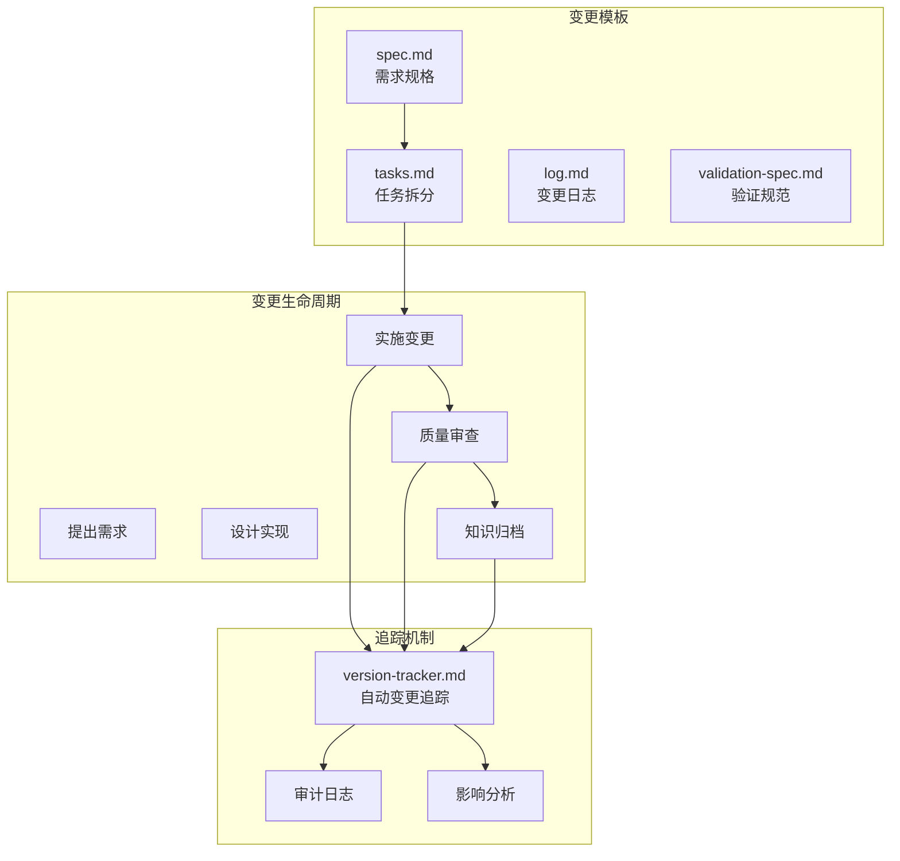

# 项目简介

<cite>
**本文引用的文件**
- [目录结构和设计说明.md](file://目录结构和设计说明.md)
- [copilot-prompt.md](file://agents/copilot-prompt.md)
- [sql-reviewer.md](file://agents/sql-reviewer.md)
- [index.md](file://knowledge/index.md)
- [sql-patterns.md](file://knowledge/sql-patterns.md)
- [etl-patterns.md](file://knowledge/etl-patterns.md)
- [spec.md](file://changes/templates/spec.md)
- [tasks.md](file://changes/templates/tasks.md)
- [sql-style.md](file://rules/sql-style.md)
- [domain-rules.md](file://rules/domain-rules.md)
</cite>

## 目录
1. [引言](#引言)
2. [项目定位与价值主张](#项目定位与价值主张)
3. [核心设计理念](#核心设计理念)
4. [主要功能概览](#主要功能概览)
5. [核心优势](#核心优势)
6. [应用场景与目标用户](#应用场景与目标用户)
7. [整体架构与工作流](#整体架构与工作流)
8. [知识库与提示词工程](#知识库与提示词工程)
9. [变更管理与追踪](#变更管理与追踪)
10. [总结](#总结)

## 引言

dwh-copilot 是一个专为数据仓库开发场景设计的 AI 协作助手系统。该项目通过工程化的提示词工程和结构化的知识库系统，帮助数据仓库团队在建模、SQL 开发、ETL 集成、性能优化、数据质量保障和调度配置等各个环节实现标准化、可审计、可复用的协作流程。

## 项目定位与价值主张

### 项目定位
- **专业领域 AI 协作助手**：专注于数据仓库工程领域的 AI 协作工具，区别于通用数据分析助手
- **工程化提示词工程**：将最佳实践、规范约束和知识经验固化为可加载到 AI 编码助手的工程化提示词
- **数仓全生命周期管理**：覆盖从需求分析到上线运维的完整数据仓库工程流程

### 价值主张
- **提升开发效率**：通过标准化模板和智能审查减少重复劳动
- **保证工程质量**：强制规范约束和三阶段审查确保代码质量
- **降低维护成本**：完整的变更追踪和知识沉淀机制
- **加速团队成长**：将资深工程师的经验转化为可复用的知识资产

## 核心设计理念

### 1. Spec 驱动原则
- **核心理念**：Spec 是昂贵的核心资产，SQL 脚本和 DDL 都是可重建的消耗品
- **四条铁律**：
  - No Spec, No Change（没有 spec，不准改）
  - Spec is Truth（spec 与实现冲突时，错的一定是实现）
  - Reverse Sync（发现偏差先改 spec 再改实现）
  - 变更即记录（任何变更必须更新 changes/ 与 changelog）

### 2. 三段式知识结构
- **rules/**：约束与规范（红线，强制遵守）
- **knowledge/**：经验与模式库（工具箱，推荐使用）
- **changes/**：过程与历史（变更记录，可审计）

### 3. 命令式协作
通过标准化命令体系让 AI 在固定流程内工作：
- `/sql`：SQL 开发
- `/etl`：ETL/数据集成
- `/model`：数仓建模
- `/propose`：创建变更提案
- `/apply`：按 spec 实施
- `/review`：三阶段审查
- `/optimize`：性能诊断
- `/dq`：数据质量校验
- `/schedule`：调度配置
- `/archive`：归档与知识沉淀

**章节来源**
- [目录结构和设计说明.md: 61-106:61-106](file://目录结构和设计说明.md#L61-L106)
- [copilot-prompt.md: 6-52:6-52](file://agents/copilot-prompt.md#L6-L52)

## 主要功能概览

### 1. 智能建模与设计
- **分层建模**：严格遵循 ODS/DWD/DWS/ADS/DIM 分层规范
- **维度建模**：支持 SCD 全套策略和各种建模技巧
- **DDL 设计**：自动检查命名规范、分区策略、生命周期管理

### 2. SQL 开发辅助
- **模式库复用**：内置丰富的 SQL 模式（去重、拉链、同环比、TopN 等）
- **性能优化**：分区裁剪、Join 优化、倾斜处理等最佳实践
- **代码审查**：自动识别潜在问题和性能隐患

### 3. ETL 集成支持
- **同步模式**：CDC、JDBC、MERGE/UPSERT、小文件控制等
- **回刷管理**：分批回刷 + 进度跟踪 + 失败重试
- **文件接入**：CSV/Excel/JSON 等多格式处理

### 4. 数据质量保障
- **五大维度**：完整性、唯一性、一致性、准确性、时效性
- **验证策略**：行数核验、抽样校验、对账验证、性能验证
- **严重等级**：P0/P1/P2 分级管理

### 5. 调度与运维
- **依赖管理**：上游就绪触发、SLA 基线倒推
- **错峰调度**：避免资源冲突
- **失败回放**：自动重试和告警机制

**章节来源**
- [目录结构和设计说明.md: 109-123:109-123](file://目录结构和设计说明.md#L109-L123)
- [sql-patterns.md: 1-200:1-200](file://knowledge/sql-patterns.md#L1-L200)
- [etl-patterns.md: 1-200:1-200](file://knowledge/etl-patterns.md#L1-L200)

## 核心优势

### 1. 标准化流程
- **完整闭环**：需求 → spec → 任务 → 实施 → 审查 → 归档
- **原子化任务**：每个任务都是可独立验证的变更单元
- **零偏差原则**：Plan 是合同，AI 是打印机

### 2. 智能知识管理
- **知识飞轮**：实践 → 知识发现 → 沉淀 → 复用
- **快速检索**：一句话索引 + 结构化模式库
- **持续演进**：随着实践不断丰富和完善

### 3. 强制质量控制
- **三阶段审查**：Spec 合规 → 模型质量 → SQL 质量
- **性能优先**：从源头预防性能问题
- **安全合规**：PII 脱敏、行级权限、数据分级

### 4. 可审计追踪
- **变更日志**：精确到库.表.字段的结构化记录
- **影响分析**：自动追踪上下游依赖关系
- **回溯能力**：支持历史变更的完整回溯

**章节来源**
- [目录结构和设计说明.md: 126-167:126-167](file://目录结构和设计说明.md#L126-L167)
- [copilot-prompt.md: 113-136:113-136](file://agents/copilot-prompt.md#L113-L136)

## 应用场景与目标用户

### 主要应用场景
- **新需求开发**：从概念到上线的完整流程支持
- **性能优化**：多层级诊断和优化建议
- **数据质量治理**：系统性的 DQ 规则和验证方法
- **团队协作**：标准化的变更管理和知识共享
- **知识传承**：将资深工程师经验固化为可复用资产

### 目标用户群体
- **数据仓库工程师**：需要高效开发和维护数据仓库
- **数据分析师**：需要可靠的数据支撑和质量保障
- **技术经理**：需要统一标准和质量控制
- **运维人员**：需要稳定的调度和监控机制
- **项目经理**：需要透明的变更追踪和风险管理

## 整体架构与工作流

### 系统架构图

**图表来源**
- [目录结构和设计说明.md: 24-54:24-54](file://目录结构和设计说明.md#L24-L54)
- [copilot-prompt.md: 63-132:63-132](file://agents/copilot-prompt.md#L63-L132)

### 典型工作流

#### 场景 A：新建数据需求

**图表来源**
- [目录结构和设计说明.md: 128-151:128-151](file://目录结构和设计说明.md#L128-L151)
- [copilot-prompt.md: 103-131:103-131](file://agents/copilot-prompt.md#L103-L131)

#### 场景 B：性能优化

**图表来源**
- [copilot-prompt.md: 117-119:117-119](file://agents/copilot-prompt.md#L117-L119)
- [sql-reviewer.md: 31-42:31-42](file://agents/sql-reviewer.md#L31-L42)

## 知识库与提示词工程

### 知识库结构

**图表来源**
- [index.md: 1-60:1-60](file://knowledge/index.md#L1-L60)
- [sql-patterns.md: 1-200:1-200](file://knowledge/sql-patterns.md#L1-L200)
- [etl-patterns.md: 1-200:1-200](file://knowledge/etl-patterns.md#L1-L200)

### 提示词工程特点

#### 主提示词设计
- **身份定位**：顶尖数仓工程师搭档，不是 SQL 生成器
- **回答框架**：问题理解 → 现状分析 → 方案设计 → 具体实现 → 验证方法 → 性能考量 → 注意事项
- **约束原则**：必须标注出处、不做假设、有价值发现主动沉淀

#### 专项审查器
- **SQL 质量审查**：Critical/Important/Minor 三级分类
- **性能审查清单**：分区裁剪、Join 顺序、倾斜风险、CTE 物化等
- **安全合规检查**：PII 脱敏、行级权限、数据分级

**章节来源**
- [copilot-prompt.md: 1-147:1-147](file://agents/copilot-prompt.md#L1-L147)
- [sql-reviewer.md: 1-68:1-68](file://agents/sql-reviewer.md#L1-L68)

## 变更管理与追踪

### 变更模板体系

**图表来源**
- [spec.md: 1-132:1-132](file://changes/templates/spec.md#L1-L132)
- [tasks.md: 1-74:1-74](file://changes/templates/tasks.md#L1-L74)

### 变更追踪特性
- **自动记录**：DDL/SQL/ETL/调度变更自动追加结构化日志
- **精确描述**：时间、模块、分层、操作类型、变更内容
- **关联分析**：关联文件、回刷范围、下游影响
- **可审计性**：所有变更都可审计、可回溯

**章节来源**
- [目录结构和设计说明.md: 98-106:98-106](file://目录结构和设计说明.md#L98-L106)
- [spec.md: 1-132:1-132](file://changes/templates/spec.md#L1-L132)

## 总结

dwh-copilot 通过工程化的提示词设计和结构化的知识库系统，为数据仓库开发提供了完整的 AI 协作解决方案。其核心价值在于：

1. **标准化流程**：通过 Spec 驱动和命令式协作确保开发流程的一致性和可预测性
2. **智能化辅助**：基于丰富的模式库和最佳实践，提供智能的建模、SQL 开发和 ETL 集成建议
3. **质量保障体系**：三阶段审查和强制规范约束确保工程质量和安全性
4. **知识传承机制**：完整的变更追踪和知识沉淀促进团队经验积累和传承

该系统特别适合需要建立标准化数据仓库工程流程的企业和团队，能够显著提升开发效率、保证工程质量，并降低维护成本。