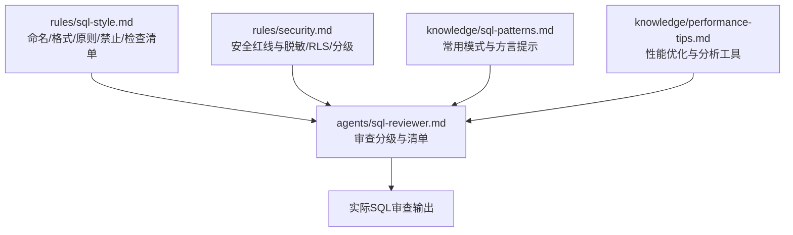
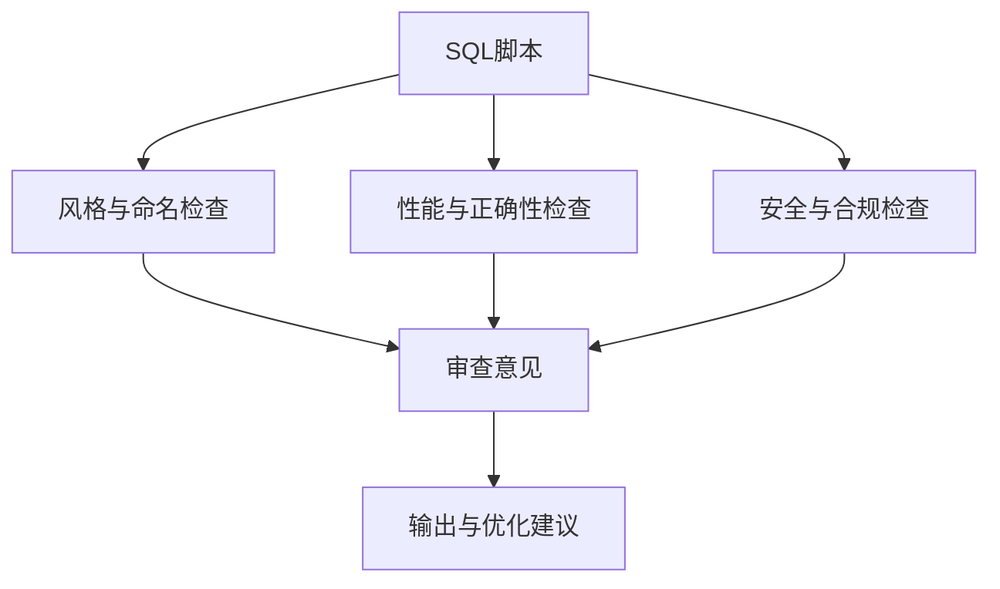
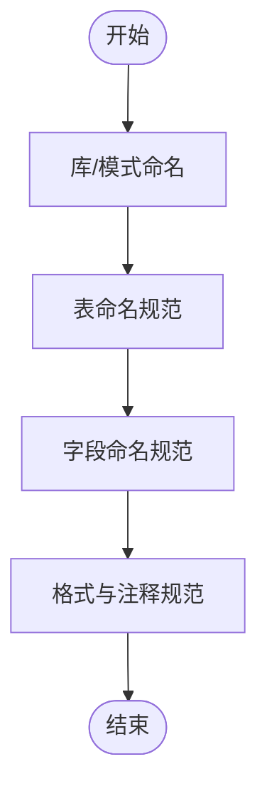
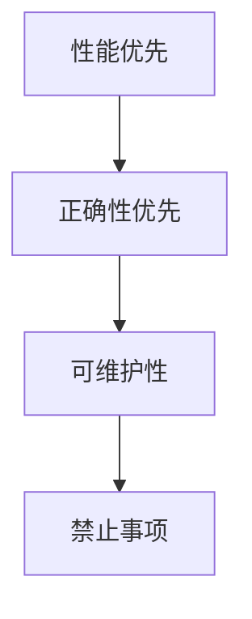
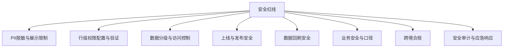
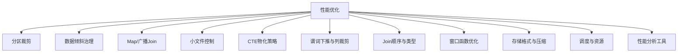
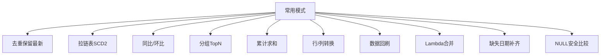
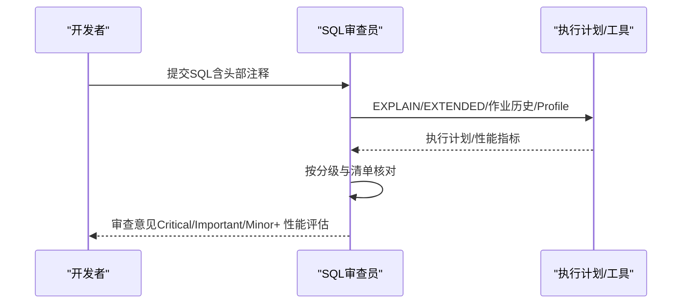
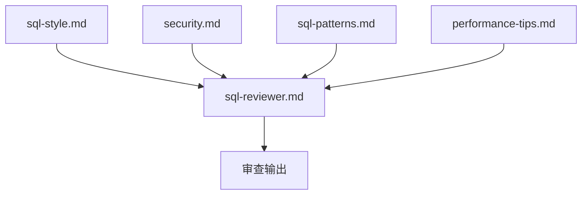

# SQL编码规范

<cite>
**本文引用的文件**
- [rules/sql-style.md](file://rules/sql-style.md)
- [rules/security.md](file://rules/security.md)
- [knowledge/sql-patterns.md](file://knowledge/sql-patterns.md)
- [knowledge/performance-tips.md](file://knowledge/performance-tips.md)
- [agents/sql-reviewer.md](file://agents/sql-reviewer.md)
</cite>

## 目录
1. [简介](#简介)
2. [项目结构](#项目结构)
3. [核心组件](#核心组件)
4. [架构总览](#架构总览)
5. [详细组件分析](#详细组件分析)
6. [依赖分析](#依赖分析)
7. [性能考量](#性能考量)
8. [故障排查指南](#故障排查指南)
9. [结论](#结论)
10. [附录](#附录)

## 简介
本规范面向数据仓库工程中的SQL编写与审查，系统化定义命名约定、格式化标准、注释规范、性能优化策略与安全编码要求。内容来源于仓库内的SQL风格、安全红线、常用模式与性能知识库，并结合SQL代码审查员的检查清单，形成可执行、可落地的工程实践指南。

## 项目结构
围绕SQL编码规范，仓库内关键文件分布如下：
- rules/sql-style.md：SQL命名、格式、编写原则、禁止事项、检查清单与常见错误对照
- rules/security.md：数据安全、字段脱敏、行级权限、数据分级与访问控制、上线发布安全、安全审计与应急响应
- knowledge/sql-patterns.md：经过验证的高质量数仓SQL模式（去重保留最新、拉链表、同比环比、TopN、累计求和、行列转换、回刷幂等、Lambda合并、缺失日期补齐、NULL安全比较）
- knowledge/performance-tips.md：分区裁剪、数据倾斜、Map/广播Join、小文件、CTE物化、谓词下推与列裁剪、Join顺序与类型、窗口函数、存储格式与压缩、调度与资源、性能分析工具
- agents/sql-reviewer.md：SQL质量审查分级、性能审查清单与输出格式

**图表来源**
- [rules/sql-style.md:1-254](file://rules/sql-style.md#L1-L254)
- [rules/security.md:1-98](file://rules/security.md#L1-L98)
- [knowledge/sql-patterns.md:1-331](file://knowledge/sql-patterns.md#L1-L331)
- [knowledge/performance-tips.md:1-349](file://knowledge/performance-tips.md#L1-L349)
- [agents/sql-reviewer.md:1-68](file://agents/sql-reviewer.md#L1-L68)

**章节来源**
- [rules/sql-style.md:1-254](file://rules/sql-style.md#L1-L254)
- [rules/security.md:1-98](file://rules/security.md#L1-L98)
- [knowledge/sql-patterns.md:1-331](file://knowledge/sql-patterns.md#L1-L331)
- [knowledge/performance-tips.md:1-349](file://knowledge/performance-tips.md#L1-L349)
- [agents/sql-reviewer.md:1-68](file://agents/sql-reviewer.md#L1-L68)

## 核心组件
- 命名约定：库/模式、表、字段、分区字段的统一命名与前缀后缀规范
- 格式规范：关键字/函数/标识符大小写、缩进与换行、头部注释与行内注释
- 编写原则：性能优先、正确性优先、可维护性优先
- 禁止事项：分区写入方式、删除表、硬编码日期、跨层反向引用、ADS/DWS直连ODS、魔法数字、调试代码残留
- 常见错误对照：SELECT *、函数包裹分区字段、浮点存金额、保留字字段名、硬编码日期
- 安全红线：凭据硬编码、PII直接展示、非安全渠道传输、测试环境使用真实数据、公共仓库泄露密钥、字段级脱敏、行级权限、数据分级与访问控制、上线发布安全、数据回刷安全、业务安全、跨境合规、安全审计、应急响应
- 性能优化：分区裁剪、数据倾斜治理、Map/广播Join、小文件控制、CTE物化策略、谓词下推与列裁剪、Join顺序与类型、窗口函数优化、存储格式与压缩、调度与资源、性能分析工具
- 常用模式：去重保留最新、拉链表、同比环比、TopN、累计求和、行列转换、回刷幂等、Lambda合并、缺失日期补齐、NULL安全比较
- 审查清单：SQL质量分级、性能审查清单、输出格式

**章节来源**
- [rules/sql-style.md:7-254](file://rules/sql-style.md#L7-L254)
- [rules/security.md:5-98](file://rules/security.md#L5-L98)
- [knowledge/sql-patterns.md:1-331](file://knowledge/sql-patterns.md#L1-L331)
- [knowledge/performance-tips.md:1-349](file://knowledge/performance-tips.md#L1-L349)
- [agents/sql-reviewer.md:1-68](file://agents/sql-reviewer.md#L1-L68)

## 架构总览
SQL编码规范的“输入—处理—输出”流程如下：
- 输入：SQL脚本（含头部注释、格式化、命名与字段类型）
- 处理：性能与正确性检查（分区裁剪、Join顺序、CTE物化、谓词下推、列裁剪、倾斜风险、窗口函数、存储格式）、安全审查（PII脱敏、RLS、分级与访问控制、凭据管理）
- 输出：审查意见（Critical/Important/Minor）、性能评估与优化建议、可复用模式引用

[此图为概念性流程图，不直接映射具体源文件，故不提供图表来源]

## 详细组件分析

### 命名约定与格式规范
- 库/模式命名：按层定义（ods/dwd/dws/ads/dim/tmp/ops），统一前缀与语义化命名
- 表命名：统一采用“层_业务过程_粒度后缀”，粒度后缀覆盖天增量/全量/累积、小时、按天/小时/月聚合、拉链表、实时等
- 字段命名：主键/外键、金额/数量/比率/标志位/时间戳/日期/状态/元信息；分区字段统一dt（小时分区dh）
- 格式规范：关键字大写、函数小写、标识符小写；缩进4空格、字段独占行、别名对齐、JOIN/ON分行、AND/OR放行首、嵌套子查询改写为CTE
- 注释规范：强制头部注释（用途/依赖/产出/调度/责任人/变更记录）；对非显然业务规则补充行内注释

**图表来源**
- [rules/sql-style.md:9-163](file://rules/sql-style.md#L9-L163)

**章节来源**
- [rules/sql-style.md:7-163](file://rules/sql-style.md#L7-L163)

### 编写原则与禁止事项
- 性能优先：大型分区表必须分区裁剪、优先CTE替代深层子查询、多次引用的复杂CTE物化为临时表、小表Join大表使用Map/广播hint、优先GROUP BY替代DISTINCT、禁止SELECT *与最外层不必要的ORDER BY、禁止函数包裹分区字段
- 正确性优先：Join条件必须包含两侧分区字段、显式处理NULL、DECIMAL优于浮点、类型显式转换、写入大表使用INSERT OVERWRITE保证幂等
- 可维护性：复杂SQL拆分为语义化CTE、统一表别名、避免超长字段表达式
- 禁止事项：禁止INSERT INTO写分区表、禁止DROP TABLE出现在调度脚本、禁止硬编码业务日期、禁止跨层反向引用、禁止ADS/DWS直连ODS、禁止未注释的魔法数字、禁止生产SQL保留调试代码

**图表来源**
- [rules/sql-style.md:165-201](file://rules/sql-style.md#L165-L201)

**章节来源**
- [rules/sql-style.md:165-201](file://rules/sql-style.md#L165-L201)

### 常见错误对照
- SELECT * → 明列字段
- 函数包裹分区字段 → 直接比较分区字段
- FLOAT存金额 → DECIMAL
- 使用SQL保留字作为字段名 → 使用语义化名称
- 硬编码日期 → 使用${bizdate}等变量

**章节来源**
- [rules/sql-style.md:226-254](file://rules/sql-style.md#L226-L254)

### 安全编码规范
- 数据安全：禁止硬编码凭据；ADS/视图不得直接展示PII；测试环境不得使用真实生产数据；禁止在公共仓库提交密钥/内部样本
- 字段级脱敏：手机号、身份证、邮箱、银行卡、姓名（中文）、地址等按标准掩码或哈希处理
- 行级权限（RLS）：多租户/多组织/多业务线表必须配置RLS，规则需明确定义并通过人工审查
- 数据分级与访问控制：L1-L4分级与访问限制；L3+数据导出需二次审批；跨级别合并表按最高级别管控
- 上线与发布安全：生产SQL必须代码评审；涉及PII/财务表需双签；DDL变更需回滚预案；服务账号使用统一密钥管理
- 数据回刷安全：明确范围、影响与回退方案；对外指标回刷需公告；低峰期执行
- 业务安全：财务/营收/上市口径指标需标注精度与披露口径；预测/预算指标明确时效性与可靠性
- 跨境合规：GDPR/PIPL等法规遵循；出境数据去标识化；跨境数据分类需清单与审批
- 安全审计：L3+数据查询留痕；异常访问告警；离职员工权限回收
- 应急响应：数据泄露/错误数据流出/SQL注入/漏洞发现后的处置流程

**图表来源**
- [rules/security.md:7-98](file://rules/security.md#L7-L98)

**章节来源**
- [rules/security.md:5-98](file://rules/security.md#L5-L98)

### 性能优化与常用模式
- 分区裁剪：WHERE直接命中分区字段，禁止函数包裹；通过EXPLAIN/EXTENDED验证
- 数据倾斜：热点key过滤单独处理、加盐打散、Map Join；配置自适应优化参数
- Map/广播Join：小表阈值建议与Hint使用；注意driver内存累积
- 小文件：控制reduce数、DISTRIBUTE BY散列、AQE自动合并、周期性合并
- CTE物化：Hive/Spark默认不物化，复杂多次引用需物化或缓存
- 谓词下推与列裁剪：WHERE下推、避免UDF阻断、SELECT明确字段
- Join顺序与类型：Broadcast Hash Join最快、Sort Merge Join代价高、Bucket Join跳过Shuffle
- 窗口函数：合理PARTITION BY列基数、配合DISTRIBUTE BY/SORT BY
- 存储格式与压缩：推荐ORC+ZSTD（Hive）/Parquet+ZSTD（Spark），列存收益显著
- 调度与资源：队列划分、错峰调度、SLA基线、失败重试策略
- 性能分析工具：EXPLAIN/作业历史/Profile/Stage Metrics/数据采样/统计信息

**图表来源**
- [knowledge/performance-tips.md:5-349](file://knowledge/performance-tips.md#L5-L349)

**章节来源**
- [knowledge/performance-tips.md:1-349](file://knowledge/performance-tips.md#L1-L349)

### 常用SQL模式与方言提示
- 去重保留最新：ROW_NUMBER() OVER PARTITION BY + tie-breaker；QUALIFY写法（Snowflake/Databricks/部分Flink SQL）
- 拉链表（SCD Type 2）：老链关、新链开；INSERT OVERWRITE保证幂等；建议定期归档
- 同比/环比：LEFT JOIN日期偏移；处理空值与除零约定
- 分组TopN：ROW_NUMBER/RANK/DENSE_RANK差异；注意基数与排序
- 累计求和：ROWS BETWEEN UNBOUNDED PRECEDING AND CURRENT ROW；跨年/跨月分组
- 行转列/列转行：CASE WHEN透视；UNION ALL/stack/unnest方言差异
- 数据回刷：INSERT OVERWRITE单分区；多分区批量回刷封装
- Lambda合并：ODS全量+增量合并；注意schema一致
- 缺失日期补齐：LEFT JOIN日期维度表
- NULL安全比较：Spark/Hive使用<=>；通用写法OR(IS NULL)组合

**图表来源**
- [knowledge/sql-patterns.md:6-331](file://knowledge/sql-patterns.md#L6-L331)

**章节来源**
- [knowledge/sql-patterns.md:1-331](file://knowledge/sql-patterns.md#L1-L331)

### SQL代码审查标准与检查清单
- 审查分级：Critical（阻塞）、Important（应修复）、Minor（建议）
- 性能审查清单：分区裁剪、Join顺序与类型、Map/广播Join、数据倾斜风险、聚合下推、SELECT*、不必要的ORDER BY、DISTINCT与GROUP BY替换、窗口函数PARTITION BY合理性、CTE物化情况
- 输出格式：问题定位、影响评估（低/中/高）、扫描数据量预估、优化建议摘要

**图表来源**
- [agents/sql-reviewer.md:1-68](file://agents/sql-reviewer.md#L1-L68)

**章节来源**
- [agents/sql-reviewer.md:1-68](file://agents/sql-reviewer.md#L1-L68)

## 依赖分析
SQL编码规范在工程中的依赖关系如下：
- rules/sql-style.md 为基础规范，指导命名、格式、原则与禁止事项
- rules/security.md 为安全基线，约束PII处理、RLS、分级与访问控制
- knowledge/sql-patterns.md 提供可复用模式，降低重复造轮子与错误率
- knowledge/performance-tips.md 提供性能优化策略与工具使用方法
- agents/sql-reviewer.md 将上述规范转化为可执行的审查流程与清单

**图表来源**
- [rules/sql-style.md:1-254](file://rules/sql-style.md#L1-L254)
- [rules/security.md:1-98](file://rules/security.md#L1-L98)
- [knowledge/sql-patterns.md:1-331](file://knowledge/sql-patterns.md#L1-L331)
- [knowledge/performance-tips.md:1-349](file://knowledge/performance-tips.md#L1-L349)
- [agents/sql-reviewer.md:1-68](file://agents/sql-reviewer.md#L1-L68)

**章节来源**
- [rules/sql-style.md:1-254](file://rules/sql-style.md#L1-L254)
- [rules/security.md:1-98](file://rules/security.md#L1-L98)
- [knowledge/sql-patterns.md:1-331](file://knowledge/sql-patterns.md#L1-L331)
- [knowledge/performance-tips.md:1-349](file://knowledge/performance-tips.md#L1-L349)
- [agents/sql-reviewer.md:1-68](file://agents/sql-reviewer.md#L1-L68)

## 性能考量
- 分区裁剪：WHERE直接命中分区字段，避免函数包裹；通过EXPLAIN/EXTENDED验证
- 数据倾斜：识别热点key，采用过滤单独处理、加盐打散、Map Join；配置自适应优化参数
- Join策略：根据表规模选择Broadcast Hash Join或Sort Merge Join；Bucket Join跳过Shuffle
- CTE物化：Hive/Spark默认不物化，复杂多次引用需物化或缓存
- 谓词下推与列裁剪：WHERE下推、避免UDF阻断、SELECT明确字段
- 窗口函数：合理PARTITION BY列基数、配合DISTRIBUTE BY/SORT BY
- 存储格式：ORC+ZSTD（Hive）/Parquet+ZSTD（Spark），列存收益显著
- 调度与资源：队列划分、错峰调度、SLA基线、失败重试策略
- 性能分析：EXPLAIN/作业历史/Profile/Stage Metrics/数据采样/统计信息

**章节来源**
- [knowledge/performance-tips.md:5-349](file://knowledge/performance-tips.md#L5-L349)

## 故障排查指南
- 全表扫描：检查WHERE是否包裹分区字段；确认执行计划包含分区裁剪
- 数据倾斜：采样热点key；采用加盐打散或过滤单独处理；调整Join顺序与类型
- Join性能问题：确认小表广播阈值；避免多个广播Join嵌套导致driver内存压力
- CTE重复计算：在Hive/Spark中将复杂CTE物化为临时表或显式缓存
- 谓词下推失效：将过滤条件移至WHERE而非ON；避免UDF阻断
- 窗口函数倾斜：合理PARTITION BY列基数；配合DISTRIBUTE BY/SORT BY
- 小文件问题：控制reduce数、DISTRIBUTE BY散列、启用AQE自动合并、周期性合并
- 性能分析：使用EXPLAIN/作业历史/Profile/Stage Metrics/数据采样/统计信息

**章节来源**
- [knowledge/performance-tips.md:23-349](file://knowledge/performance-tips.md#L23-L349)

## 结论
本规范以仓库内的SQL风格、安全、性能与常用模式为基础，构建了覆盖命名、格式、性能、安全与审查的完整体系。建议在实际开发中：
- 严格遵循命名与格式规范，确保一致性与可读性
- 优先采用分区裁剪、Map/广播Join、CTE物化等性能优化策略
- 严格执行安全红线与脱敏/RLS/分级要求
- 使用常用模式降低重复与错误，提升可维护性
- 通过审查清单与工具进行持续的质量与性能把关

## 附录
- 审查输出模板与分级说明参见SQL审查员定义
- 常用模式与方言差异参见SQL模式库
- 性能分析工具与验证方法参见性能知识库

**章节来源**
- [agents/sql-reviewer.md:44-68](file://agents/sql-reviewer.md#L44-L68)
- [knowledge/sql-patterns.md:4-5](file://knowledge/sql-patterns.md#L4-L5)
- [knowledge/performance-tips.md:327-349](file://knowledge/performance-tips.md#L327-L349)