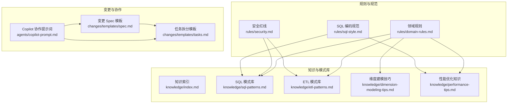
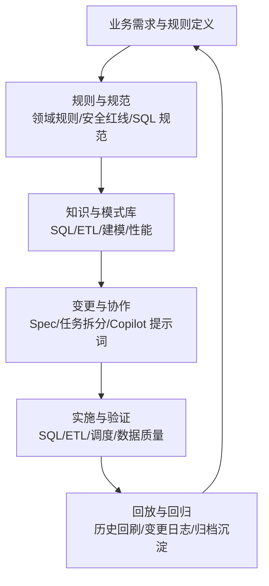
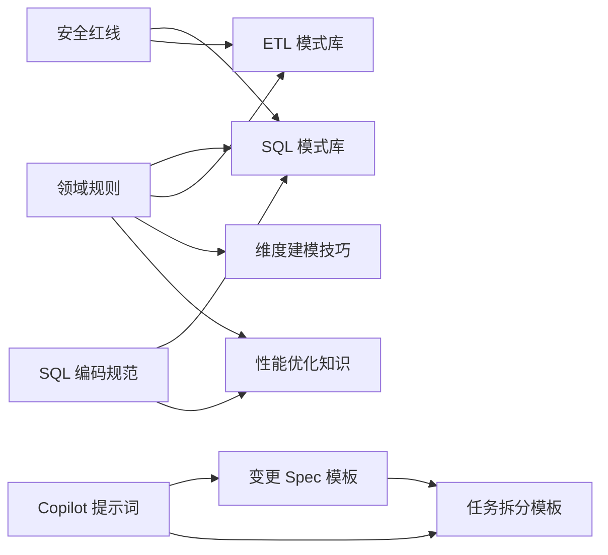

# 业务领域规则

<cite>
**本文引用的文件**
- [domain-rules.md](file://rules/domain-rules.md)
- [security.md](file://rules/security.md)
- [sql-style.md](file://rules/sql-style.md)
- [index.md](file://knowledge/index.md)
- [sql-patterns.md](file://knowledge/sql-patterns.md)
- [etl-patterns.md](file://knowledge/etl-patterns.md)
- [dimension-modeling-tips.md](file://knowledge/dimension-modeling-tips.md)
- [performance-tips.md](file://knowledge/performance-tips.md)
- [spec.md](file://changes/templates/spec.md)
- [tasks.md](file://changes/templates/tasks.md)
- [copilot-prompt.md](file://agents/copilot-prompt.md)
</cite>

## 目录
1. [简介](#简介)
2. [项目结构](#项目结构)
3. [核心组件](#核心组件)
4. [架构总览](#架构总览)
5. [详细组件分析](#详细组件分析)
6. [依赖分析](#依赖分析)
7. [性能考量](#性能考量)
8. [故障排查指南](#故障排查指南)
9. [结论](#结论)
10. [附录](#附录)

## 简介
本文件面向数据仓库工程中的“业务领域规则”，系统化梳理业务规则的分类与层次结构、表达与执行机制、维护与版本管理、与技术实现的映射关系，以及测试与验证方法。文档以仓库内现有规则、模式库与变更模板为基础，结合通用数仓最佳实践，形成可落地的业务规范文档，帮助团队在复杂业务场景中建立一致、可追溯、可演进的规则体系。

## 项目结构
该项目围绕三条主线组织业务规则与实现：
- 规则与规范：rules/ 下的领域规则、安全红线、SQL 编码规范
- 领域知识与模式库：knowledge/ 下的 SQL 模式、ETL 模式、维度建模技巧、性能优化知识
- 变更管理与协作：changes/ 下的变更模板，agents/ 下的协作提示词

图表来源
- [domain-rules.md:1-142](file://rules/domain-rules.md#L1-L142)
- [security.md:1-98](file://rules/security.md#L1-L98)
- [sql-style.md:1-254](file://rules/sql-style.md#L1-L254)
- [index.md:1-60](file://knowledge/index.md#L1-L60)
- [sql-patterns.md:1-331](file://knowledge/sql-patterns.md#L1-L331)
- [etl-patterns.md:1-220](file://knowledge/etl-patterns.md#L1-L220)
- [dimension-modeling-tips.md:1-253](file://knowledge/dimension-modeling-tips.md#L1-L253)
- [performance-tips.md:1-349](file://knowledge/performance-tips.md#L1-L349)
- [spec.md:1-132](file://changes/templates/spec.md#L1-L132)
- [tasks.md:1-74](file://changes/templates/tasks.md#L1-L74)
- [copilot-prompt.md:1-147](file://agents/copilot-prompt.md#L1-L147)

章节来源
- [domain-rules.md:1-142](file://rules/domain-rules.md#L1-L142)
- [security.md:1-98](file://rules/security.md#L1-L98)
- [sql-style.md:1-254](file://rules/sql-style.md#L1-L254)
- [index.md:1-60](file://knowledge/index.md#L1-L60)

## 核心组件
- 业务领域约束与 KPI 标准：定义通用业务规则、KPI 属性清单、数据质量维度与严重等级、历史数据约定、行业特定规则、跨系统一致性与项目特定规则。
- 安全红线：涵盖数据安全、字段级脱敏、行级权限、数据分级与访问控制、上线与发布安全、数据回刷安全、业务安全、跨境合规、安全审计与应急响应。
- SQL 编码规范：统一命名约定（库/表/字段/分区）、格式规范、SQL 编写原则、禁止事项、命名检查清单与常见错误对照。
- 知识与模式库：SQL 模式（去重保留最新、拉链表、同环比、TopN、累计求和、行转列/列转行、数据回刷、Lambda 合并、缺失日期补齐、NULL 安全比较）、ETL 模式（CDC 增量同步、JDBC 增量抽取、MERGE/UPSERT、小文件控制、历史回刷、文件接入、API 拉取、全量/增量/CDC 选型、时区处理）、维度建模技巧（代理键/业务键、SCD、桥接表、退化维度、一致性维度、事实表类型、维度分级、分层归属判定）、性能优化（分区裁剪、数据倾斜、Map Join、小文件、CTE 物化、谓词下推/列裁剪、Join 顺序与类型、分桶 Join、窗口函数、存储格式与压缩、调度与资源、性能分析工具）。
- 变更管理与协作：变更 Spec 模板（背景目标、现状分析、功能点、业务规则与口径、模型变更、SQL 加工设计、ETL/同步变更、调度变更、数据质量规则、影响范围、风险与关注点、验证策略、待澄清、技术决策、执行日志、审查结论、确认记录）、任务拆分模板（按 ODS→DIM→DWD→DWS→ADS→调度→DQ→权限的原子任务拆分）、Copilot 协作提示词（Spec 驱动、身份与原则、回答框架、意图确认、命令与流程）。

章节来源
- [domain-rules.md:6-142](file://rules/domain-rules.md#L6-L142)
- [security.md:5-98](file://rules/security.md#L5-L98)
- [sql-style.md:5-254](file://rules/sql-style.md#L5-L254)
- [sql-patterns.md:1-331](file://knowledge/sql-patterns.md#L1-L331)
- [etl-patterns.md:1-220](file://knowledge/etl-patterns.md#L1-L220)
- [dimension-modeling-tips.md:1-253](file://knowledge/dimension-modeling-tips.md#L1-L253)
- [performance-tips.md:1-349](file://knowledge/performance-tips.md#L1-L349)
- [spec.md:1-132](file://changes/templates/spec.md#L1-L132)
- [tasks.md:1-74](file://changes/templates/tasks.md#L1-L74)
- [copilot-prompt.md:1-147](file://agents/copilot-prompt.md#L1-L147)

## 架构总览
业务规则在项目中的“表达—执行—验证—演进”闭环如下：

图表来源
- [copilot-prompt.md:6-14](file://agents/copilot-prompt.md#L6-L14)
- [spec.md:1-132](file://changes/templates/spec.md#L1-L132)
- [tasks.md:1-74](file://changes/templates/tasks.md#L1-L74)
- [sql-patterns.md:1-331](file://knowledge/sql-patterns.md#L1-L331)
- [etl-patterns.md:1-220](file://knowledge/etl-patterns.md#L1-L220)
- [performance-tips.md:1-349](file://knowledge/performance-tips.md#L1-L349)

## 详细组件分析

### 业务规则分类与层次结构
- 通用业务规则：金额精度与展示、百分比格式、时间维度、同比/环比处理、排名与排序键、状态颜色一致性。
- KPI/指标定义标准：指标编号、名称、业务定义、计算公式、数据来源、粒度、更新频率、目标值/基准、责任人、适用范围；同名指标必须同口径。
- 数据质量规则：完整性、唯一性、一致性、准确性、时效性五大维度，严重等级（P0/P1/P2），边界值定义。
- 历史数据约定：事实表起始时间、口径变更生效时间、跨口径对比声明。
- 行业特定规则：零售/电商、金融、制造、互联网/用户行为等典型指标与口径。
- 跨系统一致性：数仓输出与 BI/业务后台展示一致，差异根因分析与记录。
- 项目特定规则：待实践中补充。

章节来源
- [domain-rules.md:8-142](file://rules/domain-rules.md#L8-L142)

### 规则表达与执行机制
- 规则表达：以表格、清单、条款形式呈现，明确属性、口径、边界与严重等级；SQL 模式库提供可复用的计算逻辑与边界处理。
- 执行机制：
  - 同比/环比：通过时间窗口偏移与空值/零值处理的 CASE WHEN 逻辑实现。
  - 排名：ROW_NUMBER/RANK/DENSE_RANK 三者选择与 tie-breaker 设计。
  - 拉链表：老链关闭、新链开启的幂等写入。
  - 去重保留最新：按主键与更新时间 ROW_NUMBER 排序。
  - NULL 安全比较：使用三值比较或等价布尔表达式。
  - 数据回刷：单分区幂等覆盖，批量回刷需进度跟踪与失败重试。
  - ETL：CDC/增量/全量选型与幂等回放、小文件合并、历史回刷流程。

章节来源
- [domain-rules.md:16-42](file://rules/domain-rules.md#L16-L42)
- [sql-patterns.md:97-141](file://knowledge/sql-patterns.md#L97-L141)
- [sql-patterns.md:42-94](file://knowledge/sql-patterns.md#L42-L94)
- [sql-patterns.md:6-39](file://knowledge/sql-patterns.md#L6-L39)
- [sql-patterns.md:311-331](file://knowledge/sql-patterns.md#L311-L331)
- [sql-patterns.md:232-255](file://knowledge/sql-patterns.md#L232-L255)
- [etl-patterns.md:6-28](file://knowledge/etl-patterns.md#L6-L28)
- [etl-patterns.md:30-54](file://knowledge/etl-patterns.md#L30-L54)
- [etl-patterns.md:57-87](file://knowledge/etl-patterns.md#L57-L87)
- [etl-patterns.md:90-120](file://knowledge/etl-patterns.md#L90-L120)
- [etl-patterns.md:122-152](file://knowledge/etl-patterns.md#L122-L152)

### 维护与版本管理
- 变更驱动：Spec 驱动，No Spec, No Change；Spec is Truth；Reverse Sync。
- 变更流程：
  - 提案（Propose）：现状分析、功能点、业务规则与口径、模型/SQL/ETL/调度/数据质量设计、影响范围、风险与关注点、验证策略、待澄清、技术决策。
  - 实施（Apply）：按任务拆分模板逐项执行，每个任务完成即触发版本跟踪，记录变更。
  - 审查（Review）：三阶段审查（Spec 合规、模型质量、SQL 质量）。
  - 归档（Archive）：沉淀知识到 knowledge/，记录归档与沉淀条目。
- 影响分析与回滚：
  - 影响范围：下游表、报表/API、用户/角色、历史回刷范围。
  - 回滚机制：涉及 PII/财务/历史回刷的变更必须有回滚预案与公告；历史回刷需低峰期执行并具备回放能力。
- 版本跟踪：Copilot 提示词强调“变更即记录”，每个变更完成后同步更新 changes/ 文档与变更日志。

章节来源
- [copilot-prompt.md:6-14](file://agents/copilot-prompt.md#L6-L14)
- [copilot-prompt.md:103-112](file://agents/copilot-prompt.md#L103-L112)
- [spec.md:83-112](file://changes/templates/spec.md#L83-L112)
- [tasks.md:1-74](file://changes/templates/tasks.md#L1-L74)
- [security.md:61-74](file://rules/security.md#L61-L74)

### 与技术实现的对应关系
- 字段映射与命名：库/表/字段命名规范、分区字段 dt/dh、主键/外键命名、通用字段命名（金额/数量/比率/标志位/时间戳/日期/状态/元信息）。
- 计算逻辑：同环比、排名、累计求和、行转列/列转行、去重保留最新、拉链表、NULL 安全比较、缺失日期补齐、Lambda 合并。
- 数据转换：金额精度 DECIMAL、百分比格式、币种标注、时间维度统一、历史口径变更声明、跨口径对比声明。
- ETL 与调度：CDC 增量同步、JDBC 增量抽取、MERGE/UPSERT、小文件控制、历史回刷、文件接入、API 拉取、全量/增量/CDC 选型、时区处理、调度时间窗与资源队列。

章节来源
- [sql-style.md:7-95](file://rules/sql-style.md#L7-L95)
- [sql-style.md:97-202](file://rules/sql-style.md#L97-L202)
- [sql-patterns.md:97-141](file://knowledge/sql-patterns.md#L97-L141)
- [sql-patterns.md:144-168](file://knowledge/sql-patterns.md#L144-L168)
- [sql-patterns.md:171-195](file://knowledge/sql-patterns.md#L171-L195)
- [sql-patterns.md:198-229](file://knowledge/sql-patterns.md#L198-L229)
- [sql-patterns.md:232-255](file://knowledge/sql-patterns.md#L232-L255)
- [sql-patterns.md:258-286](file://knowledge/sql-patterns.md#L258-L286)
- [sql-patterns.md:289-309](file://knowledge/sql-patterns.md#L289-L309)
- [sql-patterns.md:311-331](file://knowledge/sql-patterns.md#L311-L331)
- [etl-patterns.md:6-28](file://knowledge/etl-patterns.md#L6-L28)
- [etl-patterns.md:30-54](file://knowledge/etl-patterns.md#L30-L54)
- [etl-patterns.md:57-87](file://knowledge/etl-patterns.md#L57-L87)
- [etl-patterns.md:90-120](file://knowledge/etl-patterns.md#L90-L120)
- [etl-patterns.md:122-152](file://knowledge/etl-patterns.md#L122-L152)
- [etl-patterns.md:155-171](file://knowledge/etl-patterns.md#L155-L171)
- [etl-patterns.md:174-189](file://knowledge/etl-patterns.md#L174-L189)
- [etl-patterns.md:192-203](file://knowledge/etl-patterns.md#L192-L203)
- [etl-patterns.md:206-220](file://knowledge/etl-patterns.md#L206-L220)

### 测试方法与验证标准
- 数据准确性验证：与业务库直查、旧表、Excel 基准对比；行数核验、关键字段非空率、主键唯一性校验。
- 抽样校验：随机 N 条 + 边界 N 条；同环比/排名等边界场景专项抽样。
- 性能验证：单作业耗时、扫描量、成本；与基线对比（P50/P95）。
- 回刷验证：分批回刷 + 每批对账；失败重试与告警。
- 用户验收：业务侧确认指标口径与展示一致。

章节来源
- [spec.md:104-112](file://changes/templates/spec.md#L104-L112)
- [tasks.md:43-48](file://changes/templates/tasks.md#L43-L48)

### 常见业务场景的规则示例与最佳实践
- 同比/环比口径：明确空值与零值处理，基准替换为上期值；使用时间窗口偏移与 CASE WHEN。
- 排名与排序键：默认 ROW_NUMBER，必要时切换 RANK/DENSE_RANK；tie-breaker 设计。
- 拉链表：老链关闭、新链开启，幂等写入；查询时带时间窗口。
- 去重保留最新：ROW_NUMBER 按更新时间与操作序号排序，保留最新。
- NULL 安全比较：使用三值比较或等价布尔表达式，避免标准 SQL 中 NULL<>NULL 的问题。
- 数据回刷：单分区幂等覆盖，批量回刷控制并发与队列资源占用。
- ETL 选型：全量/增量/CDC 依据实时性、完整性、复杂度与规模选择；CDC 适合需要变更追踪的大表。
- 维度建模：代理键与业务键并存、SCD 类型选择、桥接表与退化维度、一致性维度、事实表类型与分层归属。

章节来源
- [domain-rules.md:16-42](file://rules/domain-rules.md#L16-L42)
- [sql-patterns.md:97-141](file://knowledge/sql-patterns.md#L97-L141)
- [sql-patterns.md:42-94](file://knowledge/sql-patterns.md#L42-L94)
- [sql-patterns.md:6-39](file://knowledge/sql-patterns.md#L6-L39)
- [sql-patterns.md:311-331](file://knowledge/sql-patterns.md#L311-L331)
- [sql-patterns.md:232-255](file://knowledge/sql-patterns.md#L232-L255)
- [etl-patterns.md:192-203](file://knowledge/etl-patterns.md#L192-L203)
- [dimension-modeling-tips.md:5-36](file://knowledge/dimension-modeling-tips.md#L5-L36)
- [dimension-modeling-tips.md:39-83](file://knowledge/dimension-modeling-tips.md#L39-L83)
- [dimension-modeling-tips.md:86-122](file://knowledge/dimension-modeling-tips.md#L86-L122)
- [dimension-modeling-tips.md:125-155](file://knowledge/dimension-modeling-tips.md#L125-L155)
- [dimension-modeling-tips.md:158-176](file://knowledge/dimension-modeling-tips.md#L158-L176)
- [dimension-modeling-tips.md:179-204](file://knowledge/dimension-modeling-tips.md#L179-L204)
- [dimension-modeling-tips.md:207-231](file://knowledge/dimension-modeling-tips.md#L207-L231)
- [dimension-modeling-tips.md:233-253](file://knowledge/dimension-modeling-tips.md#L233-L253)

## 依赖分析
- 规则与规范对知识与模式库的依赖：领域规则指导 SQL/ETL/建模实践，SQL/ETL/建模/性能知识支撑规则落地。
- 变更模板对规则与模式库的依赖：Spec/任务拆分模板要求业务规则与口径可验证、SQL/ETL/调度可落地。
- Copilot 协作提示词对规则与模板的依赖：确保 Spec 驱动、现状有出处、变更即记录。

图表来源
- [domain-rules.md:6-142](file://rules/domain-rules.md#L6-L142)
- [security.md:5-98](file://rules/security.md#L5-L98)
- [sql-style.md:5-254](file://rules/sql-style.md#L5-L254)
- [sql-patterns.md:1-331](file://knowledge/sql-patterns.md#L1-L331)
- [etl-patterns.md:1-220](file://knowledge/etl-patterns.md#L1-L220)
- [dimension-modeling-tips.md:1-253](file://knowledge/dimension-modeling-tips.md#L1-L253)
- [performance-tips.md:1-349](file://knowledge/performance-tips.md#L1-L349)
- [spec.md:1-132](file://changes/templates/spec.md#L1-L132)
- [tasks.md:1-74](file://changes/templates/tasks.md#L1-L74)
- [copilot-prompt.md:1-147](file://agents/copilot-prompt.md#L1-L147)

## 性能考量
- 分区裁剪：WHERE 条件直接命中分区字段，避免函数包裹；通过 EXPLAIN 验证 PartitionFilters。
- 数据倾斜：热点键过滤/单独处理、加盐打散、Map Join 小表；配置自适应优化参数。
- Join 顺序与类型：按引擎特性选择 Broadcast Hash Join、Sort Merge Join、Bucket Join；分桶 Join 跳过 Shuffle。
- CTE 物化：Hive/Spark 默认不物化，复杂 CTE 先物化为临时表或 CACHE。
- 谓词下推与列裁剪：WHERE 下推、只读必要列；避免 SELECT * 与 UDF 导致失效。
- 窗口函数：合理 PARTITION BY 列基数，配合 DISTRIBUTE BY/SORT BY；避免不必要的全局排序。
- 存储格式与压缩：ORC/Parquet 列存格式，ZSTD 压缩；列裁剪与谓词下推收益显著。
- 调度与资源：按主题/优先级划分队列，错峰调度，SLA 基线与失败重试策略。

章节来源
- [performance-tips.md:5-40](file://knowledge/performance-tips.md#L5-L40)
- [performance-tips.md:42-99](file://knowledge/performance-tips.md#L42-L99)
- [performance-tips.md:101-135](file://knowledge/performance-tips.md#L101-L135)
- [performance-tips.md:167-193](file://knowledge/performance-tips.md#L167-L193)
- [performance-tips.md:196-230](file://knowledge/performance-tips.md#L196-L230)
- [performance-tips.md:232-283](file://knowledge/performance-tips.md#L232-L283)
- [performance-tips.md:286-306](file://knowledge/performance-tips.md#L286-L306)
- [performance-tips.md:308-349](file://knowledge/performance-tips.md#L308-L349)

## 故障排查指南
- 调试流程：现象收集 → 根因定位 → 方案验证 → 实施修复；禁止在未确认根因前直接修改 SQL/DDL/调度。
- 诊断层级：数据源层（结构/迟到/重复/事务边界）、抽取层（同步/增量字段/时区）、ODS 层（落表行数/分区/字段类型）、DWD 层（业务过程/维度退化/清洗规则）、DWS 层（聚合粒度/口径/膨胀）、ADS 层（指标计算/空值/零值/异常值）、应用层（BI/API 二次聚合/时区/币种）。
- 常见问题与对策：分区裁剪失效、数据倾斜、Map Join 失败、小文件过多、CTE 重复计算、谓词下推失效、窗口函数倾斜、存储格式不当、调度资源不足。

章节来源
- [copilot-prompt.md:133-147](file://agents/copilot-prompt.md#L133-L147)
- [performance-tips.md:327-349](file://knowledge/performance-tips.md#L327-L349)

## 结论
本业务领域规则文档以规则与规范为纲，以知识与模式库为目，以变更与协作模板为纲绳，构建了“表达—执行—验证—演进”的闭环。通过统一的业务规则、可复用的 SQL/ETL/建模模式、严格的变更流程与验证标准，以及持续的知识沉淀与回放机制，能够有效保障数据质量、提升开发效率、降低维护成本，并为复杂业务场景提供一致、可追溯、可演进的规则体系。

## 附录
- 术语与缩写：YoY（同比）、MoM（环比）、SCD（Slowly Changing Dimension）、CDC（Change Data Capture）、PII（个人身份信息）、RLS（Row-Level Security）、KPI（关键绩效指标）、ADS（应用层指标表）、DWS（轻度汇总表）、DWD（明细事实表）、ODS（原始落地层）、DIM（维度表）。
- 参考文件：领域规则、安全红线、SQL 编码规范、知识索引、SQL 模式库、ETL 模式库、维度建模技巧、性能优化知识、变更 Spec 模板、任务拆分模板、Copilot 协作提示词。