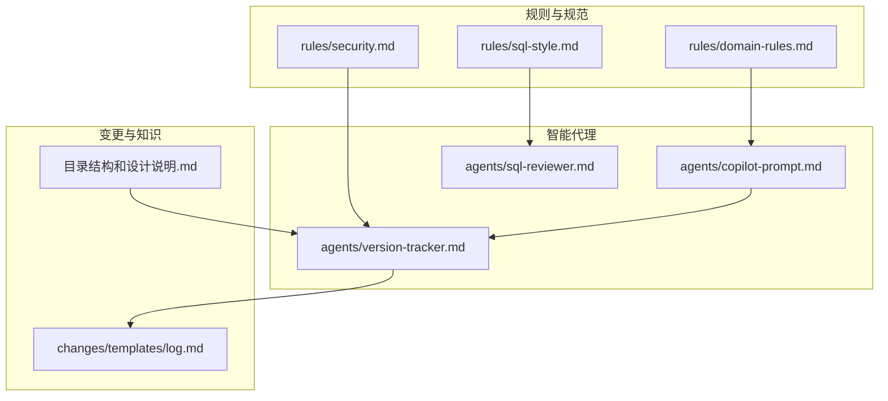
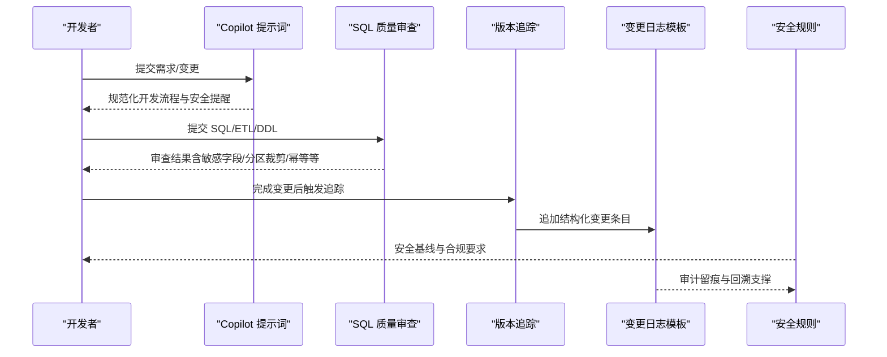
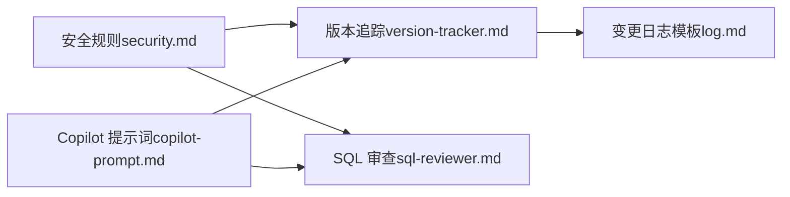

# 安全合规规范

<cite>
**本文引用的文件**
- [security.md](file://data_warehouse_engineering_code_copilot/rules/security.md)
- [copilot-prompt.md](file://data_warehouse_engineering_code_copilot/agents/copilot-prompt.md)
- [version-tracker.md](file://data_warehouse_engineering_code_copilot/agents/version-tracker.md)
- [sql-reviewer.md](file://data_warehouse_engineering_code_copilot/agents/sql-reviewer.md)
- [sql-style.md](file://data_warehouse_engineering_code_copilot/rules/sql-style.md)
- [domain-rules.md](file://data_warehouse_engineering_code_copilot/rules/domain-rules.md)
- [log.md](file://data_warehouse_engineering_code_copilot/changes/templates/log.md)
- [目录结构和设计说明.md](file://data_warehouse_engineering_code_copilot/目录结构和设计说明.md)
</cite>

## 目录
1. [简介](#简介)
2. [项目结构](#项目结构)
3. [核心组件](#核心组件)
4. [架构总览](#架构总览)
5. [详细组件分析](#详细组件分析)
6. [依赖分析](#依赖分析)
7. [性能考虑](#性能考虑)
8. [故障排查指南](#故障排查指南)
9. [结论](#结论)
10. [附录](#附录)

## 简介
本安全合规规范面向数据仓库工程实践，围绕数据访问控制、数据脱敏与加密、审计日志、数据生命周期安全、安全事件响应与应急预案、合规性检查与安全测试方法等方面，结合项目现有规则与工具，形成可执行、可审计、可追溯的安全体系。目标是确保在数据采集、存储、加工、使用、归档与销毁全生命周期中，满足最小权限、数据最小暴露、可审计、可追溯、可回溯的要求，并满足跨境与行业合规要求。

## 项目结构
该项目采用“规则 + 知识 + 变更模板 + 代理工具”的组织方式，安全相关规范集中在规则文件中，配套的审计与追踪由版本追踪代理与变更模板共同保障。

图表来源
- [security.md:1-98](file://data_warehouse_engineering_code_copilot/rules/security.md#L1-L98)
- [copilot-prompt.md:1-147](file://data_warehouse_engineering_code_copilot/agents/copilot-prompt.md#L1-L147)
- [version-tracker.md:1-120](file://data_warehouse_engineering_code_copilot/agents/version-tracker.md#L1-L120)
- [sql-reviewer.md:1-68](file://data_warehouse_engineering_code_copilot/agents/sql-reviewer.md#L1-L68)
- [sql-style.md:1-254](file://data_warehouse_engineering_code_copilot/rules/sql-style.md#L1-L254)
- [domain-rules.md:1-142](file://data_warehouse_engineering_code_copilot/rules/domain-rules.md#L1-L142)
- [log.md:1-59](file://data_warehouse_engineering_code_copilot/changes/templates/log.md#L1-L59)
- [目录结构和设计说明.md:98-125](file://data_warehouse_engineering_code_copilot/目录结构和设计说明.md#L98-L125)

章节来源
- [目录结构和设计说明.md:98-125](file://data_warehouse_engineering_code_copilot/目录结构和设计说明.md#L98-L125)

## 核心组件
- 安全规则与红线：明确数据安全、字段级脱敏、行级权限、数据分级、上线与发布安全、数据回刷、业务安全、跨境合规、安全审计与应急响应等要求。
- SQL 质量审查：从正确性、性能、可维护性角度对 SQL 进行分级审查，强调敏感字段脱敏与分区裁剪等安全要点。
- 版本追踪与变更日志：自动化记录每次 DDL/SQL/ETL/调度变更，确保可审计、可回溯。
- Copilot 提示词：强调 Spec 驱动、安全提醒、变更即记录等原则，贯穿开发流程。
- 数据质量与领域规则：为安全与合规提供业务口径与质量基线，减少错误数据流出风险。

章节来源
- [security.md:1-98](file://data_warehouse_engineering_code_copilot/rules/security.md#L1-L98)
- [sql-reviewer.md:1-68](file://data_warehouse_engineering_code_copilot/agents/sql-reviewer.md#L1-L68)
- [version-tracker.md:1-120](file://data_warehouse_engineering_code_copilot/agents/version-tracker.md#L1-L120)
- [copilot-prompt.md:1-147](file://data_warehouse_engineering_code_copilot/agents/copilot-prompt.md#L1-L147)
- [domain-rules.md:1-142](file://data_warehouse_engineering_code_copilot/rules/domain-rules.md#L1-L142)

## 架构总览
安全合规体系以“规则—工具—流程—审计”闭环为核心，通过 Copilot 提示词驱动开发流程，SQL 审查保障正确性与安全，版本追踪与变更模板确保可审计与可追溯，规则文件提供安全基线与合规要求。

图表来源
- [copilot-prompt.md:1-147](file://data_warehouse_engineering_code_copilot/agents/copilot-prompt.md#L1-L147)
- [sql-reviewer.md:1-68](file://data_warehouse_engineering_code_copilot/agents/sql-reviewer.md#L1-L68)
- [version-tracker.md:1-120](file://data_warehouse_engineering_code_copilot/agents/version-tracker.md#L1-L120)
- [log.md:1-59](file://data_warehouse_engineering_code_copilot/changes/templates/log.md#L1-L59)
- [security.md:1-98](file://data_warehouse_engineering_code_copilot/rules/security.md#L1-L98)

## 详细组件分析

### 数据访问控制策略
- 用户权限管理与角色分配
  - 多租户/多组织/多业务线场景必须配置行级权限（RLS），并在规格中明确定义并通过人工审查后实施。
  - RLS 规则变更必须进行验证：每个角色/用户仅能看到授权数据；无角色用户被正确拒绝；管理员/超级权限范围受控。
  - 严禁绕过权限校验（如直接读底层文件）。
- 最小权限原则
  - L3+ 数据导出必须二次审批；跨级别合并表按最高级别管控；L4 数据访问必须留痕（审计日志保留≥6个月）。
  - 生产 SQL 上线必须经过代码评审；涉及 PII/财务的表上线需数据负责人+安全负责人双签。
- 凭据与密钥管理
  - 禁止在脚本/配置中硬编码数据库密码/API Key/连接字符串中的凭据；数据网关/服务账号必须使用统一密钥管理（KMS/Vault），不得使用个人账号。

章节来源
- [security.md:36-67](file://data_warehouse_engineering_code_copilot/rules/security.md#L36-L67)

### 数据脱敏与加密要求
- 敏感数据识别
  - 禁止在 ADS/视图中直接展示 PII（身份证号、手机号、银行卡号、密码等），必须脱敏或哈希。
  - 禁止将包含敏感数据的结果通过非安全渠道（IM/邮件附件/截图）传输；测试环境不得使用真实生产数据。
- 脱敏算法与策略
  - 字段级脱敏标准：手机号（中间4位掩码）、身份证（出生日期段掩码）、邮箱（用户名前3位+***）、银行卡（仅末4位）、姓名（仅姓+*）、地址（区县级以下掩码）。
  - 身份证号哈希：SHA-256+salt，用于去重而不暴露明文。
- 加密与传输
  - 规则未直接给出传输加密细节，但强调“禁止通过非安全渠道传输敏感数据”，建议结合网络传输层加密与访问通道加密（TLS/VPN）作为补充。

章节来源
- [security.md:9-25](file://data_warehouse_engineering_code_copilot/rules/security.md#L9-L25)

### 审计日志规范
- 操作记录与访问追踪
  - 所有 L3+ 数据的查询必须留痕（query log+user+table）；异常访问行为（如非工作时间高频访问 PII 表）必须告警。
  - 离职员工必须在离职日24小时内回收数仓权限。
- 变更审计与可追溯
  - 版本追踪在每次 DDL/SQL/ETL/调度变更后自动追加结构化日志，包含时间（精确到分）、模块、分层、操作类型、精确到库.表.字段/作业名的变更内容、关联文件、回刷范围、下游影响等。
  - 变更日志模板支持“踩坑记录”“知识发现”“数据回刷记录”“性能对比记录”“数据质量验证记录”等，支撑安全与合规审计。

章节来源
- [security.md:87-91](file://data_warehouse_engineering_code_copilot/rules/security.md#L87-L91)
- [version-tracker.md:1-120](file://data_warehouse_engineering_code_copilot/agents/version-tracker.md#L1-L120)
- [log.md:1-59](file://data_warehouse_engineering_code_copilot/changes/templates/log.md#L1-L59)

### 数据生命周期安全管理
- 数据创建
  - 规范命名与字段类型，避免保留字与拼音混拼；金额字段使用 DECIMAL(18,4)，统一币种与精度。
- 数据存储
  - 分区字段统一 dt（YYYYMMDD），小时分区使用 dh；分区裁剪必须在 WHERE 中直接命中分区字段，禁止函数包裹。
- 数据使用
  - SQL 必须明列字段，禁止 SELECT *；Join 条件必须包含两侧分区字段；NULL 处理必须显式；金额字段使用 DECIMAL，避免 FLOAT/DOUBLE。
- 数据销毁
  - 规则未直接给出销毁流程，但强调“删除表必须走运维变更”，建议在销毁前完成数据分级评估、审计留痕与合规审批。

章节来源
- [sql-style.md:1-254](file://data_warehouse_engineering_code_copilot/rules/sql-style.md#L1-L254)
- [sql-reviewer.md:1-68](file://data_warehouse_engineering_code_copilot/agents/sql-reviewer.md#L1-L68)
- [security.md:61-67](file://data_warehouse_engineering_code_copilot/rules/security.md#L61-L67)

### 安全事件响应流程与应急预案
- 数据泄露
  - 立即冻结相关账号/视图；通知安全团队+数据负责人；启动根本原因分析（RCA）。
- 错误数据流出
  - 立即下线对外接口；评估影响范围；发布公告+修复+回放。
- SQL 注入/漏洞
  - 立即修补；全量审计相关入口；对受影响的数据与接口进行回溯与加固。

章节来源
- [security.md:93-98](file://data_warehouse_engineering_code_copilot/rules/security.md#L93-L98)

### 合规性检查清单
- 数据安全
  - 禁止硬编码凭据；禁止在 ADS/视图直接展示 PII；禁止通过非安全渠道传输敏感数据；测试环境使用脱敏样本；禁止在公共仓库提交密钥/内部数据样本。
- 字段级脱敏
  - 按标准执行手机号/身份证/邮箱/银行卡/姓名/地址脱敏；身份证号哈希用于去重。
- 行级权限（RLS）
  - 多租户/多组织/多业务线表必须配置 RLS；变更需人工审查与验证；严禁绕过权限校验。
- 数据分级与访问控制
  - L4 数据访问留痕（审计日志保留≥6个月）；L3+ 数据导出二次审批；跨级别合并表按最高级别管控。
- 上线与发布安全
  - 生产 SQL 上线必须 PR Review；涉及 PII/财务的表需双签；DDL 变更必须有回滚预案；服务账号使用统一密钥管理；临时探索查询禁止落地生产库。
- 数据回刷安全
  - 明确范围、影响下游、回退方案；涉及对外指标回刷需发布“数据修订公告”；回刷在低峰期执行。
- 业务安全
  - 财务/营收/上市口径指标需标注精度、四舍五入规则、对外披露口径；预测/预算指标明确时效性与可靠性；对外报表需数据准确性审查与法务合规审查。
- 跨境合规
  - 涉及跨境数据传输需符合 GDPR/PIPL；出境数据做必要的去标识化处理；跨境数据分类需有数据出境清单+审批记录。
- 审计与应急
  - L3+ 查询留痕；异常访问行为告警；离职员工权限回收；建立数据泄露/错误数据流出/漏洞的应急响应流程。

章节来源
- [security.md:1-98](file://data_warehouse_engineering_code_copilot/rules/security.md#L1-L98)

### 安全测试方法
- SQL 审查测试
  - 正确性：计算结果错误、笛卡尔积、全表扫描、主键重复、回刷未幂等、跨库/跨集群引用未声明、敏感字段未脱敏。
  - 性能：分区裁剪、Join 顺序、Map/Broadcast、倾斜风险、聚合下推、SELECT *、ORDER BY、DISTINCT 与 GROUP BY 互换、窗口函数分区合理性。
  - 可维护性：CTE 可读性、字段别名、头部注释、字段顺序与 DDL 一致。
- 权限与脱敏测试
  - RLS 角色/用户访问范围验证；无角色用户拒绝；管理员权限范围验证；敏感字段脱敏/哈希输出正确。
- 变更与回溯测试
  - 版本追踪条目完整、精确到库.表.字段/作业名；回刷范围与下游影响标注；变更日志模板“踩坑记录/知识发现/回刷记录/性能对比/数据质量验证”齐全。

章节来源
- [sql-reviewer.md:1-68](file://data_warehouse_engineering_code_copilot/agents/sql-reviewer.md#L1-L68)
- [version-tracker.md:1-120](file://data_warehouse_engineering_code_copilot/agents/version-tracker.md#L1-L120)
- [log.md:1-59](file://data_warehouse_engineering_code_copilot/changes/templates/log.md#L1-L59)

## 依赖分析
- 规则与工具耦合
  - 安全规则（security.md）驱动版本追踪（version-tracker.md）与 SQL 审查（sql-reviewer.md）的执行重点，确保敏感字段脱敏、分区裁剪、幂等写入、凭据管理等安全要点得到落实。
  - Copilot 提示词（copilot-prompt.md）贯穿开发流程，强调 Spec 驱动与安全提醒，降低错误数据流出风险。
- 审计与可追溯
  - 版本追踪与变更日志模板（log.md）共同构成审计留痕与回溯基础，支持安全事件调查与合规检查。

图表来源
- [security.md:1-98](file://data_warehouse_engineering_code_copilot/rules/security.md#L1-L98)
- [version-tracker.md:1-120](file://data_warehouse_engineering_code_copilot/agents/version-tracker.md#L1-L120)
- [log.md:1-59](file://data_warehouse_engineering_code_copilot/changes/templates/log.md#L1-L59)
- [sql-reviewer.md:1-68](file://data_warehouse_engineering_code_copilot/agents/sql-reviewer.md#L1-L68)
- [copilot-prompt.md:1-147](file://data_warehouse_engineering_code_copilot/agents/copilot-prompt.md#L1-L147)

## 性能考虑
- 分区裁剪与倾斜风险
  - SQL 审查强调分区裁剪、Map/Broadcast、倾斜风险识别与规避，减少不必要的扫描与计算，间接降低敏感数据暴露面与泄露风险。
- 幂等写入与回放
  - INSERT OVERWRITE 保证幂等，避免重复数据导致的错误数据流出与审计偏差。
- 字段明列与类型安全
  - 禁止 SELECT *，金额使用 DECIMAL，避免隐式类型转换带来的数据异常与错误传播。

章节来源
- [sql-reviewer.md:1-68](file://data_warehouse_engineering_code_copilot/agents/sql-reviewer.md#L1-L68)
- [sql-style.md:165-201](file://data_warehouse_engineering_code_copilot/rules/sql-style.md#L165-L201)

## 故障排查指南
- 现象收集 → 根因定位 → 方案验证 → 实施修复
- 禁止在未确认根因前直接修改 SQL、DDL 或调度作业
- 诊断层级：数据源层 → 抽取层 → ODS/DWD/DWS/ADS → 应用层（BI/API/下游消费）

章节来源
- [copilot-prompt.md:133-146](file://data_warehouse_engineering_code_copilot/agents/copilot-prompt.md#L133-L146)

## 结论
本项目通过“规则—工具—流程—审计”的闭环，构建了覆盖数据全生命周期的安全合规体系。安全规则明确了访问控制、脱敏与加密、审计与应急响应等关键要求；SQL 审查与版本追踪确保了正确性、性能与可追溯性；变更日志模板支撑安全与合规审计。建议在现有基础上进一步完善传输加密与销毁流程，并持续优化 RLS 与脱敏策略的自动化与可视化，提升整体安全治理水平。

## 附录
- 术语
  - PII：个人身份信息
  - RLS：行级权限
  - KMS：密钥管理服务
  - SQL 审查：对 SQL 的正确性、性能、可维护性进行分级审查
  - 幂等：多次执行结果一致且无副作用