# 项目约束系统

<cite>
**本文档引用的文件**
- [sql-style.md](file://data_warehouse_engineering_code_copilot/rules/sql-style.md)
- [security.md](file://data_warehouse_engineering_code_copilot/rules/security.md)
- [domain-rules.md](file://data_warehouse_engineering_code_copilot/rules/domain-rules.md)
- [sql-patterns.md](file://data_warehouse_engineering_code_copilot/knowledge/sql-patterns.md)
- [dimension-modeling-tips.md](file://data_warehouse_engineering_code_copilot/knowledge/dimension-modeling-tips.md)
- [performance-tips.md](file://data_warehouse_engineering_code_copilot/knowledge/performance-tips.md)
- [copilot-prompt.md](file://data_warehouse_engineering_code_copilot/agents/copilot-prompt.md)
- [sql-reviewer.md](file://data_warehouse_engineering_code_copilot/agents/sql-reviewer.md)
- [目录结构和设计说明.md](file://data_warehouse_engineering_code_copilot/目录结构和设计说明.md)
</cite>

## 目录
1. [简介](#简介)
2. [项目结构](#项目结构)
3. [核心组件](#核心组件)
4. [架构概览](#架构概览)
5. [详细组件分析](#详细组件分析)
6. [依赖分析](#依赖分析)
7. [性能考虑](#性能考虑)
8. [故障排查指南](#故障排查指南)
9. [结论](#结论)
10. [附录](#附录)

## 简介

项目约束系统是一个面向数据仓库工程的规范化管理系统，旨在确保数据仓库开发过程中的质量、安全性和一致性。该系统通过强制性的约束规则、推荐的最佳实践和完整的变更追踪机制，为数据仓库项目提供了标准化的开发框架。

系统的核心设计理念是"Spec 驱动 + 三段式知识库 + 强制变更追踪"，通过严格的规范约束和知识沉淀机制，确保数据仓库项目的可持续发展和高质量交付。

## 项目结构

项目采用模块化的目录结构，主要分为四个核心区域：

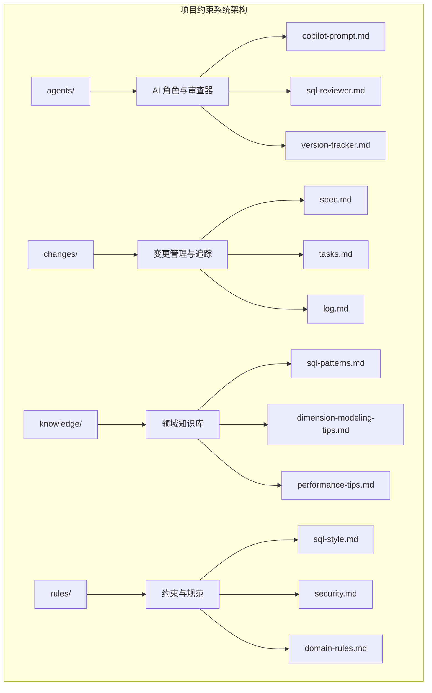

**图表来源**
- [目录结构和设计说明.md:21-55](file://data_warehouse_engineering_code_copilot/目录结构和设计说明.md#L21-L55)

**章节来源**
- [目录结构和设计说明.md:1-204](file://data_warehouse_engineering_code_copilot/目录结构和设计说明.md#L1-L204)

## 核心组件

### 规范约束层 (Rules)

规范约束层包含三个核心规范文件，构成了项目约束系统的基础：

#### SQL 编码规范
- **命名约定**：统一的库、表、字段命名规范
- **格式规范**：关键字大小写、缩进、注释标准
- **编写原则**：性能优先、正确性优先、可维护性
- **禁止事项**：明确的禁令清单和常见错误对照

#### 安全红线规范
- **数据安全**：PII 数据保护、凭据管理
- **字段脱敏**：标准化的脱敏策略
- **访问控制**：行级权限、数据分级
- **合规要求**：跨境数据传输、审计日志

#### 业务领域规则
- **通用业务规则**：金额、百分比、时间维度标准
- **KPI 定义**：指标口径、计算公式
- **数据质量**：五维度评估标准
- **行业特定规则**：零售、金融、制造等行业的特殊要求

**章节来源**
- [sql-style.md:1-254](file://data_warehouse_engineering_code_copilot/rules/sql-style.md#L1-L254)
- [security.md:1-98](file://data_warehouse_engineering_code_copilot/rules/security.md#L1-L98)
- [domain-rules.md:1-142](file://data_warehouse_engineering_code_copilot/rules/domain-rules.md#L1-L142)

### 知识库层 (Knowledge)

知识库层提供了丰富的实践经验和技术模式：

#### SQL 模式库
- **去重保留最新**：CDC 后处理模式
- **拉链表实现**：SCD Type 2 的完整实现
- **同环比计算**：标准的同比增长率算法
- **分组 TopN**：窗口函数的高效应用
- **累计求和**：时间序列分析模式

#### 维度建模技巧
- **代理键 vs 业务键**：双键并存策略
- **缓慢变化维**：Type 1/2/3 的应用场景
- **桥接表设计**：多对多关系处理
- **退化维度**：低基数属性的优化处理

#### 性能优化知识
- **分区裁剪**：大型表的高效查询策略
- **数据倾斜**：热点数据的解决方案
- **Join 优化**：不同 Join 类型的选择策略
- **存储格式**：列存格式的性能优势

**章节来源**
- [sql-patterns.md:1-331](file://data_warehouse_engineering_code_copilot/knowledge/sql-patterns.md#L1-L331)
- [dimension-modeling-tips.md:1-253](file://data_warehouse_engineering_code_copilot/knowledge/dimension-modeling-tips.md#L1-L253)
- [performance-tips.md:1-349](file://data_warehouse_engineering_code_copilot/knowledge/performance-tips.md#L1-L349)

### 审查与追踪层 (Agents)

审查与追踪层确保了开发过程的质量控制：

#### AI 协作助手
- **Copilot Prompt**：完整的 AI 角色定义和工作流程
- **SQL Reviewer**：专业的 SQL 代码质量审查
- **Version Tracker**：自动化的变更日志追踪

#### 工作流程规范
- **Spec 驱动**：需求文档驱动的所有变更
- **三阶段审查**：合规 → 模型 → SQL 的严格审查流程
- **变更追踪**：可审计、可回溯的变更管理

**章节来源**
- [copilot-prompt.md:1-147](file://data_warehouse_engineering_code_copilot/agents/copilot-prompt.md#L1-L147)
- [sql-reviewer.md:1-68](file://data_warehouse_engineering_code_copilot/agents/sql-reviewer.md#L1-L68)

## 架构概览

项目约束系统采用分层架构，确保各层职责清晰、耦合度低：

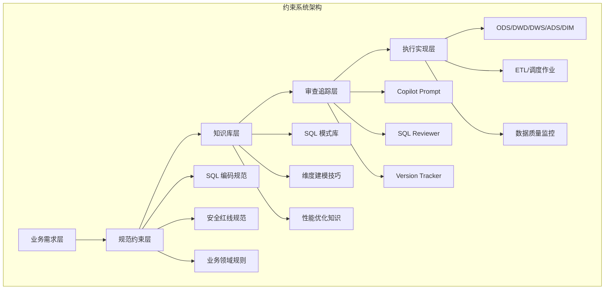

**图表来源**
- [目录结构和设计说明.md:109-123](file://data_warehouse_engineering_code_copilot/目录结构和设计说明.md#L109-L123)

系统的核心特点是"强制约束 + 推荐实践 + 完整追踪"的三层保障机制，确保数据仓库开发的规范性和可追溯性。

## 详细组件分析

### SQL 编码规范详解

#### 命名约定体系

SQL 编码规范建立了完整的命名约定体系，涵盖数据仓库的各个层次：

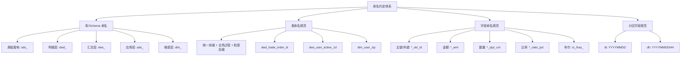

**图表来源**
- [sql-style.md:9-87](file://data_warehouse_engineering_code_copilot/rules/sql-style.md#L9-L87)

#### 格式规范标准

格式规范确保了 SQL 代码的一致性和可读性：

| 规范类别 | 具体要求 | 示例 |
|---------|---------|------|
| 关键字大小写 | SQL 关键字统一大写 | SELECT、FROM、JOIN |
| 函数名大小写 | 函数名统一小写 | sum、count、coalesce |
| 表名/字段名 | 统一小写 | dwh_dwd.dwd_user_event_di |
| 缩进规则 | 一级缩进 4 个空格 | 标准化代码格式 |
| 注释规范 | 头部注释强制要求 | 用途、依赖、产出 |

**章节来源**
- [sql-style.md:97-190](file://data_warehouse_engineering_code_copilot/rules/sql-style.md#L97-L190)

### 安全规范实施

#### 数据安全矩阵

安全规范建立了多层次的安全防护体系：

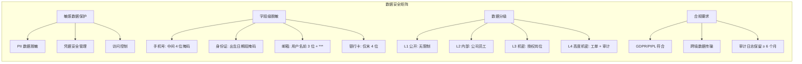

**图表来源**
- [security.md:7-98](file://data_warehouse_engineering_code_copilot/rules/security.md#L7-L98)

#### 行级权限 (RLS) 实施

行级权限是多租户环境下数据安全的关键机制：

| 实施要求 | 验证标准 | 审查要点 |
|---------|---------|---------|
| 必须配置 | 所有多租户表 | 角色权限验证 |
| 规则定义 | spec 中明确定义 | 人工审查通过 |
| 变更验证 | 测试每个角色权限 | 无角色用户拒绝 |
| 禁止绕过 | 严禁代码绕过 | 审计日志追踪 |

**章节来源**
- [security.md:36-44](file://data_warehouse_engineering_code_copilot/rules/security.md#L36-L44)

### 业务领域规则

#### KPI 定义标准

业务领域规则为关键指标提供了标准化的定义框架：

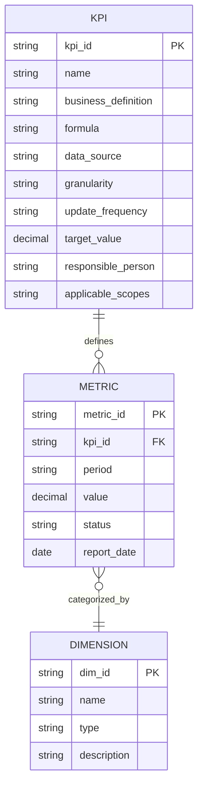

**图表来源**
- [domain-rules.md:47-62](file://data_warehouse_engineering_code_copilot/rules/domain-rules.md#L47-L62)

#### 数据质量评估体系

数据质量规范建立了完整的评估和监控体系：

| 评估维度 | 评估标准 | 严重等级 | 监控方式 |
|---------|---------|---------|---------|
| 完整性 | 非空率 ≥ 99.9% | P0/P1/P2 | 自动化检查 |
| 唯一性 | COUNT(*) = COUNT(DISTINCT pk) | P0 | 唯一性约束 |
| 一致性 | 行数差异 < 0.1% | P1 | 跨系统对账 |
| 准确性 | 与业务库直查对账 | P0 | 业务验证 |
| 时效性 | 产出时间 ≤ SLA 基线 | P1 | SLA 监控 |

**章节来源**
- [domain-rules.md:69-91](file://data_warehouse_engineering_code_copilot/rules/domain-rules.md#L69-L91)

### 维度建模最佳实践

#### SCD 类型选择策略

缓慢变化维度 (SCD) 的选择直接影响数据仓库的性能和维护成本：

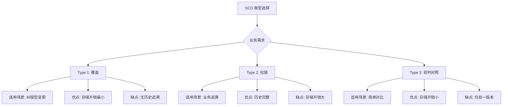

**图表来源**
- [dimension-modeling-tips.md:39-83](file://data_warehouse_engineering_code_copilot/knowledge/dimension-modeling-tips.md#L39-L83)

#### 事实表类型设计

不同类型的事实表适用于不同的业务场景：

| 事实表类型 | 适用场景 | 粒度特征 | 性能特点 |
|---------|---------|---------|---------|
| 事务事实表 | 业务事件流水 | 单事件 | 高频写入，存储大 |
| 周期快照 | 等间隔状态拍照 | 日/月 | 存储相对较小 |
| 累积快照 | 流程里程碑快照 | 单实例 | 写入复杂，存储中等 |
| 无事实事实表 | 仅记录事件发生 | 单事件 | 存储最小，分析受限 |

**章节来源**
- [dimension-modeling-tips.md:179-204](file://data_warehouse_engineering_code_copilot/knowledge/dimension-modeling-tips.md#L179-L204)

## 依赖分析

项目约束系统的依赖关系体现了从规范到实践的完整链条：

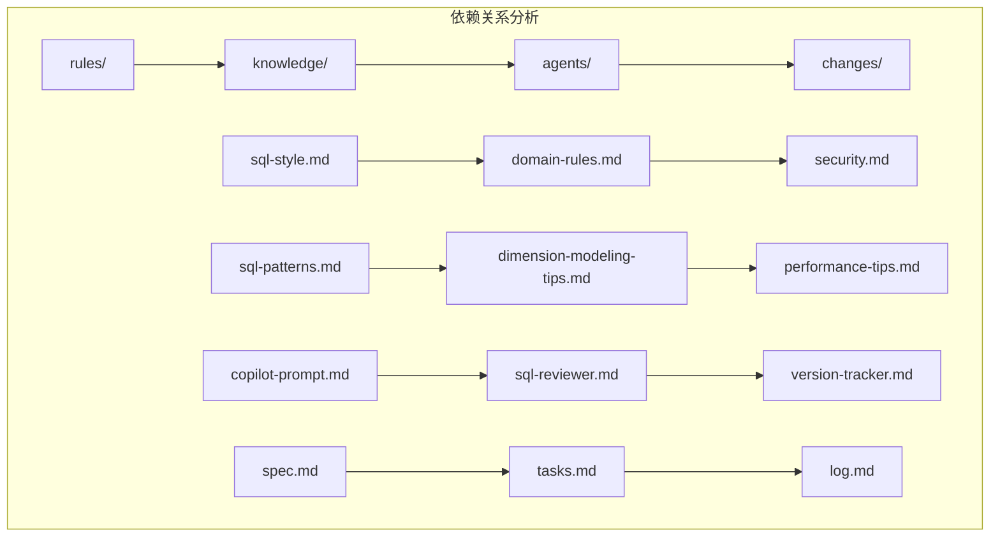

**图表来源**
- [目录结构和设计说明.md:45-54](file://data_warehouse_engineering_code_copilot/目录结构和设计说明.md#L45-L54)

系统的关键依赖特性：
- **向下依赖**：规范约束向下指导知识库实践
- **向内依赖**：知识库支撑 AI 审查器的智能判断
- **向外依赖**：审查追踪确保规范的有效执行

**章节来源**
- [目录结构和设计说明.md:70-78](file://data_warehouse_engineering_code_copilot/目录结构和设计说明.md#L70-L78)

## 性能考虑

### 分区裁剪优化

分区裁剪是大型表查询性能的关键优化手段：

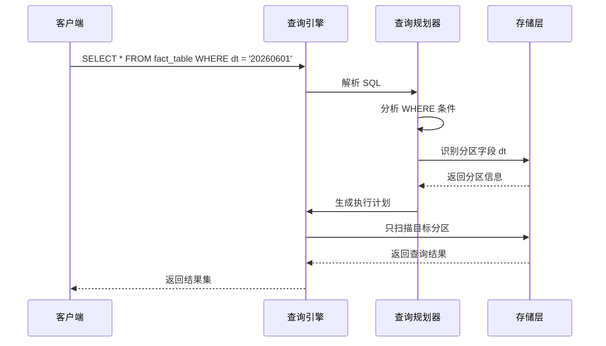

**图表来源**
- [performance-tips.md:5-35](file://data_warehouse_engineering_code_copilot/knowledge/performance-tips.md#L5-L35)

### 数据倾斜解决方案

数据倾斜是分布式计算中的常见问题，需要针对性的解决方案：

| 解决方案 | 适用场景 | 实现方式 | 风险控制 |
|---------|---------|---------|---------|
| 过滤 + 单独处理 | 热点键明确 | WHERE IN/NOT IN | 需要预分析热点键 |
| 加盐打散 | 热点分布均匀 | rand() % N | 控制盐值数量，避免过度打散 |
| Map Join | 小表 Join 大表 | BROADCAST hint | 小表大小阈值控制 |
| 自适应优化 | 引擎自动优化 | AQE/动态调整 | 需要引擎支持 |

**章节来源**
- [performance-tips.md:42-98](file://data_warehouse_engineering_code_copilot/knowledge/performance-tips.md#L42-L98)

### Join 优化策略

不同 Join 类型的选择直接影响查询性能：

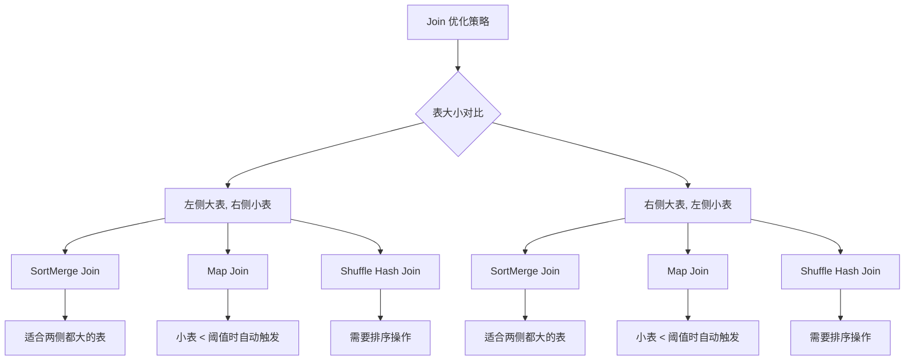

**图表来源**
- [performance-tips.md:232-256](file://data_warehouse_engineering_code_copilot/knowledge/performance-tips.md#L232-L256)

## 故障排查指南

### SQL 质量审查流程

SQL 代码质量审查采用分级管理制度：

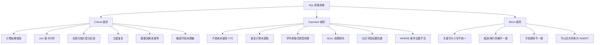

**图表来源**
- [sql-reviewer.md:5-30](file://data_warehouse_engineering_code_copilot/agents/sql-reviewer.md#L5-L30)

### 性能诊断流程

性能问题的诊断采用四层分析方法：

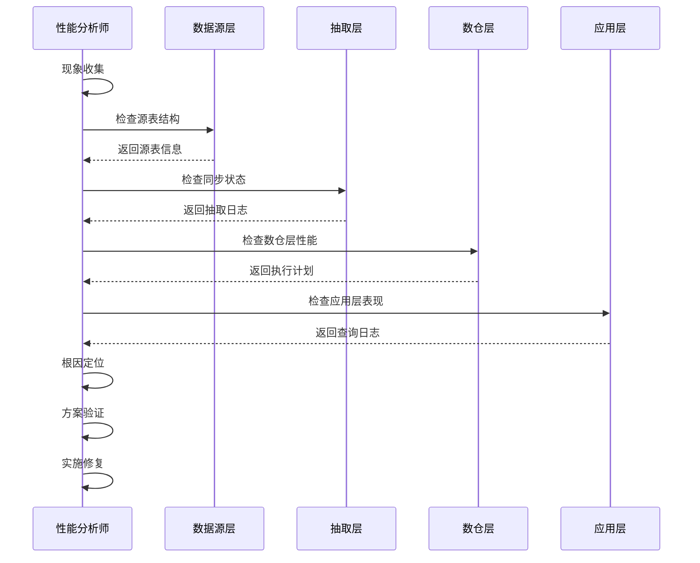

**图表来源**
- [copilot-prompt.md:133-146](file://data_warehouse_engineering_code_copilot/agents/copilot-prompt.md#L133-L146)

**章节来源**
- [sql-reviewer.md:31-67](file://data_warehouse_engineering_code_copilot/agents/sql-reviewer.md#L31-L67)

## 结论

项目约束系统通过规范化的约束规则、丰富的知识库和完善的审查追踪机制，为数据仓库项目提供了全面的质量保障。系统的核心价值体现在：

### 主要成就

1. **标准化程度高**：建立了覆盖 SQL 编码、安全规范、业务规则的完整标准体系
2. **可执行性强**：通过 AI 协作助手和审查器确保规范的有效执行
3. **可追溯性好**：完整的变更追踪机制确保所有变更都可审计、可回溯
4. **知识沉淀**：持续的知识库更新和最佳实践积累

### 实施效果

- **质量提升**：通过强制性的规范约束显著提升了 SQL 代码质量
- **安全性增强**：多层次的安全防护确保了敏感数据的安全
- **效率提高**：标准化的流程和工具减少了重复劳动
- **风险降低**：完善的审查机制降低了项目实施风险

### 发展方向

系统将继续在以下方面进行优化：
- 增强 AI 协作能力，提供更智能的代码生成和优化建议
- 扩展行业特定规则，支持更多业务领域的特殊需求
- 完善性能监控工具，提供更精细化的性能分析
- 加强自动化程度，减少人工干预的需求

## 附录

### 快速参考表

#### SQL 编码规范检查清单

| 检查项目 | 检查标准 | 通过标准 |
|---------|---------|---------|
| 命名规范 | 使用统一前缀和后缀 | ✓ |
| 关键字大小写 | SQL 关键字大写 | ✓ |
| 缩进格式 | 4 空格缩进 | ✓ |
| 注释规范 | 头部注释强制 | ✓ |
| 禁止事项 | 无硬编码日期 | ✓ |

#### 安全检查清单

| 检查项目 | 检查标准 | 通过标准 |
|---------|---------|---------|
| PII 数据 | 已脱敏或哈希 | ✓ |
| 凭据管理 | 无硬编码凭据 | ✓ |
| 访问控制 | 行级权限配置 | ✓ |
| 数据分级 | 按级别管控 | ✓ |
| 审计日志 | 查询留痕 | ✓ |

#### 性能优化检查清单

| 检查项目 | 检查标准 | 通过标准 |
|---------|---------|---------|
| 分区裁剪 | dt 字段直接比较 | ✓ |
| Join 优化 | 小表在右侧 | ✓ |
| 数据倾斜 | 无热点键 | ✓ |
| 存储格式 | 列存格式 | ✓ |
| CTE 物化 | 复杂 CTE 物化 | ✓ |

### 常用工具和命令

#### AI 协作命令

| 命令 | 用途 | 使用场景 |
|------|------|---------|
| `/sql` | SQL 开发 | 单段 SQL 加工 |
| `/model` | 数仓建模 | 事实/维度/分层设计 |
| `/propose` | 变更提案 | 新需求创建 |
| `/apply` | 实施变更 | 按 spec 实施 |
| `/review` | 三阶段审查 | 合规 → 模型 → SQL |
| `/optimize` | 性能诊断 | 慢查询优化 |
| `/dq` | 数据质量 | 对账和校验 |
| `/schedule` | 调度配置 | 作业依赖和 SLA |

**章节来源**
- [copilot-prompt.md:63-128](file://data_warehouse_engineering_code_copilot/agents/copilot-prompt.md#L63-L128)