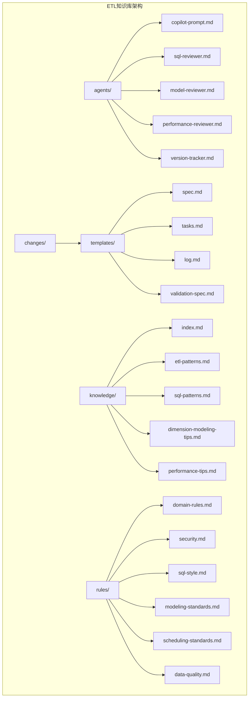
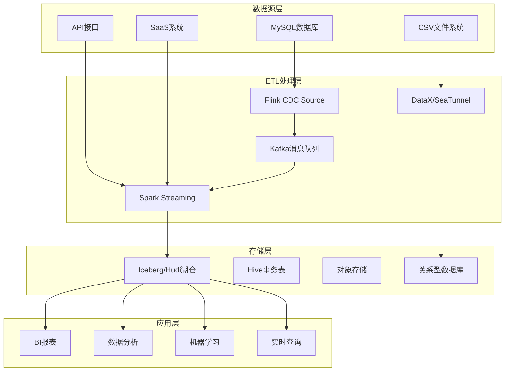
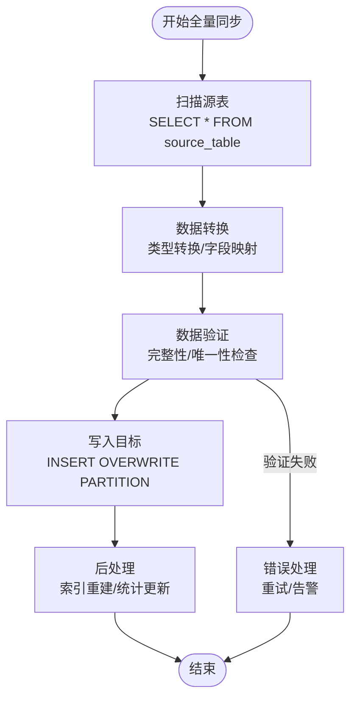
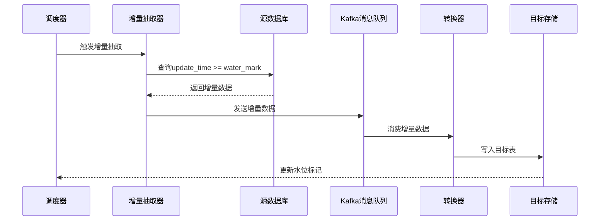
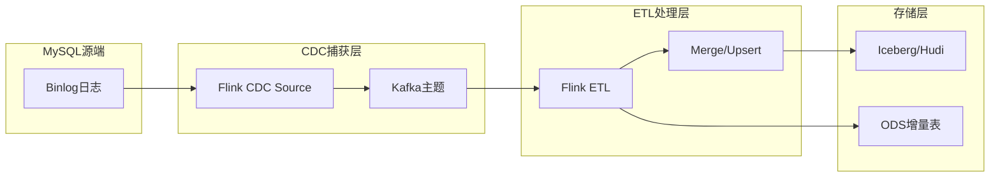
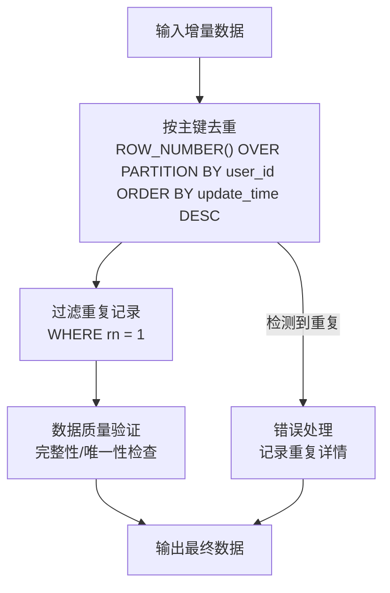
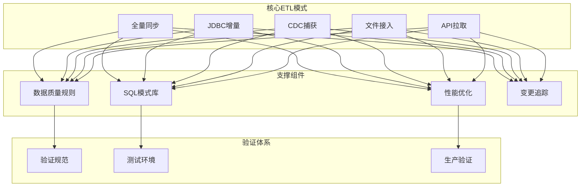
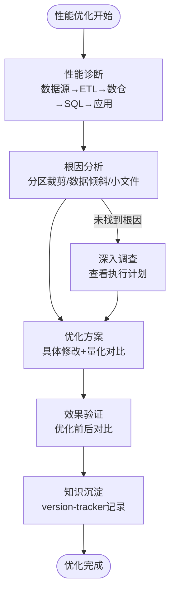
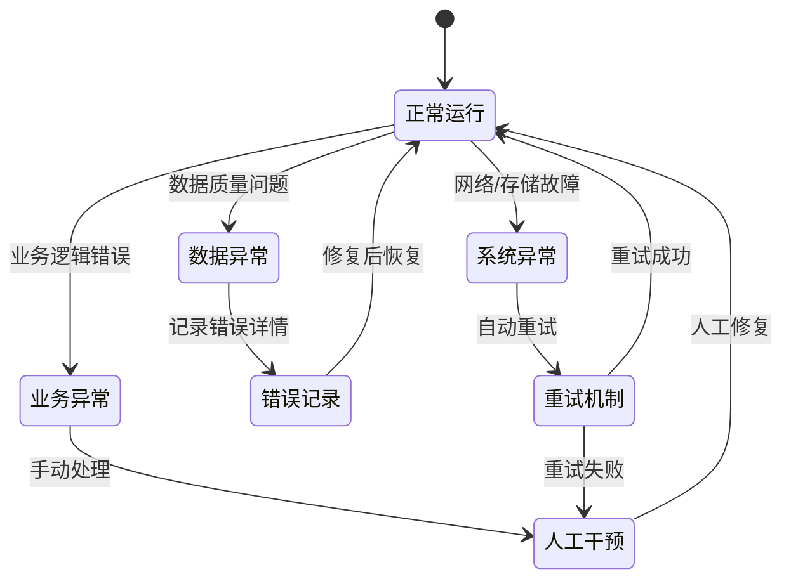

# ETL模式扩展

<cite>
**本文档引用的文件**
- [etl-patterns.md](file://data_warehouse_engineering_code_copilot/knowledge/etl-patterns.md)
- [sql-patterns.md](file://data_warehouse_engineering_code_copilot/knowledge/sql-patterns.md)
- [index.md](file://data_warehouse_engineering_code_copilot/knowledge/index.md)
- [目录结构和设计说明.md](file://data_warehouse_engineering_code_copilot/目录结构和设计说明.md)
- [data-quality.md](file://data_warehouse_engineering_code_copilot/rules/data-quality.md)
- [validation-spec.md](file://data_warehouse_engineering_code_copilot/changes/templates/validation-spec.md)
- [performance-tips.md](file://data_warehouse_engineering_code_copilot/knowledge/performance-tips.md)
</cite>

## 目录
1. [简介](#简介)
2. [项目结构](#项目结构)
3. [核心组件](#核心组件)
4. [架构概览](#架构概览)
5. [详细组件分析](#详细组件分析)
6. [依赖分析](#依赖分析)
7. [性能考虑](#性能考虑)
8. [故障排查指南](#故障排查指南)
9. [结论](#结论)
10. [附录](#附录)

## 简介

本指南基于数据仓库工程化知识库，为ETL模式库创建全面的扩展指南。该知识库涵盖了数仓常用的数据接入与同步模式，包括JDBC抽取、CDC、文件、API等典型场景，工具栈以DataX/SeaTunnel/Flink CDC/dbt/Spark为主。

项目采用"Spec驱动 + 三段式知识库 + 强制变更追踪"的核心理念，确保ETL模式的标准化、可复用性和可审计性。

## 项目结构



**图表来源**
- [目录结构和设计说明.md:21-55](file://data_warehouse_engineering_code_copilot/目录结构和设计说明.md#L21-L55)

**章节来源**
- [目录结构和设计说明.md:19-55](file://data_warehouse_engineering_code_copilot/目录结构和设计说明.md#L19-L55)

## 核心组件

### ETL模式库核心能力

ETL模式库提供了九种核心模式，涵盖从全量到增量再到CDC的完整数据同步路径：

| 模式类型 | 工具栈 | 实时性 | 适用场景 | 复杂度 |
|---------|--------|--------|----------|--------|
| 全量抽取 | DataX/SeaTunnel | T+1 | 小表（<100万行） | 低 |
| JDBC增量 | DataX/SeaTunnel | T+1（小时级） | 中等规模 | 低 |
| CDC | Flink CDC/Debezium | 秒级~分钟级 | 大型/变更追踪 | 高 |
| 文件接入 | Spark/Hive | 批处理 | CSV/Excel/JSON | 中等 |
| API拉取 | REST/GraphQL | 批处理 | SaaS/CRM | 中等 |

**章节来源**
- [etl-patterns.md:192-203](file://data_warehouse_engineering_code_copilot/knowledge/etl-patterns.md#L192-L203)

### 数据质量保障体系

建立了完整的数据质量五维度规范：
- **完整性**：关键字段非空率≥99.9%
- **唯一性**：主键/业务唯一键不重复
- **一致性**：跨表/跨系统对齐，差异<0.1%
- **准确性**：与业务库直查对账误差<0.5%
- **时效性**：按时产出，≤SLA基线

**章节来源**
- [data-quality.md:9-18](file://data_warehouse_engineering_code_copilot/rules/data-quality.md#L9-L18)

## 架构概览



**图表来源**
- [etl-patterns.md:12-15](file://data_warehouse_engineering_code_copilot/knowledge/etl-patterns.md#L12-L15)

## 详细组件分析

### 全量同步模式设计与实现

#### 设计原则

全量同步适用于小规模数据表（<100万行），通过一次性扫描整个表来创建数据快照。其核心特点是数据完整性高，但源端压力较大。

#### 关键实现要素



**图表来源**
- [etl-patterns.md:30-54](file://data_warehouse_engineering_code_copilot/knowledge/etl-patterns.md#L30-L54)

#### 最佳实践

1. **水位字段选择**：推荐使用update_time而非create_time，确保历史数据更新也能被捕捉
2. **网络与并发**：DataX channel数与源端连接池容量匹配，大表使用splitPk分片
3. **幂等写入**：使用INSERT OVERWRITE PARTITION确保重复执行的安全性
4. **重叠窗口**：跨天边界抽取建议有5-30分钟重叠，配合ODS去重避免漏数

**章节来源**
- [etl-patterns.md:44-48](file://data_warehouse_engineering_code_copilot/knowledge/etl-patterns.md#L44-L48)

### 增量同步模式扩展

#### 基于时间戳的增量策略

时间戳增量是最常见的增量策略，适用于有更新时间字段的表。



**图表来源**
- [etl-patterns.md:36-42](file://data_warehouse_engineering_code_copilot/knowledge/etl-patterns.md#L36-L42)

#### 基于行号的增量策略

适用于没有合适时间戳字段的场景，通过自增主键实现增量识别。

#### 基于哈希值的增量策略

通过计算数据行的哈希值来识别变更，适用于复杂业务场景。

**章节来源**
- [etl-patterns.md:30-54](file://data_warehouse_engineering_code_copilot/knowledge/etl-patterns.md#L30-L54)

### CDC捕获模式设计原理

#### 核心架构



**图表来源**
- [etl-patterns.md:12-21](file://data_warehouse_engineering_code_copilot/knowledge/etl-patterns.md#L12-L21)

#### 关键技术实现

1. **位点保护**：Checkpoint周期建议30s~60s，state backend选RocksDB
2. **op字段保留**：保留+I/-U/+U/-D四种事件，下游可还原全量
3. **幂等处理**：Hudi/Iceberg主键upsert；Hive增量表落binlog原始事件
4. **回放机制**：保留Kafka topic不少于7天，故障时按位点重放

**章节来源**
- [etl-patterns.md:17-21](file://data_warehouse_engineering_code_copilot/knowledge/etl-patterns.md#L17-L21)

### 数据转换与验证流程

#### 去重保留最新模式



**图表来源**
- [sql-patterns.md:12-26](file://data_warehouse_engineering_code_copilot/knowledge/sql-patterns.md#L12-L26)

#### 拉链表（SCD Type 2）实现

拉链表用于保留维度的历史变化，通过start_date/end_date/is_current三列标记每条版本的生效区间。

**章节来源**
- [sql-patterns.md:42-94](file://data_warehouse_engineering_code_copilot/knowledge/sql-patterns.md#L42-L94)

## 依赖分析

### 模块间依赖关系



**图表来源**
- [目录结构和设计说明.md:70-78](file://data_warehouse_engineering_code_copilot/目录结构和设计说明.md#L70-L78)

### 工具栈依赖关系

| 模式类型 | 核心工具 | 依赖组件 | 配置要求 |
|---------|----------|----------|----------|
| 全量同步 | DataX/SeaTunnel | MySQL驱动/JDBC连接池 | 连接池容量匹配 |
| 增量同步 | DataX/SeaTunnel | 水位字段/索引 | 时间字段单调递增 |
| CDC捕获 | Flink CDC | Kafka/Zookeeper | Checkpoint配置 |
| 文件接入 | Spark/Hive | HDFS/S3 | 文件系统权限 |
| API拉取 | REST/GraphQL | Token管理/限流 | API配额限制 |

**章节来源**
- [etl-patterns.md:3-4](file://data_warehouse_engineering_code_copilot/knowledge/etl-patterns.md#L3-L4)

## 性能考虑

### 小文件控制策略

小文件问题是大数据处理中的常见挑战，通过以下策略解决：

1. **手动控制reduce数**：SET mapreduce.job.reduces=32
2. **强制散列分布**：DISTRIBUTE BY pmod(hash(key), 32)
3. **动态分区合并**：spark.sql.adaptive.enabled=true

### 性能优化建议



**图表来源**
- [目录结构和设计说明.md:153-166](file://data_warehouse_engineering_code_copilot/目录结构和设计说明.md#L153-L166)

**章节来源**
- [performance-tips.md:286-307](file://data_warehouse_engineering_code_copilot/knowledge/performance-tips.md#L286-L307)

## 故障排查指南

### 常见问题及解决方案

#### CDC捕获问题

| 问题类型 | 症状 | 原因 | 解决方案 |
|---------|------|------|----------|
| binlog时间戳问题 | 事件时间≠事务提交时间 | ts字段含义混淆 | 使用gtid+bin_pos+op_seq组合排序 |
| 大事务处理 | 海量binlog瞬时产生 | DDL/批量update | 监控lag，合理设置checkpoint |
| 主备切换 | 位点跳变 | GTID不一致 | 订阅端做GTID校验 |

#### 增量抽取问题

| 问题类型 | 症状 | 原因 | 解决方案 |
|---------|------|------|----------|
| 跨日漏数 | 时区不一致 | 业务库+00:00 vs 数仓+08:00 | 统一转换为UTC存储 |
| 历史更新漏捕 | update_time不更新 | 存储过程更新逻辑 | 使用create_time作为辅助水位 |
| 重复数据 | 主键冲突 | 源端重复 | 使用ROW_NUMBER去重 |

**章节来源**
- [etl-patterns.md:23-26](file://data_warehouse_engineering_code_copilot/knowledge/etl-patterns.md#L23-L26)
- [etl-patterns.md:50-53](file://data_warehouse_engineering_code_copilot/knowledge/etl-patterns.md#L50-L53)

### 错误处理机制



**图表来源**
- [data-quality.md:102-114](file://data_warehouse_engineering_code_copilot/rules/data-quality.md#L102-L114)

## 结论

ETL模式库通过标准化的九种核心模式，为数据仓库建设提供了完整的解决方案。其核心优势包括：

1. **标准化流程**：统一的ETL模式确保了不同项目间的一致性
2. **可扩展性**：支持从全量到增量再到CDC的完整数据同步路径
3. **质量保障**：完整的数据质量五维度规范和验证体系
4. **可审计性**：强制变更追踪确保所有改动可追溯
5. **最佳实践**：沉淀了丰富的踩坑经验和优化技巧

通过遵循本指南的模式和最佳实践，可以显著提升ETL项目的成功率和维护效率。

## 附录

### ETL流程模板

#### 全量同步模板

```sql
-- 全量抽取SQL模板
SELECT {columns}
FROM {source_table}
WHERE 1=1
-- 过滤条件
```

#### 增量同步模板

```sql
-- 增量抽取SQL模板
SELECT {columns}
FROM {source_table}
WHERE {watermark_column} >= '{start_time}'
  AND {watermark_column} < '{end_time}'
  AND 1=1
-- 业务过滤条件
```

#### CDC捕获模板

```sql
-- CDC数据处理模板
SELECT 
    {pk_columns},
    {other_columns},
    op_type,
    proc_time
FROM {cdc_source}
WHERE dt = '{bizdate}'
```

### 验证标准清单

#### 数据质量验证

- [ ] 行数核验：与业务库直查对比
- [ ] 主键唯一性：重复行数=0
- [ ] 关键字段非空率：≥99.9%
- [ ] 核心指标对账：差异<0.5%

#### 性能基准测试

- [ ] 全量首跑时间：<x分钟
- [ ] 单分区增量时间：<x分钟  
- [ ] 历史回刷时间：<x分钟
- [ ] 扫描量控制：合理分区裁剪

#### 错误处理机制

- [ ] P0级阻断：主键唯一、行数下限、关键字段非空
- [ ] P1级告警：行数上限、跨系统一致性、指标对账
- [ ] P2级监控：字段值分布、典型值占比

**章节来源**
- [validation-spec.md:6-13](file://data_warehouse_engineering_code_copilot/changes/templates/validation-spec.md#L6-L13)
- [validation-spec.md:24-97](file://data_warehouse_engineering_code_copilot/changes/templates/validation-spec.md#L24-L97)