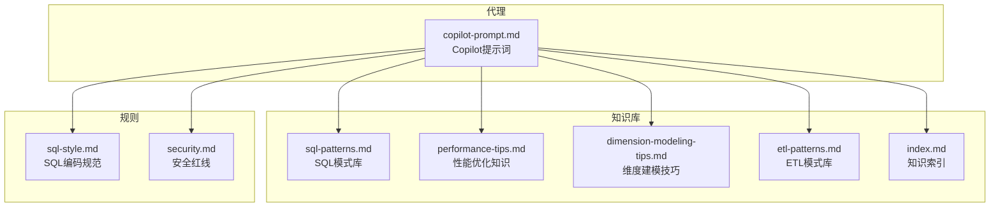
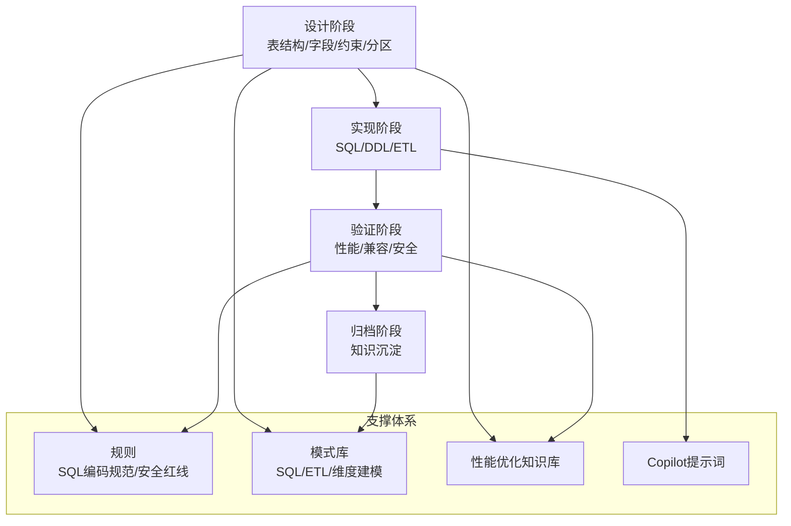
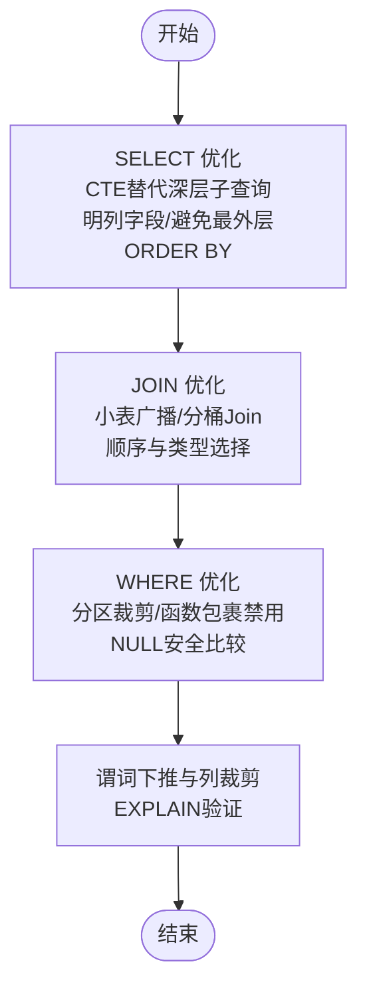
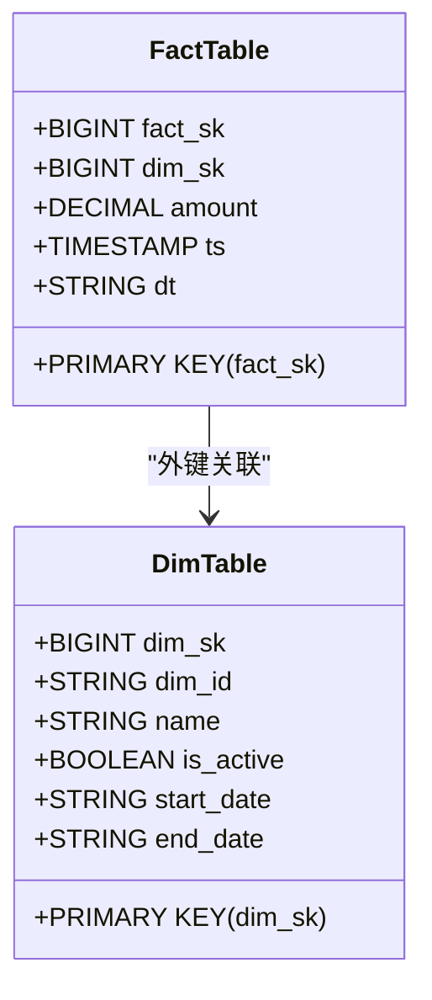
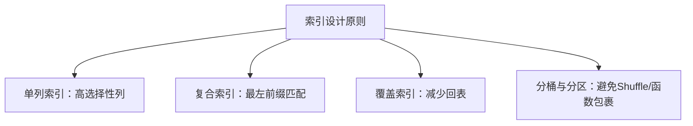
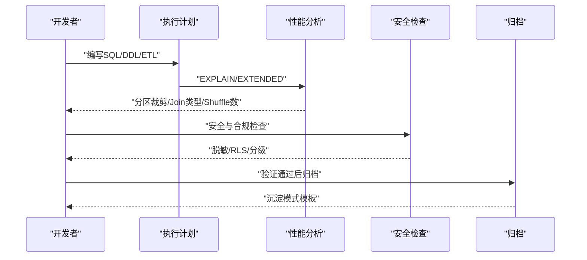
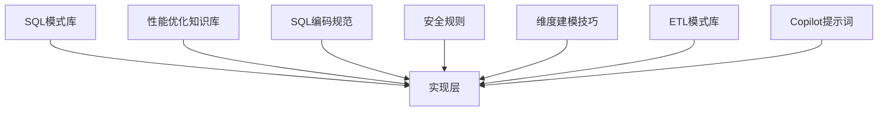
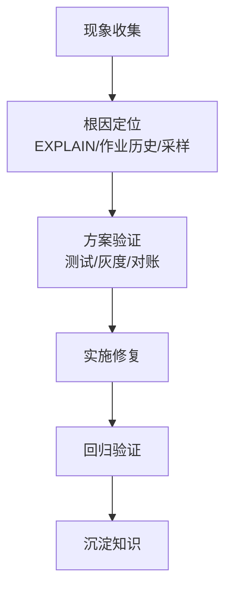

# SQL模式扩展

<cite>
**本文引用的文件**
- [sql-patterns.md](file://data_warehouse_engineering_code_copilot/knowledge/sql-patterns.md)
- [performance-tips.md](file://data_warehouse_engineering_code_copilot/knowledge/performance-tips.md)
- [sql-style.md](file://data_warehouse_engineering_code_copilot/rules/sql-style.md)
- [dimension-modeling-tips.md](file://data_warehouse_engineering_code_copilot/knowledge/dimension-modeling-tips.md)
- [etl-patterns.md](file://data_warehouse_engineering_code_copilot/knowledge/etl-patterns.md)
- [security.md](file://data_warehouse_engineering_code_copilot/rules/security.md)
- [index.md](file://data_warehouse_engineering_code_copilot/knowledge/index.md)
- [copilot-prompt.md](file://data_warehouse_engineering_code_copilot/agents/copilot-prompt.md)
</cite>

## 目录
1. [简介](#简介)
2. [项目结构](#项目结构)
3. [核心组件](#核心组件)
4. [架构总览](#架构总览)
5. [详细组件分析](#详细组件分析)
6. [依赖关系分析](#依赖关系分析)
7. [性能考量](#性能考量)
8. [故障排查指南](#故障排查指南)
9. [结论](#结论)
10. [附录](#附录)

## 简介
本指南面向数据仓库工程团队，系统化扩展 SQL 模式库，围绕以下目标展开：
- 设计与提炼 SQL 查询优化模式：SELECT 语句优化、JOIN 策略优化、WHERE 条件优化等。
- 扩展表设计模式：表结构设计、字段类型选择、约束定义的最佳实践。
- 规范索引策略模式：单列索引、复合索引、覆盖索引等的使用场景与设计原则。
- 建立 SQL 模式验证标准流程：性能基准测试、兼容性验证、安全性检查等质量保证机制。
- 提供模式模板与实现示例，确保可复用、可审计、可演进。

## 项目结构
该项目采用“知识库 + 规则 + 代理提示”的结构化组织方式，支撑 SQL 模式扩展与落地：
- knowledge/：存放 SQL 模式库、性能优化知识、维度建模技巧、ETL 模式库、知识索引等。
- rules/：存放 SQL 编码规范、安全红线等规则文件。
- agents/：Copilot 提示词，指导如何以 Spec 驱动的方式进行 SQL/ETL/建模/优化/质量校验等。

图表来源
- [sql-patterns.md:1-331](file://data_warehouse_engineering_code_copilot/knowledge/sql-patterns.md#L1-L331)
- [performance-tips.md:1-349](file://data_warehouse_engineering_code_copilot/knowledge/performance-tips.md#L1-L349)
- [sql-style.md:1-254](file://data_warehouse_engineering_code_copilot/rules/sql-style.md#L1-L254)
- [dimension-modeling-tips.md:1-253](file://data_warehouse_engineering_code_copilot/knowledge/dimension-modeling-tips.md#L1-L253)
- [etl-patterns.md:1-220](file://data_warehouse_engineering_code_copilot/knowledge/etl-patterns.md#L1-L220)
- [index.md:1-60](file://data_warehouse_engineering_code_copilot/knowledge/index.md#L1-L60)
- [copilot-prompt.md:1-147](file://data_warehouse_engineering_code_copilot/agents/copilot-prompt.md#L1-L147)

章节来源
- [index.md:1-60](file://data_warehouse_engineering_code_copilot/knowledge/index.md#L1-L60)
- [copilot-prompt.md:1-147](file://data_warehouse_engineering_code_copilot/agents/copilot-prompt.md#L1-L147)

## 核心组件
- SQL 模式库：提供经过验证的高质量数仓 SQL 模式，涵盖去重保留最新、拉链表（SCD Type 2）、同比环比、分组 TopN、累计求和、行转列/列转行、数据回刷（幂等覆盖）、增量+全量合并（Lambda）、缺失日期补齐、NULL 安全比较等。
- 性能优化知识库：涵盖分区裁剪、数据倾斜、Map Join/Broadcast Join、小文件问题、CTE/ WITH 物化策略、谓词下推（PPD）与列裁剪、Join 顺序与类型、分桶 Join、窗口函数性能、存储格式与压缩、调度与资源、性能分析工具等。
- SQL 编码规范：统一命名约定（库/表/字段/分区）、格式规范、SQL 编写原则、禁止事项、命名检查清单、常见错误对照。
- 维度建模技巧：代理键 vs 业务键、SCD 三种类型、桥接表、退化维度、一致性维度、事实表类型选择、维度表分级、分层归属判定。
- ETL 模式库：CDC 增量同步（Flink CDC + Kafka + Iceberg/Hudi）、JDBC 增量抽取（DataX/SeaTunnel）、MERGE/UPSERT（基于主键幂等写入）、小文件控制、历史回刷（分批 + 进度跟踪）、文件接入（CSV/Excel/JSON）、API 拉取（REST/GraphQL）、全量 vs 增量 vs CDC 选型对照、数据漂移与时区处理。
- 安全规则：数据安全、字段级脱敏标准、行级权限（RLS）、数据分级与访问控制、上线与发布安全、数据回刷安全、业务安全、跨境合规、安全审计、应急响应。
- 知识索引：对 SQL 模式库、ETL 模式库、维度建模技巧、性能优化技巧进行关键词索引，便于检索与复用。

章节来源
- [sql-patterns.md:1-331](file://data_warehouse_engineering_code_copilot/knowledge/sql-patterns.md#L1-L331)
- [performance-tips.md:1-349](file://data_warehouse_engineering_code_copilot/knowledge/performance-tips.md#L1-L349)
- [sql-style.md:1-254](file://data_warehouse_engineering_code_copilot/rules/sql-style.md#L1-L254)
- [dimension-modeling-tips.md:1-253](file://data_warehouse_engineering_code_copilot/knowledge/dimension-modeling-tips.md#L1-L253)
- [etl-patterns.md:1-220](file://data_warehouse_engineering_code_copilot/knowledge/etl-patterns.md#L1-L220)
- [security.md:1-98](file://data_warehouse_engineering_code_copilot/rules/security.md#L1-L98)
- [index.md:1-60](file://data_warehouse_engineering_code_copilot/knowledge/index.md#L1-L60)

## 架构总览
SQL 模式扩展的总体架构以“模式库 + 规则 + 代理”为核心，形成“设计—实现—验证—归档”的闭环：
- 设计阶段：依据 SQL 编码规范与维度建模技巧，确定表结构、字段类型、约束与分区策略。
- 实现阶段：基于 SQL 模式库与 ETL 模式库编写 SQL/DDL/ETL，遵循性能优化知识库进行优化。
- 验证阶段：通过性能基准测试、兼容性验证、安全性检查等质量保证机制进行验证。
- 归档阶段：将有价值的经验沉淀到知识库，形成可复用的模式模板与实现示例。

图表来源
- [sql-style.md:1-254](file://data_warehouse_engineering_code_copilot/rules/sql-style.md#L1-L254)
- [security.md:1-98](file://data_warehouse_engineering_code_copilot/rules/security.md#L1-L98)
- [sql-patterns.md:1-331](file://data_warehouse_engineering_code_copilot/knowledge/sql-patterns.md#L1-L331)
- [etl-patterns.md:1-220](file://data_warehouse_engineering_code_copilot/knowledge/etl-patterns.md#L1-L220)
- [dimension-modeling-tips.md:1-253](file://data_warehouse_engineering_code_copilot/knowledge/dimension-modeling-tips.md#L1-L253)
- [performance-tips.md:1-349](file://data_warehouse_engineering_code_copilot/knowledge/performance-tips.md#L1-L349)
- [copilot-prompt.md:1-147](file://data_warehouse_engineering_code_copilot/agents/copilot-prompt.md#L1-L147)

## 详细组件分析

### SQL 查询优化模式
- SELECT 语句优化
  - 优先使用 CTE（WITH）替代深层子查询，多次引用的复杂 CTE 应物化为临时表。
  - 明列字段，禁止 SELECT *；避免在最外层不必要的 ORDER BY。
  - 使用列裁剪与谓词下推，减少扫描与 IO。
- JOIN 策略优化
  - 小表广播（Map Join/Broadcast Join）优先，结合引擎阈值与配置项。
  - 分桶 Join：两侧按相同 key 分桶，Join 时跳过 Shuffle。
  - Join 顺序：Hive on MR 左大右小（SortMerge），Spark/Trino CBO 自动选，保留 hint 兜底。
- WHERE 条件优化
  - 必须直接命中分区字段，禁止函数包裹；使用 EXPLAIN/EXTENDED 验证分区裁剪与谓词下推。
  - NULL 安全比较：在 Hive/Spark 中使用 <=>，通用写法使用 OR (IS NULL) 条件。
  - 过滤提前：将过滤条件尽量放在 JOIN 前或 WHERE 子句中，避免在 ON 中混入过滤。

图表来源
- [performance-tips.md:196-229](file://data_warehouse_engineering_code_copilot/knowledge/performance-tips.md#L196-L229)
- [sql-style.md:165-182](file://data_warehouse_engineering_code_copilot/rules/sql-style.md#L165-L182)
- [sql-patterns.md:311-331](file://data_warehouse_engineering_code_copilot/knowledge/sql-patterns.md#L311-L331)

章节来源
- [performance-tips.md:1-349](file://data_warehouse_engineering_code_copilot/knowledge/performance-tips.md#L1-L349)
- [sql-style.md:1-254](file://data_warehouse_engineering_code_copilot/rules/sql-style.md#L1-L254)
- [sql-patterns.md:1-331](file://data_warehouse_engineering_code_copilot/knowledge/sql-patterns.md#L1-L331)

### 表设计模式
- 表结构设计
  - 采用 Kimball 维度建模：事实表 + 维度表；事务事实表、周期快照、累积快照、无事实事实表的类型选择与适用场景。
  - 一致性维度：跨主题共享，避免重复建设；核心维度（高复用、低变化）与扩展维度（仅特定主题使用）分离。
  - 退化维度：低基数/仅事实表内使用的属性可退化为事实表列，避免低价值维度表。
- 字段类型选择
  - 金额使用 DECIMAL(18,4)，比率使用 DECIMAL(10,6)，布尔使用 BOOLEAN，时间戳使用 TIMESTAMP，日期使用 STRING（YYYYMMDD）。
  - 主键/外键：代理键（BIGINT）与业务键（STRING）双键并存，提升稳定性与追溯性。
- 约束定义
  - 主键约束：维度表主键使用 PRIMARY KEY；事实表主键用于分桶 Join 或主键幂等写入。
  - 分区字段：统一使用 dt（STRING，YYYYMMDD），小时分区使用 dh（YYYYMMDDHH）。
  - 约束与生命周期：明确表生命周期、分区策略、分桶数量、存储格式与压缩算法。

图表来源
- [dimension-modeling-tips.md:1-253](file://data_warehouse_engineering_code_copilot/knowledge/dimension-modeling-tips.md#L1-L253)
- [sql-style.md:58-87](file://data_warehouse_engineering_code_copilot/rules/sql-style.md#L58-L87)

章节来源
- [dimension-modeling-tips.md:1-253](file://data_warehouse_engineering_code_copilot/knowledge/dimension-modeling-tips.md#L1-L253)
- [sql-style.md:1-254](file://data_warehouse_engineering_code_copilot/rules/sql-style.md#L1-L254)

### 索引策略模式
- 单列索引
  - 适用于高选择性列的过滤与排序；避免对低基数列建立索引导致数据倾斜。
- 复合索引
  - 用于多列过滤与排序，遵循“最左前缀原则”，WHERE/JOIN 中的列顺序应与索引列一致。
- 覆盖索引
  - 将查询所需列纳入索引，避免回表，提高查询效率；适用于高频查询且列数适中的场景。
- 分桶与分区
  - 分桶 Join：两侧按相同 key 分桶，避免 Shuffle；适合大表 Join。
  - 分区裁剪：WHERE 条件直接命中分区字段，禁止函数包裹；EXPLAIN 验证。

图表来源
- [performance-tips.md:232-256](file://data_warehouse_engineering_code_copilot/knowledge/performance-tips.md#L232-L256)
- [sql-style.md:80-87](file://data_warehouse_engineering_code_copilot/rules/sql-style.md#L80-L87)

章节来源
- [performance-tips.md:1-349](file://data_warehouse_engineering_code_copilot/knowledge/performance-tips.md#L1-L349)
- [sql-style.md:1-254](file://data_warehouse_engineering_code_copilot/rules/sql-style.md#L1-L254)

### SQL 模式验证标准流程
- 性能基准测试
  - EXPLAIN/EXTENDED 查看执行计划：分区裁剪、Join 类型、Shuffle 数、PartitionFilters/DataFilters。
  - 作业历史与 Stage Metrics：识别慢 stage、单 task 数据量、运行时长、shuffle 读写量。
  - 数据采样：通过 GROUP BY key 排序找出倾斜键。
- 兼容性验证
  - 引擎差异：Hive/Spark/Trino 对 CTE 物化、WITH 行为、广播阈值等存在差异，需在目标引擎验证。
  - 语法兼容：NULL 安全比较、窗口函数、CTE 使用需遵循各引擎规范。
- 安全性检查
  - 禁止硬编码凭据与敏感数据；PII 数据脱敏或哈希；RLS 行级权限配置与验证；数据分级与访问控制。
  - 生产 SQL 上线必须经过代码评审与数据/安全负责人双签；涉及 PII/财务的表必须有回滚预案。

图表来源
- [performance-tips.md:327-348](file://data_warehouse_engineering_code_copilot/knowledge/performance-tips.md#L327-L348)
- [security.md:1-98](file://data_warehouse_engineering_code_copilot/rules/security.md#L1-L98)
- [copilot-prompt.md:117-124](file://data_warehouse_engineering_code_copilot/agents/copilot-prompt.md#L117-L124)

章节来源
- [performance-tips.md:1-349](file://data_warehouse_engineering_code_copilot/knowledge/performance-tips.md#L1-L349)
- [security.md:1-98](file://data_warehouse_engineering_code_copilot/rules/security.md#L1-L98)
- [copilot-prompt.md:1-147](file://data_warehouse_engineering_code_copilot/agents/copilot-prompt.md#L1-L147)

### 模式模板与实现示例（路径指引）
- 去重保留最新（ROW_NUMBER + 分区散列）
  - 参考路径：[去重保留最新:6-39](file://data_warehouse_engineering_code_copilot/knowledge/sql-patterns.md#L6-L39)
- 拉链表（SCD Type 2，INSERT OVERWRITE 幂等）
  - 参考路径：[拉链表:42-94](file://data_warehouse_engineering_code_copilot/knowledge/sql-patterns.md#L42-L94)
- 同环比（YoY/MoM，空值与除零处理）
  - 参考路径：[同环比:97-141](file://data_warehouse_engineering_code_copilot/knowledge/sql-patterns.md#L97-L141)
- 分组 TopN（窗口函数 + 分区散列）
  - 参考路径：[分组 TopN:144-168](file://data_warehouse_engineering_code_copilot/knowledge/sql-patterns.md#L144-L168)
- 累计求和（Running Total）
  - 参考路径：[累计求和:171-194](file://data_warehouse_engineering_code_copilot/knowledge/sql-patterns.md#L171-L194)
- 行转列/列转行（CASE WHEN + LATERAL VIEW）
  - 参考路径：[行转列/列转行:198-229](file://data_warehouse_engineering_code_copilot/knowledge/sql-patterns.md#L198-L229)
- 数据回刷（幂等覆盖）
  - 参考路径：[数据回刷:232-255](file://data_warehouse_engineering_code_copilot/knowledge/sql-patterns.md#L232-L255)
- 增量+全量合并（Lambda）
  - 参考路径：[增量+全量合并:258-286](file://data_warehouse_engineering_code_copilot/knowledge/sql-patterns.md#L258-L286)
- 缺失日期补齐
  - 参考路径：[缺失日期补齐:289-308](file://data_warehouse_engineering_code_copilot/knowledge/sql-patterns.md#L289-L308)
- NULL 安全比较
  - 参考路径：[NULL 安全比较:311-331](file://data_warehouse_engineering_code_copilot/knowledge/sql-patterns.md#L311-L331)

章节来源
- [sql-patterns.md:1-331](file://data_warehouse_engineering_code_copilot/knowledge/sql-patterns.md#L1-L331)

## 依赖关系分析
SQL 模式扩展依赖于以下知识与规则：
- SQL 模式库为实现层提供可复用的 SQL 模板与最佳实践。
- 性能优化知识库为模式实现提供执行计划与资源优化指导。
- SQL 编码规范与安全规则为模式设计与实现提供约束与质量门槛。
- 维度建模技巧为表设计与分层归属提供理论基础。
- ETL 模式库为数据接入与同步提供工程化方案。
- Copilot 提示词为模式扩展提供“Spec 驱动”的工作流与质量保障。

图表来源
- [sql-patterns.md:1-331](file://data_warehouse_engineering_code_copilot/knowledge/sql-patterns.md#L1-L331)
- [performance-tips.md:1-349](file://data_warehouse_engineering_code_copilot/knowledge/performance-tips.md#L1-L349)
- [sql-style.md:1-254](file://data_warehouse_engineering_code_copilot/rules/sql-style.md#L1-L254)
- [security.md:1-98](file://data_warehouse_engineering_code_copilot/rules/security.md#L1-L98)
- [dimension-modeling-tips.md:1-253](file://data_warehouse_engineering_code_copilot/knowledge/dimension-modeling-tips.md#L1-L253)
- [etl-patterns.md:1-220](file://data_warehouse_engineering_code_copilot/knowledge/etl-patterns.md#L1-L220)
- [copilot-prompt.md:1-147](file://data_warehouse_engineering_code_copilot/agents/copilot-prompt.md#L1-L147)

章节来源
- [index.md:1-60](file://data_warehouse_engineering_code_copilot/knowledge/index.md#L1-L60)
- [copilot-prompt.md:1-147](file://data_warehouse_engineering_code_copilot/agents/copilot-prompt.md#L1-L147)

## 性能考量
- 分区裁剪与谓词下推：WHERE 条件直接命中分区字段，禁止函数包裹；EXPLAIN 验证 PartitionFilters/DataFilters。
- 数据倾斜治理：过滤 + 单独处理、加盐打散（Salt + 二次聚合）、Map Join 小表。
- 小文件控制：输出端控制 reduce 数与 distribute by，Spark AQE 自动合并；周期性合并。
- CTE 物化策略：在 Hive/Spark 中 WITH 默认不物化，多次引用的复杂 CTE 应物化为临时表或显式 CACHE。
- Join 顺序与类型：Map Join 优先小表；Sort Merge Join 两侧都大；分桶 Join 跳过 Shuffle。
- 窗口函数性能：PARTITION BY 列基数适中；ORDER BY 复杂时考虑预排序；配合 DISTRIBUTE BY/SORT BY。
- 存储格式与压缩：ORC/Parquet 列存格式 + ZSTD 压缩；列裁剪与谓词下推收益显著。

章节来源
- [performance-tips.md:1-349](file://data_warehouse_engineering_code_copilot/knowledge/performance-tips.md#L1-L349)

## 故障排查指南
- 现象收集：慢查询、数据倾斜、小文件爆炸、资源队列争用。
- 根因定位：EXPLAIN/EXTENDED 执行计划、作业历史与 Stage Metrics、数据采样。
- 方案验证：先在测试环境验证，再在低峰期灰度上线；对账与抽样校验。
- 实施修复：修复后进行回归测试与性能对比；记录变更与沉淀到知识库。

图表来源
- [copilot-prompt.md:133-146](file://data_warehouse_engineering_code_copilot/agents/copilot-prompt.md#L133-L146)
- [performance-tips.md:327-348](file://data_warehouse_engineering_code_copilot/knowledge/performance-tips.md#L327-L348)

章节来源
- [copilot-prompt.md:1-147](file://data_warehouse_engineering_code_copilot/agents/copilot-prompt.md#L1-L147)
- [performance-tips.md:1-349](file://data_warehouse_engineering_code_copilot/knowledge/performance-tips.md#L1-L349)

## 结论
通过系统化扩展 SQL 模式库，结合性能优化知识、编码规范与安全规则，能够形成可复用、可审计、可演进的 SQL 设计与实现体系。建议在实践中持续沉淀模式模板与实现示例，完善知识索引，确保模式库的质量与可用性。

## 附录
- 知识索引：对 SQL 模式库、ETL 模式库、维度建模技巧、性能优化技巧进行关键词索引，便于检索与复用。
- Copilot 提示词：以 Spec 驱动的方式进行 SQL/ETL/建模/优化/质量校验，确保变更可追溯、可验证、可归档。

章节来源
- [index.md:1-60](file://data_warehouse_engineering_code_copilot/knowledge/index.md#L1-L60)
- [copilot-prompt.md:1-147](file://data_warehouse_engineering_code_copilot/agents/copilot-prompt.md#L1-L147)