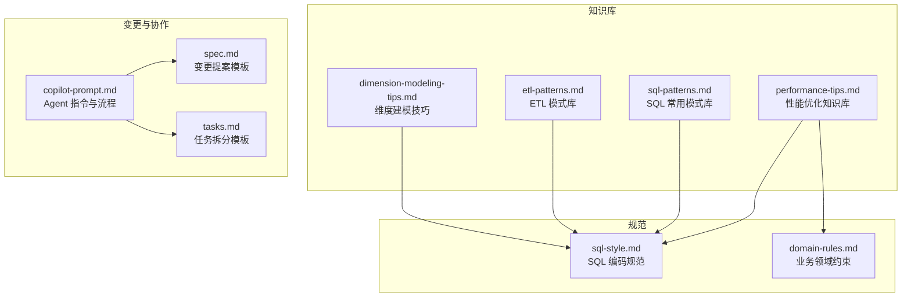
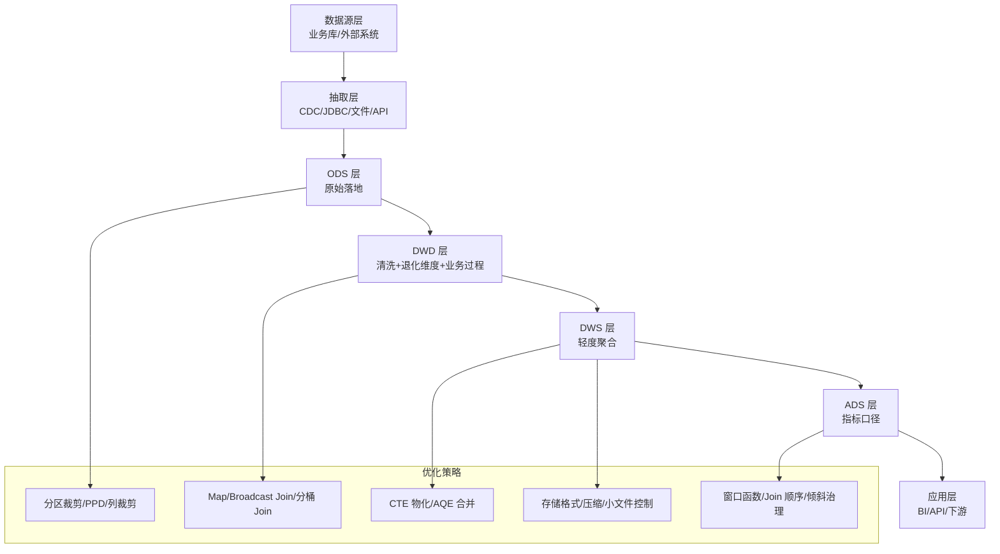
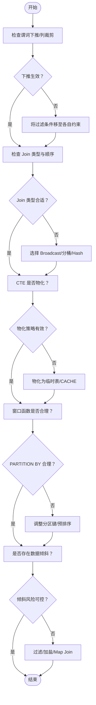
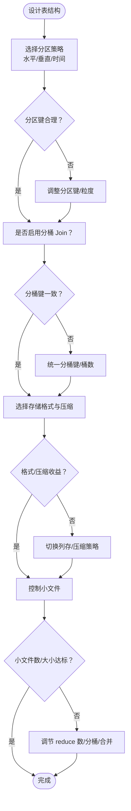
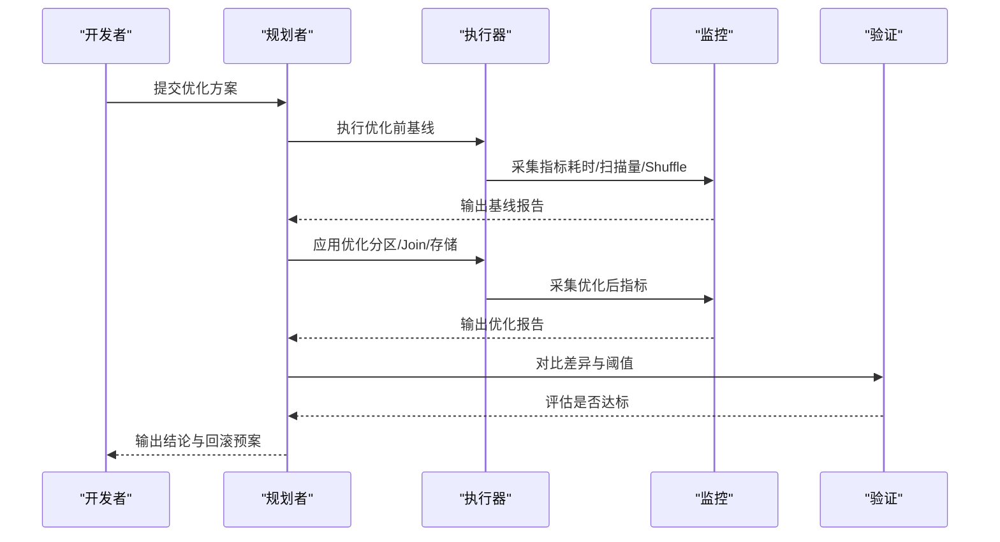
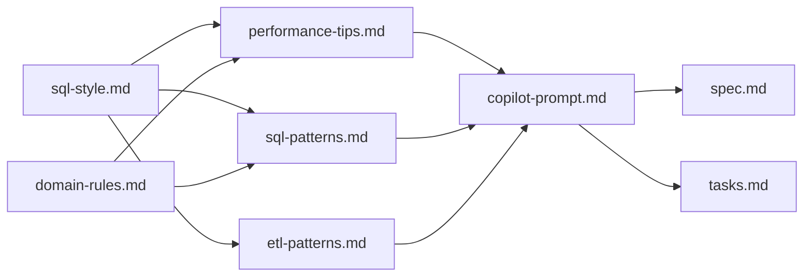

# 性能优化扩展

<cite>
**本文引用的文件**
- [performance-tips.md](file://data_warehouse_engineering_code_copilot/knowledge/performance-tips.md)
- [sql-patterns.md](file://data_warehouse_engineering_code_copilot/knowledge/sql-patterns.md)
- [etl-patterns.md](file://data_warehouse_engineering_code_copilot/knowledge/etl-patterns.md)
- [dimension-modeling-tips.md](file://data_warehouse_engineering_code_copilot/knowledge/dimension-modeling-tips.md)
- [domain-rules.md](file://data_warehouse_engineering_code_copilot/rules/domain-rules.md)
- [sql-style.md](file://data_warehouse_engineering_code_copilot/rules/sql-style.md)
- [copilot-prompt.md](file://data_warehouse_engineering_code_copilot/agents/copilot-prompt.md)
- [spec.md](file://data_warehouse_engineering_code_copilot/changes/templates/spec.md)
- [tasks.md](file://data_warehouse_engineering_code_copilot/changes/templates/tasks.md)
</cite>

## 目录
1. [简介](#简介)
2. [项目结构](#项目结构)
3. [核心组件](#核心组件)
4. [架构总览](#架构总览)
5. [详细组件分析](#详细组件分析)
6. [依赖关系分析](#依赖关系分析)
7. [性能考量](#性能考量)
8. [故障排查指南](#故障排查指南)
9. [结论](#结论)
10. [附录](#附录)

## 简介
本指南面向数据仓库工程团队，系统化扩展“性能优化经验库”，围绕查询优化模式、表设计优化（分区/分桶/存储格式）、分区策略模式、以及性能验证与质量保障机制，提供可落地的设计原则、实现细节与最佳实践。文档同时给出优化案例与性能调优模板，帮助在不同引擎（Hive/Spark/Trino/Iceberg 等）下稳定提升查询与 ETL 性能。

## 项目结构
该项目采用“知识库 + 规范 + 变更模板”的组织方式，便于沉淀经验、约束实现、追踪变更与验证效果。

图表来源
- [performance-tips.md:1-349](file://data_warehouse_engineering_code_copilot/knowledge/performance-tips.md#L1-L349)
- [sql-patterns.md:1-331](file://data_warehouse_engineering_code_copilot/knowledge/sql-patterns.md#L1-L331)
- [etl-patterns.md:1-220](file://data_warehouse_engineering_code_copilot/knowledge/etl-patterns.md#L1-L220)
- [dimension-modeling-tips.md:1-253](file://data_warehouse_engineering_code_copilot/knowledge/dimension-modeling-tips.md#L1-L253)
- [sql-style.md:1-254](file://data_warehouse_engineering_code_copilot/rules/sql-style.md#L1-L254)
- [domain-rules.md:1-142](file://data_warehouse_engineering_code_copilot/rules/domain-rules.md#L1-L142)
- [copilot-prompt.md:1-147](file://data_warehouse_engineering_code_copilot/agents/copilot-prompt.md#L1-L147)
- [spec.md:1-132](file://data_warehouse_engineering_code_copilot/changes/templates/spec.md#L1-L132)
- [tasks.md:1-74](file://data_warehouse_engineering_code_copilot/changes/templates/tasks.md#L1-L74)

章节来源
- [performance-tips.md:1-349](file://data_warehouse_engineering_code_copilot/knowledge/performance-tips.md#L1-L349)
- [sql-patterns.md:1-331](file://data_warehouse_engineering_code_copilot/knowledge/sql-patterns.md#L1-L331)
- [etl-patterns.md:1-220](file://data_warehouse_engineering_code_copilot/knowledge/etl-patterns.md#L1-L220)
- [dimension-modeling-tips.md:1-253](file://data_warehouse_engineering_code_copilot/knowledge/dimension-modeling-tips.md#L1-L253)
- [sql-style.md:1-254](file://data_warehouse_engineering_code_copilot/rules/sql-style.md#L1-L254)
- [domain-rules.md:1-142](file://data_warehouse_engineering_code_copilot/rules/domain-rules.md#L1-L142)
- [copilot-prompt.md:1-147](file://data_warehouse_engineering_code_copilot/agents/copilot-prompt.md#L1-L147)
- [spec.md:1-132](file://data_warehouse_engineering_code_copilot/changes/templates/spec.md#L1-L132)
- [tasks.md:1-74](file://data_warehouse_engineering_code_copilot/changes/templates/tasks.md#L1-L74)

## 核心组件
- 查询优化模式：分区裁剪、谓词下推/列裁剪、Map/Broadcast Join、CTE 物化、窗口函数优化、Join 顺序与类型、数据倾斜治理。
- 表设计优化：分区策略（水平/垂直/时间）、分桶 Join、存储格式与压缩、小文件控制。
- 分区策略模式：水平分区（按业务键/时间）、垂直分区（按维度/事实）、时间分区（日/小时/月）的设计原则与实现细节。
- 性能验证体系：执行计划分析、基准测试方法、性能监控指标、优化效果评估与回滚策略。
- 优化案例与模板：SQL 模式、ETL 模式、变更提案与任务拆分模板。

章节来源
- [performance-tips.md:5-349](file://data_warehouse_engineering_code_copilot/knowledge/performance-tips.md#L5-L349)
- [sql-patterns.md:6-331](file://data_warehouse_engineering_code_copilot/knowledge/sql-patterns.md#L6-L331)
- [etl-patterns.md:6-220](file://data_warehouse_engineering_code_copilot/knowledge/etl-patterns.md#L6-L220)
- [dimension-modeling-tips.md:39-253](file://data_warehouse_engineering_code_copilot/knowledge/dimension-modeling-tips.md#L39-L253)
- [sql-style.md:165-254](file://data_warehouse_engineering_code_copilot/rules/sql-style.md#L165-L254)
- [domain-rules.md:45-142](file://data_warehouse_engineering_code_copilot/rules/domain-rules.md#L45-L142)
- [copilot-prompt.md:117-147](file://data_warehouse_engineering_code_copilot/agents/copilot-prompt.md#L117-L147)
- [spec.md:104-132](file://data_warehouse_engineering_code_copilot/changes/templates/spec.md#L104-L132)
- [tasks.md:15-74](file://data_warehouse_engineering_code_copilot/changes/templates/tasks.md#L15-L74)

## 架构总览
性能优化贯穿“数据源层 → 抽取层 → 数仓层（ODS/DWD/DWS/ADS）→ 应用层（BI/API/下游消费）”。优化策略在各层协同推进，形成闭环验证与持续改进。

图表来源
- [copilot-prompt.md:137-147](file://data_warehouse_engineering_code_copilot/agents/copilot-prompt.md#L137-L147)
- [performance-tips.md:1-349](file://data_warehouse_engineering_code_copilot/knowledge/performance-tips.md#L1-L349)
- [etl-patterns.md:1-220](file://data_warehouse_engineering_code_copilot/knowledge/etl-patterns.md#L1-L220)
- [sql-patterns.md:1-331](file://data_warehouse_engineering_code_copilot/knowledge/sql-patterns.md#L1-L331)

## 详细组件分析

### 查询优化模式设计原则
- 分区裁剪：WHERE 条件直接命中分区字段，避免函数包裹导致全表扫描；验证执行计划中是否出现分区过滤。
- 谓词下推与列裁剪：将过滤条件尽量下推到数据源层，只读取必要列；避免在 JOIN ON 中混入过滤，避免 UDF 导致下推失效。
- Join 顺序与类型：依据引擎特性选择最优 Join 类型，优先 Broadcast Hash Join（小表），其次 Shuffle Hash Join，避免 Sort Merge Join 的高代价；分桶 Join 可跳过 Shuffle。
- Map/Broadcast Join：小表广播阈值按引擎设定，避免 Driver OOM；多表广播时注意内存累积。
- CTE 物化：不同引擎对 WITH 的物化策略不同，复杂 CTE 建议物化为临时表或显式 CACHE。
- 窗口函数：合理设置 PARTITION BY 列基数，避免倾斜；必要时配合 DISTRIBUTE BY + SORT BY 预排序。
- 数据倾斜治理：识别热点键，采用过滤单独处理、加盐打散、Map Join 等策略；关注配置项如自适应倾斜处理。

图表来源
- [performance-tips.md:196-349](file://data_warehouse_engineering_code_copilot/knowledge/performance-tips.md#L196-L349)
- [sql-patterns.md:167-194](file://data_warehouse_engineering_code_copilot/knowledge/sql-patterns.md#L167-L194)

章节来源
- [performance-tips.md:5-349](file://data_warehouse_engineering_code_copilot/knowledge/performance-tips.md#L5-L349)
- [sql-patterns.md:167-194](file://data_warehouse_engineering_code_copilot/knowledge/sql-patterns.md#L167-L194)

### 表设计优化：分区策略、分桶与存储格式
- 分区策略模式
  - 水平分区：按业务键（如 user_id）或时间（dt/dh）进行分区，确保 WHERE 条件直接命中分区字段。
  - 垂直分区：将高基数维度与事实表分离，降低单表宽度，提升扫描效率。
  - 时间分区：按日/小时/月分区，结合分区裁剪与列存格式，最大化过滤收益。
- 分桶设计：两侧表按相同 Join Key 分桶，启用分桶 Join 跳过 Shuffle，显著降低 Shuffle 成本。
- 存储格式与压缩：优先列存格式（ORC/Parquet），结合 ZSTD/ Snappy 压缩；小表/临时表可用 Snappy；强演进场景优先 Iceberg + Parquet。
- 小文件控制：输出端控制 reduce 数或使用 DISTRIBUTE BY；Spark 开启 AQE 自动合并；定期合并（Hive CONCATENATE、Iceberg 重写）。

图表来源
- [performance-tips.md:286-349](file://data_warehouse_engineering_code_copilot/knowledge/performance-tips.md#L286-L349)
- [dimension-modeling-tips.md:179-253](file://data_warehouse_engineering_code_copilot/knowledge/dimension-modeling-tips.md#L179-L253)

章节来源
- [performance-tips.md:247-349](file://data_warehouse_engineering_code_copilot/knowledge/performance-tips.md#L247-L349)
- [dimension-modeling-tips.md:179-253](file://data_warehouse_engineering_code_copilot/knowledge/dimension-modeling-tips.md#L179-L253)

### 分区策略模式添加规范
- 水平分区：按业务键（user_id、item_id）或时间（dt/dh）分区，WHERE 条件直接命中分区字段；避免函数包裹。
- 垂直分区：将维度列与事实列分离，降低单表宽度；对高频访问维度可考虑缓存或物化。
- 时间分区：按自然日/小时分区，结合业务日（local_dt）与报表口径，避免跨日订单混淆。
- 实现细节：分区字段统一 dt（YYYYMMDD），小时分区 dh（YYYYMMDDHH）；建表时明确分区与分桶策略；写入时使用 INSERT OVERWRITE 并按分区裁剪。

章节来源
- [performance-tips.md:5-40](file://data_warehouse_engineering_code_copilot/knowledge/performance-tips.md#L5-L40)
- [sql-style.md:80-87](file://data_warehouse_engineering_code_copilot/rules/sql-style.md#L80-L87)

### 性能优化验证标准流程
- 执行计划分析：使用 EXPLAIN/EXPLAIN EXTENDED 检查分区裁剪、Join 类型、Shuffle 数；确认 PartitionFilters/DataFilters。
- 基准测试：在相同数据量与资源条件下对比优化前后单作业耗时、扫描量、shuffle 读写量、资源消耗与成本。
- 性能监控指标：Stage 持续时间、Task 数据量分布、OOM/卡点、倾斜比例；结合作业历史与 Profile。
- 优化效果评估：以 P50/P95 耗时、扫描量、分区裁剪命中率、小文件数等指标量化收益；建立回滚策略与观察期。
- 数据质量校验：完整性/唯一性/一致性/准确性/时效性五维规则，配套判定 SQL 与阈值。

图表来源
- [copilot-prompt.md:117-124](file://data_warehouse_engineering_code_copilot/agents/copilot-prompt.md#L117-L124)
- [performance-tips.md:327-349](file://data_warehouse_engineering_code_copilot/knowledge/performance-tips.md#L327-L349)
- [domain-rules.md:69-91](file://data_warehouse_engineering_code_copilot/rules/domain-rules.md#L69-L91)

章节来源
- [copilot-prompt.md:117-124](file://data_warehouse_engineering_code_copilot/agents/copilot-prompt.md#L117-L124)
- [performance-tips.md:327-349](file://data_warehouse_engineering_code_copilot/knowledge/performance-tips.md#L327-L349)
- [domain-rules.md:69-91](file://data_warehouse_engineering_code_copilot/rules/domain-rules.md#L69-L91)

### 优化案例与性能调优模板
- 去重保留最新：使用 ROW_NUMBER 按主键与更新时间取最新；注意基数过低导致倾斜，可配合 DISTRIBUTE BY。
- 拉链表（SCD Type 2）：老链关、新链开；全量重写随历史增长代价上升，建议年度归档。
- 同环比（YoY/MoM）：限定窗口避免全表扫描；注意空值与除零处理。
- 分组 TopN：ROW_NUMBER 获取每组前 N；配合 DISTRIBUTE BY + SORT BY 降低二次排序。
- 累计求和：标准窗口写法；跨年/跨月分组时加 PARTITION BY。
- 行转列/列转行：行转列性能可控；列转行注意行数膨胀。
- 数据回刷（幂等覆盖）：单分区 INSERT OVERWRITE；批量回刷控制并发与队列资源。
- 增量 + 全量合并（Lambda）：增量优先覆盖昨日全量；超大表建议拉链或 ACID MERGE。
- NULL 安全比较：Hive/Spark 用 <=>，通用写法用 OR/AND 组合。

章节来源
- [sql-patterns.md:6-331](file://data_warehouse_engineering_code_copilot/knowledge/sql-patterns.md#L6-L331)

## 依赖关系分析
- 查询优化依赖于规范约束（命名、格式、性能优先原则）与领域规则（KPI/口径/质量维度）。
- ETL 模式与 SQL 模式相互支撑：ETL 侧保证幂等与回放，SQL 侧保证可维护性与性能。
- Agent 指令驱动变更流程：从提案、任务拆分、实施到验证与归档，形成闭环。

图表来源
- [sql-style.md:1-254](file://data_warehouse_engineering_code_copilot/rules/sql-style.md#L1-L254)
- [domain-rules.md:1-142](file://data_warehouse_engineering_code_copilot/rules/domain-rules.md#L1-L142)
- [performance-tips.md:1-349](file://data_warehouse_engineering_code_copilot/knowledge/performance-tips.md#L1-L349)
- [sql-patterns.md:1-331](file://data_warehouse_engineering_code_copilot/knowledge/sql-patterns.md#L1-L331)
- [etl-patterns.md:1-220](file://data_warehouse_engineering_code_copilot/knowledge/etl-patterns.md#L1-L220)
- [copilot-prompt.md:1-147](file://data_warehouse_engineering_code_copilot/agents/copilot-prompt.md#L1-L147)
- [spec.md:1-132](file://data_warehouse_engineering_code_copilot/changes/templates/spec.md#L1-L132)
- [tasks.md:1-74](file://data_warehouse_engineering_code_copilot/changes/templates/tasks.md#L1-L74)

章节来源
- [sql-style.md:1-254](file://data_warehouse_engineering_code_copilot/rules/sql-style.md#L1-L254)
- [domain-rules.md:1-142](file://data_warehouse_engineering_code_copilot/rules/domain-rules.md#L1-L142)
- [copilot-prompt.md:1-147](file://data_warehouse_engineering_code_copilot/agents/copilot-prompt.md#L1-L147)

## 性能考量
- 扫描量与分区裁剪：WHERE 条件直接命中 dt/dh，避免函数包裹；确认执行计划中 PartitionFilters。
- Shuffle 与 Join：优先 Broadcast/分桶 Join；避免 Sort Merge Join；必要时使用 DPP（Spark 3.0+）。
- 列存与压缩：ORC/Parquet + ZSTD/ Snappy；列裁剪与谓词下推收益巨大。
- 小文件与元数据：控制 reduce 数与 DISTRIBUTE BY；AQE 合并；定期合并。
- 倾斜与内存：热点键加盐打散；广播阈值与 Driver 内存上限；多表广播需谨慎。
- 调度与资源：队列隔离、错峰调度、SLA 基线、失败重试与告警。

章节来源
- [performance-tips.md:1-349](file://data_warehouse_engineering_code_copilot/knowledge/performance-tips.md#L1-L349)
- [sql-style.md:165-254](file://data_warehouse_engineering_code_copilot/rules/sql-style.md#L165-L254)

## 故障排查指南
- 现象收集：卡点、OOM、慢 Stage、倾斜比例异常。
- 根因定位：执行计划（分区裁剪/Join 类型/Shuffle）、作业历史与 Profile、数据采样（热点键）。
- 方案验证：对比优化前后指标（耗时/扫描量/资源），必要时回滚。
- 实施修复：按 Agent 指令进行四阶段闭环（现象收集→根因定位→方案验证→实施修复）。

章节来源
- [copilot-prompt.md:133-147](file://data_warehouse_engineering_code_copilot/agents/copilot-prompt.md#L133-L147)
- [performance-tips.md:327-349](file://data_warehouse_engineering_code_copilot/knowledge/performance-tips.md#L327-L349)

## 结论
通过系统化的查询优化模式、表设计优化与分区策略规范，结合严格的性能验证与质量保障机制，可在 Hive/Spark/Trino/Iceberg 等多引擎环境下稳定提升数仓性能。建议将优化经验沉淀为 SQL/ETL 模式与变更模板，形成可复用、可审计、可回溯的知识资产。

## 附录
- 变更提案模板：用于明确背景、现状、功能点、业务规则、模型变更、SQL 设计、ETL/调度变更、数据质量规则、影响范围、风险与验证策略。
- 任务拆分模板：将变更拆分为原子任务，明确目标、分层、涉及变更、关键 DDL/SQL、依赖、验收标准与回刷计划。

章节来源
- [spec.md:1-132](file://data_warehouse_engineering_code_copilot/changes/templates/spec.md#L1-L132)
- [tasks.md:1-74](file://data_warehouse_engineering_code_copilot/changes/templates/tasks.md#L1-L74)