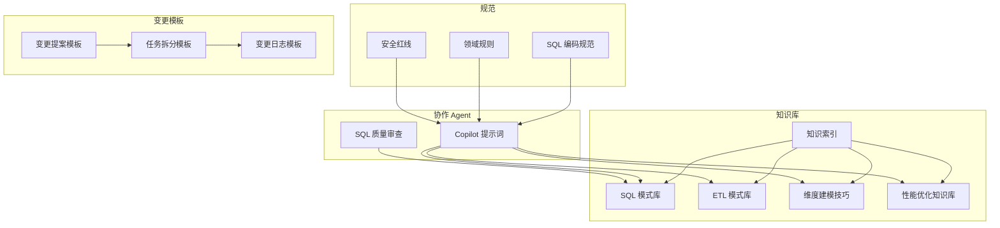
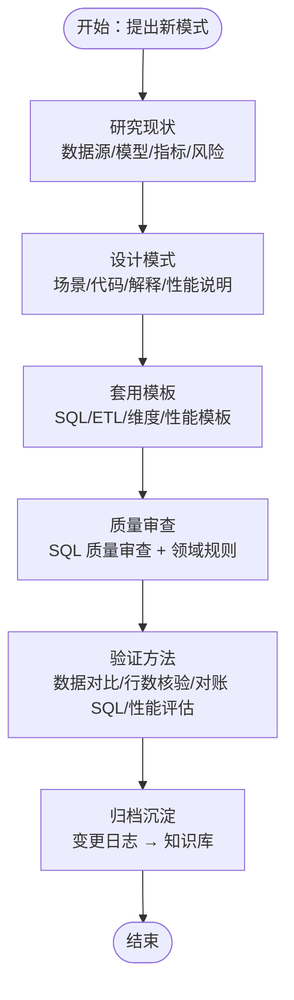
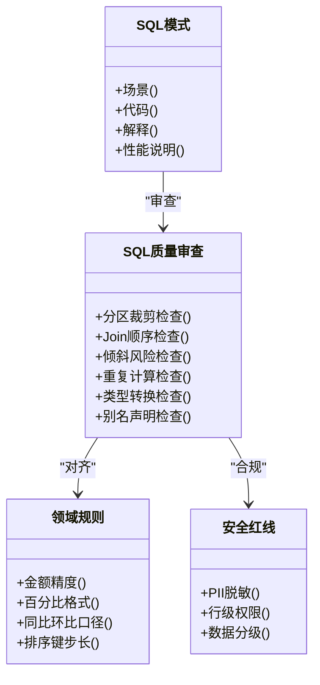
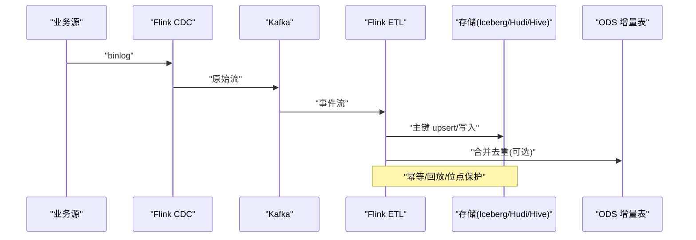
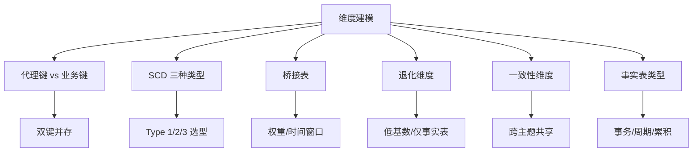
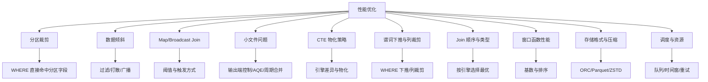
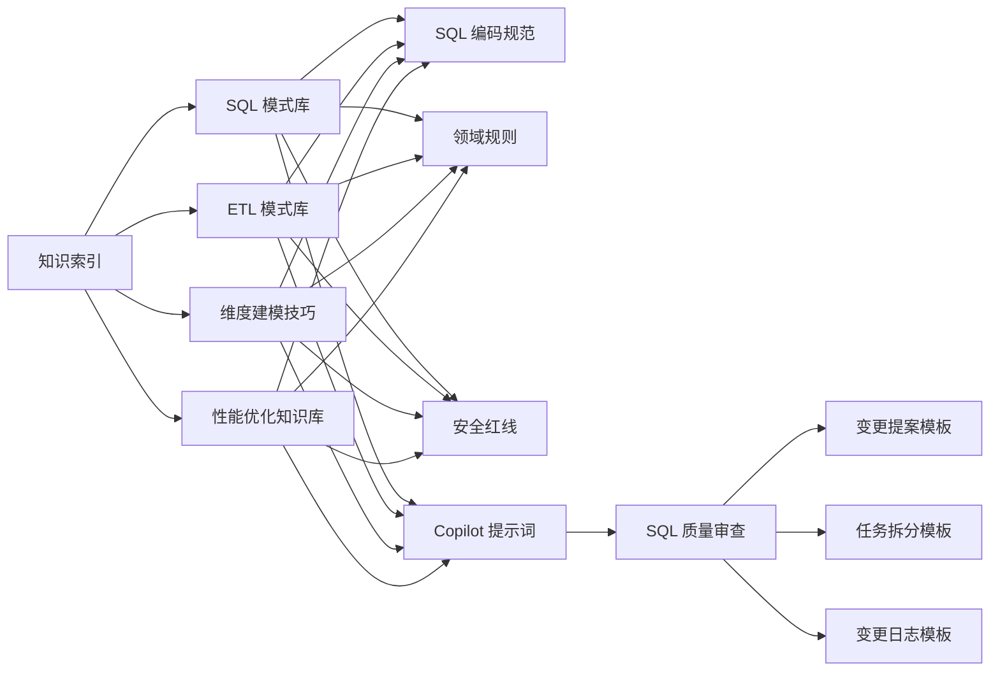

# 模式库扩展

<cite>
**本文引用的文件**
- [知识索引](file://data_warehouse_engineering_code_copilot/knowledge/index.md)
- [SQL 模式库](file://data_warehouse_engineering_code_copilot/knowledge/sql-patterns.md)
- [ETL 模式库](file://data_warehouse_engineering_code_copilot/knowledge/etl-patterns.md)
- [维度建模技巧](file://data_warehouse_engineering_code_copilot/knowledge/dimension-modeling-tips.md)
- [性能优化知识库](file://data_warehouse_engineering_code_copilot/knowledge/performance-tips.md)
- [Copilot 提示词](file://data_warehouse_engineering_code_copilot/agents/copilot-prompt.md)
- [SQL 质量审查](file://data_warehouse_engineering_code_copilot/agents/sql-reviewer.md)
- [领域规则](file://data_warehouse_engineering_code_copilot/rules/domain-rules.md)
- [SQL 编码规范](file://data_warehouse_engineering_code_copilot/rules/sql-style.md)
- [安全红线](file://data_warehouse_engineering_code_copilot/rules/security.md)
- [变更提案模板](file://data_warehouse_engineering_code_copilot/changes/templates/spec.md)
- [任务拆分模板](file://data_warehouse_engineering_code_copilot/changes/templates/tasks.md)
- [变更日志模板](file://data_warehouse_engineering_code_copilot/changes/templates/log.md)
</cite>

## 目录
1. [简介](#简介)
2. [项目结构](#项目结构)
3. [核心组件](#核心组件)
4. [架构总览](#架构总览)
5. [详细组件分析](#详细组件分析)
6. [依赖关系分析](#依赖关系分析)
7. [性能考量](#性能考量)
8. [故障排查指南](#故障排查指南)
9. [结论](#结论)
10. [附录](#附录)

## 简介
本指南面向“数据仓库工程协作助手”的模式库扩展，系统化说明如何新增模式（SQL 模式、ETL 模式、维度建模技巧、性能优化经验），并建立可复用的模板格式、验证标准与质量保证机制。文档以现有知识库为基础，结合变更管理流程，形成“提出—设计—实施—验证—沉淀”的闭环。

## 项目结构
项目采用“知识库 + 规范 + 变更模板 + 协作 Agent”的组织方式：
- knowledge/：模式库（SQL、ETL、维度建模、性能优化）
- rules/：领域规则、SQL 规范、安全红线
- changes/templates/：变更提案、任务拆分、变更日志模板
- agents/：Copilot 提示词与 SQL 质量审查

图表来源
- [知识索引:1-60](file://data_warehouse_engineering_code_copilot/knowledge/index.md#L1-L60)
- [SQL 模式库:1-331](file://data_warehouse_engineering_code_copilot/knowledge/sql-patterns.md#L1-L331)
- [ETL 模式库:1-220](file://data_warehouse_engineering_code_copilot/knowledge/etl-patterns.md#L1-L220)
- [维度建模技巧:1-253](file://data_warehouse_engineering_code_copilot/knowledge/dimension-modeling-tips.md#L1-L253)
- [性能优化知识库:1-349](file://data_warehouse_engineering_code_copilot/knowledge/performance-tips.md#L1-L349)
- [Copilot 提示词:1-147](file://data_warehouse_engineering_code_copilot/agents/copilot-prompt.md#L1-L147)
- [SQL 质量审查:1-68](file://data_warehouse_engineering_code_copilot/agents/sql-reviewer.md#L1-L68)
- [变更提案模板:1-132](file://data_warehouse_engineering_code_copilot/changes/templates/spec.md#L1-L132)
- [任务拆分模板:1-74](file://data_warehouse_engineering_code_copilot/changes/templates/tasks.md#L1-L74)
- [变更日志模板:1-61](file://data_warehouse_engineering_code_copilot/changes/templates/log.md#L1-L61)

章节来源
- [知识索引:1-60](file://data_warehouse_engineering_code_copilot/knowledge/index.md#L1-L60)

## 核心组件
- SQL 模式库：提供经验证的高质量 SQL 模式，包含场景、代码、解释与性能说明，覆盖去重保留最新、拉链表、同环比、TopN、累计求和、行转列/列转行、回刷幂等、Lambda 合并、缺失日期补齐、NULL 安全比较等。
- ETL 模式库：覆盖 CDC 增量同步、JDBC 增量抽取、MERGE/UPSERT、小文件控制、历史回刷、文件接入、API 拉取、全量/增量/CDC 选型对照、数据漂移与时区处理。
- 维度建模技巧：代理键 vs 业务键、SCD 三种类型、桥接表、退化维度、一致性维度、事实表类型选择、维度分级、分层归属判定。
- 性能优化知识库：分区裁剪、数据倾斜、Map/Broadcast Join、小文件问题、CTE 物化策略、谓词下推与列裁剪、Join 顺序与类型、窗口函数性能、存储格式与压缩、调度与资源、性能分析工具。
- 规范与约束：SQL 编码规范、领域规则（业务口径、KPI 定义、数据质量）、安全红线。
- 变更模板：变更提案、任务拆分、变更日志，支撑“Spec 驱动”的变更流程。
- 协作 Agent：Copilot 提示词与 SQL 质量审查，确保实现与规范一致、可维护、可验证。

章节来源
- [SQL 模式库:1-331](file://data_warehouse_engineering_code_copilot/knowledge/sql-patterns.md#L1-L331)
- [ETL 模式库:1-220](file://data_warehouse_engineering_code_copilot/knowledge/etl-patterns.md#L1-L220)
- [维度建模技巧:1-253](file://data_warehouse_engineering_code_copilot/knowledge/dimension-modeling-tips.md#L1-L253)
- [性能优化知识库:1-349](file://data_warehouse_engineering_code_copilot/knowledge/performance-tips.md#L1-L349)
- [SQL 编码规范:1-254](file://data_warehouse_engineering_code_copilot/rules/sql-style.md#L1-L254)
- [领域规则:1-142](file://data_warehouse_engineering_code_copilot/rules/domain-rules.md#L1-L142)
- [安全红线:1-98](file://data_warehouse_engineering_code_copilot/rules/security.md#L1-L98)
- [变更提案模板:1-132](file://data_warehouse_engineering_code_copilot/changes/templates/spec.md#L1-L132)
- [任务拆分模板:1-74](file://data_warehouse_engineering_code_copilot/changes/templates/tasks.md#L1-L74)
- [变更日志模板:1-61](file://data_warehouse_engineering_code_copilot/changes/templates/log.md#L1-L61)
- [Copilot 提示词:1-147](file://data_warehouse_engineering_code_copilot/agents/copilot-prompt.md#L1-L147)
- [SQL 质量审查:1-68](file://data_warehouse_engineering_code_copilot/agents/sql-reviewer.md#L1-L68)

## 架构总览
模式库扩展遵循“规范先行、模板驱动、质量审查、知识沉淀”的闭环流程。新增模式需满足：
- 设计原则：可复用、可验证、可维护、可迁移
- 模板格式：场景、代码、解释、性能说明（SQL 模式库）
- 验证标准：数据对比、行数核验、对账 SQL、性能评估
- 质量保证：SQL 质量审查、领域规则对齐、安全合规

图表来源
- [Copilot 提示词:68-147](file://data_warehouse_engineering_code_copilot/agents/copilot-prompt.md#L68-L147)
- [SQL 质量审查:1-68](file://data_warehouse_engineering_code_copilot/agents/sql-reviewer.md#L1-L68)
- [变更日志模板:1-61](file://data_warehouse_engineering_code_copilot/changes/templates/log.md#L1-L61)

## 详细组件分析

### SQL 模式库扩展指南
- 设计原则
  - 场景明确：针对常见业务问题（去重、拉链、同环比、TopN、累计求和、行转列/列转行、回刷幂等、Lambda 合并、缺失日期补齐、NULL 安全比较）
  - 代码可复用：提供 ANSI SQL/Hive SQL 通用写法，特殊引擎差异单独标注
  - 解释清晰：说明核心思想、注意事项、典型坑点
  - 性能说明：给出性能等级、潜在风险、优化建议
- 模板格式规范
  - 场景：一句话描述业务背景与目标
  - 代码：提供可直接复制的 SQL 片段，必要时附注释
  - 解释：核心逻辑、边界条件、与引擎差异
  - 性能说明：扫描量、Shuffle、倾斜风险、优化建议
- 验证标准
  - 数据对比：与业务库直查或历史版本对比
  - 行数核验：源 vs 目标 vs 上一版本
  - 对账 SQL：关键指标一致性校验
  - 性能评估：单作业耗时、扫描量、成本
- 质量保证
  - SQL 质量审查：分区裁剪、Join 顺序、倾斜风险、重复计算、类型转换、别名声明等
  - 领域规则：金额精度、百分比格式、同比/环比口径、排序键步长等
  - 安全合规：PII 脱敏、行级权限、数据分级

图表来源
- [SQL 模式库:1-331](file://data_warehouse_engineering_code_copilot/knowledge/sql-patterns.md#L1-L331)
- [SQL 质量审查:1-68](file://data_warehouse_engineering_code_copilot/agents/sql-reviewer.md#L1-L68)
- [领域规则:1-142](file://data_warehouse_engineering_code_copilot/rules/domain-rules.md#L1-L142)
- [安全红线:1-98](file://data_warehouse_engineering_code_copilot/rules/security.md#L1-L98)

章节来源
- [SQL 模式库:1-331](file://data_warehouse_engineering_code_copilot/knowledge/sql-patterns.md#L1-L331)
- [SQL 质量审查:1-68](file://data_warehouse_engineering_code_copilot/agents/sql-reviewer.md#L1-L68)
- [领域规则:1-142](file://data_warehouse_engineering_code_copilot/rules/domain-rules.md#L1-L142)
- [安全红线:1-98](file://data_warehouse_engineering_code_copilot/rules/security.md#L1-L98)

### ETL 模式库扩展指南
- 设计原则
  - 场景导向：覆盖 JDBC 抽取、CDC、文件、API 等典型场景
  - 关键约定：位点保护、op 字段、幂等、回放、水位字段、小文件控制、历史回刷流程
  - 踩坑警示：binlog 事件时间、大事务、主备切换、时区不一致、小表广播 OOM 等
- 模板格式规范
  - 场景：业务背景与目标
  - 拓扑：端到端数据流图（可选）
  - 关键约定：位点/水位/幂等/回放等
  - 关键 SQL/代码：抽取 SQL、MERGE/UPSERT、小文件控制、回刷流程
  - 踩坑：常见陷阱与规避
- 验证标准
  - 幂等与回放：单分区覆盖、多分区回刷、失败重试
  - 数据一致性：源 vs 目标行数、关键指标对账
  - 性能评估：扫描量、并发、小文件数
- 质量保证
  - SQL 质量审查：分区裁剪、Join 顺序、倾斜风险
  - 领域规则：口径一致性、时区处理
  - 安全合规：密钥管理、API 限流、断点续传

图表来源
- [ETL 模式库:6-28](file://data_warehouse_engineering_code_copilot/knowledge/etl-patterns.md#L6-L28)

章节来源
- [ETL 模式库:1-220](file://data_warehouse_engineering_code_copilot/knowledge/etl-patterns.md#L1-L220)
- [SQL 质量审查:1-68](file://data_warehouse_engineering_code_copilot/agents/sql-reviewer.md#L1-L68)
- [领域规则:1-142](file://data_warehouse_engineering_code_copilot/rules/domain-rules.md#L1-L142)
- [安全红线:1-98](file://data_warehouse_engineering_code_copilot/rules/security.md#L1-L98)

### 维度建模技巧扩展指南
- 设计原则
  - 代理键 vs 业务键：双键并存，兼顾稳定性与可追溯性
  - SCD 三种类型：Type 1/2/3 适用场景与权衡
  - 桥接表：解决多对多与多值维度，注意权重与时间窗口
  - 退化维度：低基数/仅事实表使用的属性直接退化
  - 一致性维度：跨主题共享，避免重复建设
  - 事实表类型：事务/周期/累积/无事实事实表的选择
- 模板格式规范
  - 概念：定义与适用场景
  - 示例：建表/查询示例
  - 选型建议：权衡历史完整性、存储开销、Join 复杂度
  - 踩坑：常见误区与规避
- 验证标准
  - 数据一致性：跨主题口径对齐
  - Join 正确性：SCD 时间窗口、桥接权重
  - 性能评估：维度基数、Join 代价
- 质量保证
  - SQL 质量审查：Join 顺序、倾斜风险
  - 领域规则：KPI 定义、指标字典
  - 安全合规：PII 脱敏、行级权限

图表来源
- [维度建模技巧:5-253](file://data_warehouse_engineering_code_copilot/knowledge/dimension-modeling-tips.md#L5-L253)

章节来源
- [维度建模技巧:1-253](file://data_warehouse_engineering_code_copilot/knowledge/dimension-modeling-tips.md#L1-L253)
- [SQL 质量审查:1-68](file://data_warehouse_engineering_code_copilot/agents/sql-reviewer.md#L1-L68)
- [领域规则:1-142](file://data_warehouse_engineering_code_copilot/rules/domain-rules.md#L1-L142)
- [安全红线:1-98](file://data_warehouse_engineering_code_copilot/rules/security.md#L1-L98)

### 性能优化经验扩展指南
- 设计原则
  - 分区裁剪：WHERE 直接命中分区字段，禁止函数包裹
  - 数据倾斜：过滤/打散/小表广播
  - Map/Broadcast Join：阈值与触发方式
  - 小文件问题：输出端控制、AQE 合并、周期性合并
  - CTE 物化策略：引擎差异与推荐做法
  - 谓词下推与列裁剪：WHERE 下推、只读必要列
  - Join 顺序与类型：按引擎选择最优
  - 窗口函数性能：PARTITION BY 列基数与排序
  - 存储格式与压缩：ORC/Parquet/ZSTD
  - 调度与资源：队列划分、时间窗、失败重试
  - 性能分析工具：EXPLAIN、作业历史、Profile、采样
- 模板格式规范
  - 核心：优化目标与原理
  - 反例 vs 正例：对比展示
  - 验证：执行计划、采样、对比
  - 踩坑：常见失效场景与规避
- 验证标准
  - EXPLAIN：分区裁剪、Join 类型、Shuffle 数
  - 采样：倾斜键识别
  - 对比：优化前后扫描量、耗时、资源、成本
- 质量保证
  - SQL 质量审查：分区裁剪、倾斜风险、CTE 物化
  - 领域规则：KPI 与指标口径
  - 安全合规：PII 脱敏、行级权限

图表来源
- [性能优化知识库:5-349](file://data_warehouse_engineering_code_copilot/knowledge/performance-tips.md#L5-L349)

章节来源
- [性能优化知识库:1-349](file://data_warehouse_engineering_code_copilot/knowledge/performance-tips.md#L1-L349)
- [SQL 质量审查:1-68](file://data_warehouse_engineering_code_copilot/agents/sql-reviewer.md#L1-L68)
- [领域规则:1-142](file://data_warehouse_engineering_code_copilot/rules/domain-rules.md#L1-L142)
- [安全红线:1-98](file://data_warehouse_engineering_code_copilot/rules/security.md#L1-L98)

## 依赖关系分析
- 知识索引作为导航中枢，串联 SQL 模式库、ETL 模式库、维度建模技巧、性能优化知识库
- Copilot 提示词与 SQL 质量审查贯穿模式设计与实施全过程
- 变更模板（Spec/Tasks/Log）保障变更的可追溯与可复用
- 规范（SQL 编码规范、领域规则、安全红线）为模式设计提供约束与边界

图表来源
- [知识索引:1-60](file://data_warehouse_engineering_code_copilot/knowledge/index.md#L1-L60)
- [SQL 模式库:1-331](file://data_warehouse_engineering_code_copilot/knowledge/sql-patterns.md#L1-L331)
- [ETL 模式库:1-220](file://data_warehouse_engineering_code_copilot/knowledge/etl-patterns.md#L1-L220)
- [维度建模技巧:1-253](file://data_warehouse_engineering_code_copilot/knowledge/dimension-modeling-tips.md#L1-L253)
- [性能优化知识库:1-349](file://data_warehouse_engineering_code_copilot/knowledge/performance-tips.md#L1-L349)
- [SQL 编码规范:1-254](file://data_warehouse_engineering_code_copilot/rules/sql-style.md#L1-L254)
- [领域规则:1-142](file://data_warehouse_engineering_code_copilot/rules/domain-rules.md#L1-L142)
- [安全红线:1-98](file://data_warehouse_engineering_code_copilot/rules/security.md#L1-L98)
- [Copilot 提示词:1-147](file://data_warehouse_engineering_code_copilot/agents/copilot-prompt.md#L1-L147)
- [SQL 质量审查:1-68](file://data_warehouse_engineering_code_copilot/agents/sql-reviewer.md#L1-L68)
- [变更提案模板:1-132](file://data_warehouse_engineering_code_copilot/changes/templates/spec.md#L1-L132)
- [任务拆分模板:1-74](file://data_warehouse_engineering_code_copilot/changes/templates/tasks.md#L1-L74)
- [变更日志模板:1-61](file://data_warehouse_engineering_code_copilot/changes/templates/log.md#L1-L61)

章节来源
- [知识索引:1-60](file://data_warehouse_engineering_code_copilot/knowledge/index.md#L1-L60)
- [Copilot 提示词:1-147](file://data_warehouse_engineering_code_copilot/agents/copilot-prompt.md#L1-L147)
- [SQL 质量审查:1-68](file://data_warehouse_engineering_code_copilot/agents/sql-reviewer.md#L1-L68)
- [变更提案模板:1-132](file://data_warehouse_engineering_code_copilot/changes/templates/spec.md#L1-L132)
- [任务拆分模板:1-74](file://data_warehouse_engineering_code_copilot/changes/templates/tasks.md#L1-L74)
- [变更日志模板:1-61](file://data_warehouse_engineering_code_copilot/changes/templates/log.md#L1-L61)

## 性能考量
- 分区裁剪：WHERE 直接命中分区字段，避免函数包裹
- 数据倾斜：过滤热点、加盐打散、小表广播
- Join 顺序：按引擎选择最优 Join 类型与顺序
- CTE 物化：根据引擎差异选择物化或临时表
- 存储格式：ORC/Parquet + ZSTD，列裁剪与谓词下推
- 调度与资源：队列划分、时间窗、失败重试

章节来源
- [性能优化知识库:1-349](file://data_warehouse_engineering_code_copilot/knowledge/performance-tips.md#L1-L349)
- [SQL 质量审查:1-68](file://data_warehouse_engineering_code_copilot/agents/sql-reviewer.md#L1-L68)

## 故障排查指南
- 调试流程：现象收集 → 根因定位 → 方案验证 → 实施修复
- 诊断层级：数据源层 → 抽取层 → 数仓层（ODS/DWD/DWS/ADS）→ 应用层
- 常见问题：全表扫描、笛卡尔积、重复计算、分区裁剪失效、倾斜、小文件、CTE 未物化
- 安全与合规：PII 脱敏、行级权限、数据分级、密钥管理

章节来源
- [Copilot 提示词:133-147](file://data_warehouse_engineering_code_copilot/agents/copilot-prompt.md#L133-L147)
- [SQL 质量审查:1-68](file://data_warehouse_engineering_code_copilot/agents/sql-reviewer.md#L1-L68)
- [安全红线:1-98](file://data_warehouse_engineering_code_copilot/rules/security.md#L1-L98)

## 结论
通过规范化的模式设计、严格的模板格式、完善的验证标准与质量保证机制，可以持续扩展与沉淀高质量的模式库。建议在新增模式时：
- 以“场景—代码—解释—性能”为主线
- 严格遵循 SQL 编码规范与领域规则
- 通过 SQL 质量审查与变更模板确保可维护性与可追溯性
- 以变更日志沉淀知识，推动“知识飞轮”持续迭代

## 附录
- 变更提案模板：用于提出与记录变更需求、现状分析、功能点、业务规则、模型变更、SQL 加工设计、ETL/同步变更、调度变更、数据质量规则、影响范围、风险与关注点、验证策略、技术决策、执行日志、审查结论与确认记录
- 任务拆分模板：按数据源接入 → ODS 落地 → DIM 维度建设 → DWD 明细加工 → DWS 汇总 → ADS 应用层 → 调度配置 → 数据质量 → 权限发布顺序拆分任务，明确目标、分层、涉及变更、关键 DDL/SQL、依赖、验收标准、验证方法、回刷计划
- 变更日志模板：记录时间线、技术决策、踩坑记录、知识发现、Spec-实现偏差记录、数据回刷记录、性能对比记录、数据质量验证记录、质量备忘

章节来源
- [变更提案模板:1-132](file://data_warehouse_engineering_code_copilot/changes/templates/spec.md#L1-L132)
- [任务拆分模板:1-74](file://data_warehouse_engineering_code_copilot/changes/templates/tasks.md#L1-L74)
- [变更日志模板:1-61](file://data_warehouse_engineering_code_copilot/changes/templates/log.md#L1-L61)