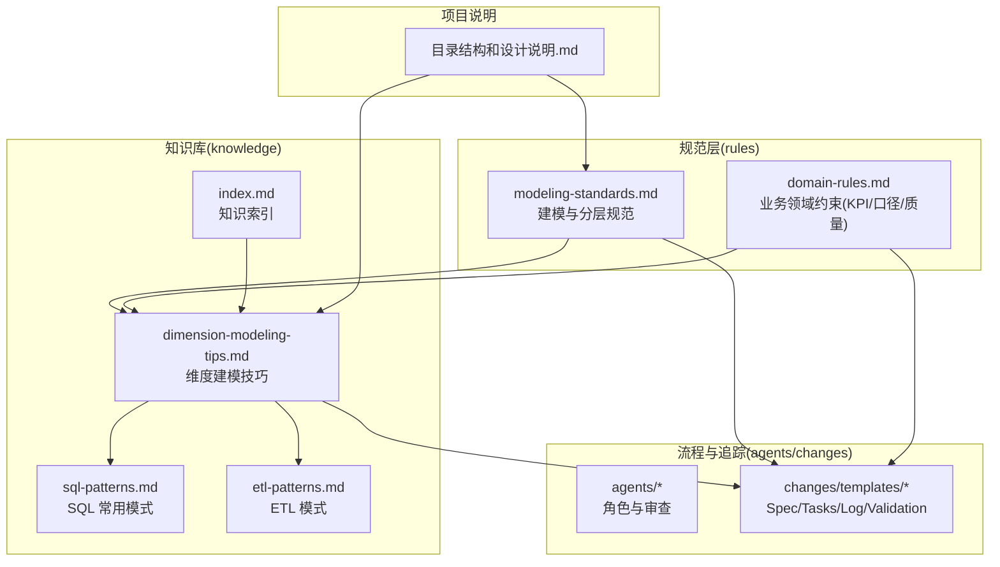
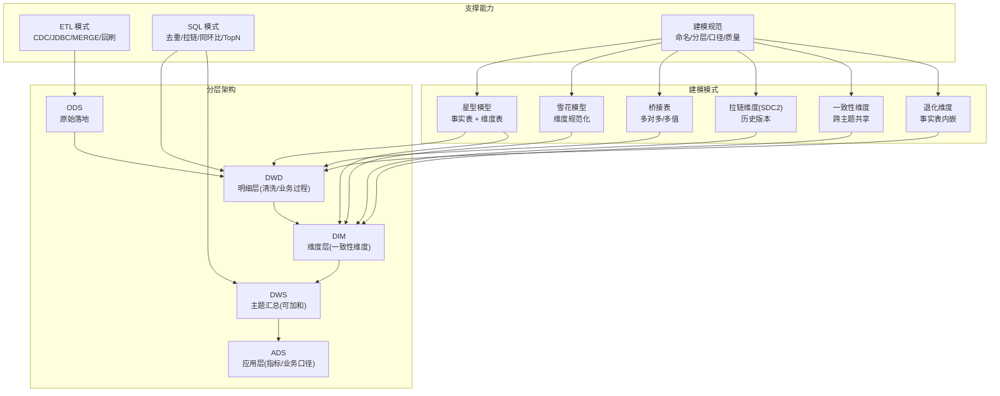
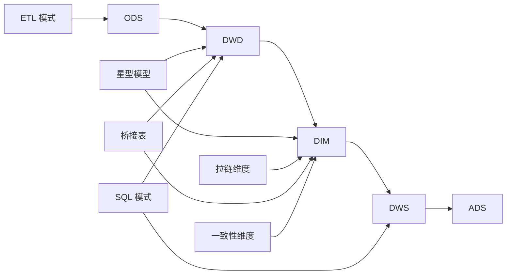

# 维度建模扩展

<cite>
**本文引用的文件**
- [dimension-modeling-tips.md](file://data_warehouse_engineering_code_copilot/knowledge/dimension-modeling-tips.md)
- [modeling-standards.md](file://data_warehouse_engineering_code_copilot/rules/modeling-standards.md)
- [sql-patterns.md](file://data_warehouse_engineering_code_copilot/knowledge/sql-patterns.md)
- [etl-patterns.md](file://data_warehouse_engineering_code_copilot/knowledge/etl-patterns.md)
- [domain-rules.md](file://data_warehouse_engineering_code_copilot/rules/domain-rules.md)
- [index.md](file://data_warehouse_engineering_code_copilot/knowledge/index.md)
- [目录结构和设计说明.md](file://data_warehouse_engineering_code_copilot/目录结构和设计说明.md)
</cite>

## 目录
1. [引言](#引言)
2. [项目结构](#项目结构)
3. [核心组件](#核心组件)
4. [架构概览](#架构概览)
5. [详细组件分析](#详细组件分析)
6. [依赖分析](#依赖分析)
7. [性能考量](#性能考量)
8. [故障排查指南](#故障排查指南)
9. [结论](#结论)
10. [附录](#附录)

## 引言
本指南围绕维度建模的“星型模型”“雪花模型”“桥接表模式”三大主题，结合仓库现有知识与规范，系统阐述：
- 星型模型的扩展方法：事实表与维度表的设计原则、命名规范、关系建立与查询路径
- 雪花模型的扩展指南：维度表规范化与反规范化策略、查询性能权衡与治理建议
- 桥接表模式的设计原理：多对多关系处理、缓慢变化维度管理、数据冗余控制
- 模式验证方法论：模型完整性检查、查询性能评估、存储效率分析与质量标准
- 建模模板与设计示例：可直接复用的 DDL/命名/分层/口径模板与示例路径

## 项目结构
仓库采用“三段式知识库 + 强制变更追踪”的工程化组织方式：
- rules/：强制约束与规范（建模分层、命名、指标口径、安全等）
- knowledge/：经验沉淀（维度建模技巧、SQL 模式、ETL 模式、性能优化）
- agents/：AI 角色与审查流程（SQL/模型/性能/版本追踪）
- changes/templates/：变更驱动的 Spec/Tasks/Log/Validation 模板

图表来源
- [目录结构和设计说明.md:19-55](file://data_warehouse_engineering_code_copilot/目录结构和设计说明.md#L19-L55)
- [modeling-standards.md:1-242](file://data_warehouse_engineering_code_copilot/rules/modeling-standards.md#L1-L242)
- [dimension-modeling-tips.md:1-253](file://data_warehouse_engineering_code_copilot/knowledge/dimension-modeling-tips.md#L1-L253)
- [sql-patterns.md:1-331](file://data_warehouse_engineering_code_copilot/knowledge/sql-patterns.md#L1-L331)
- [etl-patterns.md:1-220](file://data_warehouse_engineering_code_copilot/knowledge/etl-patterns.md#L1-L220)
- [index.md:1-60](file://data_warehouse_engineering_code_copilot/knowledge/index.md#L1-L60)

章节来源
- [目录结构和设计说明.md:19-55](file://data_warehouse_engineering_code_copilot/目录结构和设计说明.md#L19-L55)
- [index.md:27-36](file://data_warehouse_engineering_code_copilot/knowledge/index.md#L27-L36)

## 核心组件
- 星型模型（Kimball）：事实表 + 维度表，维度表为高度反规范化，强调查询性能与可理解性
- 雪花模型：在星型基础上对维度表进一步规范化，降低存储但增加 Join 复杂度
- 桥接表：解决多对多或多值维度，承载权重与时间窗口，平衡冗余与一致性
- 拉链维度（SCD2）：保留历史版本，查询时需带时间窗口
- 一致性维度：跨主题共享，避免重复建设
- 退化维度：低基数/仅事实表使用属性，直接退化为事实表列
- 事实表类型：事务事实表、周期快照、累积快照、无事实事实表

章节来源
- [dimension-modeling-tips.md:39-122](file://data_warehouse_engineering_code_copilot/knowledge/dimension-modeling-tips.md#L39-L122)
- [modeling-standards.md:49-87](file://data_warehouse_engineering_code_copilot/rules/modeling-standards.md#L49-L87)

## 架构概览
下图展示维度建模在分层中的位置与交互关系，以及与 ETL/SQL 模式的衔接。

图表来源
- [modeling-standards.md:7-46](file://data_warehouse_engineering_code_copilot/rules/modeling-standards.md#L7-L46)
- [modeling-standards.md:49-87](file://data_warehouse_engineering_code_copilot/rules/modeling-standards.md#L49-L87)
- [dimension-modeling-tips.md:86-122](file://data_warehouse_engineering_code_copilot/knowledge/dimension-modeling-tips.md#L86-L122)
- [sql-patterns.md:42-94](file://data_warehouse_engineering_code_copilot/knowledge/sql-patterns.md#L42-L94)
- [etl-patterns.md:6-27](file://data_warehouse_engineering_code_copilot/knowledge/etl-patterns.md#L6-L27)

## 详细组件分析

### 星型模型扩展方法
- 设计原则
  - 事实表只保留外键、退化维度与度量值，避免描述性属性冗余
  - 维度表高度反规范化，包含完整描述性属性，提升查询性能
  - 一致性维度跨主题共享，避免重复建设
- 命名规范
  - 事实表：dwd_xxx_di（事务事实表）、dwd_xxx_1d（周期快照）、dwd_xxx_da（累积快照）
  - 维度表：dim_xxx，拉链维度：dim_xxx_zip
  - 桥接表：bridge_xxx
- 关系建立
  - 事实表外键 = 维度表代理键
  - 拉链维度关联需带时间窗口
  - 默认 LEFT JOIN，必要时使用 INNER JOIN
- 查询路径
  - 星型模型查询路径短、Join 少，适合 OLAP 分析
  - 对于强层级/强复用/强治理需求，可考虑雪花模型，但需说明原因

章节来源
- [modeling-standards.md:73-114](file://data_warehouse_engineering_code_copilot/rules/modeling-standards.md#L73-L114)
- [modeling-standards.md:118-142](file://data_warehouse_engineering_code_copilot/rules/modeling-standards.md#L118-L142)
- [modeling-standards.md:151-161](file://data_warehouse_engineering_code_copilot/rules/modeling-standards.md#L151-L161)
- [modeling-standards.md:59-69](file://data_warehouse_engineering_code_copilot/rules/modeling-standards.md#L59-L69)

### 雪花模型扩展指南
- 规范化设计
  - 将维度表进一步拆分为父子表，减少冗余，提升存储效率
  - 适用于强层级（如地理/组织）或强复用维度
- 反规范化策略
  - 在热点维度上做“宽维度”缓存，减少 Join
  - 对查询频繁的维度属性进行冗余存储
- 查询性能权衡
  - Join 增多带来 CPU/网络开销上升，需结合查询模式评估
  - 建议在 DWS/ADS 层做预聚合，缓解雪花模型的 Join 压力
- 治理建议
  - 严格记录雪花化的动机与范围，避免无理由的过度规范化
  - 保持一致性维度的共享与复用，防止“雪花陷阱”

章节来源
- [modeling-standards.md:51-56](file://data_warehouse_engineering_code_copilot/rules/modeling-standards.md#L51-L56)

### 桥接表模式设计原理
- 多对多关系处理
  - 通过桥接表将多对多关系分解为两个一对多关系，消除交叉表
  - 支持权重字段，用于金额/数量等度量的分摊与去重
- 缓慢变化维度管理
  - 桥接表可带时间窗口字段，记录标签/角色等随时间变化的关系
  - 与拉链维度配合，实现“关系的历史版本”
- 数据冗余控制
  - 桥接表行数 ≈ 实体基数 × 平均关系基数，需关注爆炸效应
  - 可通过预计算宽表或在 DWS 层做聚合，降低冗余
- 关键约定
  - 权重字段用于避免重复计算
  - 时间窗口用于关系随时间变化的追踪
  - 基数控制与性能监控并重

章节来源
- [dimension-modeling-tips.md:86-122](file://data_warehouse_engineering_code_copilot/knowledge/dimension-modeling-tips.md#L86-L122)

### 缓慢变化维度（SCD）与拉链表
- 类型与适用场景
  - Type 1：覆盖，不保留历史，适用于纠错型变更
  - Type 2：拉链，保留完整历史，适用于业务追溯
  - Type 3：双列对照，保留前一版本，适用于简单对比
- 实现要点
  - 拉链表写入需幂等（全量重写）
  - 查询时必须带时间窗口：`fact.dt BETWEEN dim.start_date AND dim.end_date`
- 选型对照
  - 历史完整性、存储开销、Join 复杂度、适用场景综合权衡

章节来源
- [dimension-modeling-tips.md:39-83](file://data_warehouse_engineering_code_copilot/knowledge/dimension-modeling-tips.md#L39-L83)
- [sql-patterns.md:42-94](file://data_warehouse_engineering_code_copilot/knowledge/sql-patterns.md#L42-L94)

### 一致性维度与退化维度
- 一致性维度
  - 跨主题共享，避免重复建设；变更需广播预警
  - 典型例子：dim_date、dim_user、dim_product
- 退化维度
  - 低基数/仅事实表使用属性，直接退化为事实表列
  - 适用场景：订单号、支付渠道等

章节来源
- [dimension-modeling-tips.md:125-155](file://data_warehouse_engineering_code_copilot/knowledge/dimension-modeling-tips.md#L125-L155)
- [dimension-modeling-tips.md:158-176](file://data_warehouse_engineering_code_copilot/knowledge/dimension-modeling-tips.md#L158-L176)

### 事实表类型选择
- 事务事实表：单事件粒度，适合订单、支付、点击
- 周期快照：等间隔状态拍照，适合库存、账户余额
- 累积快照：流程多个里程碑的快照，适合订单生命周期
- 无事实事实表：仅记录事件发生，适合选课、咨询

章节来源
- [dimension-modeling-tips.md:179-204](file://data_warehouse_engineering_code_copilot/knowledge/dimension-modeling-tips.md#L179-L204)

### 维度表分级
- 核心维度：高复用、低变化（用户、商品、组织）
- 扩展维度：仅特定主题使用（订单标签、风险评分）
- 杂项维度：低基数标志位组合，降低事实表外键列数

章节来源
- [dimension-modeling-tips.md:207-231](file://data_warehouse_engineering_code_copilot/knowledge/dimension-modeling-tips.md#L207-L231)

### 数仓分层归属判定
- ODS：原始落地（保留源端字段，不加工）
- DWD：清洗 + 维度退化 + 业务过程
- DWS：轻度聚合（多维度组合）
- ADS：应用层（指标 + 业务口径）
- DIM：维度表

章节来源
- [dimension-modeling-tips.md:233-253](file://data_warehouse_engineering_code_copilot/knowledge/dimension-modeling-tips.md#L233-L253)

## 依赖分析
- 分层依赖
  - ODS → DWD → DIM → DWS → ADS，禁止跨层反向与跳跃
- 模式依赖
  - 星型模型依赖一致性维度与拉链维度
  - 桥接表依赖维度表与事实表
- ETL/SQL 依赖
  - ETL 提供数据来源与变更追踪
  - SQL 模式支撑去重、拉链、同环比、TopN 等分析

图表来源
- [modeling-standards.md:163-167](file://data_warehouse_engineering_code_copilot/rules/modeling-standards.md#L163-L167)
- [modeling-standards.md:151-161](file://data_warehouse_engineering_code_copilot/rules/modeling-standards.md#L151-L161)
- [etl-patterns.md:6-27](file://data_warehouse_engineering_code_copilot/knowledge/etl-patterns.md#L6-L27)
- [sql-patterns.md:42-94](file://data_warehouse_engineering_code_copilot/knowledge/sql-patterns.md#L42-L94)

章节来源
- [modeling-standards.md:163-167](file://data_warehouse_engineering_code_copilot/rules/modeling-standards.md#L163-L167)
- [modeling-standards.md:151-161](file://data_warehouse_engineering_code_copilot/rules/modeling-standards.md#L151-L161)

## 性能考量
- 分区裁剪：WHERE 条件直接命中分区字段，避免函数包裹
- 数据倾斜：高频空值/默认值加盐打散，或拆分 SQL
- Map Join：小表广播加速
- Broadcast 阈值：各引擎默认阈值与调参
- 小文件合并：输出端控制并发与文件大小
- CTE 物化：各引擎对 WITH 的物化策略差异
- Join 优化：星型模型减少 Join，雪花模型在 DWS/ADS 层预聚合

章节来源
- [index.md:38-48](file://data_warehouse_engineering_code_copilot/knowledge/index.md#L38-L48)
- [modeling-standards.md:171-193](file://data_warehouse_engineering_code_copilot/rules/modeling-standards.md#L171-L193)

## 故障排查指南
- 拉链维度查询错误
  - 症状：历史数据不正确
  - 原因：未带时间窗口或时间区间不匹配
  - 处理：在关联条件中加入时间窗口
- 桥接表重复计算
  - 症状：金额/数量重复
  - 原因：未使用权重字段
  - 处理：在聚合时乘以权重，或预计算宽表
- 维度表基数爆炸
  - 症状：桥接表行数异常增长
  - 原因：平均关系基数过高
  - 处理：拆分维度、预聚合、限制关系基数
- 分层误用
  - 症状：跨层读取导致口径不一致
  - 原因：DWD 做主题汇总、ADS 做清洗
  - 处理：严格按分层职责执行，避免跨层依赖

章节来源
- [dimension-modeling-tips.md:80-83](file://data_warehouse_engineering_code_copilot/knowledge/dimension-modeling-tips.md#L80-L83)
- [dimension-modeling-tips.md:119-122](file://data_warehouse_engineering_code_copilot/knowledge/dimension-modeling-tips.md#L119-L122)
- [modeling-standards.md:212-221](file://data_warehouse_engineering_code_copilot/rules/modeling-standards.md#L212-L221)

## 结论
- 星型模型是数仓分析的首选，强调查询性能与可理解性
- 雪花模型在特定强层级/强复用场景下可适度使用，但需严格治理
- 桥接表是处理多对多/多值维度的关键手段，需重视权重与时间窗口
- 拉链维度与一致性维度是保障历史追溯与口径一致性的基础
- 严格的分层与命名规范、完善的 ETL/SQL 模式与性能优化策略，是高质量维度建模的保障

## 附录

### 模式验证方法论
- 模型完整性检查
  - 表名前缀与粒度后缀是否符合分层规范
  - 主键/外键命名是否规范
  - 分区字段是否为 dt，生命周期是否配置
  - 字段类型与注释是否齐全
- 查询性能评估
  - 分区裁剪是否生效
  - Join 是否过多，是否在 DWS/ADS 层预聚合
  - 是否存在数据倾斜与小文件问题
- 存储效率分析
  - 维度表是否过度规范化
  - 桥接表行数是否在预期范围内
  - 拉链维度是否定期归档与拆分

章节来源
- [modeling-standards.md:224-242](file://data_warehouse_engineering_code_copilot/rules/modeling-standards.md#L224-L242)

### 建模模板与设计示例（路径）
- 事实表标准字段与分区
  - 示例路径：[标准事实表字段与分区:90-114](file://data_warehouse_engineering_code_copilot/rules/modeling-standards.md#L90-L114)
- 维度表标准字段与 SCD2
  - 示例路径：[标准维度表字段与 SCD2:127-142](file://data_warehouse_engineering_code_copilot/rules/modeling-standards.md#L127-L142)
- 拉链表实现（SCD2）
  - 示例路径：[拉链表实现:42-94](file://data_warehouse_engineering_code_copilot/knowledge/sql-patterns.md#L42-L94)
- 桥接表示例与用法
  - 示例路径：[桥接表示例与用法:86-122](file://data_warehouse_engineering_code_copilot/knowledge/dimension-modeling-tips.md#L86-L122)
- 代理键 vs 业务键
  - 示例路径：[代理键与业务键:5-36](file://data_warehouse_engineering_code_copilot/knowledge/dimension-modeling-tips.md#L5-L36)
- 一致性维度与退化维度
  - 示例路径：[一致性维度:158-176](file://data_warehouse_engineering_code_copilot/knowledge/dimension-modeling-tips.md#L158-L176)，[退化维度:125-155](file://data_warehouse_engineering_code_copilot/knowledge/dimension-modeling-tips.md#L125-L155)
- 事实表类型选择
  - 示例路径：[事实表类型:179-204](file://data_warehouse_engineering_code_copilot/knowledge/dimension-modeling-tips.md#L179-L204)
- 维度表分级
  - 示例路径：[维度表分级:207-231](file://data_warehouse_engineering_code_copilot/knowledge/dimension-modeling-tips.md#L207-L231)
- 数仓分层归属判定
  - 示例路径：[分层归属:233-253](file://data_warehouse_engineering_code_copilot/knowledge/dimension-modeling-tips.md#L233-L253)