# 系统架构设计

<cite>
**本文档引用的文件**
- [目录结构和设计说明.md](file://目录结构和设计说明.md)
- [copilot-prompt.md](file://agents/copilot-prompt.md)
- [version-tracker.md](file://agents/version-tracker.md)
- [domain-rules.md](file://rules/domain-rules.md)
- [security.md](file://rules/security.md)
- [sql-style.md](file://rules/sql-style.md)
- [index.md](file://knowledge/index.md)
- [dimension-modeling-tips.md](file://knowledge/dimension-modeling-tips.md)
- [etl-patterns.md](file://knowledge/etl-patterns.md)
- [performance-tips.md](file://knowledge/performance-tips.md)
- [sql-patterns.md](file://knowledge/sql-patterns.md)
- [spec.md](file://changes/templates/spec.md)
- [tasks.md](file://changes/templates/tasks.md)
- [log.md](file://changes/templates/log.md)
</cite>

## 目录
1. [引言](#引言)
2. [项目结构](#项目结构)
3. [核心组件](#核心组件)
4. [架构概览](#架构概览)
5. [详细组件分析](#详细组件分析)
6. [依赖关系分析](#依赖关系分析)
7. [性能考虑](#性能考虑)
8. [故障排除指南](#故障排除指南)
9. [结论](#结论)

## 引言

dwh-copilot 是一个面向数据仓库开发场景的 AI 数据分析与建模协作助手。该项目采用"Spec 驱动 + 三段式知识结构 + 强制变更追踪"的核心设计理念，旨在为数据仓库开发提供标准化、可审计、可复用的工程化协作框架。

该项目的核心价值在于：
- **标准化流程**：通过严格的命令式协作机制，确保每个变更都在受控流程中进行
- **知识复用**：三段式知识结构实现了从实践到知识沉淀的飞轮效应
- **可审计性**：强制变更追踪确保所有操作都有据可查
- **质量保障**：多阶段审查机制从源头保证代码质量

## 项目结构

项目采用模块化的目录结构，围绕三个核心维度组织：

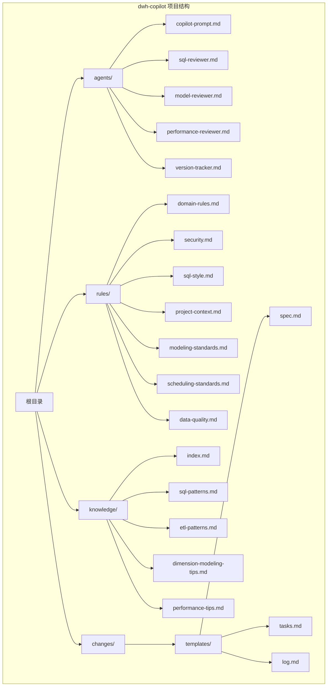

**图表来源**
- [目录结构和设计说明.md:21-55](file://目录结构和设计说明.md#L21-L55)

### 三段式知识结构设计

项目的核心创新在于三段式知识结构，每段都有明确的职责分工：

| 目录 | 角色 | 关系 | 职责 |
|------|------|------|------|
| `rules/` | **约束** — 必须遵守的"红线" | 强制 | 定义项目约束、规范和强制规则 |
| `knowledge/` | **经验** — 可复用的"工具箱" | 推荐 | 提供可复用的模式库和最佳实践 |
| `changes/` | **过程** — 每次变更的"病历" | 历史 | 记录具体的变更过程和结果 |

**章节来源**
- [目录结构和设计说明.md:70-79](file://目录结构和设计说明.md#L70-L79)

## 核心组件

### 1. Spec 驱动架构

Spec 驱动是整个系统的核心设计理念，强调需求规格（Spec）作为昂贵的核心资产的重要性。

#### Spec 驱动四条铁律

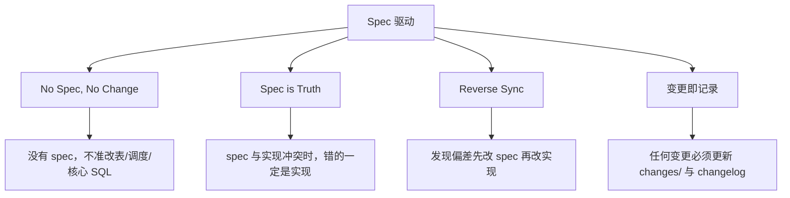

**图表来源**
- [目录结构和设计说明.md:64-69](file://目录结构和设计说明.md#L64-L69)

#### Spec 模板结构

Spec 模板提供了完整的变更管理框架：

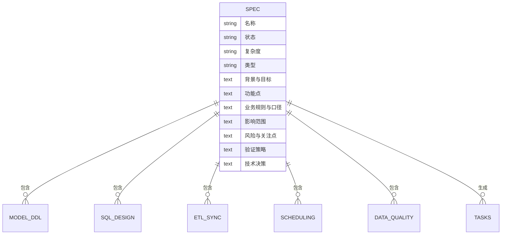

**图表来源**
- [spec.md:1-132](file://changes/templates/spec.md#L1-L132)

**章节来源**
- [目录结构和设计说明.md:61-69](file://目录结构和设计说明.md#L61-L69)
- [spec.md:1-132](file://changes/templates/spec.md#L1-L132)

### 2. 命令式协作机制

系统通过一组标准化的命令实现强制性的协作流程：

#### 命令体系

| 命令 | 触发场景 | 核心功能 |
|------|---------|---------|
| `/init` | 新项目初始化 | 填充项目上下文 |
| `/sql` | 单段 SQL 开发 | SQL 脚本生成与审查 |
| `/etl` | 数据接入开发 | ETL/同步任务配置 |
| `/model` | 数仓建模 | 分层设计与 DDL 生成 |
| `/propose` | 变更提案 | Spec 生成与确认 |
| `/apply` | 实施执行 | 任务拆分与执行 |
| `/review` | 质量审查 | 三阶段审查流程 |
| `/optimize` | 性能诊断 | 五层性能诊断 |
| `/dq` | 数据质量 | DQ 规则与对账 |
| `/schedule` | 调度配置 | 作业依赖与 SLA |
| `/archive` | 知识沉淀 | 归档与知识复用 |

**章节来源**
- [目录结构和设计说明.md:80-97](file://目录结构和设计说明.md#L80-L97)

### 3. 强制变更追踪

Version Tracker 作为强制变更追踪的核心组件，确保所有操作都有据可查：

#### 变更追踪流程

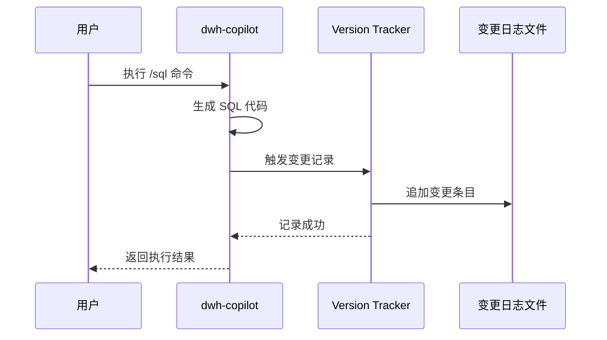

**图表来源**
- [version-tracker.md:5-16](file://agents/version-tracker.md#L5-L16)

**章节来源**
- [version-tracker.md:1-120](file://agents/version-tracker.md#L1-L120)

## 架构概览

### 系统整体架构

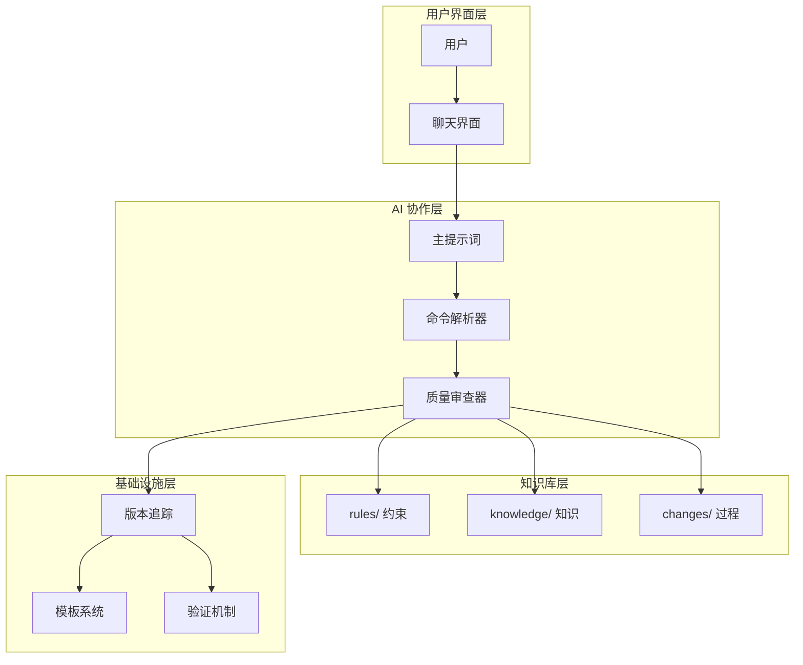

**图表来源**
- [目录结构和设计说明.md:19-55](file://目录结构和设计说明.md#L19-L55)

### 三段式知识结构协作流程

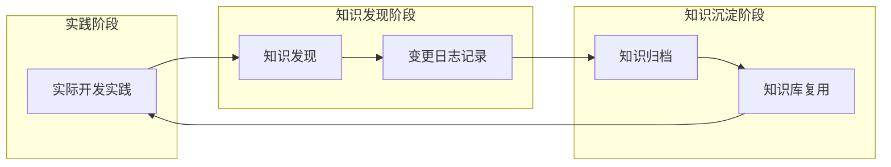

**图表来源**
- [目录结构和设计说明.md:78](file://目录结构和设计说明.md#L78)

## 详细组件分析

### 1. 规则系统（Rules）

规则系统是项目的约束层，包含强制性和推荐性的规则定义。

#### 规则分类与特点

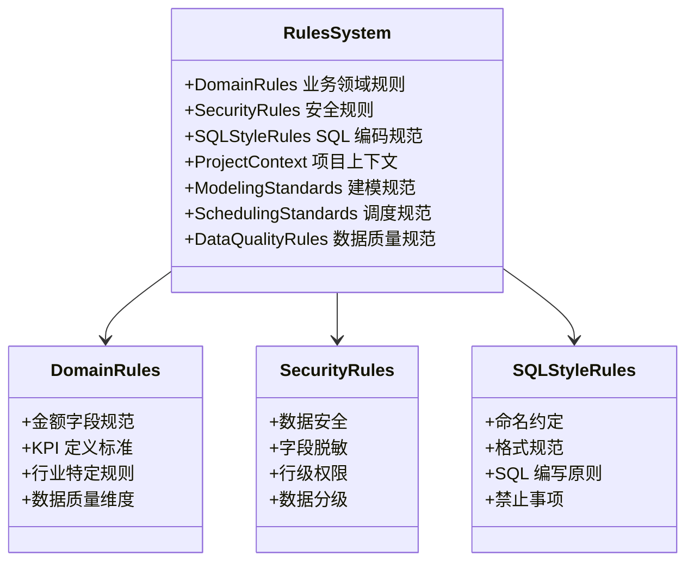

**图表来源**
- [domain-rules.md:1-142](file://rules/domain-rules.md#L1-L142)
- [security.md:1-98](file://rules/security.md#L1-L98)
- [sql-style.md:1-254](file://rules/sql-style.md#L1-L254)

#### 数据质量规则体系

数据质量规则采用五维度模型：

| 维度 | 含义 | 典型规则 | 严重等级 |
|------|------|---------|---------|
| **完整性** | 必填字段非空率 | 非空率 ≥ 99.9% | P0 阻断 |
| **唯一性** | 主键不重复 | COUNT(*) = COUNT(DISTINCT pk) | P1 告警 |
| **一致性** | 上下游对齐 | 行数差异 < 0.1%，金额差异 < 0.5% | P1 告警 |
| **准确性** | 与业务真实值匹配 | 与业务库直查对账 | P1 告警 |
| **时效性** | 按时产出 | 产出时间 ≤ SLA 基线 | P2 监控 |

**章节来源**
- [domain-rules.md:69-91](file://rules/domain-rules.md#L69-L91)

### 2. 知识库系统（Knowledge）

知识库系统提供可复用的经验和模式库，支持快速开发和质量保证。

#### 知识库组织结构

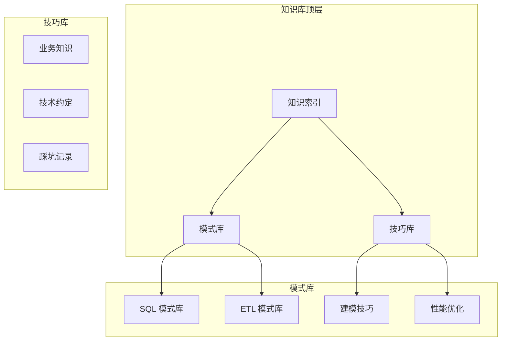

**图表来源**
- [index.md:1-60](file://knowledge/index.md#L1-L60)

#### SQL 模式库核心模式

| 模式类型 | 场景 | 核心逻辑 | 性能特征 |
|----------|------|---------|---------|
| 去重保留最新 | CDC 后处理 | ROW_NUMBER() OVER PARTITION BY | 🟢 良好 |
| 拉链表（SCD2） | 历史变化追踪 | 老链关闭 + 新链开启 | 🟡 中等 |
| 同环比计算 | 指标趋势分析 | 自连接 + 日期偏移 | 🟢 良好 |
| 分组 TopN | 排名分析 | ROW_NUMBER() + QUALIFY | 🟡 中等 |
| 累计求和 | 时间序列分析 | SUM() OVER (ORDER BY...) | 🟢 良好 |

**章节来源**
- [sql-patterns.md:6-331](file://knowledge/sql-patterns.md#L6-L331)

### 3. 变更管理系统（Changes）

变更管理系统通过模板化的方式管理整个变更生命周期。

#### 变更流程模板

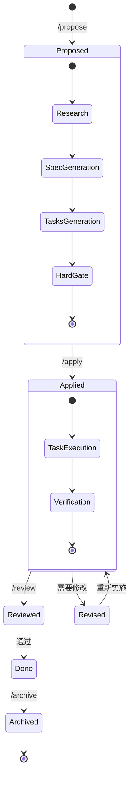

**图表来源**
- [目录结构和设计说明.md:126-167](file://目录结构和设计说明.md#L126-L167)

#### 任务拆分原则

任务拆分遵循"原子化"原则，每个任务必须满足：
- **可独立验证**：能够独立验证其正确性
- **精确到对象**：精确到库.表.字段或作业名
- **最小可行**：聚焦单一表或单一作业
- **可回滚**：具备回滚能力

**章节来源**
- [tasks.md:1-74](file://changes/templates/tasks.md#L1-L74)

### 4. 主提示词系统

主提示词系统定义了 dwh-copilot 的核心行为和约束。

#### 核心法则体系

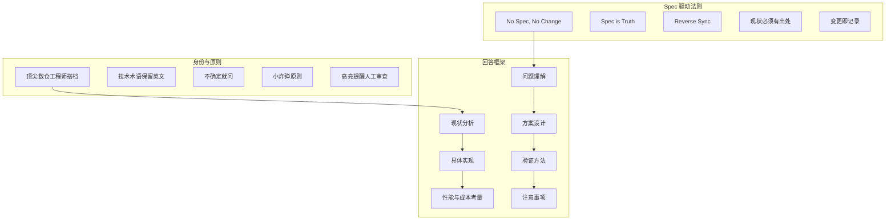

**图表来源**
- [copilot-prompt.md:4-34](file://agents/copilot-prompt.md#L4-L34)

**章节来源**
- [copilot-prompt.md:1-147](file://agents/copilot-prompt.md#L1-L147)

## 依赖关系分析

### 1. 组件耦合关系

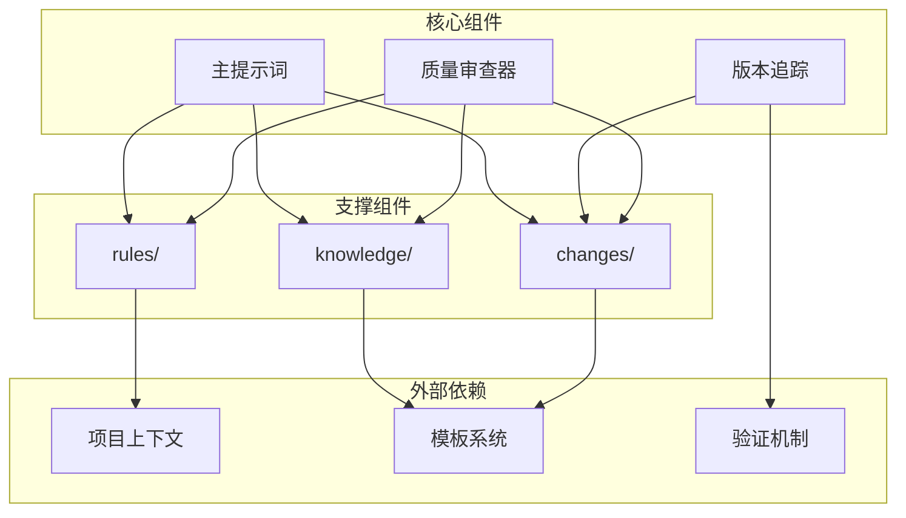

**图表来源**
- [目录结构和设计说明.md:19-55](file://目录结构和设计说明.md#L19-L55)

### 2. 数据流向分析

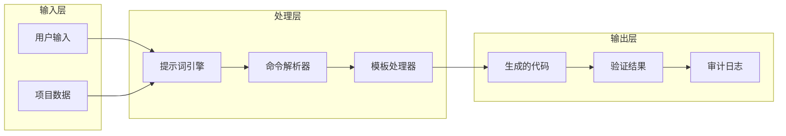

**图表来源**
- [copilot-prompt.md:55-61](file://agents/copilot-prompt.md#L55-L61)

### 3. 依赖深度分析

| 组件 | 直接依赖 | 间接依赖 | 总依赖数 |
|------|---------|---------|---------|
| 主提示词 | rules/, knowledge/, changes/ | 项目上下文 | 3 |
| 规则系统 | 项目上下文 | 无 | 1 |
| 知识库 | 无 | 无 | 0 |
| 变更管理 | 模板系统 | 无 | 1 |
| 版本追踪 | 变更日志文件 | 无 | 1 |

**章节来源**
- [目录结构和设计说明.md:19-55](file://目录结构和设计说明.md#L19-L55)

## 性能考虑

### 1. 查询性能优化

系统在多个层面考虑性能优化：

#### 分区裁剪优化

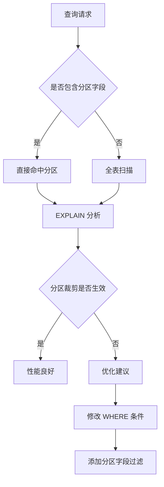

**图表来源**
- [performance-tips.md:5-35](file://knowledge/performance-tips.md#L5-L35)

#### 数据倾斜处理策略

| 处理方案 | 适用场景 | 实现方式 | 性能影响 |
|----------|---------|---------|---------|
| 过滤 + 单独处理 | 热点键明确 | WHERE IN/NOT IN | 🟢 最小 |
| 加盐打散 | 热点分布均匀 | RAND() % N | 🟡 中等 |
| Map Join | 小表广播 | BROADCAST | 🟢 最佳 |
| 分区重组 | 大表分桶 | CLUSTERED BY | 🟡 中等 |

**章节来源**
- [performance-tips.md:42-98](file://knowledge/performance-tips.md#L42-L98)

### 2. 存储格式选择

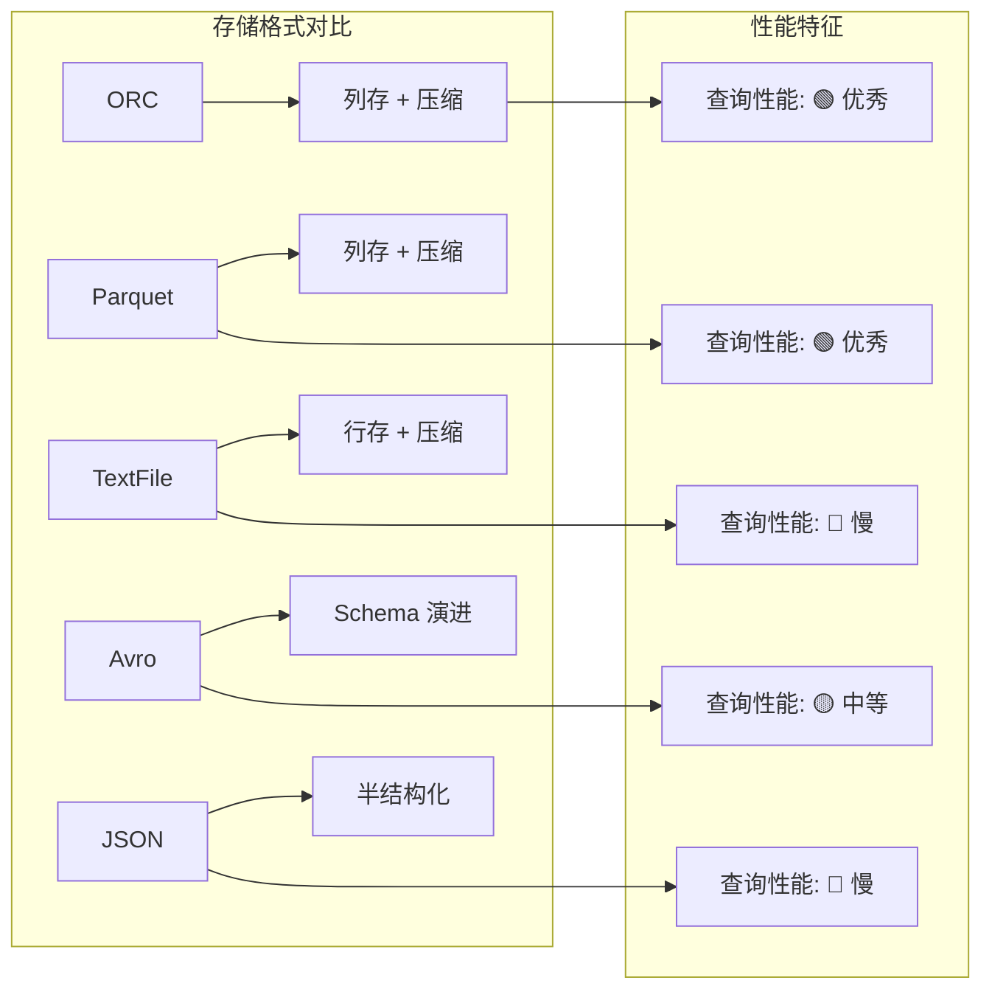

**图表来源**
- [performance-tips.md:286-305](file://knowledge/performance-tips.md#L286-L305)

### 3. 调度优化策略

| 优化维度 | 策略 | 实现方式 | 效果 |
|----------|------|---------|------|
| 资源队列 | 优先级划分 | 按主题/优先级 | 🟢 提升吞吐 |
| 错峰调度 | 时间窗优化 | 避开备份高峰 | 🟢 减少竞争 |
| 依赖紧凑 | 上游就绪触发 | 减少空等 | 🟡 减少等待 |
| 失败重试 | 指数退避 | 1min→5min→15min | 🟢 提高成功率 |

**章节来源**
- [performance-tips.md:308-324](file://knowledge/performance-tips.md#L308-L324)

## 故障排除指南

### 1. 常见问题诊断

#### 性能问题诊断流程

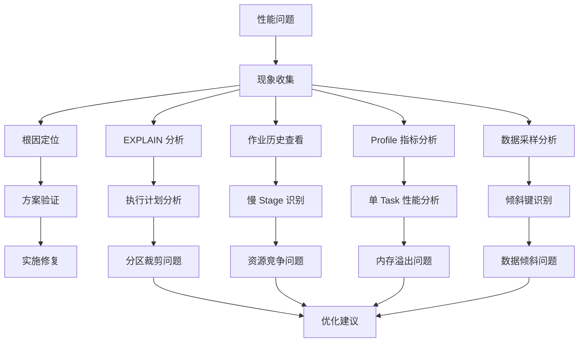

**图表来源**
- [copilot-prompt.md:133-146](file://agents/copilot-prompt.md#L133-L146)

#### 质量问题处理流程

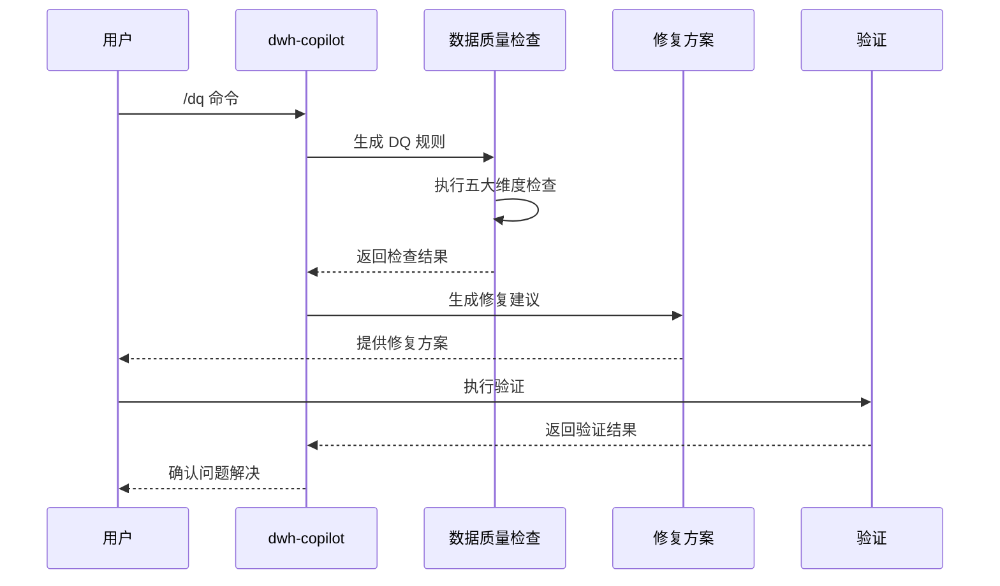

**图表来源**
- [copilot-prompt.md:121-124](file://agents/copilot-prompt.md#L121-L124)

### 2. 审计与回溯

#### 变更追踪机制

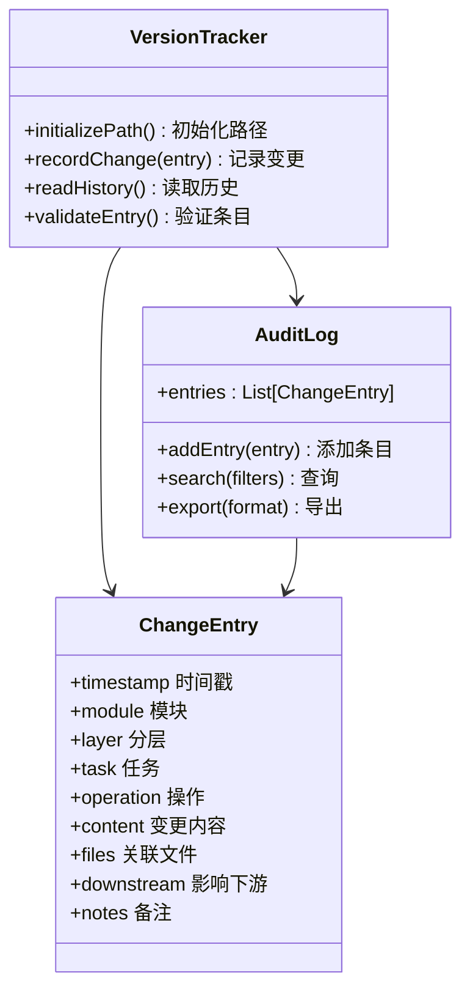

**图表来源**
- [version-tracker.md:44-64](file://agents/version-tracker.md#L44-L64)

**章节来源**
- [version-tracker.md:80-89](file://agents/version-tracker.md#L80-L89)

## 结论

dwh-copilot 通过"Spec 驱动 + 三段式知识结构 + 强制变更追踪"的架构设计，为数据仓库开发提供了一个完整的工程化协作框架。该系统的主要优势包括：

### 架构优势

1. **标准化流程**：通过严格的命令式协作机制，确保每个变更都在受控流程中进行
2. **知识复用**：三段式知识结构实现了从实践到知识沉淀的飞轮效应
3. **可审计性**：强制变更追踪确保所有操作都有据可查
4. **质量保障**：多阶段审查机制从源头保证代码质量

### 技术创新

1. **Spec 驱动**：将需求规格作为核心资产，避免实现偏离
2. **三段式知识结构**：将约束、经验和过程分离，提高系统的可维护性
3. **命令式协作**：通过标准化命令实现强制性的协作流程
4. **强制变更追踪**：确保所有操作都有据可查

### 可扩展性考虑

系统在设计时充分考虑了可扩展性：
- **模块化设计**：各组件相对独立，便于单独扩展
- **模板化机制**：支持新的规则、模式和流程的快速添加
- **插件化架构**：支持第三方工具和平台的集成
- **配置驱动**：通过配置文件支持不同项目的需求

### 最佳实践建议

1. **严格遵循 Spec 驱动原则**：任何变更都必须有明确的 Spec 支持
2. **及时记录变更**：每个操作完成后都要触发版本追踪
3. **充分利用知识库**：优先使用已有的模式和最佳实践
4. **持续改进**：通过 /archive 命令不断沉淀新的知识

该架构设计为数据仓库工程协作提供了一个坚实的基础，既保证了开发效率，又确保了质量和可维护性。