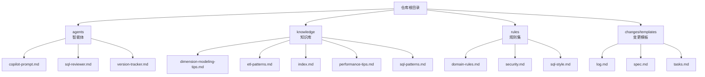
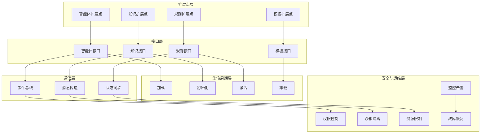
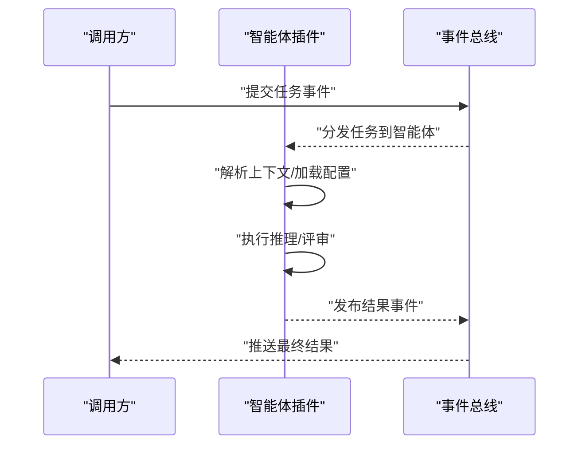
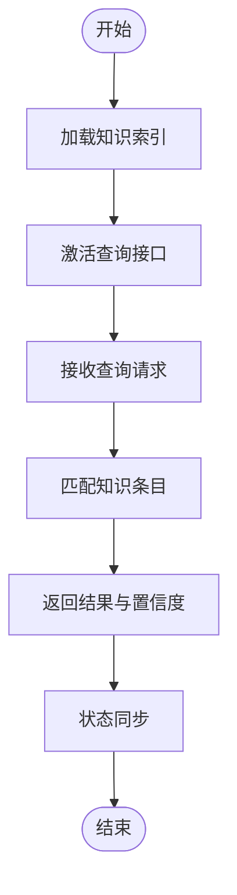
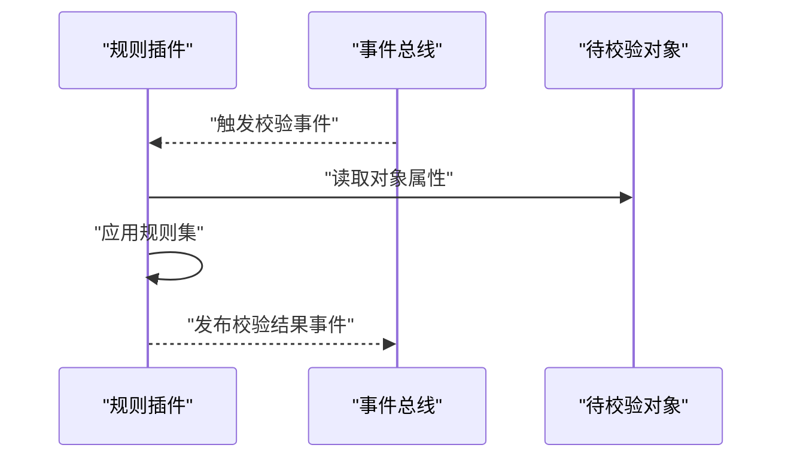
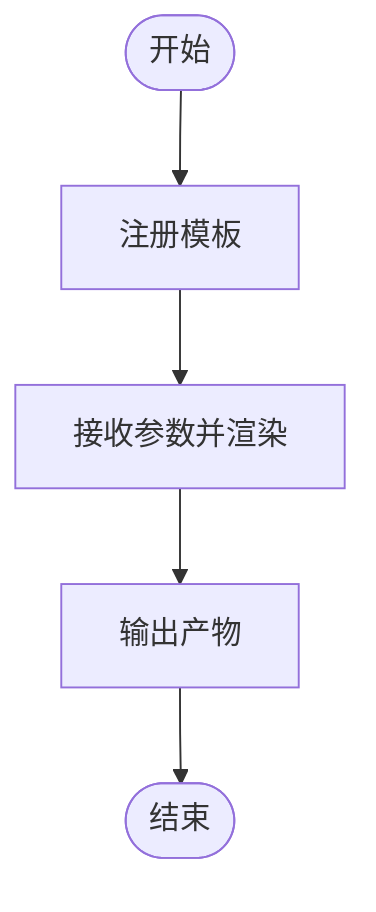
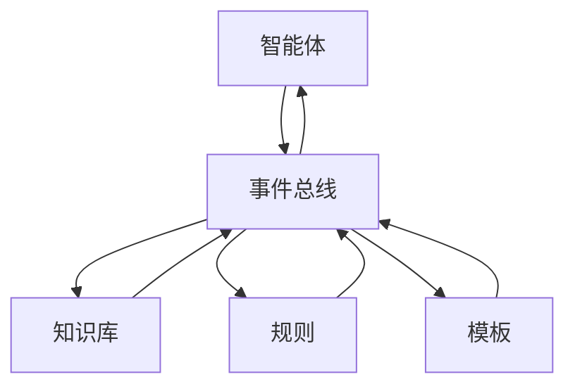

# 插件化架构设计

<cite>
**本文引用的文件**
- [目录结构和设计说明.md](file://目录结构和设计说明.md)
- [copilot-prompt.md](file://agents/copilot-prompt.md)
- [sql-reviewer.md](file://agents/sql-reviewer.md)
- [version-tracker.md](file://agents/version-tracker.md)
- [dimension-modeling-tips.md](file://knowledge/dimension-modeling-tips.md)
- [etl-patterns.md](file://knowledge/etl-patterns.md)
- [index.md](file://knowledge/index.md)
- [performance-tips.md](file://knowledge/performance-tips.md)
- [sql-patterns.md](file://knowledge/sql-patterns.md)
- [domain-rules.md](file://rules/domain-rules.md)
- [security.md](file://rules/security.md)
- [sql-style.md](file://rules/sql-style.md)
- [log.md](file://changes/templates/log.md)
- [spec.md](file://changes/templates/spec.md)
- [tasks.md](file://changes/templates/tasks.md)
</cite>

## 目录
1. [引言](#引言)
2. [项目结构](#项目结构)
3. [核心组件](#核心组件)
4. [架构总览](#架构总览)
5. [详细组件分析](#详细组件分析)
6. [依赖关系分析](#依赖关系分析)
7. [性能考虑](#性能考虑)
8. [故障排查指南](#故障排查指南)
9. [结论](#结论)
10. [附录](#附录)

## 引言
本技术文档面向“数据仓库工程协作助手”的插件化架构设计，目标是构建一个可扩展、可维护、可演进的插件体系。通过对现有知识库、规则集与模板的结构化梳理，本文提出插件化扩展点、接口契约、生命周期管理、通信机制、安全与运维等系统性方案，并给出开发与最佳实践指引。

## 项目结构
当前仓库采用内容驱动的模块化组织方式：agents（智能体）、knowledge（知识库）、rules（规则集）、changes/templates（变更模板）。这种结构天然支持以“功能域”为维度进行插件化扩展，每个子目录可视为一个插件域或插件集合。

图表来源
- [目录结构和设计说明.md](file://目录结构和设计说明.md)
- [copilot-prompt.md](file://agents/copilot-prompt.md)
- [sql-reviewer.md](file://agents/sql-reviewer.md)
- [version-tracker.md](file://agents/version-tracker.md)
- [dimension-modeling-tips.md](file://knowledge/dimension-modeling-tips.md)
- [etl-patterns.md](file://knowledge/etl-patterns.md)
- [index.md](file://knowledge/index.md)
- [performance-tips.md](file://knowledge/performance-tips.md)
- [sql-patterns.md](file://knowledge/sql-patterns.md)
- [domain-rules.md](file://rules/domain-rules.md)
- [security.md](file://rules/security.md)
- [sql-style.md](file://rules/sql-style.md)
- [log.md](file://changes/templates/log.md)
- [spec.md](file://changes/templates/spec.md)
- [tasks.md](file://changes/templates/tasks.md)

章节来源
- [目录结构和设计说明.md](file://目录结构和设计说明.md)

## 核心组件
- 智能体（Agents）
  - 提供面向任务的提示词与评审能力，作为协作助手的“执行器”。
  - 建议抽象为插件接口：输入上下文→输出建议/评审结果。
- 知识库（Knowledge）
  - 存放领域知识与最佳实践，作为“信息源”被各插件消费。
  - 建议抽象为只读插件接口：按主题检索/过滤→返回知识条目。
- 规则集（Rules）
  - 定义业务域规则、安全策略与风格规范，作为“校验器”参与决策。
  - 建议抽象为插件接口：输入对象→输出校验结果与建议。
- 变更模板（Changes/Templates）
  - 生成标准化的变更日志、规格与任务清单，作为“产物生成器”。
  - 建议抽象为插件接口：输入参数→输出模板渲染结果。

章节来源
- [copilot-prompt.md](file://agents/copilot-prompt.md)
- [sql-reviewer.md](file://agents/sql-reviewer.md)
- [version-tracker.md](file://agents/version-tracker.md)
- [dimension-modeling-tips.md](file://knowledge/dimension-modeling-tips.md)
- [etl-patterns.md](file://knowledge/etl-patterns.md)
- [index.md](file://knowledge/index.md)
- [performance-tips.md](file://knowledge/performance-tips.md)
- [sql-patterns.md](file://knowledge/sql-patterns.md)
- [domain-rules.md](file://rules/domain-rules.md)
- [security.md](file://rules/security.md)
- [sql-style.md](file://rules/sql-style.md)
- [log.md](file://changes/templates/log.md)
- [spec.md](file://changes/templates/spec.md)
- [tasks.md](file://changes/templates/tasks.md)

## 架构总览
插件化架构以“内容即插件”的理念组织，通过统一的扩展点与接口契约实现松耦合。系统由以下层次构成：
- 扩展点层：定义插件类型与职责边界（智能体、知识、规则、模板）。
- 接口层：为每类插件定义稳定的输入/输出契约。
- 生命周期层：负责插件的发现、加载、初始化、激活、卸载。
- 通信层：事件总线、消息传递与状态同步，保障跨插件协作。
- 安全与运维层：权限控制、沙箱隔离、资源限制、监控告警与故障恢复。

## 详细组件分析

### 智能体插件（Agent）
- 职责：接收上下文，生成建议或执行评审。
- 输入：任务描述、数据模型、历史记录、配置参数。
- 输出：建议文本、评分、改进建议、元数据。
- 生命周期：加载后初始化配置；激活后响应事件；卸载时释放资源。
- 通信：通过事件总线订阅/发布；与其他插件共享状态。

图表来源
- [目录结构和设计说明.md](file://目录结构和设计说明.md)
- [copilot-prompt.md](file://agents/copilot-prompt.md)
- [sql-reviewer.md](file://agents/sql-reviewer.md)
- [version-tracker.md](file://agents/version-tracker.md)

章节来源
- [目录结构和设计说明.md](file://目录结构和设计说明.md)
- [copilot-prompt.md](file://agents/copilot-prompt.md)
- [sql-reviewer.md](file://agents/sql-reviewer.md)
- [version-tracker.md](file://agents/version-tracker.md)

### 知识库插件（Knowledge）
- 职责：提供领域知识检索与推荐。
- 输入：关键词、主题标签、上下文语境。
- 输出：相关知识条目列表、置信度、引用来源。
- 生命周期：加载时建立索引；激活时开放查询；卸载时释放缓存。
- 通信：通过消息传递与智能体共享检索结果；通过状态同步保持一致性。

图表来源
- [目录结构和设计说明.md](file://目录结构和设计说明.md)
- [dimension-modeling-tips.md](file://knowledge/dimension-modeling-tips.md)
- [etl-patterns.md](file://knowledge/etl-patterns.md)
- [index.md](file://knowledge/index.md)
- [performance-tips.md](file://knowledge/performance-tips.md)
- [sql-patterns.md](file://knowledge/sql-patterns.md)

章节来源
- [directory.md](file://knowledge/index.md)
- [dimension-modeling-tips.md](file://knowledge/dimension-modeling-tips.md)
- [etl-patterns.md](file://knowledge/etl-patterns.md)
- [performance-tips.md](file://knowledge/performance-tips.md)
- [sql-patterns.md](file://knowledge/sql-patterns.md)

### 规则插件（Rule）
- 职责：对输入对象进行合规性检查与风格校验。
- 输入：对象（如SQL、表结构、流程）。
- 输出：校验结果、违规项、修复建议。
- 生命周期：加载时编译规则；激活时启用校验；卸载时清理规则引擎。
- 通信：通过事件总线触发校验；通过消息传递传播结果。

图表来源
- [目录结构和设计说明.md](file://目录结构和设计说明.md)
- [domain-rules.md](file://rules/domain-rules.md)
- [security.md](file://rules/security.md)
- [sql-style.md](file://rules/sql-style.md)

章节来源
- [domain-rules.md](file://rules/domain-rules.md)
- [security.md](file://rules/security.md)
- [sql-style.md](file://rules/sql-style.md)

### 模板插件（Template）
- 职责：根据输入参数生成标准化产物（日志、规格、任务）。
- 输入：参数映射、上下文变量、模板标识。
- 输出：渲染后的文本/文档。
- 生命周期：加载时注册模板；激活时可用渲染；卸载时注销模板。
- 通信：通过消息传递接收参数；通过状态同步确保版本一致。

图表来源
- [目录结构和设计说明.md](file://目录结构和设计说明.md)
- [log.md](file://changes/templates/log.md)
- [spec.md](file://changes/templates/spec.md)
- [tasks.md](file://changes/templates/tasks.md)

章节来源
- [log.md](file://changes/templates/log.md)
- [spec.md](file://changes/templates/spec.md)
- [tasks.md](file://changes/templates/tasks.md)

## 依赖关系分析
- 内聚性：每个插件域内部高内聚（agents/knowledge/rules/changes/templates），便于独立演进。
- 耦合性：插件间通过事件总线与消息传递弱耦合，避免直接依赖。
- 可替换性：同一职责的插件可被替换，不影响其他插件运行。
- 可观测性：通过监控告警与故障恢复机制提升整体可观测性。

图表来源
- [目录结构和设计说明.md](file://目录结构和设计说明.md)

章节来源
- [目录结构和设计说明.md](file://目录结构和设计说明.md)

## 性能考虑
- 加载优化：延迟加载与按需初始化，减少启动时间。
- 缓存策略：知识库与模板渲染结果缓存，降低重复计算。
- 并发控制：事件总线与消息队列限流，避免过载。
- 资源限制：为插件设置CPU/内存上限，防止资源争用。
- 监控指标：吞吐量、延迟、错误率、资源占用，建立告警阈值。

## 故障排查指南
- 日志与追踪：为每个插件输出结构化日志，关联请求ID以便回溯。
- 降级策略：当某插件异常时，系统自动降级至默认行为或快速失败。
- 自愈机制：超时重试、熔断与隔离，避免级联故障。
- 回滚与灰度：支持插件版本回滚与灰度发布，降低风险。

## 结论
通过“内容即插件”的设计理念与清晰的扩展点划分，系统可在不破坏核心稳定性的前提下持续演进。配合完善的生命周期管理、事件驱动的通信机制、严格的安全与运维策略，可支撑复杂数据仓库协作场景下的插件生态。

## 附录

### 插件开发指南（从零到一）
- 开发环境搭建
  - 准备内容编辑工具与版本控制（Git）。
  - 在对应目录新增插件文件（例如在 agents 下新增 .md 文件）。
- 接口实现
  - 智能体：定义输入上下文与输出建议格式。
  - 知识库：定义检索关键词与返回条目格式。
  - 规则：定义校验对象与规则表达式。
  - 模板：定义参数映射与渲染输出。
- 测试验证
  - 单元测试：针对输入/输出契约编写测试用例。
  - 集成测试：模拟事件总线与消息传递，验证端到端流程。
- 打包部署
  - 将插件文件纳入版本控制，遵循命名规范与目录约定。
  - 发布前进行静态检查与性能基准测试。

### 插件安全机制
- 权限控制：最小权限原则，仅授予插件所需访问范围。
- 沙箱隔离：限制插件文件系统与网络访问，避免越权操作。
- 资源限制：CPU/内存/IO配额，防止恶意或异常插件耗尽资源。
- 审计日志：记录插件执行的关键动作，便于审计与追溯。

### 运维考虑
- 监控告警：建立插件级指标面板，设置阈值告警。
- 故障恢复：自动重启、健康检查、熔断与隔离策略。
- 版本治理：插件版本号管理、兼容性矩阵与升级路径。

### 最佳实践
- 明确定义扩展点与接口契约，保持向后兼容。
- 使用事件驱动与异步处理，提升系统弹性。
- 为插件提供详尽的文档与示例，降低接入成本。
- 定期进行安全扫描与性能评估，持续优化。