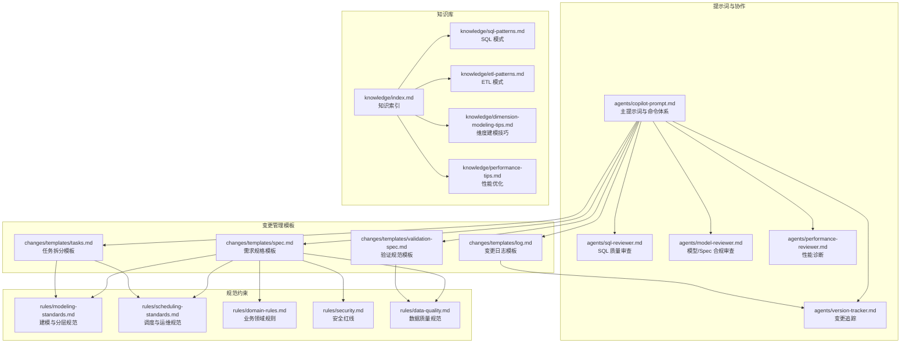
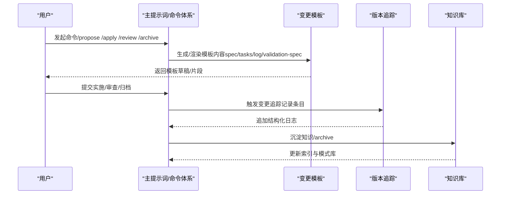
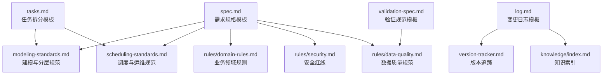

# 模板定制化

<cite>
**本文引用的文件**
- [目录结构和设计说明.md](file://目录结构和设计说明.md)
- [copilot-prompt.md](file://agents/copilot-prompt.md)
- [version-tracker.md](file://agents/version-tracker.md)
- [spec.md](file://changes/templates/spec.md)
- [tasks.md](file://changes/templates/tasks.md)
- [log.md](file://changes/templates/log.md)
- [validation-spec.md](file://changes/templates/validation-spec.md)
- [modeling-standards.md](file://rules/modeling-standards.md)
- [scheduling-standards.md](file://rules/scheduling-standards.md)
- [index.md](file://knowledge/index.md)
</cite>

## 目录
1. [简介](#简介)
2. [项目结构](#项目结构)
3. [核心组件](#核心组件)
4. [架构总览](#架构总览)
5. [详细组件分析](#详细组件分析)
6. [依赖分析](#依赖分析)
7. [性能考虑](#性能考虑)
8. [故障排查指南](#故障排查指南)
9. [结论](#结论)
10. [附录](#附录)

## 简介
本文件面向“数据仓库工程协作助手”项目，围绕变更管理模板的扩展与定制化，系统阐述需求规格模板、任务模板、日志模板的修改与定制方法，以及新增模板类型的流程规范。同时提供模板语法规范、变量定义、条件逻辑实现建议，结合具体业务场景给出模板变体示例，并说明版本管理与兼容性处理、迁移策略与回滚机制，最后给出模板测试方法、部署流程与维护指南，帮助团队在统一规范下高效协作与持续演进。

## 项目结构
项目采用“提示词工程 + 变更模板 + 知识库 + 规范约束”的分层组织方式：
- agents：AI 角色与子 Agent 提示词，包括主提示词、SQL/模型/性能审查、版本追踪等
- changes/templates：变更管理模板集合，包含需求规格、任务拆分、变更日志、验证规范等
- knowledge：领域知识库，沉淀 SQL 模式、ETL 模式、建模技巧、性能优化等
- rules：项目约束与规范，涵盖建模分层、调度运维、数据质量、安全等

图表来源
- [目录结构和设计说明.md:19-55](file://目录结构和设计说明.md#L19-L55)
- [目录结构和设计说明.md:109-123](file://目录结构和设计说明.md#L109-L123)

章节来源
- [目录结构和设计说明.md:19-55](file://目录结构和设计说明.md#L19-L55)
- [目录结构和设计说明.md:109-123](file://目录结构和设计说明.md#L109-L123)

## 核心组件
- 主提示词与命令体系：定义 AI 的身份、原则、回答框架与命令映射，确保协作流程标准化
- 变更追踪 Agent：在关键操作后自动记录结构化变更条目，保证可审计与可回溯
- 变更模板：spec、tasks、log、validation-spec 四大模板构成“需求 → 任务 → 实施 → 审查 → 归档”的闭环
- 规范约束：建模分层、调度运维、数据质量、安全等强制约束，保障实现与规范一致
- 知识库：沉淀 SQL 模式、ETL 模式、建模技巧、性能优化经验，支持复用与传承

章节来源
- [copilot-prompt.md:15-34](file://agents/copilot-prompt.md#L15-L34)
- [copilot-prompt.md:63-131](file://agents/copilot-prompt.md#L63-L131)
- [version-tracker.md:5-16](file://agents/version-tracker.md#L5-L16)
- [version-tracker.md:44-64](file://agents/version-tracker.md#L44-L64)
- [目录结构和设计说明.md:31-53](file://目录结构和设计说明.md#L31-L53)

## 架构总览
模板定制化遵循“模板语法 + 变量约定 + 条件逻辑 + 规范约束 + 追踪审计”的整体架构。AI 通过主提示词驱动，依据规范约束生成/校验模板内容，并在关键节点触发变更追踪，最终沉淀到知识库。

图表来源
- [copilot-prompt.md:63-131](file://agents/copilot-prompt.md#L63-L131)
- [version-tracker.md:5-16](file://agents/version-tracker.md#L5-L16)
- [目录结构和设计说明.md:78](file://目录结构和设计说明.md#L78)

## 详细组件分析

### 需求规格模板（spec.md）定制
- 目标：以结构化方式记录背景、现状、功能点、业务规则、模型变更、SQL 设计、ETL/同步、调度、数据质量、影响范围、风险与验证策略等
- 可定制维度
  - 字段与表格：新增/修改/删除 DDL 表格、SQL 表格、ETL 表格、调度表格的字段与说明
  - 业务规则：增加规则模板、判定 SQL 片段、阈值与严重等级
  - 影响范围：细化下游表、报表/API、用户/角色、历史回刷范围
  - 验证策略：扩展数据准确性、行数核验、抽样校验、性能验证、回刷验证、用户验收等
- 语法与变量
  - 使用 Markdown 表格与列表，保持一致性
  - 可引入调度变量占位符（如业务日期、调度时间等），便于后续渲染
- 条件逻辑
  - 通过“状态”字段控制流程推进（如 propose/apply/review/done）
  - “待澄清”列表用于阻断进入下一步
- 规范约束
  - 现状必须有出处（库.表.字段、作业名、SQL 片段）
  - 每条业务规则必须可验证且提供判定 SQL 片段
  - 涉及生产数据/PII/财务/历史回刷必须高亮标注

章节来源
- [spec.md:1-132](file://changes/templates/spec.md#L1-L132)
- [copilot-prompt.md:9-13](file://agents/copilot-prompt.md#L9-L13)
- [scheduling-standards.md:152-161](file://rules/scheduling-standards.md#L152-L161)

### 任务拆分模板（tasks.md）定制
- 目标：将变更拆分为可独立验证的原子任务，按数仓分层顺序执行
- 可定制维度
  - 前置条件：细化数据源连接、项目上下文、上游就绪、调度资源等
  - Task 模板：目标、分层、涉及变更（DDL/SQL/ETL/调度）、关键 DDL/SQL、依赖、验收标准、验证方法、回刷计划
  - 变更摘要：统计新建/修改表数、脚本数、作业数、DQ 规则数、历史回刷分区数等
- 语法与变量
  - 使用标题层级与列表，保持结构清晰
  - 关键 SQL/DDL 使用代码块，便于复制与执行
- 条件逻辑
  - 每个任务必须精确到库.表.字段/作业名/调度依赖
  - 验证方法遵循“行数核验/抽样对比/对账 SQL 三选一”
- 规范约束
  - 每个任务必须可独立验证
  - 回刷计划需明确范围、分批策略与失败处理

章节来源
- [tasks.md:1-74](file://changes/templates/tasks.md#L1-L74)
- [validation-spec.md:8-12](file://changes/templates/validation-spec.md#L8-L12)

### 变更日志模板（log.md）定制
- 目标：记录决策、踩坑与知识发现，支撑知识飞轮
- 可定制维度
  - 时间线：按时间顺序记录阶段与事件
  - 技术决策：记录选择与放弃方案及原因
  - 踩坑记录：问题、原因、解决方案、是否沉淀
  - 知识发现：关键词、分类标签（SQL 模式、建模技巧、ETL/同步技巧、调度与运维、性能优化、数据质量、安全、业务口径）
  - Spec-实现偏差记录：偏差点、预期与实际情况、处理方式
  - 数据回刷记录：表名、回刷分区范围、触发原因、行数变化、完成时间
  - 性能对比记录：扫描量、耗时、资源、成本
  - 数据质量验证记录：规则、结果、实际值、阈值、是否通过
- 语法与变量
  - 使用表格与列表，便于结构化沉淀
  - 分类标签用于检索与索引
- 条件逻辑
  - 每个 task 后实时记录，归档时逐条确认沉淀到知识库
- 规范约束
  - 每条记录必须可检索，便于后续复用

章节来源
- [log.md:1-61](file://changes/templates/log.md#L1-L61)
- [index.md:1-60](file://knowledge/index.md#L1-L60)

### 验证规范模板（validation-spec.md）定制
- 目标：为每个变更提供可执行的验证清单与证据要求
- 可定制维度
  - 验证原则：数据驱动、三选一铁律、对比验证、边界测试、回刷可重入
  - 验证环境：数据源环境、集群、数据量级、时间范围、基准值来源
  - 数据准确性验证：行数核验、主键/唯一性核验、核心与辅助指标、字段级抽样
  - 模型结构验证：分层归属、分区字段、主键/唯一约束、字段类型、分桶/索引、表属性、依赖关系
  - 性能验证：作业/SQL 的全量首跑、单分区增量、历史回刷耗时与扫描量
  - 数据质量规则验证：完整性、唯一性、一致性、准确性、时效性
  - 安全与权限验证：表权限、PII 脱敏、行级权限
  - 回刷验证：批次、分区范围、期望与实际行数、关键指标对账
  - 执行计划：按步骤推进的验证清单
- 语法与变量
  - 使用表格与清单，便于量化与追踪
- 条件逻辑
  - 每个 Task 至少展示三选一的实际证据
  - 核心指标必须与已知正确值交叉对比
- 规范约束
  - 禁止“已验证”等无证据声明
  - 回刷必须保证幂等

章节来源
- [validation-spec.md:1-123](file://changes/templates/validation-spec.md#L1-L123)

### 新模板类型的添加流程
- 模板语法规范
  - 使用 Markdown 标准语法，保持标题层级、列表、表格、代码块的一致性
  - 为可复用字段预留占位符（如“变更名称”、“created”、“status”等），便于统一渲染
- 变量定义
  - 统一变量命名：如业务日期、调度时间、责任人等，参考调度规范中的变量约定
  - 变量在模板中以占位符形式出现，渲染时替换为实际值
- 条件逻辑实现
  - 通过“状态”字段控制流程推进（propose/apply/review/done）
  - 通过“待澄清”列表阻断进入下一步
  - 通过“回刷范围”“影响下游”等字段实现条件分支与回滚提示
- 新模板类型示例
  - 审批流程模板：包含申请人、审批人、审批意见、状态流转、附件上传等字段
  - 项目管理模板：包含里程碑、风险登记、资源分配、预算与成本、变更请求等字段
  - 回滚计划模板：包含回滚触发条件、回滚范围、回滚步骤、验证方法、回退责任人等
- 与现有模板的集成
  - 新模板应与主提示词中的命令体系对接，确保在相应命令下触发
  - 新模板应与版本追踪联动，在关键节点自动记录结构化条目
  - 新模板应与知识库联动，沉淀可复用的经验与模式

章节来源
- [copilot-prompt.md:63-131](file://agents/copilot-prompt.md#L63-L131)
- [version-tracker.md:5-16](file://agents/version-tracker.md#L5-L16)
- [scheduling-standards.md:152-161](file://rules/scheduling-standards.md#L152-L161)

### 模板的版本管理与兼容性处理
- 向后兼容性保证
  - 新增字段时保留默认值或可选字段，避免破坏既有渲染
  - 保持标题层级与表格结构不变，确保旧版渲染器仍可解析
  - 对变量占位符进行版本化管理，避免冲突
- 迁移策略
  - 逐步迁移：先在新模板中引入新字段，旧模板保留兼容字段，逐步替换
  - 渲染适配：在渲染层增加兼容层，将旧字段映射到新字段
  - 测试验证：在迁移前后进行模板渲染与追踪记录的回归测试
- 回滚机制
  - 版本追踪：通过版本追踪记录每次模板变更，便于回溯
  - 回滚脚本：在调度规范中提供回滚脚本模板，确保回滚可执行
  - 影响评估：回滚前评估对下游的影响，必要时冻结下游作业

章节来源
- [version-tracker.md:80-89](file://agents/version-tracker.md#L80-L89)
- [scheduling-standards.md:205-233](file://rules/scheduling-standards.md#L205-L233)

### 模板测试方法
- 单元测试
  - 模板字段完整性：检查必填字段是否齐全
  - 渲染一致性：检查不同环境下渲染结果是否一致
  - 变量替换：验证变量占位符是否正确替换
- 集成测试
  - 命令触发：通过主提示词命令触发模板生成，检查输出是否符合预期
  - 追踪联动：在关键节点触发版本追踪，检查日志条目是否正确
  - 知识沉淀：归档时检查知识发现是否正确沉淀到知识库
- 回归测试
  - 兼容性测试：在模板升级后，验证旧模板仍可正常渲染
  - 性能测试：验证模板渲染与追踪记录的性能开销

章节来源
- [validation-spec.md:8-12](file://changes/templates/validation-spec.md#L8-L12)
- [copilot-prompt.md:63-131](file://agents/copilot-prompt.md#L63-L131)
- [version-tracker.md:5-16](file://agents/version-tracker.md#L5-L16)

### 部署流程与维护指南
- 部署流程
  - 加载提示词：将项目目录加载到 AI 编码助手，阅读主提示词
  - 初始化上下文：首次使用执行初始化命令，填充项目上下文
  - 模板生效：通过命令触发模板生成，确保渲染与追踪正常
- 维护指南
  - 定期审查：定期审查模板字段与规范约束，确保一致性
  - 知识更新：及时将新的经验与模式沉淀到知识库
  - 版本管理：建立模板版本号与变更日志，便于追踪与回滚
  - 团队培训：对团队成员进行模板使用与规范约束的培训

章节来源
- [目录结构和设计说明.md:186-193](file://目录结构和设计说明.md#L186-L193)
- [index.md:1-60](file://knowledge/index.md#L1-L60)

## 依赖分析
模板之间的依赖关系如下：
- spec.md 依赖建模与分层规范、调度与运维规范、业务领域规则、安全红线、数据质量规范
- tasks.md 依赖建模与分层规范、调度与运维规范
- log.md 依赖版本追踪，沉淀到知识库
- validation-spec.md 依赖数据质量规范

图表来源
- [spec.md:1-132](file://changes/templates/spec.md#L1-L132)
- [tasks.md:1-74](file://changes/templates/tasks.md#L1-L74)
- [log.md:1-61](file://changes/templates/log.md#L1-L61)
- [validation-spec.md:1-123](file://changes/templates/validation-spec.md#L1-L123)
- [modeling-standards.md:1-242](file://rules/modeling-standards.md#L1-L242)
- [scheduling-standards.md:1-233](file://rules/scheduling-standards.md#L1-L233)
- [index.md:1-60](file://knowledge/index.md#L1-L60)

## 性能考虑
- 模板渲染性能：尽量减少复杂表格与长代码块的数量，提升渲染效率
- 追踪记录性能：版本追踪应在关键节点触发，避免频繁写入造成性能开销
- 知识沉淀性能：知识库的索引与检索应保持简洁，避免过度复杂的分类标签

## 故障排查指南
- 模板字段缺失：检查必填字段是否齐全，必要时回填默认值
- 变量替换失败：检查变量占位符是否正确，确保渲染层正确替换
- 追踪记录异常：检查版本追踪的触发时机与路径初始化，确保日志文件可写
- 知识沉淀失败：检查归档流程与知识库索引，确保知识发现正确沉淀

章节来源
- [version-tracker.md:19-41](file://agents/version-tracker.md#L19-L41)
- [version-tracker.md:80-89](file://agents/version-tracker.md#L80-L89)

## 结论
通过规范化的模板定制与扩展，团队可以在统一的流程与规范下高效协作。需求规格、任务拆分、变更日志与验证规范四大模板相互配合，辅以版本追踪与知识沉淀，形成完整的变更管理闭环。新增模板类型应遵循语法规范、变量定义与条件逻辑实现，确保与现有体系兼容并具备可审计性与可回溯性。

## 附录
- 模板字段清单与示例路径
  - 需求规格模板字段：见 [spec.md:1-132](file://changes/templates/spec.md#L1-L132)
  - 任务拆分模板字段：见 [tasks.md:1-74](file://changes/templates/tasks.md#L1-L74)
  - 变更日志模板字段：见 [log.md:1-61](file://changes/templates/log.md#L1-L61)
  - 验证规范模板字段：见 [validation-spec.md:1-123](file://changes/templates/validation-spec.md#L1-L123)
- 规范约束参考
  - 建模与分层规范：见 [modeling-standards.md:1-242](file://rules/modeling-standards.md#L1-L242)
  - 调度与运维规范：见 [scheduling-standards.md:1-233](file://rules/scheduling-standards.md#L1-L233)
- 知识库索引：见 [index.md:1-60](file://knowledge/index.md#L1-L60)