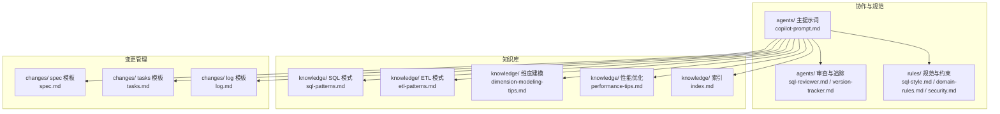
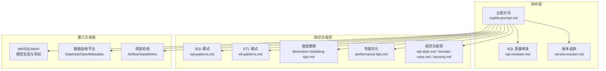
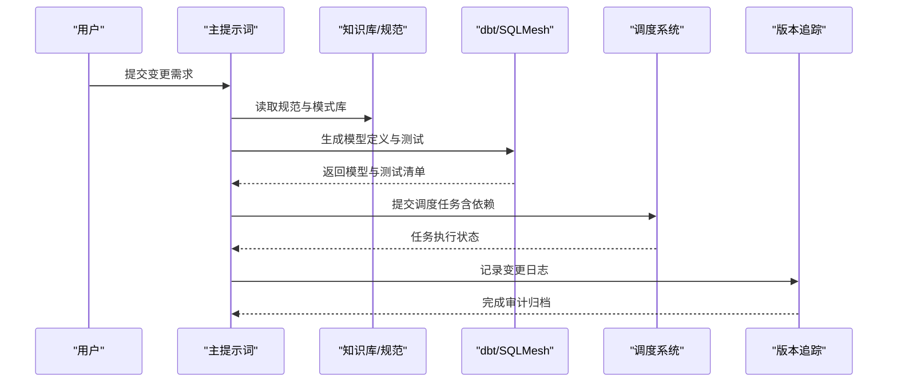
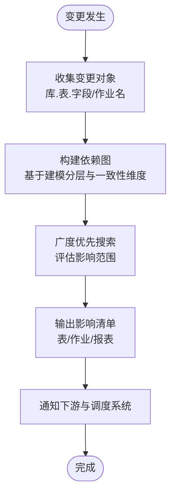
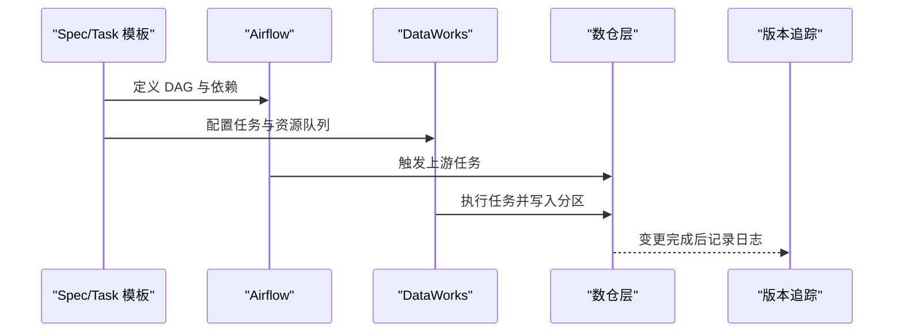
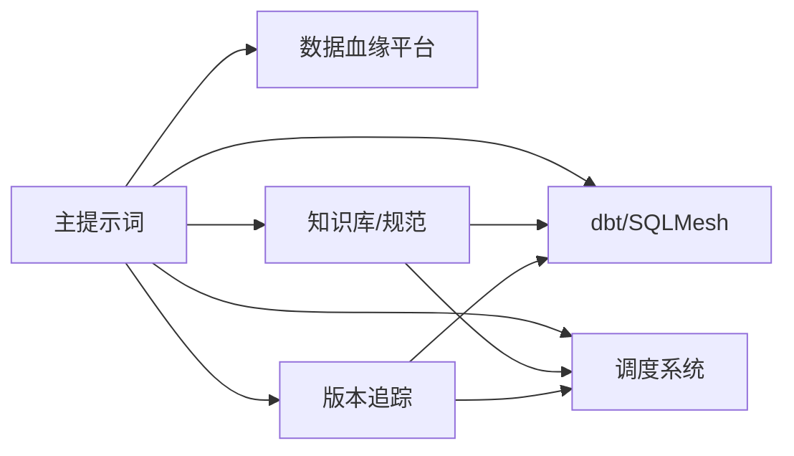

# 第三方系统集成

<cite>
**本文引用的文件**
- [目录结构和设计说明.md](file://目录结构和设计说明.md)
- [copilot-prompt.md](file://agents/copilot-prompt.md)
- [sql-reviewer.md](file://agents/sql-reviewer.md)
- [version-tracker.md](file://agents/version-tracker.md)
- [index.md](file://knowledge/index.md)
- [sql-patterns.md](file://knowledge/sql-patterns.md)
- [etl-patterns.md](file://knowledge/etl-patterns.md)
- [dimension-modeling-tips.md](file://knowledge/dimension-modeling-tips.md)
- [performance-tips.md](file://knowledge/performance-tips.md)
- [domain-rules.md](file://rules/domain-rules.md)
- [security.md](file://rules/security.md)
- [sql-style.md](file://rules/sql-style.md)
- [spec.md](file://changes/templates/spec.md)
- [tasks.md](file://changes/templates/tasks.md)
- [log.md](file://changes/templates/log.md)
</cite>

## 目录
1. [简介](#简介)
2. [项目结构](#项目结构)
3. [核心组件](#核心组件)
4. [架构总览](#架构总览)
5. [详细组件分析](#详细组件分析)
6. [依赖分析](#依赖分析)
7. [性能考虑](#性能考虑)
8. [故障排查指南](#故障排查指南)
9. [结论](#结论)
10. [附录](#附录)

## 简介
本文件面向“数据仓库工程协作助手”项目，围绕与第三方系统的集成提供系统化技术文档，重点覆盖以下方面：
- 与 dbt/SQLMesh 的集成方案：连接参数配置、自动化模型生成、测试用例的自动生成与执行
- 数据血缘平台对接：变更影响分析自动化、血缘数据采集与同步、影响范围评估算法
- 调度系统集成策略：与 Apache Airflow、DataWorks 等调度平台的对接方法、任务编排与依赖管理
- 配置示例、API 接口说明、错误处理机制与性能优化建议

本项目以“Spec 驱动 + 三段式知识库 + 强制变更追踪”为核心设计，强调规范、可审计与可复用。本文在不直接粘贴代码的前提下，提供可落地的集成路径、流程图与最佳实践。

## 项目结构
项目采用提示词工程与知识库驱动的协作模式，核心目录与职责如下：
- agents/：AI 角色与子 Agent 提示词，包括主提示词、SQL 质量审查、模型审查、性能审查、版本追踪等
- knowledge/：领域知识库（SQL 模式、ETL 模式、维度建模技巧、性能优化、业务知识等）
- rules/：项目约束与规范（SQL 编码规范、建模标准、调度规范、数据质量、安全、领域规则等）
- changes/：变更管理（spec、tasks、log、validation-spec 等模板）

**图表来源**
- [目录结构和设计说明.md:19-55](file://目录结构和设计说明.md#L19-L55)
- [copilot-prompt.md:23-34](file://agents/copilot-prompt.md#L23-L34)

**章节来源**
- [目录结构和设计说明.md:19-55](file://目录结构和设计说明.md#L19-L55)

## 核心组件
- 主提示词与命令体系：定义 AI 的身份、法则、命令映射与工作流，确保每次交互遵循固定流程
- SQL 质量审查：对 SQL 的正确性、性能与可维护性进行分级审查
- 版本追踪：在 DDL/SQL/ETL/调度变更后自动记录结构化变更日志
- 知识库：沉淀 SQL 模式、ETL 模式、建模技巧、性能优化经验
- 规范与约束：统一 SQL 编码、建模分层、调度与安全规范
- 变更模板：spec、tasks、log 等模板支撑 Spec 驱动的变更闭环

**章节来源**
- [copilot-prompt.md:63-131](file://agents/copilot-prompt.md#L63-L131)
- [sql-reviewer.md:1-68](file://agents/sql-reviewer.md#L1-L68)
- [version-tracker.md:1-120](file://agents/version-tracker.md#L1-L120)
- [index.md:1-60](file://knowledge/index.md#L1-L60)
- [spec.md:1-132](file://changes/templates/spec.md#L1-L132)
- [tasks.md:1-74](file://changes/templates/tasks.md#L1-L74)
- [log.md:1-61](file://changes/templates/log.md#L1-L61)

## 架构总览
下图展示了与第三方系统集成的总体架构：通过主提示词与 Agent 协作，结合知识库与规范，驱动 dbt/SQLMesh 的模型生成与测试、数据血缘平台的变更影响分析、以及调度系统的任务编排与依赖管理。

**图表来源**
- [目录结构和设计说明.md:196-204](file://目录结构和设计说明.md#L196-L204)
- [copilot-prompt.md:63-131](file://agents/copilot-prompt.md#L63-L131)

## 详细组件分析

### 与 dbt/SQLMesh 的集成方案
目标：实现连接参数配置、自动化模型生成、测试用例的自动生成与执行，并与项目规范、知识库联动。

- 连接参数配置
  - 在 dbt/SQLMesh 的配置文件中定义数据源连接（如 Hive/Spark/MaxCompute 等），确保与项目规范一致（分区字段 dt、命名规范、建模分层等）
  - 使用项目规则中的 SQL 编码规范与建模标准，确保生成的 SQL 符合 ODS/DWD/DWS/ADS/DIM 分层与命名约定
  - 参考路径：[sql-style.md:7-87](file://rules/sql-style.md#L7-L87)、[domain-rules.md:45-62](file://rules/domain-rules.md#L45-L62)

- 自动化模型生成
  - 基于 changes/spec 与 tasks 模板，将 Spec 中的模型变更 DDL、SQL 设计、调度配置转化为 dbt/SQLMesh 的模型定义
  - 生成的模型需满足性能优化知识库中的分区裁剪、谓词下推、Join 顺序等要求
  - 参考路径：[spec.md:49-71](file://changes/templates/spec.md#L49-L71)、[tasks.md:15-53](file://changes/templates/tasks.md#L15-L53)、[performance-tips.md:5-40](file://knowledge/performance-tips.md#L5-L40)

- 测试用例的自动生成与执行
  - 基于 SQL 模式库与数据质量规则，自动生成单元测试与回归测试（完整性、唯一性、一致性、准确性、时效性）
  - 在 dbt/SQLMesh 中配置测试任务，与 Airflow/DataWorks 的调度系统联动，确保测试在模型更新后自动执行
  - 参考路径：[sql-patterns.md:1-331](file://knowledge/sql-patterns.md#L1-L331)、[domain-rules.md:69-91](file://rules/domain-rules.md#L69-L91)

- 版本追踪与审计
  - 每次模型变更后，version-tracker 自动记录结构化变更条目，包含时间、模块、分层、操作类型、精确变更对象、关联文件、回刷范围、下游影响等
  - 参考路径：[version-tracker.md:44-120](file://agents/version-tracker.md#L44-L120)

**图表来源**
- [copilot-prompt.md:63-131](file://agents/copilot-prompt.md#L63-L131)
- [version-tracker.md:5-16](file://agents/version-tracker.md#L5-L16)
- [spec.md:78-98](file://changes/templates/spec.md#L78-L98)
- [tasks.md:15-53](file://changes/templates/tasks.md#L15-L53)

**章节来源**
- [copilot-prompt.md:63-131](file://agents/copilot-prompt.md#L63-L131)
- [version-tracker.md:5-16](file://agents/version-tracker.md#L5-L16)
- [spec.md:49-98](file://changes/templates/spec.md#L49-L98)
- [tasks.md:15-53](file://changes/templates/tasks.md#L15-L53)
- [sql-style.md:7-87](file://rules/sql-style.md#L7-L87)
- [domain-rules.md:45-91](file://rules/domain-rules.md#L45-L91)
- [performance-tips.md:5-40](file://knowledge/performance-tips.md#L5-L40)

### 数据血缘平台对接（DataHub/OpenMetadata）
目标：实现变更影响分析自动化、血缘数据采集与同步、影响范围评估算法。

- 变更影响分析自动化
  - 在模型/SQL/ETL 变更后，version-tracker 记录精确到库.表.字段/作业名的变更内容，作为影响分析的输入
  - 结合建模技巧（一致性维度、桥接表、退化维度）与分层归属，自动识别下游表与作业
  - 参考路径：[version-tracker.md:44-89](file://agents/version-tracker.md#L44-L89)、[dimension-modeling-tips.md:158-253](file://knowledge/dimension-modeling-tips.md#L158-L253)

- 血缘数据采集与同步
  - 通过数据血缘平台的 API 或 SDK，采集数仓各层的表/字段/作业之间的依赖关系
  - 将采集到的血缘数据与 changes/log 模板中的技术决策与踩坑记录进行对齐，形成可审计的血缘档案
  - 参考路径：[log.md:10-35](file://changes/templates/log.md#L10-L35)

- 影响范围评估算法
  - 以变更对象为起点，基于依赖图进行广度优先搜索（BFS），识别所有受影响的表/作业/报表
  - 结合性能优化知识库中的分区裁剪、倾斜、小文件等指标，评估回刷范围与资源影响
  - 参考路径：[performance-tips.md:101-135](file://knowledge/performance-tips.md#L101-L135)

**图表来源**
- [version-tracker.md:44-89](file://agents/version-tracker.md#L44-L89)
- [dimension-modeling-tips.md:158-253](file://knowledge/dimension-modeling-tips.md#L158-L253)
- [log.md:10-35](file://changes/templates/log.md#L10-L35)

**章节来源**
- [version-tracker.md:44-89](file://agents/version-tracker.md#L44-L89)
- [dimension-modeling-tips.md:158-253](file://knowledge/dimension-modeling-tips.md#L158-L253)
- [log.md:10-35](file://changes/templates/log.md#L10-L35)
- [performance-tips.md:101-135](file://knowledge/performance-tips.md#L101-L135)

### 调度系统集成策略（Airflow/DataWorks）
目标：实现任务编排与依赖管理，确保上游就绪触发、SLA 基线倒推、错峰调度与失败回放。

- 与 Airflow 的对接
  - 使用 DAG 定义上游依赖与触发策略，结合项目规范中的调度周期与 SLA 基线，设置重试与告警
  - 在 SQL/ETL/调度变更后，version-tracker 记录作业名、依赖关系、重试与告警配置，确保可审计
  - 参考路径：[copilot-prompt.md:125-127](file://agents/copilot-prompt.md#L125-L127)、[version-tracker.md:44-89](file://agents/version-tracker.md#L44-L89)

- 与 DataWorks 的对接
  - 通过 DataWorks 的任务配置与依赖管理，实现跨层任务的有序执行与资源队列控制
  - 结合性能优化知识库中的资源队列与调度时间窗，避免数据库备份高峰与资源争用
  - 参考路径：[performance-tips.md:308-324](file://knowledge/performance-tips.md#L308-L324)

- 任务编排与依赖管理
  - 基于 changes/tasks 模板，将每个 Task 精确到库.表.字段/作业名，确保依赖关系清晰、可验证
  - 在任务完成后，触发 version-tracker 记录变更内容与影响范围
  - 参考路径：[tasks.md:15-53](file://changes/templates/tasks.md#L15-L53)、[version-tracker.md:5-16](file://agents/version-tracker.md#L5-L16)

**图表来源**
- [tasks.md:15-53](file://changes/templates/tasks.md#L15-L53)
- [copilot-prompt.md:125-127](file://agents/copilot-prompt.md#L125-L127)
- [version-tracker.md:5-16](file://agents/version-tracker.md#L5-L16)

**章节来源**
- [copilot-prompt.md:125-127](file://agents/copilot-prompt.md#L125-L127)
- [tasks.md:15-53](file://changes/templates/tasks.md#L15-L53)
- [version-tracker.md:5-16](file://agents/version-tracker.md#L5-L16)
- [performance-tips.md:308-324](file://knowledge/performance-tips.md#L308-L324)

## 依赖分析
- 组件耦合与内聚
  - 主提示词与 Agent 之间通过命令体系耦合，内聚于 Spec 驱动与三阶段审查流程
  - 知识库与规范为 dbt/SQLMesh 生成与调度系统提供约束与模式，降低实现偏差
  - version-tracker 作为横切关注点，贯穿所有变更环节，确保可审计性

- 外部依赖与集成点
  - dbt/SQLMesh：模型生成、测试与调度
  - 数据血缘平台：血缘采集与影响分析
  - 调度系统：Airflow/DataWorks 任务编排与依赖管理

**图表来源**
- [目录结构和设计说明.md:196-204](file://目录结构和设计说明.md#L196-L204)
- [copilot-prompt.md:63-131](file://agents/copilot-prompt.md#L63-L131)

**章节来源**
- [目录结构和设计说明.md:196-204](file://目录结构和设计说明.md#L196-L204)
- [copilot-prompt.md:63-131](file://agents/copilot-prompt.md#L63-L131)

## 性能考虑
- 分区裁剪与谓词下推：确保 WHERE 条件直接命中分区字段，避免函数包裹导致的全表扫描
- Join 顺序与类型：根据引擎特性选择 Broadcast Hash Join、Sort Merge Join 或 Bucket Join
- 小文件控制：通过 reduce 数控制、DISTRIBUTE BY 与 AQE 合并，降低 NameNode 压力与启动开销
- CTE 物化策略：在 Hive/Spark 中避免重复计算，必要时显式物化或缓存
- 调度与资源：按主题/优先级划分队列，错峰调度，SLA 基线倒推，失败重试与告警

**章节来源**
- [performance-tips.md:5-40](file://knowledge/performance-tips.md#L5-L40)
- [performance-tips.md:101-135](file://knowledge/performance-tips.md#L101-L135)
- [performance-tips.md:138-164](file://knowledge/performance-tips.md#L138-L164)
- [performance-tips.md:167-193](file://knowledge/performance-tips.md#L167-L193)
- [performance-tips.md:308-324](file://knowledge/performance-tips.md#L308-L324)

## 故障排查指南
- SQL 质量审查：按 Critical/Important/Minor 三级识别问题，结合性能评估与优化建议
- 数据质量校验：完整性、唯一性、一致性、准确性、时效性五维度规则，配套对账 SQL 与阈值告警
- 安全与合规：禁止硬编码凭据、PII 脱敏、RLS 配置与审计、跨境合规
- 版本追踪：记录失败不阻塞主流程，提示用户但不中断操作，确保变更可回溯

**章节来源**
- [sql-reviewer.md:1-68](file://agents/sql-reviewer.md#L1-L68)
- [domain-rules.md:69-91](file://rules/domain-rules.md#L69-L91)
- [security.md:1-98](file://rules/security.md#L1-L98)
- [version-tracker.md:80-120](file://agents/version-tracker.md#L80-L120)

## 结论
通过将主提示词、Agent、知识库与规范有机整合，本项目为第三方系统集成提供了可落地的路径与保障：
- dbt/SQLMesh：以 Spec 与模板为驱动，实现模型生成与测试的自动化
- 数据血缘平台：以精确变更追踪为基础，实现影响分析与血缘同步
- 调度系统：以 Airflow/DataWorks 为载体，实现任务编排与依赖管理
- 性能与安全：以性能优化与安全规范为底线，确保系统稳定与合规

## 附录
- 配置示例与 API 接口说明
  - dbt/SQLMesh：在配置文件中定义数据源连接、模型路径与测试配置，结合项目规范与知识库生成模型
  - 数据血缘平台：通过 API 或 SDK 采集血缘数据，与 changes/log 模板对齐
  - 调度系统：在 Airflow/DataWorks 中配置 DAG、依赖、重试与告警，确保 SLA 基线与错峰调度
- 错误处理机制
  - 版本追踪记录失败不阻塞主流程，提示用户但不中断操作
  - SQL 质量审查与数据质量规则提供分级告警与修复建议
- 性能优化建议
  - 分区裁剪、谓词下推、Join 顺序与类型、小文件控制、CTE 物化策略、调度与资源队列