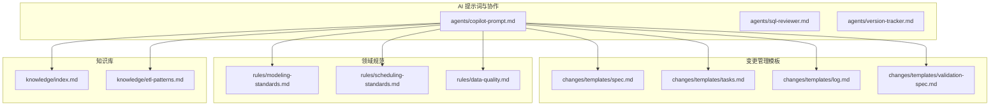
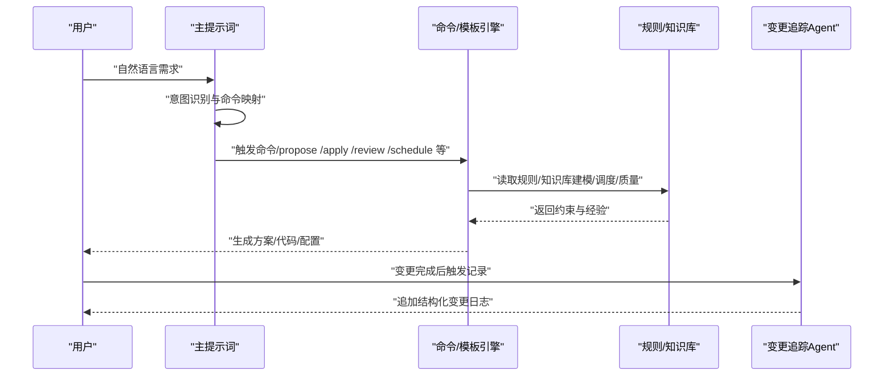
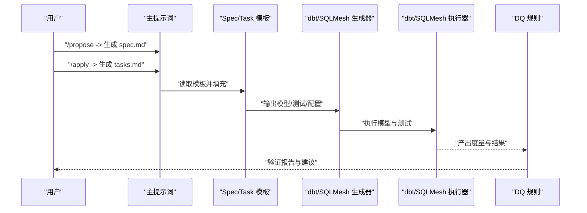
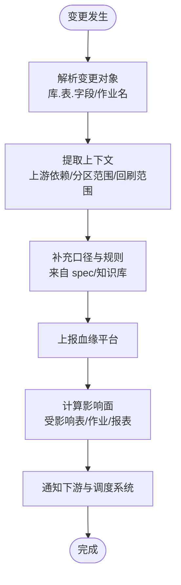
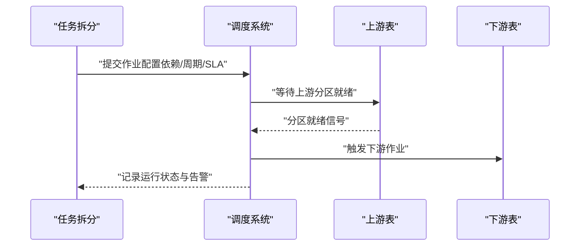
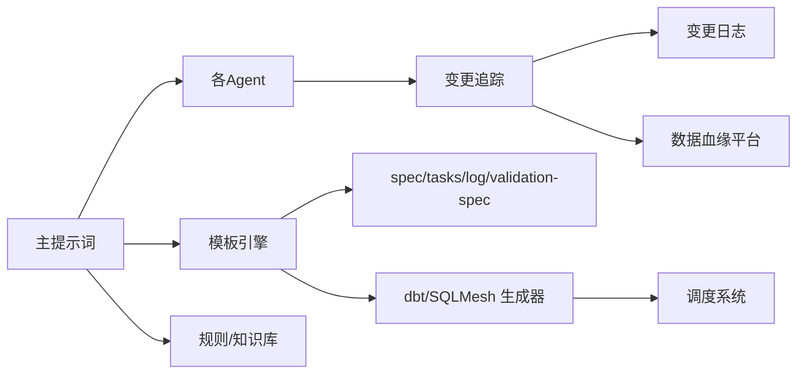

# 系统集成与扩展

<cite>
**本文引用的文件**
- [目录结构和设计说明.md](file://目录结构和设计说明.md)
- [copilot-prompt.md](file://agents/copilot-prompt.md)
- [sql-reviewer.md](file://agents/sql-reviewer.md)
- [version-tracker.md](file://agents/version-tracker.md)
- [spec.md](file://changes/templates/spec.md)
- [tasks.md](file://changes/templates/tasks.md)
- [log.md](file://changes/templates/log.md)
- [validation-spec.md](file://changes/templates/validation-spec.md)
- [modeling-standards.md](file://rules/modeling-standards.md)
- [scheduling-standards.md](file://rules/scheduling-standards.md)
- [data-quality.md](file://rules/data-quality.md)
- [index.md](file://knowledge/index.md)
- [etl-patterns.md](file://knowledge/etl-patterns.md)
</cite>

## 目录
1. [简介](#简介)
2. [项目结构](#项目结构)
3. [核心组件](#核心组件)
4. [架构总览](#架构总览)
5. [详细组件分析](#详细组件分析)
6. [依赖分析](#依赖分析)
7. [性能考虑](#性能考虑)
8. [故障排查指南](#故障排查指南)
9. [结论](#结论)
10. [附录](#附录)

## 简介
本文件面向“数据仓库工程协作助手”项目，围绕系统集成与扩展，提供第三方系统集成方案、dbt/SQLMesh集成、数据血缘平台对接、调度系统对接、自定义Agent开发指南、模板定制化扩展、插件化架构设计以及大规模部署的运维实践。文档以仓库现有提示词、模板与规范为基础，结合概念性扩展设计，帮助团队在保持“Spec驱动 + 三段式知识库 + 强制变更追踪”的核心理念下，实现工程化与智能化的协同。

## 项目结构
项目采用“提示词 + 模板 + 规范 + 知识库”的工程化提示词工程组织方式，强调可加载、可复用、可审计与可沉淀。

图表来源
- [目录结构和设计说明.md:19-56](file://目录结构和设计说明.md#L19-L56)
- [copilot-prompt.md:1-147](file://agents/copilot-prompt.md#L1-L147)
- [spec.md:1-132](file://changes/templates/spec.md#L1-L132)
- [tasks.md:1-74](file://changes/templates/tasks.md#L1-L74)
- [log.md:1-61](file://changes/templates/log.md#L1-L61)
- [validation-spec.md:1-123](file://changes/templates/validation-spec.md#L1-L123)
- [modeling-standards.md:1-242](file://rules/modeling-standards.md#L1-L242)
- [scheduling-standards.md:1-233](file://rules/scheduling-standards.md#L1-L233)
- [data-quality.md:1-195](file://rules/data-quality.md#L1-L195)
- [index.md:1-60](file://knowledge/index.md#L1-L60)
- [etl-patterns.md:1-220](file://knowledge/etl-patterns.md#L1-L220)

章节来源
- [目录结构和设计说明.md:19-56](file://目录结构和设计说明.md#L19-L56)

## 核心组件
- 提示词与命令体系：通过主提示词定义协作范式、命令映射与回答框架，确保AI在固定流程内工作，避免发散与遗漏。
- 变更管理模板：以Spec驱动的变更提案、任务拆分、日志与验证规范，形成“需求—任务—实施—审查—归档”的闭环。
- 规范与知识：建模分层、调度与运维、数据质量等规范，以及SQL/ETL/性能等知识库，作为AI决策与生成的约束与经验来源。
- 变更追踪Agent：在DDL/SQL/ETL/调度等关键节点自动记录结构化变更日志，确保可审计与可回溯。

章节来源
- [copilot-prompt.md:63-147](file://agents/copilot-prompt.md#L63-L147)
- [spec.md:1-132](file://changes/templates/spec.md#L1-L132)
- [tasks.md:1-74](file://changes/templates/tasks.md#L1-L74)
- [log.md:1-61](file://changes/templates/log.md#L1-L61)
- [validation-spec.md:1-123](file://changes/templates/validation-spec.md#L1-L123)
- [version-tracker.md:1-120](file://agents/version-tracker.md#L1-L120)

## 架构总览
系统以“提示词工程”为核心，围绕命令与模板驱动的工程流程，结合规范与知识库，实现从需求到上线的全链路协作。下图展示了从用户意图到AI响应、再到变更追踪与知识沉淀的关键交互。

图表来源
- [copilot-prompt.md:36-147](file://agents/copilot-prompt.md#L36-L147)
- [version-tracker.md:5-16](file://agents/version-tracker.md#L5-L16)
- [modeling-standards.md:1-242](file://rules/modeling-standards.md#L1-L242)
- [scheduling-standards.md:1-233](file://rules/scheduling-standards.md#L1-L233)
- [data-quality.md:1-195](file://rules/data-quality.md#L1-L195)

## 详细组件分析

### 第三方系统集成方案

#### 与 dbt/SQLMesh 的集成
- 目标：将变更提案与任务拆分转化为可执行的dbt模型与测试，实现“Spec → 模型 → 测试 → 验证”的自动化流水线。
- 集成路径（概念性设计）：
  - 变更提案（spec.md）中定义的“模型变更（DDL）”“SQL加工设计”“ETL/同步变更”“调度变更”“数据质量规则”作为dbt/SQLMesh生成的输入。
  - 任务拆分（tasks.md）中的“关键DDL/SQL/依赖/验收标准/回刷计划”映射为dbt包结构、模型文件、测试用例与增量策略。
  - 数据质量规则（validation-spec.md）中的“三选一验证”“核心指标对账”“性能验证”映射为dbt tests与度量监控。
- 生成产物：
  - dbt models：按分层（ODS/DWD/DWS/ADS/DIM）生成SQL模型，保留分区与幂等写法。
  - dbt seeds/tests：基于spec中的规则生成seed与test，覆盖完整性、唯一性、一致性、准确性、时效性。
  - SQLMesh单元：将任务拆分与验证规范映射为SQLMesh的单元与回归测试。
- 自动化流程（概念性序列）：

图表来源
- [spec.md:1-132](file://changes/templates/spec.md#L1-L132)
- [tasks.md:1-74](file://changes/templates/tasks.md#L1-L74)
- [validation-spec.md:1-123](file://changes/templates/validation-spec.md#L1-L123)

#### 数据血缘平台对接（DataHub/OpenMetadata）
- 目标：在模型DDL与SQL变更后，自动采集并上报血缘元数据，实现“变更影响分析”的自动化。
- 对接方案（概念性设计）：
  - 在version-tracker记录DDL/SQL变更后，触发元数据采集器，读取变更对象（库.表.字段/作业名）与上下文（上游依赖、分区范围、回刷范围）。
  - 将采集到的血缘关系与变更影响写入数据血缘平台，形成“变更 → 影响面 → 下游任务”的自动映射。
  - 与调度系统联动：当检测到上游依赖变更，自动标记下游作业为“需重跑”，并纳入调度重试/回放流程。
- 影响分析自动化（概念性流程）：

图表来源
- [version-tracker.md:44-120](file://agents/version-tracker.md#L44-L120)
- [spec.md:78-100](file://changes/templates/spec.md#L78-L100)
- [scheduling-standards.md:29-58](file://rules/scheduling-standards.md#L29-L58)

#### 调度系统集成（现有调度平台对接与任务编排）
- 目标：将任务拆分与调度规范映射为具体作业配置，实现基于上游就绪触发的编排。
- 集成要点：
  - 作业命名与表名一致，严格基于上游表当日分区就绪触发。
  - 依赖关系：强依赖（上游分区就绪）与弱依赖（上游有新数据时触发）。
  - SLA倒推：核心ADS基线决定DWS/DWD基线，每层预留缓冲。
  - 重试与告警：按失败类型设定重试策略与告警等级。
- 任务编排（概念性序列）：

图表来源
- [tasks.md:3-6](file://changes/templates/tasks.md#L3-L6)
- [scheduling-standards.md:9-58](file://rules/scheduling-standards.md#L9-L58)
- [scheduling-standards.md:74-134](file://rules/scheduling-standards.md#L74-L134)

### 自定义Agent开发指南
- 设计原则
  - 专责化：每个Agent聚焦单一职责（如SQL质量审查、性能诊断、数据质量评审）。
  - 可审计：所有输出具备可追溯的引用与出处。
  - 可复用：遵循统一的输入/输出格式与权限约束。
- 接口规范
  - 输入：变更上下文（spec/tasks）、规则/知识库片段、当前会话状态。
  - 输出：结构化建议/代码/配置，附带验证方法与性能评估。
  - 权限：仅读取必要资源，避免写入权限。
- 实现方法
  - 基于现有Agent模板（如sql-reviewer）扩展审查清单与输出格式。
  - 在主提示词中注册命令映射与触发条件。
  - 与version-tracker集成，在关键节点触发变更记录。
- 集成测试
  - 使用validation-spec中的“三选一验证”“核心指标对账”“性能验证”作为测试用例模板。
  - 通过spec/tasks中的验收标准与回刷计划验证实施效果。

章节来源
- [sql-reviewer.md:1-68](file://agents/sql-reviewer.md#L1-L68)
- [validation-spec.md:6-123](file://changes/templates/validation-spec.md#L6-L123)
- [version-tracker.md:5-16](file://agents/version-tracker.md#L5-L16)

### 模板定制化技术细节
- 变更管理模板扩展
  - 变更类型：可在spec.md的type字段扩展（如“模型变更”“SQL开发”“ETL接入”“调度配置”“数据回刷”“性能优化”“数据质量”）。
  - 任务拆分：在tasks.md中增加新的拆分维度（如“权限发布”“安全脱敏”“回放验证”）。
  - 日志沉淀：在log.md中新增分类标签（如“湖仓一体”“实时数仓”“成本优化”）。
- 新模板类型添加方法
  - 在changes/templates下新增模板文件，遵循现有标题、元信息、表格与示例格式。
  - 在主提示词中注册模板路径与触发命令，确保AI可按需加载。
  - 在version-tracker中补充对应模块分类与记录规则，保证变更追踪覆盖新模板。

章节来源
- [spec.md:1-132](file://changes/templates/spec.md#L1-L132)
- [tasks.md:1-74](file://changes/templates/tasks.md#L1-L74)
- [log.md:1-61](file://changes/templates/log.md#L1-L61)
- [version-tracker.md:66-77](file://agents/version-tracker.md#L66-L77)

### 插件化架构设计
- 扩展点识别
  - 提示词扩展：在主提示词中新增命令与Agent入口。
  - 模板扩展：在changes/templates中新增模板类型与渲染规则。
  - 规则扩展：在rules中新增规范文件，AI在生成时自动引用。
  - 知识扩展：在knowledge中新增专题文档，AI在审查与优化时调用。
- 插件接口定义
  - Agent接口：输入（上下文/规则/模板）、输出（建议/代码/配置）、权限（只读）。
  - 模板接口：输入（spec/tasks/日志）、输出（结构化文档）、渲染（Markdown/SQL/YAML）。
  - 变更追踪接口：输入（变更对象/上下文/影响面）、输出（结构化日志）。
- 生命周期管理
  - 加载：启动时扫描agents/rules/changes/templates/knowledge目录。
  - 执行：按命令触发Agent与模板渲染，读取规则/知识库。
  - 记录：在关键节点触发version-tracker，写入变更日志。
  - 沉淀：归档时将log.md中的知识发现沉淀到knowledge/。

章节来源
- [目录结构和设计说明.md:196-204](file://目录结构和设计说明.md#L196-L204)
- [copilot-prompt.md:63-147](file://agents/copilot-prompt.md#L63-L147)
- [version-tracker.md:19-41](file://agents/version-tracker.md#L19-L41)

## 依赖分析
- 组件耦合
  - 主提示词与Agent强耦合：命令映射与回答框架决定Agent触发与输出。
  - 模板与规则/知识库弱耦合：模板读取规则/知识库作为输入，不反向依赖模板。
  - 变更追踪与所有关键操作强耦合：DDL/SQL/ETL/调度变更均需记录。
- 外部依赖
  - 调度系统：Airflow/DolphinScheduler等，依赖上游就绪触发与SLA配置。
  - 数据血缘平台：DataHub/OpenMetadata，依赖元数据采集与影响分析。
  - dbt/SQLMesh：依赖模板与规范生成模型与测试。

图表来源
- [copilot-prompt.md:63-147](file://agents/copilot-prompt.md#L63-L147)
- [version-tracker.md:5-16](file://agents/version-tracker.md#L5-L16)
- [spec.md:1-132](file://changes/templates/spec.md#L1-L132)
- [tasks.md:1-74](file://changes/templates/tasks.md#L1-L74)
- [log.md:1-61](file://changes/templates/log.md#L1-L61)
- [validation-spec.md:1-123](file://changes/templates/validation-spec.md#L1-L123)

## 性能考虑
- 生成性能
  - 模板渲染与规则/知识库加载应缓存热点内容，减少重复IO。
  - Agent输出建议分段生成，避免一次性大文本处理。
- 执行性能
  - 调度周期与SLA倒推：核心ADS基线决定DWS/DWD基线，每层预留缓冲，避免级联超时。
  - 幂等写入：统一使用INSERT OVERWRITE单分区，降低重复写入成本。
- 监控与告警
  - 作业成功率、运行时长、数据产出延迟、DQ通过率、资源消耗趋势为必备指标。
  - 异常阈值：单作业耗时>P95×1.5、行数环比波动>阈值、关键字段非空率下降>阈值触发告警。

章节来源
- [scheduling-standards.md:74-203](file://rules/scheduling-standards.md#L74-L203)
- [data-quality.md:188-202](file://rules/data-quality.md#L188-L202)

## 故障排查指南
- 变更追踪失败
  - 现象：version-tracker无法写入日志。
  - 排查：确认日志路径有效、文件可写、权限正确；若失败不阻塞主流程，提示用户后继续。
- SQL质量审查阻塞
  - 现象：Critical问题导致阻断。
  - 排查：修正笛卡尔积、分区裁剪缺失、JOIN重复、幂等保护缺失等问题。
- 调度失败与回放
  - 现象：上游延迟导致下游级联失败。
  - 排查：等待上游就绪后自动重试；单分区失败重试3次后告警；批量失败确认根因后回刷。
- 数据质量规则不通过
  - 现象：P0规则阻断。
  - 排查：修复主键唯一、行数下限/上限、关键字段非空等规则；与业务方对账确认阈值。

章节来源
- [version-tracker.md:80-89](file://agents/version-tracker.md#L80-L89)
- [sql-reviewer.md:7-30](file://agents/sql-reviewer.md#L7-L30)
- [scheduling-standards.md:94-134](file://rules/scheduling-standards.md#L94-L134)
- [data-quality.md:102-114](file://rules/data-quality.md#L102-L114)

## 结论
本项目以“Spec驱动 + 三段式知识库 + 强制变更追踪”为核心，通过提示词工程与模板化流程，实现了从需求到上线的工程化协作。面向扩展，建议以模板与Agent为中心，结合dbt/SQLMesh生成模型与测试、对接数据血缘平台实现影响分析自动化、与调度系统深度集成实现任务编排，并通过插件化架构持续扩展Agent与模板类型。在大规模部署中，应重视性能优化、监控告警与故障恢复，确保系统稳定与可运维。

## 附录
- 建模分层与命名规范：参考建模标准，确保表名前缀、粒度后缀、分区字段与存储格式符合规范。
- ETL模式与最佳实践：参考ETL模式库，选择合适的同步方式（CDC/JDBC/MERGE/回刷），并遵循幂等与回放优先。
- 数据质量五维度：完整性、唯一性、一致性、准确性、时效性，配套规则与阈值，上线即配套。

章节来源
- [modeling-standards.md:7-242](file://rules/modeling-standards.md#L7-L242)
- [etl-patterns.md:1-220](file://knowledge/etl-patterns.md#L1-L220)
- [data-quality.md:9-114](file://rules/data-quality.md#L9-L114)