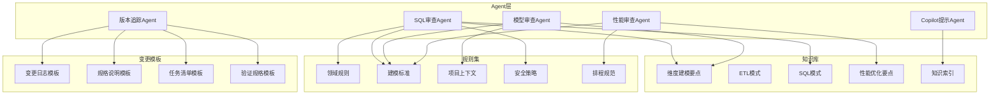
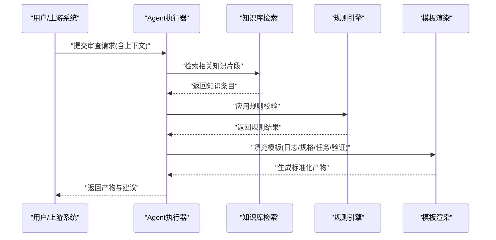
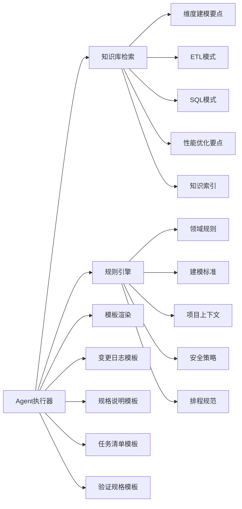

# 自定义Agent开发

<cite>
**本文引用的文件**
- [目录结构和设计说明.md](file://目录结构和设计说明.md)
- [copilot-prompt.md](file://agents/copilot-prompt.md)
- [sql-reviewer.md](file://agents/sql-reviewer.md)
- [version-tracker.md](file://agents/version-tracker.md)
- [model-reviewer.md](file://agents/model-reviewer.md)
- [performance-reviewer.md](file://agents/performance-reviewer.md)
- [log.md](file://changes/templates/log.md)
- [spec.md](file://changes/templates/spec.md)
- [tasks.md](file://changes/templates/tasks.md)
- [validation-spec.md](file://changes/templates/validation-spec.md)
- [dimension-modeling-tips.md](file://knowledge/dimension-modeling-tips.md)
- [etl-patterns.md](file://knowledge/etl-patterns.md)
- [index.md](file://knowledge/index.md)
- [performance-tips.md](file://knowledge/performance-tips.md)
- [sql-patterns.md](file://knowledge/sql-patterns.md)
- [domain-rules.md](file://rules/domain-rules.md)
- [modeling-standards.md](file://rules/modeling-standards.md)
- [project-context.md](file://rules/project-context.md)
- [security.md](file://rules/security.md)
- [scheduling-standards.md](file://rules/scheduling-standards.md)
</cite>

## 目录
1. [引言](#引言)
2. [项目结构](#项目结构)
3. [核心组件](#核心组件)
4. [架构总览](#架构总览)
5. [详细组件分析](#详细组件分析)
6. [依赖关系分析](#依赖关系分析)
7. [性能考虑](#性能考虑)
8. [故障排查指南](#故障排查指南)
9. [结论](#结论)
10. [附录](#附录)

## 引言
本指南面向数据仓库工程协作场景，提供自定义Agent开发的系统化方法论与实操步骤。围绕职责边界、交互协议、状态管理、接口规范、实现流程、集成方式、调试与优化等维度，结合现有知识库、规则集与模板体系，帮助开发者快速构建可维护、可扩展、可复用的智能Agent。

## 项目结构
该代码库采用“领域知识+规则约束+模板化产物”的分层组织方式：
- agents：内置Agent提示词与能力清单，体现不同职责域（SQL审查、模型审查、性能审查、版本追踪、Copilot提示）。
- knowledge：领域知识库，覆盖维度建模、ETL模式、SQL模式、性能优化、知识索引等。
- rules：工程规则与标准，涵盖领域规则、建模标准、项目上下文、安全策略、排程规范等。
- changes/templates：变更产物模板，包括变更日志、规格说明、任务清单、验证规格等。

**图表来源**
- [目录结构和设计说明.md](file://目录结构和设计说明.md)
- [sql-reviewer.md](file://agents/sql-reviewer.md)
- [model-reviewer.md](file://agents/model-reviewer.md)
- [performance-reviewer.md](file://agents/performance-reviewer.md)
- [version-tracker.md](file://agents/version-tracker.md)
- [copilot-prompt.md](file://agents/copilot-prompt.md)
- [dimension-modeling-tips.md](file://knowledge/dimension-modeling-tips.md)
- [etl-patterns.md](file://knowledge/etl-patterns.md)
- [sql-patterns.md](file://knowledge/sql-patterns.md)
- [performance-tips.md](file://knowledge/performance-tips.md)
- [domain-rules.md](file://rules/domain-rules.md)
- [modeling-standards.md](file://rules/modeling-standards.md)
- [project-context.md](file://rules/project-context.md)
- [security.md](file://rules/security.md)
- [scheduling-standards.md](file://rules/scheduling-standards.md)
- [log.md](file://changes/templates/log.md)
- [spec.md](file://changes/templates/spec.md)
- [tasks.md](file://changes/templates/tasks.md)
- [validation-spec.md](file://changes/templates/validation-spec.md)

**章节来源**
- [目录结构和设计说明.md](file://目录结构和设计说明.md)

## 核心组件
- Agent职责边界
  - SQL审查Agent：聚焦SQL语法、风格、安全性与性能基线检查，参考规则与SQL模式。
  - 模型审查Agent：面向建模一致性、维度事实表关系、命名规范与上下文匹配。
  - 性能审查Agent：基于性能优化要点与排程标准，评估执行计划与调度风险。
  - 版本追踪Agent：生成标准化变更日志、规格说明、任务清单与验证规格。
  - Copilot提示Agent：整合知识索引，提供上下文化的协作提示。
- 知识库与规则集
  - 知识库：维度建模、ETL模式、SQL模式、性能优化、知识索引。
  - 规则集：领域规则、建模标准、项目上下文、安全策略、排程规范。
- 变更模板
  - 日志、规格、任务、验证规格，支撑版本追踪Agent的产物生成。

**章节来源**
- [目录结构和设计说明.md](file://目录结构和设计说明.md)
- [sql-reviewer.md](file://agents/sql-reviewer.md)
- [model-reviewer.md](file://agents/model-reviewer.md)
- [performance-reviewer.md](file://agents/performance-reviewer.md)
- [version-tracker.md](file://agents/version-tracker.md)
- [copilot-prompt.md](file://agents/copilot-prompt.md)
- [dimension-modeling-tips.md](file://knowledge/dimension-modeling-tips.md)
- [etl-patterns.md](file://knowledge/etl-patterns.md)
- [sql-patterns.md](file://knowledge/sql-patterns.md)
- [performance-tips.md](file://knowledge/performance-tips.md)
- [domain-rules.md](file://rules/domain-rules.md)
- [modeling-standards.md](file://rules/modeling-standards.md)
- [project-context.md](file://rules/project-context.md)
- [security.md](file://rules/security.md)
- [scheduling-standards.md](file://rules/scheduling-standards.md)
- [log.md](file://changes/templates/log.md)
- [spec.md](file://changes/templates/spec.md)
- [tasks.md](file://changes/templates/tasks.md)
- [validation-spec.md](file://changes/templates/validation-spec.md)

## 架构总览
Agent开发遵循“提示词驱动 + 领域知识 + 工程规则 + 模板化产物”的闭环设计。Agent在运行时根据输入上下文选择合适的知识片段与规则条目，形成结构化输出或产物模板填充。

**图表来源**
- [目录结构和设计说明.md](file://目录结构和设计说明.md)
- [sql-reviewer.md](file://agents/sql-reviewer.md)
- [model-reviewer.md](file://agents/model-reviewer.md)
- [performance-reviewer.md](file://agents/performance-reviewer.md)
- [version-tracker.md](file://agents/version-tracker.md)
- [copilot-prompt.md](file://agents/copilot-prompt.md)
- [log.md](file://changes/templates/log.md)
- [spec.md](file://changes/templates/spec.md)
- [tasks.md](file://changes/templates/tasks.md)
- [validation-spec.md](file://changes/templates/validation-spec.md)

## 详细组件分析

### 设计原则与职责边界
- 职责单一：每个Agent专注一个领域（如SQL审查），避免跨域耦合。
- 输入明确：统一接收上下文（如SQL文本、模型定义、执行计划、项目信息）。
- 输出结构化：优先返回结构化产物（JSON/表格/模板化文档），便于后续处理。
- 可组合：通过模板与规则的组合，支持多Agent协同与流水线编排。
- 可解释：输出应包含依据来源（知识条目/规则条目），便于回溯与审计。

**章节来源**
- [目录结构和设计说明.md](file://目录结构和设计说明.md)

### 交互协议设计
- 请求格式
  - 必填字段：agent_type（Agent类型）、context（上下文对象）
  - 上下文对象包含：输入数据、项目信息、时间范围、环境标识等
- 响应格式
  - 结果字段：status（成功/失败/警告）、data（结构化结果）、logs（诊断日志）、references（引用的知识/规则）
- 错误码约定
  - 0：成功
  - 1xxx：输入参数错误
  - 2xxx：规则/知识检索异常
  - 3xxx：模板渲染异常
  - 4xxx：执行器内部异常
- 日志规范
  - 记录级别：DEBUG/INFO/WARN/ERROR
  - 字段：timestamp、level、agent、step、message、trace_id

**章节来源**
- [目录结构和设计说明.md](file://目录结构和设计说明.md)

### 状态管理机制
- 会话态：单次请求的上下文缓存，用于跨步骤的中间结果传递
- 全局态：Agent能力清单、规则索引、模板索引的全局缓存
- 生命周期：初始化加载知识/规则/模板 -> 接收请求 -> 执行 -> 渲染产物 -> 返回
- 并发控制：对共享资源（模板/规则）加锁或使用不可变快照

**章节来源**
- [目录结构和设计说明.md](file://目录结构和设计说明.md)

### Agent接口规范
- 输入
  - agent_type: 字符串，Agent类型标识
  - context: 对象，包含输入数据与上下文键值
- 输出
  - status: 整数，状态码
  - data: 对象，结构化结果
  - logs: 数组，日志项
  - references: 数组，引用来源列表
- 错误处理
  - 参数缺失/非法：返回1xxx并给出具体字段
  - 规则/知识未命中：返回2xxx并建议补充
  - 模板渲染失败：返回3xxx并附带模板路径
  - 内部异常：返回4xxx并记录堆栈
- 日志记录
  - 统一结构化字段，便于聚合与检索

**章节来源**
- [目录结构和设计说明.md](file://目录结构和设计说明.md)

### 提示词设计与实现步骤
以“新增专业审查Agent”为例，步骤如下：
1. 明确职责与边界
   - 定义审查目标（如数据质量、一致性、合规性）
   - 确定输入输出格式与触发条件
2. 选择知识与规则
   - 从知识库选取相关条目（如数据质量要点、建模标准）
   - 从规则集选取适用规则（如领域规则、安全策略）
3. 设计提示词
   - 将职责、知识、规则封装为提示词模板，支持参数化
   - 控制上下文长度，避免截断
4. 实现执行器
   - 解析输入 -> 检索知识/规则 -> 生成结果 -> 渲染模板（如需要）
5. 测试验证
   - 单元测试：覆盖正常/异常/边界场景
   - 回归测试：与历史产物对比，确保稳定性
6. 文档与发布
   - 更新Agent清单与注册表
   - 发布版本并更新知识/规则索引

**章节来源**
- [目录结构和设计说明.md](file://目录结构和设计说明.md)

### 集成方法与生命周期管理
- 注册流程
  - 在Agent注册表中登记agent_type、入口函数、依赖集合
  - 加载对应的知识/规则/模板索引
- 生命周期
  - 初始化：加载索引、建立连接、预热缓存
  - 运行：接收请求、执行、落盘日志
  - 关闭：释放资源、持久化状态
- 依赖注入
  - 使用依赖注入容器管理知识检索器、规则引擎、模板渲染器
  - 支持多实例与隔离

**章节来源**
- [目录结构和设计说明.md](file://目录结构和设计说明.md)

### 开发示例：新增专业审查Agent
- 场景：对数据质量进行专业级审查
- 步骤
  1) 定义输入输出
     - 输入：数据表名、字段清单、采样数据、项目上下文
     - 输出：质量评分、问题清单、修复建议、引用规则
  2) 选择知识与规则
     - 知识：数据质量要点、建模标准
     - 规则：领域规则、项目上下文
  3) 设计提示词
     - 将输入与规则封装为提示词，控制token上限
  4) 实现执行器
     - 解析输入 -> 检索规则 -> 生成评分与建议 -> 结构化输出
  5) 测试验证
     - 构造典型样本 -> 校验输出稳定性与可解释性
  6) 集成发布
     - 注册Agent -> 更新索引 -> 部署上线

**章节来源**
- [directory.md](file://目录结构和设计说明.md)
- [domain-rules.md](file://rules/domain-rules.md)
- [modeling-standards.md](file://rules/modeling-standards.md)
- [project-context.md](file://rules/project-context.md)

### 开发示例：扩展功能Agent（以“变更影响分析Agent”为例）
- 场景：基于版本追踪产物，分析变更对下游的影响
- 步骤
  1) 输入输出
     - 输入：变更日志、规格说明、任务清单
     - 输出：影响矩阵、阻塞点、风险等级、建议
  2) 选择知识与规则
     - 知识：ETL模式、性能优化要点
     - 规则：排程规范、安全策略
  3) 设计提示词
     - 将变更内容与规则映射为分析提示
  4) 实现执行器
     - 解析模板 -> 抽取关键实体 -> 规则匹配 -> 影响评估 -> 结构化输出
  5) 测试验证
     - 基于历史变更回归测试
  6) 集成发布
     - 注册Agent -> 更新索引 -> 部署上线

**章节来源**
- [directory.md](file://目录结构和设计说明.md)
- [etl-patterns.md](file://knowledge/etl-patterns.md)
- [performance-tips.md](file://knowledge/performance-tips.md)
- [scheduling-standards.md](file://rules/scheduling-standards.md)
- [security.md](file://rules/security.md)
- [log.md](file://changes/templates/log.md)
- [spec.md](file://changes/templates/spec.md)
- [tasks.md](file://changes/templates/tasks.md)

## 依赖关系分析
Agent与知识库、规则集、模板之间的依赖关系如下：

**图表来源**
- [目录结构和设计说明.md](file://目录结构和设计说明.md)
- [dimension-modeling-tips.md](file://knowledge/dimension-modeling-tips.md)
- [etl-patterns.md](file://knowledge/etl-patterns.md)
- [sql-patterns.md](file://knowledge/sql-patterns.md)
- [performance-tips.md](file://knowledge/performance-tips.md)
- [index.md](file://knowledge/index.md)
- [domain-rules.md](file://rules/domain-rules.md)
- [modeling-standards.md](file://rules/modeling-standards.md)
- [project-context.md](file://rules/project-context.md)
- [security.md](file://rules/security.md)
- [scheduling-standards.md](file://rules/scheduling-standards.md)
- [log.md](file://changes/templates/log.md)
- [spec.md](file://changes/templates/spec.md)
- [tasks.md](file://changes/templates/tasks.md)
- [validation-spec.md](file://changes/templates/validation-spec.md)

**章节来源**
- [目录结构和设计说明.md](file://目录结构和设计说明.md)

## 性能考虑
- 上下文裁剪：限制提示词长度，优先保留关键上下文
- 缓存策略：对规则与知识检索结果进行缓存，减少重复计算
- 并行化：对独立审查任务并行执行，提升吞吐
- 分页与增量：对大规模数据采用分页或增量处理
- 资源隔离：为不同Agent分配独立线程池与内存配额

[本节为通用指导，无需列出章节来源]

## 故障排查指南
- 常见问题
  - 输入参数缺失：检查agent_type与context字段是否完整
  - 规则/知识未命中：确认索引是否加载成功，必要时重建索引
  - 模板渲染失败：核对模板变量与数据结构一致性
  - 执行器异常：查看日志中的trace_id，定位具体步骤
- 调试技巧
  - 启用DEBUG级别日志，逐步缩小范围
  - 使用最小化输入复现问题
  - 对比历史稳定版本，定位变更点
- 最佳实践
  - 为每个Agent编写单元测试与回归测试
  - 对外暴露健康检查端点，监控可用性
  - 对敏感操作增加审计日志

**章节来源**
- [目录结构和设计说明.md](file://目录结构和设计说明.md)

## 结论
通过明确职责边界、规范交互协议、完善状态管理与接口规范，结合知识库与规则集的可组合能力，以及模板化产物的标准化输出，可以高效地开发出高质量的自定义Agent。建议在设计初期即考虑可测试性与可观测性，持续迭代以提升稳定性与可维护性。

[本节为总结性内容，无需列出章节来源]

## 附录
- Agent清单与职责概览
  - SQL审查Agent：负责SQL语法、风格、安全与性能基线检查
  - 模型审查Agent：负责建模一致性与上下文匹配
  - 性能审查Agent：负责执行计划与排程风险评估
  - 版本追踪Agent：负责标准化变更产物生成
  - Copilot提示Agent：负责上下文化协作提示
- 关键模板与知识索引
  - 变更模板：日志、规格、任务、验证规格
  - 知识索引：维度建模、ETL模式、SQL模式、性能优化
  - 规则索引：领域规则、建模标准、项目上下文、安全策略、排程规范

**章节来源**
- [目录结构和设计说明.md](file://目录结构和设计说明.md)
- [sql-reviewer.md](file://agents/sql-reviewer.md)
- [model-reviewer.md](file://agents/model-reviewer.md)
- [performance-reviewer.md](file://agents/performance-reviewer.md)
- [version-tracker.md](file://agents/version-tracker.md)
- [copilot-prompt.md](file://agents/copilot-prompt.md)
- [log.md](file://changes/templates/log.md)
- [spec.md](file://changes/templates/spec.md)
- [tasks.md](file://changes/templates/tasks.md)
- [validation-spec.md](file://changes/templates/validation-spec.md)
- [dimension-modeling-tips.md](file://knowledge/dimension-modeling-tips.md)
- [etl-patterns.md](file://knowledge/etl-patterns.md)
- [sql-patterns.md](file://knowledge/sql-patterns.md)
- [performance-tips.md](file://knowledge/performance-tips.md)
- [index.md](file://knowledge/index.md)
- [domain-rules.md](file://rules/domain-rules.md)
- [modeling-standards.md](file://rules/modeling-standards.md)
- [project-context.md](file://rules/project-context.md)
- [security.md](file://rules/security.md)
- [scheduling-standards.md](file://rules/scheduling-standards.md)