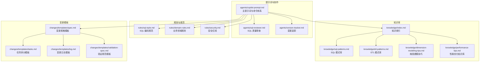
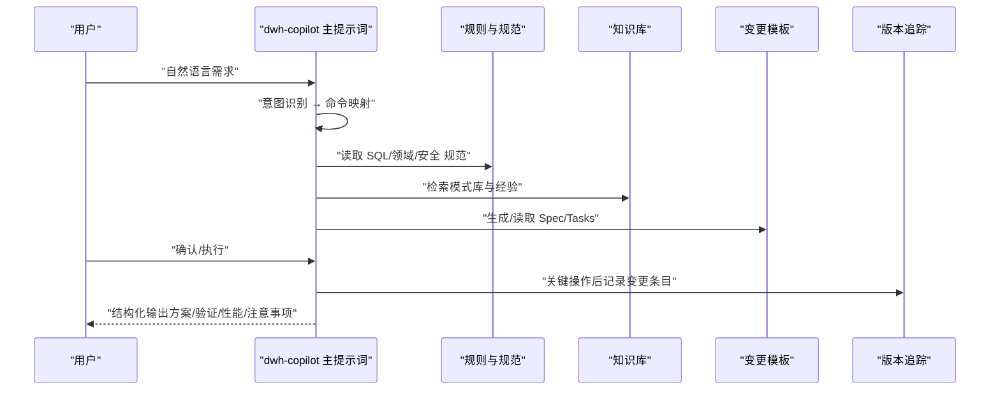
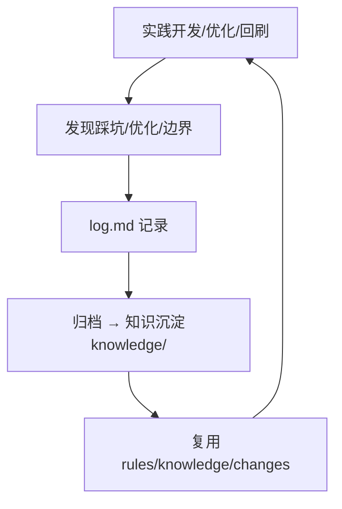
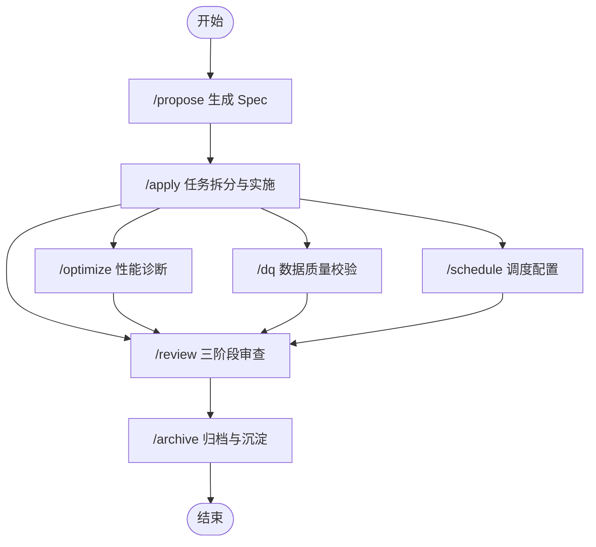
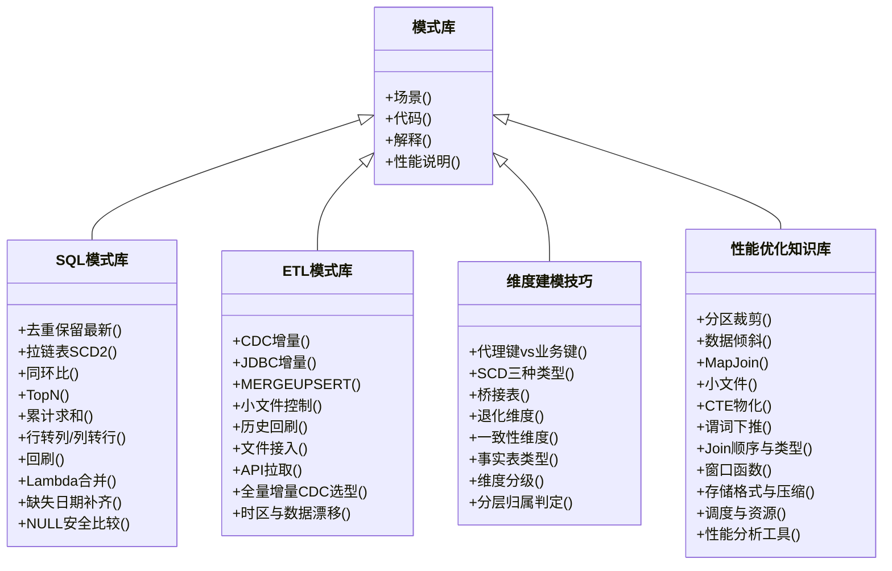
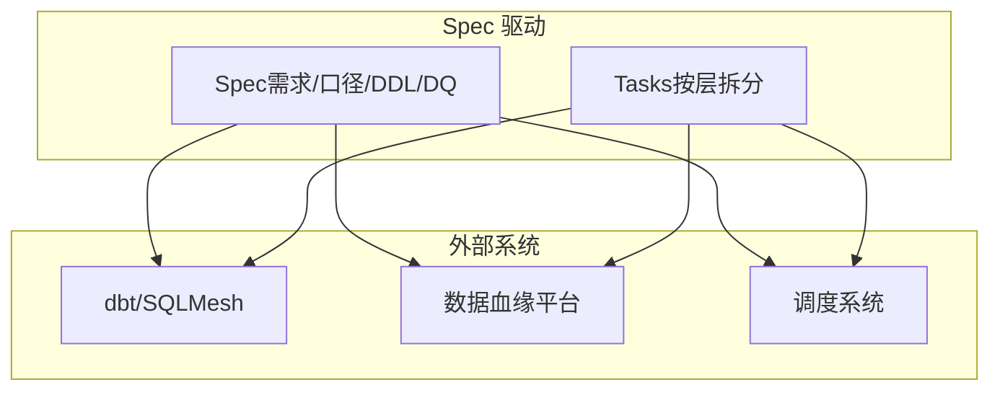
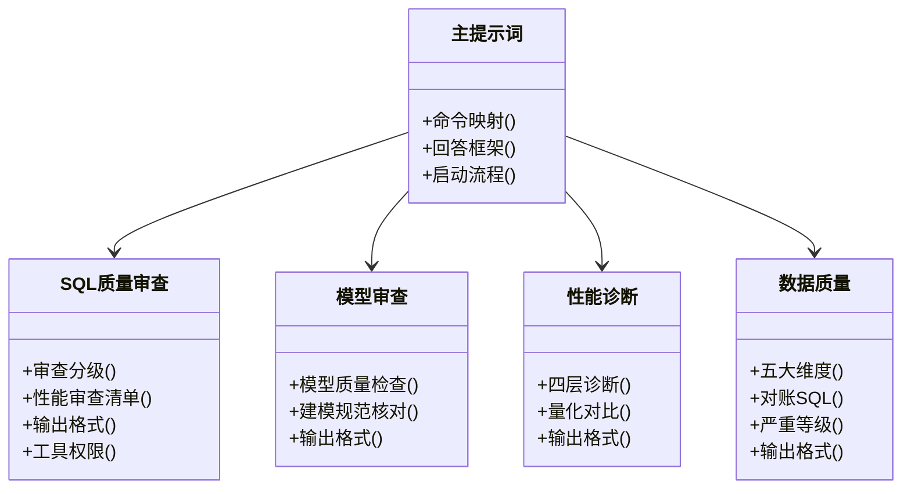
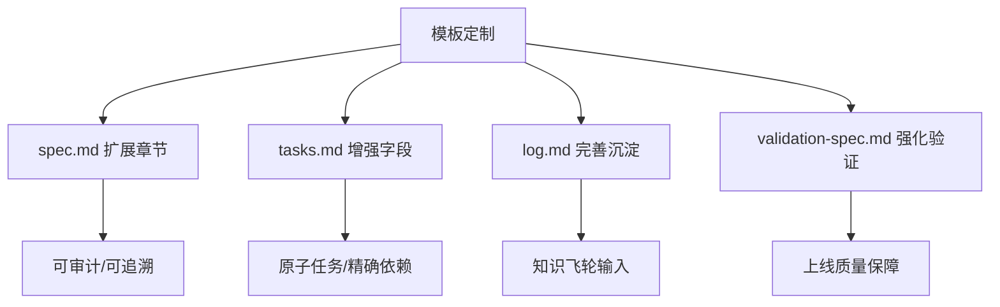
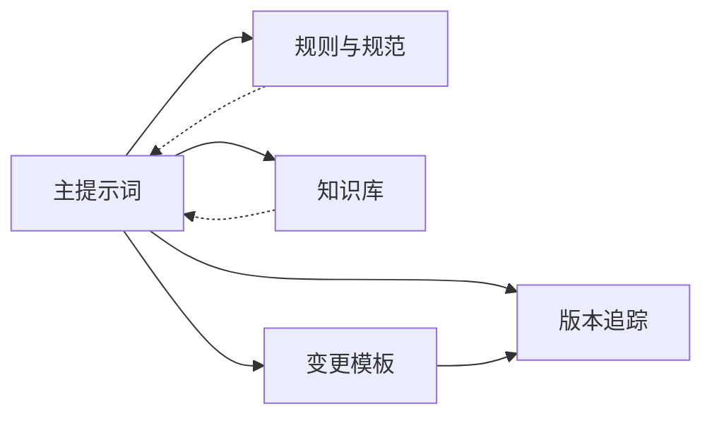

# 高级主题与扩展

<cite>
**本文引用的文件**   
- [目录结构和设计说明.md](file://目录结构和设计说明.md)
- [copilot-prompt.md](file://agents/copilot-prompt.md)
- [sql-reviewer.md](file://agents/sql-reviewer.md)
- [version-tracker.md](file://agents/version-tracker.md)
- [index.md](file://knowledge/index.md)
- [sql-patterns.md](file://knowledge/sql-patterns.md)
- [etl-patterns.md](file://knowledge/etl-patterns.md)
- [dimension-modeling-tips.md](file://knowledge/dimension-modeling-tips.md)
- [performance-tips.md](file://knowledge/performance-tips.md)
- [domain-rules.md](file://rules/domain-rules.md)
- [security.md](file://rules/security.md)
- [sql-style.md](file://rules/sql-style.md)
- [spec.md](file://changes/templates/spec.md)
- [tasks.md](file://changes/templates/tasks.md)
- [log.md](file://changes/templates/log.md)
- [validation-spec.md](file://changes/templates/validation-spec.md)
</cite>

## 目录
1. [简介](#简介)
2. [项目结构](#项目结构)
3. [核心组件](#核心组件)
4. [架构总览](#架构总览)
5. [详细组件分析](#详细组件分析)
6. [依赖分析](#依赖分析)
7. [性能考量](#性能考量)
8. [故障排查指南](#故障排查指南)
9. [结论](#结论)
10. [附录](#附录)

## 简介
本文件面向“数据仓库工程协作助手”的高级主题与扩展，围绕三段式知识结构、Spec 驱动架构与命令式协作机制进行系统化阐述，并提供模式库扩展、第三方系统集成、自定义 Agent 开发、模板定制化以及性能优化与大规模部署的实践经验。目标是帮助读者在不深入代码的情况下，理解并高效扩展该协作体系。

## 项目结构
项目采用“提示词 + 规则 + 知识 + 变更模板”的工程化组织方式，强调可加载到 AI 编码助手的工作区，通过命令驱动的协作流程实现“需求 → 规格 → 任务 → 实施 → 审查 → 归档”的闭环。

**图表来源**
- [目录结构和设计说明.md:19-55](file://目录结构和设计说明.md#L19-L55)
- [copilot-prompt.md:1-147](file://agents/copilot-prompt.md#L1-L147)
- [index.md:1-60](file://knowledge/index.md#L1-L60)
- [spec.md:1-132](file://changes/templates/spec.md#L1-L132)

**章节来源**
- [目录结构和设计说明.md:19-55](file://目录结构和设计说明.md#L19-L55)

## 核心组件
- 提示词与命令体系：定义协作角色、核心法则、命令映射与回答框架，确保每次交互可追踪、可审计。
- 规则与规范：提供 SQL 编码规范、业务领域规则与安全红线，作为强制约束。
- 知识库：沉淀 SQL 模式、ETL 模式、维度建模技巧与性能优化经验，作为推荐工具箱。
- 变更模板：规范 Spec、任务拆分、日志与验证流程，支撑“Spec 驱动”的工程闭环。
- 变更追踪：在关键节点自动记录结构化变更条目，确保所有变更可审计、可回溯。

**章节来源**
- [copilot-prompt.md:1-147](file://agents/copilot-prompt.md#L1-L147)
- [version-tracker.md:1-120](file://agents/version-tracker.md#L1-L120)
- [index.md:1-60](file://knowledge/index.md#L1-L60)
- [spec.md:1-132](file://changes/templates/spec.md#L1-L132)

## 架构总览
系统采用“提示词驱动 + 模板化流程 + 知识库复用 + 强制变更追踪”的架构。AI 在会话开始时读取规则与当前变更状态，按命令推进流程，每个关键动作触发版本追踪，形成“实践 → 发现 → 沉淀 → 复用”的知识飞轮。

**图表来源**
- [copilot-prompt.md:55-147](file://agents/copilot-prompt.md#L55-L147)
- [version-tracker.md:5-16](file://agents/version-tracker.md#L5-L16)

**章节来源**
- [copilot-prompt.md:55-147](file://agents/copilot-prompt.md#L55-L147)
- [目录结构和设计说明.md:126-167](file://目录结构和设计说明.md#L126-L167)

## 详细组件分析

### 三段式知识结构设计
- 约束层（rules/）：强制规范，如 SQL 编码、领域规则、安全红线，确保工程底线。
- 经验层（knowledge/）：可复用模式库，如 SQL/ETL/建模/性能，提升开发效率与质量。
- 过程层（changes/）：每次变更的“病历”，沉淀到 archive，成为知识飞轮的输入。

**图表来源**
- [目录结构和设计说明.md:70-78](file://目录结构和设计说明.md#L70-L78)
- [log.md:1-61](file://changes/templates/log.md#L1-L61)

**章节来源**
- [目录结构和设计说明.md:70-78](file://目录结构和设计说明.md#L70-L78)
- [index.md:1-60](file://knowledge/index.md#L1-L60)

### Spec 驱动架构与命令式协作
- Spec 驱动：四条铁律确保 Spec 是唯一真相，变更必须逆向同步到 Spec。
- 命令体系：通过 /init、/sql、/etl、/model、/propose、/apply、/review、/optimize、/dq、/schedule、/archive 等命令，将复杂流程结构化、原子化。
- 审查流程：三阶段审查（Spec 合规 → 模型质量 → SQL 质量），不通过不进入下一阶段。

**图表来源**
- [目录结构和设计说明.md:80-97](file://目录结构和设计说明.md#L80-L97)
- [copilot-prompt.md:103-131](file://agents/copilot-prompt.md#L103-L131)

**章节来源**
- [目录结构和设计说明.md:61-69](file://目录结构和设计说明.md#L61-L69)
- [copilot-prompt.md:103-131](file://agents/copilot-prompt.md#L103-L131)

### 模式库扩展方法
- 新模式添加流程
  - 选择模式库：SQL 模式、ETL 模式、维度建模技巧、性能优化知识库。
  - 参考既有模式的结构：场景、代码、解释、性能说明。
  - 在相应文件末尾新增条目，保持格式一致。
- 验证标准
  - 场景明确、代码可复用、解释可追溯、性能说明量化。
  - 与现有规范（命名、分区、幂等）保持一致。
- 最佳实践
  - 优先使用幂等写法（INSERT OVERWRITE、MERGE）。
  - 明确分区裁剪与谓词下推，避免全表扫描。
  - 对热点键做倾斜治理（过滤、加盐、广播）。

**图表来源**
- [sql-patterns.md:1-331](file://knowledge/sql-patterns.md#L1-L331)
- [etl-patterns.md:1-220](file://knowledge/etl-patterns.md#L1-L220)
- [dimension-modeling-tips.md:1-253](file://knowledge/dimension-modeling-tips.md#L1-L253)
- [performance-tips.md:1-349](file://knowledge/performance-tips.md#L1-L349)

**章节来源**
- [sql-patterns.md:1-331](file://knowledge/sql-patterns.md#L1-L331)
- [etl-patterns.md:1-220](file://knowledge/etl-patterns.md#L1-L220)
- [dimension-modeling-tips.md:1-253](file://knowledge/dimension-modeling-tips.md#L1-L253)
- [performance-tips.md:1-349](file://knowledge/performance-tips.md#L1-L349)

### 第三方系统集成方案
- 与 dbt/SQLMesh 集成
  - 通过 /propose 生成的 Spec 与 Tasks，映射为 dbt 模型与测试用例，实现“Spec → 模型 → 测试 → 上线”的自动化。
  - 在 /apply 阶段，将 SQL 逻辑转化为 dbt SQL，结合验证规范模板进行回归测试。
- 与数据血缘平台对接
  - 在 /model 与 /etl 命令中，记录库.表.字段与作业名，作为血缘采集的结构化输入。
  - 与 DataHub/OpenMetadata 等平台联动，自动抓取上游/下游影响，辅助影响分析。
- 与调度系统集成
  - 在 /schedule 命令中，明确上游依赖、周期、SLA、重试与资源队列，生成调度配置。
  - 与 Azkaban/DolphinScheduler/Metacat 等系统对接，实现依赖触发与失败回放。

**图表来源**
- [spec.md:1-132](file://changes/templates/spec.md#L1-L132)
- [tasks.md:1-74](file://changes/templates/tasks.md#L1-L74)
- [目录结构和设计说明.md:196-204](file://目录结构和设计说明.md#L196-L204)

**章节来源**
- [目录结构和设计说明.md:196-204](file://目录结构和设计说明.md#L196-L204)

### 自定义 Agent 开发指南
- 设计原则
  - 单一职责：每个 Agent 聚焦一个领域（如 SQL 质量、模型合规、性能诊断、DQ、调度）。
  - 可组合：Agent 之间通过前置条件与输出格式协同，避免重复审查。
- 接口规范
  - 输入：明确触发条件与前置依赖（如 model-reviewer 依赖通过后才启动 sql-reviewer）。
  - 输出：结构化报告，包含分级（Critical/Important/Minor）与性能评估摘要。
- 实现方法
  - 以现有 Agent 为模板，定义审查清单、输出格式与工具权限。
  - 与主提示词协作，确保在审查流程中被正确调用与串联。

**图表来源**
- [copilot-prompt.md:63-147](file://agents/copilot-prompt.md#L63-L147)
- [sql-reviewer.md:1-68](file://agents/sql-reviewer.md#L1-L68)

**章节来源**
- [copilot-prompt.md:63-147](file://agents/copilot-prompt.md#L63-L147)
- [sql-reviewer.md:1-68](file://agents/sql-reviewer.md#L1-L68)

### 模板定制化与扩展点
- 变更规格模板（spec.md）
  - 扩展点：新增“技术决策”“执行日志”“审查结论”等章节，满足复杂需求的可追溯性。
  - 最佳实践：在“功能点”中细化输入→计算→产出，确保可验证。
- 任务拆分模板（tasks.md）
  - 扩展点：增加“回刷计划”“依赖矩阵”“验收标准”等字段，提升任务颗粒度。
  - 最佳实践：每个任务原子化，精确到库.表.字段/作业名/依赖。
- 变更日志模板（log.md）
  - 扩展点：加入“性能对比记录”“Spec-实现偏差记录”“数据回刷记录”等，完善知识沉淀。
- 验证规范模板（validation-spec.md）
  - 扩展点：增加“回刷验证”“执行计划”“安全与权限验证”等，确保上线质量。
  - 最佳实践：三选一验证铁律（行数/抽样/对账）与边界测试必做。

**图表来源**
- [spec.md:1-132](file://changes/templates/spec.md#L1-L132)
- [tasks.md:1-74](file://changes/templates/tasks.md#L1-L74)
- [log.md:1-61](file://changes/templates/log.md#L1-L61)
- [validation-spec.md:1-123](file://changes/templates/validation-spec.md#L1-L123)

**章节来源**
- [spec.md:1-132](file://changes/templates/spec.md#L1-L132)
- [tasks.md:1-74](file://changes/templates/tasks.md#L1-L74)
- [log.md:1-61](file://changes/templates/log.md#L1-L61)
- [validation-spec.md:1-123](file://changes/templates/validation-spec.md#L1-L123)

## 依赖分析
- 组件耦合
  - 主提示词依赖规则与知识库，输出结构化协作结果。
  - 变更模板贯穿 Spec/Task/Log/Validation，形成闭环。
  - 版本追踪作为横切关注点，在关键节点注入，降低耦合。
- 外部依赖
  - 与调度系统、血缘平台、dbt/SQLMesh 等系统通过结构化输入/输出对接。
- 潜在风险
  - 规则与模板不一致可能导致 Spec 与实现偏差。
  - 审查流程断点（如 SQL 审查未通过）可能阻塞上线。

**图表来源**
- [copilot-prompt.md:55-61](file://agents/copilot-prompt.md#L55-L61)
- [version-tracker.md:5-16](file://agents/version-tracker.md#L5-L16)

**章节来源**
- [copilot-prompt.md:55-61](file://agents/copilot-prompt.md#L55-L61)
- [version-tracker.md:5-16](file://agents/version-tracker.md#L5-L16)

## 性能考量
- 分区裁剪：WHERE 条件直接命中分区字段，避免函数包裹。
- 数据倾斜：热点键过滤、加盐打散、广播小表、自适应倾斜优化。
- 小文件：控制 reduce 数、DISTRIBUTE BY、AQE 合并、周期性合并。
- CTE 物化：复杂 CTE 先落临时表，Spark 可 CACHE。
- 谓词下推与列裁剪：WHERE 下推、只读必要列。
- Join 顺序与类型：按引擎选择最优 Join，分桶 Join 跳过 Shuffle。
- 存储格式与压缩：ORC/Parquet + ZSTD，列存收益显著。
- 调度与资源：队列隔离、错峰调度、SLA 基线、指数退避重试。

**章节来源**
- [performance-tips.md:5-349](file://knowledge/performance-tips.md#L5-L349)
- [sql-style.md:165-201](file://rules/sql-style.md#L165-L201)

## 故障排查指南
- 调试流程：现象收集 → 根因定位 → 方案验证 → 实施修复。
- 诊断层级：数据源层 → 抽取层 → ODS/DWD/DWS/ADS → 应用层。
- 常见问题
  - 全表扫描：检查分区裁剪与谓词下推。
  - 数据倾斜：识别热点键，采用过滤/加盐/广播。
  - 小文件爆炸：控制输出端分区与合并策略。
  - 性能退化：对比执行计划与资源使用，定位慢 stage。
- 审查清单
  - SQL 质量：Join 膨胀、重复计算、NULL 处理、分区裁剪。
  - 模型质量：分层归属、主键唯一、分区范围、跨层引用。
  - 数据质量：完整性/唯一性/一致性/准确性/时效性。

**章节来源**
- [copilot-prompt.md:133-147](file://agents/copilot-prompt.md#L133-L147)
- [sql-reviewer.md:7-30](file://agents/sql-reviewer.md#L7-L30)

## 结论
本协作体系以“Spec 驱动 + 三段式知识结构 + 命令式协作”为核心，通过模板化流程与版本追踪实现可审计、可回溯、可复用的工程闭环。通过扩展模式库、对接第三方系统、开发自定义 Agent 与优化性能，可在大规模场景中持续演进，提升数仓交付质量与效率。

## 附录
- 术语
  - Spec：需求规格，唯一真相。
  - ODS/DWD/DWS/ADS/DIM：数仓分层。
  - P0/P1/P2：数据质量严重等级。
- 参考文件
  - [目录结构和设计说明.md](file://目录结构和设计说明.md)
  - [copilot-prompt.md](file://agents/copilot-prompt.md)
  - [version-tracker.md](file://agents/version-tracker.md)
  - [index.md](file://knowledge/index.md)
  - [sql-patterns.md](file://knowledge/sql-patterns.md)
  - [etl-patterns.md](file://knowledge/etl-patterns.md)
  - [dimension-modeling-tips.md](file://knowledge/dimension-modeling-tips.md)
  - [performance-tips.md](file://knowledge/performance-tips.md)
  - [domain-rules.md](file://rules/domain-rules.md)
  - [security.md](file://rules/security.md)
  - [sql-style.md](file://rules/sql-style.md)
  - [spec.md](file://changes/templates/spec.md)
  - [tasks.md](file://changes/templates/tasks.md)
  - [log.md](file://changes/templates/log.md)
  - [validation-spec.md](file://changes/templates/validation-spec.md)